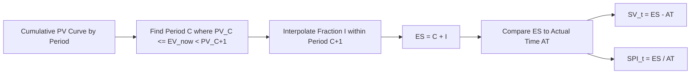

## Earned Schedule Calculation

### Definition

Earned Schedule (ES) is a technique that converts the traditional, cost-based Schedule Variance (SV) into a genuine time-based measure, expressed in the same units as the project schedule (weeks, months) rather than currency. ES answers: **"At what point in the planned schedule does our current Earned Value correspond to?"** — effectively identifying *when* the amount of work we've actually earned was originally supposed to happen.

### The Core Calculation

ES is calculated by finding the point on the cumulative Planned Value (PV) curve where the PV equals the current cumulative Earned Value (EV):

$$ES = t \quad \text{such that} \quad PV(t) = EV_{now}$$

In practice, since actual reporting periods are discrete, ES is calculated by identifying the last full period where cumulative PV was less than or equal to current EV, then interpolating the fractional portion of the next period:

$$ES = C + I$$

Where:

- $C$ = the number of complete time periods where cumulative $PV \leq EV_{now}$
- $I$ = an interpolated fraction of the next period, calculated as:

$$I = \frac{EV_{now} - PV_C}{PV_{C+1} - PV_C}$$

Here, $PV_C$ is the cumulative planned value at the end of period $C$, and $PV_{C+1}$ is the cumulative planned value at the end of the following period.

### Time-Based Schedule Variance and Performance Index

Once ES is calculated, it replaces the dollar-based EV in the schedule variance and index formulas, using **Actual Time (AT)** — the actual elapsed time since project start — as the comparison point:

$$SV(t) = ES - AT$$

$$SPI(t) = \frac{ES}{AT}$$

Unlike traditional SV and SPI, these are expressed directly in time units (e.g., "the project is 2.3 months behind schedule"), and critically, they do **not** suffer from the mathematical convergence-to-zero problem that traditional SV exhibits near project completion, since AT continues increasing linearly regardless of how EV and PV behave near the end.

### Worked Example

A project has monthly cumulative PV values as follows:

| Month (t) | Cumulative PV |
| --- | --- |
| 1 | $40,000 |
| 2 | $90,000 |
| 3 | $150,000 |
| 4 | $220,000 |

At the current reporting date, **Actual Time (AT) = 4 months** has elapsed, and cumulative $EV_{now} = \$130{,}000$.

**Step 1 — Find C**: identify the last month where cumulative PV ≤ EV. At month 2, PV = $90,000 ≤ $130,000. At month 3, PV = $150,000 > $130,000. So $C = 2$.

**Step 2 — Interpolate I**:

$$I = \frac{130{,}000 - 90{,}000}{150{,}000 - 90{,}000} = \frac{40{,}000}{60{,}000} \approx 0.667$$

**Step 3 — Calculate ES**:

$$ES = 2 + 0.667 = 2.667 \text{ months}$$

**Step 4 — Calculate time-based schedule metrics**:

$$SV(t) = ES - AT = 2.667 - 4 = -1.333 \text{ months}$$

$$SPI(t) = \frac{ES}{AT} = \frac{2.667}{4} \approx 0.667$$

**Interpretation**: The work actually earned so far corresponds to what should have been accomplished by month 2.667 of the schedule, but 4 months of actual time have elapsed. The project is running approximately **1.33 months behind schedule** — a directly interpretable, calendar-based statement that traditional dollar-based SV cannot provide.

### Comparing Traditional SV to Earned Schedule SV(t)

Using the same data, with $PV_{now}$ (cumulative PV at month 4) = $220,000:

$$SV_{traditional} = EV - PV = 130{,}000 - 220{,}000 = -\$90{,}000$$

This traditional figure tells us there's a $90,000 value gap, but says nothing directly about calendar delay. The Earned Schedule calculation above converts this into "1.33 months behind" — a figure that remains meaningful and non-zero even as the project nears its planned finish date, unlike traditional SV.

### Handling the Interpolation at Project Extremes

- **If $EV_{now}$ exceeds the final cumulative PV** (i.e., the project has earned more than the entire planned scope, which can occur with certain scope or measurement anomalies), ES calculation requires extrapolation beyond the schedule's endpoint using the rate of the last period — a recognized edge case requiring careful handling in ES methodology. [Inference — this extrapolation approach is part of the standard Earned Schedule methodology as documented by its原 originators, though implementation details can vary slightly across tools]
- **Early in the project** (few data points), ES calculations carry higher uncertainty since fewer PV data points exist to interpolate against

### Data Requirements

Calculating ES requires access to the **time-phased cumulative PV curve** at each reporting interval — not just the current period's PV, EV, and AC totals. This means organizations must retain and structure their baseline schedule data in a way that permits this period-by-period lookup, which is a more granular data requirement than traditional EVM's headline CV/SV calculations demand.

### Common Pitfalls

- **Confusing ES (a point in time) with SV(t) (a variance)**: ES itself is a schedule position ("2.667 months into the plan"), not a variance; SV(t) is the difference between ES and AT
- **Using period-end PV values only, without interpolation**: skipping the interpolation step produces a coarser, stair-stepped ES that loses precision, especially important for shorter reporting cycles
- **Applying ES without the underlying time-phased PV data**: if only cumulative totals are retained rather than a full period-by-period PV curve, ES cannot be calculated retroactively
- **Assuming ES eliminates the need for critical path analysis**: ES improves on traditional SV's time-unit limitation, but like traditional SV, it is still an aggregate measure and doesn't by itself indicate whether delay affects the critical path

### Visual: Earned Schedule Interpolation

### Related Topics

- Limitations of traditional schedule variance in time units
- Independent Estimate at Completion (IEAC) techniques
- Critical Path Method (CPM) integration with Earned Schedule
- Time-based forecasting: Estimated Duration at Completion using SPI(t)
- Schedule Performance Index (SPI) — traditional versus time-based
- Time-phased budgeting and PV curve development