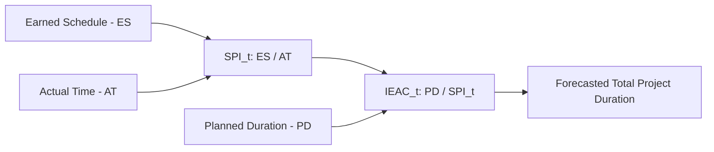

## Time-Based Schedule Performance Index

### Definition

Time-based Schedule Performance Index, denoted $SPI(t)$, is the Earned Schedule counterpart to the traditional cost-based SPI. It measures schedule efficiency as a ratio of time units rather than currency, expressing how much schedule progress has been achieved relative to actual elapsed time.

$$SPI(t) = \frac{ES}{AT}$$

Where:

- $ES$ = Earned Schedule, the point in the planned schedule corresponding to the value currently earned
- $AT$ = Actual Time, the actual elapsed time since project start

This directly parallels the traditional formula $SPI = EV/PV$, but replaces both value-based terms with time-based equivalents, avoiding the distortions that occur when traditional SPI is evaluated near project completion.

### Interpreting the Value

| SPI(t) Value | Interpretation |
| --- | --- |
| $SPI(t) > 1.0$ | Ahead of schedule — earning schedule progress faster than time is elapsing |
| $SPI(t) = 1.0$ | Exactly on schedule |
| $SPI(t) < 1.0$ | Behind schedule — earning schedule progress slower than time is elapsing |

A useful practical interpretation: $SPI(t) = 0.75$ means that, on average, for every 1 unit of actual time that passes, only 0.75 units of planned schedule progress are being achieved — directly supporting a duration-based forecast of the likely final completion delay.

### Why SPI(t) Improves on Traditional SPI

Traditional $SPI = EV/PV$ shares the same structural flaw as traditional SV: because both EV and PV converge toward BAC near project completion, traditional SPI mathematically trends toward 1.0 in the final stages of a project regardless of whether the project is actually finishing on time. $SPI(t)$ does not suffer this distortion, because $AT$ (actual time) continues to increase linearly and independently of how the value-based curves behave — meaning $SPI(t)$ remains a meaningful, non-distorted indicator of schedule health all the way through project completion. [Inference — this improvement over traditional SPI's end-of-project behavior is the primary documented motivation for Earned Schedule in the source literature, though the magnitude of the distortion avoided varies by project profile]

### Worked Example

Using Earned Schedule calculated as $ES = 2.667$ months, with $AT = 4$ months elapsed:

$$SPI(t) = \frac{2.667}{4} \approx 0.667$$

**Interpretation**: The project is progressing through its schedule at approximately 66.7% of the planned rate — for every month of actual time, only about 0.667 months of planned schedule progress is being achieved.

### Forecasting with SPI(t): Independent Estimated Duration at Completion

Just as CPI feeds into EAC formulas for cost forecasting, $SPI(t)$ feeds into an analogous time-based forecast called **Independent Estimated Duration at Completion (IEAC(t))**, projecting the likely total project duration:

$$IEAC(t) = \frac{PD}{SPI(t)}$$

Where $PD$ is the Planned Duration (the original total project schedule length).

**Continuing the example**: if the original planned duration $PD = 10$ months:

$$IEAC(t) = \frac{10}{0.667} \approx 14.99 \text{ months}$$

This suggests that, if the current schedule efficiency trend continues, the project is forecast to take approximately 15 months rather than the originally planned 10 months — a direct, calendar-based forecast that traditional SPI-based methods cannot produce with comparable reliability near project completion.

### Comparing SPI(t) to Traditional SPI

| Metric | Formula | Units | End-of-Project Behavior |
| --- | --- | --- | --- |
| Traditional SPI | $EV/PV$ | Unitless (value ratio) | Converges toward 1.0 regardless of actual delay |
| SPI(t) | $ES/AT$ | Unitless (time ratio) | Remains meaningful and stable throughout, including near completion |

Both metrics use the same conceptual structure (a ratio comparing "earned" to "planned/elapsed"), but SPI(t)'s time-based construction avoids the mathematical artifact that undermines traditional SPI's reliability late in a project's lifecycle.

### Practical Applications

- **Late-stage schedule health monitoring**: SPI(t) remains a reliable indicator when traditional SPI has already converged near 1.0 and lost diagnostic value
- **Communicating schedule delay in intuitive terms**: stakeholders generally understand "we are progressing at 67% of planned pace, forecasting a ~5 month overall delay" more readily than an abstract dollar-based SV figure
- **Trend analysis across reporting periods**: tracking $SPI(t)$ period-over-period reveals whether schedule efficiency is improving, stable, or deteriorating — complementing cost-based CPI trend analysis
- **Portfolio-level schedule risk reporting**: because $SPI(t)$ is unitless and time-based, it is directly comparable across projects of different durations and budget sizes, similar to how CPI enables cross-project cost comparison

### Common Pitfalls

- **Using SPI(t) as a substitute for critical path analysis**: SPI(t) is an aggregate schedule efficiency measure; it does not indicate whether the specific delay affects the project's critical path or merely consumes float on non-critical activities
- **Calculating SPI(t) without a properly time-phased PV baseline**: since ES depends on interpolating against the cumulative PV curve, an inaccurate or coarsely time-phased baseline undermines SPI(t) accuracy
- **Treating IEAC(t) as a guaranteed completion date**: like cost-based EAC, IEAC(t) assumes the current SPI(t) trend continues — a reasonable default assumption, but one that should be stated explicitly rather than presented as certain
- **Ignoring SPI(t) trend volatility in early project stages**: with limited actual time elapsed and few data points, early SPI(t) readings can be more volatile and less predictive than later-stage readings

### Visual: SPI(t) Within the Earned Schedule Forecasting Chain

### Related Topics

- Earned Schedule calculation
- Limitations of traditional schedule variance in time units
- Independent Estimated Duration at Completion (IEAC(t))
- Critical Path Method (CPM) integration with Earned Schedule
- Cost Performance Index (CPI) as the cost-domain analog
- Time-phased budgeting and PV curve development