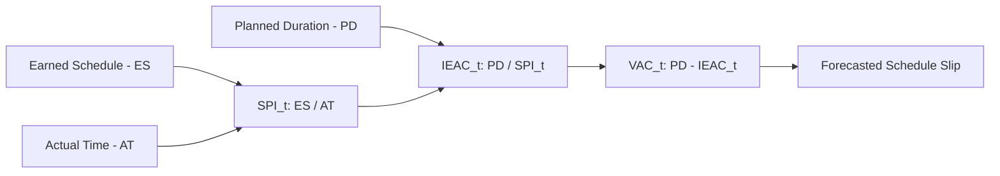

## Independent Estimate at Completion for Time

### Definition

Independent Estimate at Completion for Time — commonly notated IEAC(t) — is the Earned Schedule forecasting metric that projects a project's total duration at completion, based on current time-based schedule efficiency. It is the direct time-domain counterpart to the cost-domain EAC, answering: **"Given how we're actually progressing through the schedule, how long will the project really take?"**

$$IEAC(t) = \frac{PD}{SPI(t)}$$

Where:

- $PD$ = Planned Duration, the original total scheduled project length
- $SPI(t)$ = time-based Schedule Performance Index, calculated as $ES/AT$

### Purpose Within Earned Schedule

Just as cost-domain EAC recalculates the likely final cost based on current CPI trends, IEAC(t) recalculates the likely final completion date based on current schedule efficiency trends — but expressed in actual calendar/duration units rather than the value-based proxy that traditional SPI provides. This makes IEAC(t) directly actionable for schedule communication: stakeholders can be told "the project is now forecast to finish in month 15" rather than an abstract dollar-based schedule variance.

### Alternative IEAC(t) Formulas

Analogous to the four cost-domain EAC formulas, several IEAC(t) variants exist depending on assumptions about future performance:

**1. Assuming current SPI(t) trend continues (most common)**

$$IEAC(t) = \frac{PD}{SPI(t)}$$

**2. Assuming remaining work proceeds at the planned rate (atypical/one-time variance assumption)**

$$IEAC(t) = AT + (PD - ES)$$

This assumes the schedule inefficiency observed so far was a one-time issue and remaining work will proceed exactly on the original planned pace.

**3. Composite approach incorporating both cost and schedule performance**

$$IEAC(t) = AT + \frac{PD - ES}{SPI(t) \times SCI}$$

Where $SCI$ (Schedule Cost Index, sometimes used in more advanced Earned Schedule applications) incorporates a cost-efficiency-adjusted factor, reflecting that cost pressure can also influence how quickly remaining schedule work is completed. [Inference — this composite time-domain formula is an extension by analogy from the cost-domain composite EAC formula; it is less universally standardized in Earned Schedule literature than the two formulas above, and specific formulations vary across sources]

### Worked Example

A project has a Planned Duration $PD = 10$ months. At the current reporting date, Earned Schedule $ES = 2.667$ months and Actual Time $AT = 4$ months elapsed.

$$SPI(t) = \frac{ES}{AT} = \frac{2.667}{4} \approx 0.667$$

**Formula 1 (current trend continues):**

$$IEAC(t) = \frac{10}{0.667} \approx 14.99 \text{ months}$$

**Formula 2 (atypical variance, remaining work at planned pace):**

$$IEAC(t) = 4 + (10 - 2.667) = 4 + 7.333 = 11.33 \text{ months}$$

**Comparison**: The two formulas produce meaningfully different forecasts — approximately 15 months if current inefficiency continues, versus approximately 11.3 months if the team assumes remaining work will proceed exactly per the original plan. As with cost-domain EAC formula selection, the choice between these should be justified by root cause analysis: if the schedule delay stems from a systemic, ongoing issue (e.g., a persistent resource constraint), Formula 1 is more defensible; if it stems from a genuinely one-time, now-resolved event, Formula 2 may be more appropriate.

### Time-Based Variance at Completion

Analogous to cost-domain VAC, a time-based variance at completion can be derived:

$$VAC(t) = PD - IEAC(t)$$

Using Formula 1 above: $VAC(t) = 10 - 14.99 = -4.99$ months — indicating a forecasted overall schedule slip of roughly 5 months if current schedule efficiency continues unchanged.

### IEAC(t) vs. Traditional Schedule Forecasting Approaches

| Approach | Basis | Reliability Near Project End |
| --- | --- | --- |
| Traditional SPI-based duration estimate | $EV/PV$ ratio applied to duration | Degrades — SPI converges to 1.0 near completion, understating remaining delay |
| IEAC(t) | $ES/AT$ ratio (time-based) | Remains stable and meaningful throughout project lifecycle |
| Critical Path Method (CPM) forward pass re-scheduling | Network logic and remaining activity durations | Highly reliable but requires detailed, up-to-date schedule network data |

IEAC(t) is often used as a quick, data-driven early-warning cross-check, complementing (not replacing) a full CPM network re-schedule, which remains the more detailed and authoritative method once available in a specific reporting cycle.

### Practical Applications

- **Executive/sponsor communication**: providing a forecasted completion date rather than only a dollar-based schedule variance
- **Contractual milestone risk assessment**: comparing IEAC(t) against contractual completion deadlines to flag potential liquidated damages or penalty exposure early
- **Cross-checking detailed CPM re-scheduling**: a significant divergence between IEAC(t) and a full critical path re-forecast may indicate the schedule network needs updating, or that non-critical delays are being conflated with critical path risk
- **Portfolio-level schedule health dashboards**: since SPI(t) and IEAC(t) are unitless/time-based, they support standardized comparison across projects of different durations

### Common Pitfalls

- **Treating IEAC(t) as equivalent to a detailed CPM re-forecast**: IEAC(t) is a statistical extrapolation based on aggregate schedule efficiency, not a network-logic-based schedule recalculation; it can miss critical-path-specific risk that a full re-schedule would capture
- **Applying Formula 1 by default without root cause justification**: as with cost EAC, defaulting to the "trend continues" assumption without considering whether the observed inefficiency is genuinely systemic can produce an inaccurate forecast
- **Ignoring VAC(t) in stakeholder reporting**: presenting IEAC(t) alone, without translating it into "X months of forecasted slip," can under-communicate the practical significance of the forecast
- **Using IEAC(t) with an unreliable time-phased PV baseline**: since $ES$ depends on accurate historical PV data, an imprecise baseline undermines the entire time-based forecasting chain

### Visual: IEAC(t) Forecasting Chain

### Related Topics

- Time-based Schedule Performance Index (SPI(t))
- Earned Schedule calculation
- Limitations of traditional schedule variance in time units
- Critical Path Method (CPM) integration with Earned Schedule
- Estimate at Completion (EAC) formulas and scenarios — the cost-domain analog
- Contractual schedule risk and liquidated damages exposure