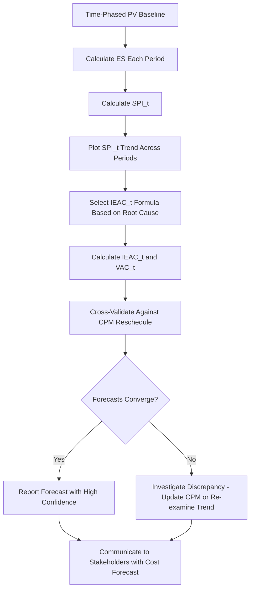

## Applying Earned Schedule to Forecasting

### Purpose

This topic synthesizes the individual Earned Schedule (ES) components — ES itself, SPI(t), and IEAC(t) — into a practical, end-to-end forecasting workflow. Rather than treating each metric in isolation, applying Earned Schedule to forecasting means using the full chain to produce a defensible, time-based schedule forecast that complements traditional cost-based EVM forecasting and integrates with Critical Path Method (CPM) analysis.

### The Full Forecasting Chain

$$\text{Time-phased PV curve} \rightarrow ES \rightarrow SPI(t) \rightarrow IEAC(t) \rightarrow VAC(t)$$

Each step builds on the prior:

1. **ES** locates the current earned value on the original planned schedule timeline
2. **SPI(t) = ES/AT** measures schedule efficiency in time units
3. **IEAC(t) = PD/SPI(t)** projects total duration at completion
4. **VAC(t) = PD − IEAC(t)** quantifies the forecasted schedule slip or gain

### Step-by-Step Application Workflow

**Step 1 — Establish the time-phased PV baseline.** Forecasting with ES requires the full cumulative PV curve by period, not just current totals. This must be established during planning and retained for every reporting cycle.

**Step 2 — Calculate ES each reporting period.** Using current cumulative EV against the PV curve, interpolate ES as described in the Earned Schedule calculation method.

**Step 3 — Calculate SPI(t) and compare to trend.** A single period's SPI(t) is a snapshot; plotting SPI(t) across multiple reporting periods reveals whether schedule efficiency is stable, improving, or deteriorating — critical context for choosing which IEAC(t) formula to apply.

**Step 4 — Select the appropriate IEAC(t) formula based on root cause.** As with cost EAC, the choice between "current trend continues" and "atypical one-time variance" formulas should be informed by root cause analysis of *why* the schedule variance occurred, not applied by default.

**Step 5 — Cross-validate against CPM network re-scheduling.** IEAC(t) is a statistical extrapolation; a full CPM forward-pass reschedule (updating remaining activity durations and dependencies) is the more detailed and authoritative source when available. Significant divergence between the two warrants investigation.

**Step 6 — Communicate VAC(t) and forecasted completion date to stakeholders.** Translate the abstract SPI(t) ratio into concrete terms: a forecasted completion month/date and the magnitude of slip versus the original plan.

### Worked End-to-End Example

A project has:

- $PD = 10$ months
- Time-phased cumulative PV curve (selected points): Month 2 = $90,000; Month 3 = $150,000
- Current cumulative $EV = \$130{,}000$ at $AT = 4$ months elapsed

**ES calculation:**

$$C = 2 \quad (\text{PV}_2 = 90{,}000 \leq 130{,}000)$$

$$I = \frac{130{,}000 - 90{,}000}{150{,}000 - 90{,}000} = 0.667$$

$$ES = 2 + 0.667 = 2.667 \text{ months}$$

**SPI(t):**

$$SPI(t) = \frac{2.667}{4} \approx 0.667$$

**IEAC(t) (assuming trend continues):**

$$IEAC(t) = \frac{10}{0.667} \approx 14.99 \text{ months}$$

**VAC(t):**

$$VAC(t) = 10 - 14.99 = -4.99 \text{ months}$$

**Cross-validation**: A CPM network reschedule of remaining activities, incorporating known resource constraints, projects a completion at month 14.5 — reasonably close to the ES-derived forecast of 14.99 months. This convergence increases confidence in the forecast; had the two diverged by, say, 3+ months, it would signal that either the CPM schedule needs updating or that the ES trend extrapolation is being distorted by a factor not captured in the network logic (e.g., a recent, not-yet-trended change in resource allocation).

**Stakeholder communication**: "The project is currently forecast to complete in month 15 rather than the originally planned month 10 — approximately a 5-month slip, consistent with independent critical path analysis."

### Integrating ES Forecasting with Cost Forecasting

A mature EVM/ES practice reports cost and schedule forecasts together, since they are often causally linked:

| Metric | Formula | Current Value (Example) | Forecast |
| --- | --- | --- | --- |
| CPI | $EV/AC$ | 0.833 | EAC ≈ $600,240 |
| SPI(t) | $ES/AT$ | 0.667 | IEAC(t) ≈ 14.99 months |

Presenting both together allows stakeholders to see the compounding risk picture: a project both over budget and significantly behind schedule, with each dimension's forecast informed by the metric structurally suited to measure it — cost-domain EAC for budget, time-domain IEAC(t) for schedule.

### When Earned Schedule Forecasting Adds the Most Value

- **Late-stage project reporting**, where traditional SPI has already converged toward 1.0 and lost diagnostic value, but IEAC(t) remains meaningful
- **Contractual completion date risk assessment**, translating schedule inefficiency into a concrete forecasted date comparable against contract milestones
- **Portfolio dashboards**, where standardized SPI(t)/IEAC(t) reporting enables cross-project schedule risk comparison independent of each project's budget size or duration
- **Early warning ahead of formal CPM re-scheduling cycles**, since ES calculations can be updated as frequently as EVM data is collected, potentially more often than a full network reschedule is performed

### Common Pitfalls

- **Applying ES forecasting without a validated time-phased PV baseline**: garbage-in, garbage-out — an imprecise or coarse PV curve undermines every downstream calculation
- **Treating IEAC(t) as a replacement for CPM scheduling**: ES forecasting is a statistical/aggregate technique; it doesn't replace the network-logic detail of a proper critical path reschedule, and the two should be used together, not interchangeably
- **Reporting SPI(t)/IEAC(t) without root cause context**: as with cost EAC, presenting a bare forecast number without explaining what's driving the trend limits its usefulness for corrective decision-making
- **Inconsistent reporting cadence between ES and CPM updates**: if ES is updated monthly but the CPM schedule is only refreshed quarterly, the two can drift out of sync, creating confusing or contradictory forecasts
- **Ignoring SPI(t) trend volatility in early periods**: forecasts based on very early, sparse data carry more uncertainty and should be presented with appropriate caveats

### Visual: Integrated Earned Schedule Forecasting Workflow

### Related Topics

- Earned Schedule calculation
- Time-based Schedule Performance Index (SPI(t))
- Independent Estimate at Completion for Time (IEAC(t))
- Critical Path Method (CPM) integration with Earned Schedule
- Estimate at Completion (EAC) formulas and scenarios
- Variance analysis reports and stakeholder communication