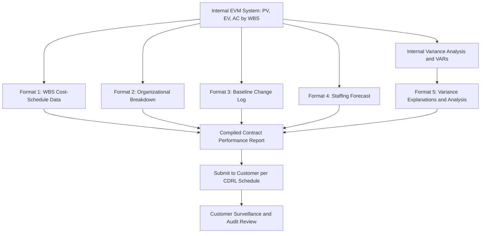

## Contract Performance Reports

### Definition

A Contract Performance Report (CPR) is a formal, standardized report format used to communicate EVM data from a contractor to a customer (typically a government or large enterprise buyer), summarizing cost and schedule performance against the contractual baseline. The CPR is the primary contractual deliverable through which EVM system output becomes visible and auditable outside the performing organization, most notably in U.S. government contracting under frameworks aligned with ANSI/EIA-748.

### Purpose Within Contractual EVM

Where internal variance analysis reports (VARs) and S-curves serve a project team's own management needs, the CPR exists specifically to satisfy a **contractual reporting obligation** — giving the customer/buyer independent visibility into contractor performance without requiring direct access to the contractor's internal systems. It formalizes the same underlying data (PV, EV, AC, variances, EAC) into a structure the customer can consistently interpret and compare across contracts or contractors.

### Standard CPR Format Elements

Historically, the U.S. Department of Defense CPR format (DI-MGMT-81466 and related specifications) organized reporting into distinct formats, each serving a different reporting purpose. While specific format numbers and exact requirements vary by contract and have evolved over time, the general structure typically includes:

**Format 1 — WBS-Level Cost/Schedule Data**

Presents PV, EV, AC, variances (CV, SV), and EAC broken down by Work Breakdown Structure element, typically showing both current period and cumulative-to-date figures, plus BAC and EAC at completion.

**Format 2 — Organizational/Functional Breakdown**

Presents similar cost/schedule data organized by the performing organization's functional structure (e.g., engineering, manufacturing, program management) rather than by WBS — useful for understanding which parts of the organization are driving variance.

**Format 3 — Baseline Changes**

Documents changes to the Performance Measurement Baseline (PMB) over the reporting period — additions, deletions, or re-plans — providing an audit trail for baseline integrity, which is critical since uncontrolled baseline changes can be used to artificially mask variance.

**Format 4 — Staffing Forecast**

Reports current and forecasted staffing levels (labor hours or headcount) by time period, supporting resource capacity analysis.

**Format 5 — Explanations and Analysis**

Narrative variance analysis, similar in content to an internal VAR — explaining significant variances, root causes, corrective actions, and their expected impact on cost/schedule at completion.

[Note: exact CPR format numbering, required content, and applicable specification (e.g., DI-MGMT-81466A/B or successor guidance) vary by contract, agency, and time period; contractors should always confirm current requirements against the specific contract's Contract Data Requirements List (CDRL) and applicable specification version rather than assuming a fixed universal format.]

### Reporting Cadence and Thresholds

CPRs are typically required:

- **Monthly**, aligned with the contractor's standard EVM reporting cycle
- Only for contracts **exceeding a defined dollar threshold** and risk category, since formal CPR requirements impose significant reporting overhead that is generally reserved for larger, higher-risk procurements
- With a **variance narrative threshold** — explanations required only for variances exceeding a specified percentage or dollar amount, following the same management-by-exception principle used in internal VARs

### Distinguishing CPR from Internal EVM Reporting

| Aspect | Internal VAR/S-Curve | Contract Performance Report (CPR) |
| --- | --- | --- |
| Audience | Internal project team, PMO, sponsor | External customer/contracting officer |
| Format | Organization-specific, flexible | Standardized per contract specification |
| Frequency | As needed, often continuous monitoring | Fixed contractual cadence (typically monthly) |
| Legal/contractual weight | Internal management tool | Contractual deliverable, subject to audit |
| Data granularity | Often deeper/more granular internally | Summarized to the level specified in the contract |

A contractor's internal systems generate far more granular data than a CPR discloses; the CPR represents a formally agreed subset and format of that data, tailored to what the contract specifies the customer needs to see.

### Worked Example — CPR Data Excerpt (Format 1 Style)

| WBS Element | BAC | Cumulative PV | Cumulative EV | Cumulative AC | CV | SV | EAC |
| --- | --- | --- | --- | --- | --- | --- | --- |
| 1.0 Design | $200,000 | $200,000 | $195,000 | $210,000 | -$15,000 | -$5,000 | $215,385 |
| 2.0 Construction | $800,000 | $500,000 | $460,000 | $540,000 | -$80,000 | -$40,000 | $939,130 |
| 3.0 Testing | $100,000 | $20,000 | $15,000 | $18,000 | -$3,000 | -$5,000 | $120,000 |
| **Total** | **$1,100,000** | **$720,000** | **$670,000** | **$768,000** | **-$98,000** | **-$50,000** | **$1,274,515** |

Accompanying this table, a Format 5-style narrative would explain the Construction element's significant negative CV and SV — likely the primary driver of the total project's variance — along with root cause and corrective action, consistent with standard variance analysis report content.

### Compliance and Audit Considerations

- **EVM System Validation**: for contracts requiring formal EVM system compliance (typically large, complex government contracts), the contractor's underlying EVM system itself may be subject to a formal validation/certification review against ANSI/EIA-748 guidelines before CPRs are accepted as compliant
- **Surveillance reviews**: contracting agencies may periodically conduct surveillance of the contractor's EVM system and CPR data integrity, separate from routine monthly report review
- **Data consistency across formats**: CPR formats must reconcile internally (e.g., Format 1 WBS totals must match Format 2 organizational totals) — inconsistency across formats is a common audit finding
- **Baseline change documentation (Format 3) integrity**: since baseline changes directly affect how variances are calculated, incomplete or delayed baseline change documentation undermines the credibility of all other reported variances

### Common Pitfalls

- **Treating CPR preparation as a compliance afterthought**: since CPR data derives from the same underlying EVM system used for internal management, poor internal EVM discipline (inconsistent measurement methods, undocumented baseline changes) directly produces a poor-quality, potentially non-compliant CPR
- **Narrative sections that restate numbers without explaining cause**: Format 5-style narratives that describe "CV is -$80,000" without root cause and corrective action fail to meet the report's actual purpose
- **Inconsistent reporting cadence or late submission**: contractual CPR deadlines are typically firm; late submission can itself constitute a contract compliance issue independent of the underlying performance data
- **Confusing internal management reporting flexibility with contractual reporting rigidity**: teams accustomed to informal internal variance discussions must adapt to the structured, audit-ready discipline CPRs require
- **Assuming CPR format requirements are universal**: as noted above, specific format content and applicable specifications vary by contract and have evolved over time — verifying current contract-specific requirements is essential rather than assuming a fixed template

### Visual: CPR Data Flow from Internal EVM to Contractual Deliverable

### Related Topics

- ANSI/EIA-748 EVM system compliance requirements
- Variance analysis reports (internal VAR structure)
- Performance Measurement Baseline (PMB) and baseline change control
- EVM system validation and surveillance reviews
- S-curve development and interpretation
- Government contract EVM reporting requirements (CDRL/DID specifications)