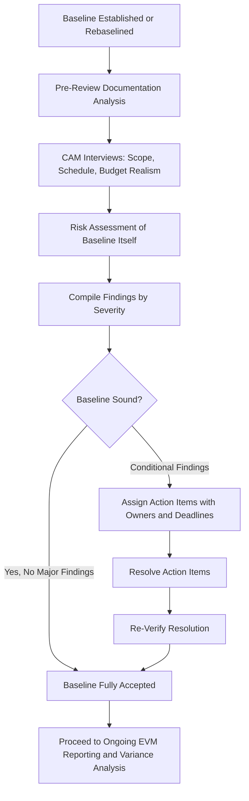

## Integrated Baseline Reviews

### Definition

An Integrated Baseline Review (IBR) is a formal, structured joint review conducted by the customer and contractor (or between internal program management and executing teams) early in a project's execution phase, to validate that the Performance Measurement Baseline (PMB) is realistic, complete, and achievable. The IBR confirms — before significant execution has occurred — that the technical scope, schedule, and budget are mutually understood and properly integrated, so that subsequent EVM variance data can be trusted as a meaningful signal rather than an artifact of a flawed baseline.

### Purpose Within EVM Governance

EVM's entire analytical value depends on the quality of the baseline against which performance is measured — a technically unrealistic or poorly resourced baseline produces variances that reflect baseline flaws rather than genuine execution problems. The IBR exists specifically to catch these flaws early, before months of reporting accumulate against a baseline that was never achievable in the first place. It answers three core questions:

1. **Is the technical scope of work fully and accurately captured in the WBS?**
2. **Is the schedule logically sound, resource-loaded, and realistic given the technical scope?**
3. **Is the budget (BAC) sufficient and correctly time-phased to support the schedule and scope?**

### When IBRs Are Conducted

- **At contract/program award**, before or shortly after execution begins, to validate the initial baseline
- **After a major rebaseline**, since a significant re-plan effectively creates a new baseline requiring the same validation rigor as the original
- **At major program milestones or phase transitions**, particularly for large, multi-year programs where an initial IBR may not remain sufficient validation for later phases with substantially different scope
- **Following major scope changes or contract modifications** that materially alter the baseline

### IBR Process Components

**1. Documentation Review (typically pre-meeting)**

The review team examines the WBS, schedule network, resource loading, and budget allocation documentation in advance, looking for internal consistency and completeness.

**2. Technical/Programmatic Interviews**

Reviewers interview control account managers (CAMs) — the individuals accountable for specific WBS elements — to assess whether they understand their assigned scope, agree the budget and schedule allocated to their work package is realistic, and can articulate how they will execute and measure progress.

**3. Risk Assessment**

Identifies risks embedded in the baseline itself — for example, an overly optimistic schedule duration, an unresourced dependency, or a budget that doesn't account for a known cost driver — distinct from risks that might emerge during execution.

**4. Findings and Action Items**

The review produces a formal set of findings, typically categorized by severity, with action items assigned to specific owners and deadlines for resolution before the baseline is considered validated.

### Key IBR Evaluation Criteria

| Criterion | What Is Assessed |
| --- | --- |
| Scope completeness | Does the WBS capture 100% of the contracted/required scope? |
| Schedule logic | Are dependencies correctly sequenced, with realistic durations and no unaddressed critical path risks? |
| Resource realism | Are the people, equipment, and materials assumed in the schedule actually available when needed? |
| Budget adequacy | Is the BAC, as time-phased into PV, sufficient to execute the defined scope and schedule? |
| Management processes | Does the organization have the EVM system maturity (measurement methods, change control, reporting cadence) to execute and report against this baseline? |
| CAM understanding | Do the individuals accountable for each work package genuinely understand and accept their assigned scope, budget, and schedule? |

### Common IBR Findings

- **Unresourced or under-resourced critical path activities**: schedule assumes availability of specialized resources without confirmed allocation
- **Optimistic duration estimates**: activity durations based on best-case rather than realistic performance assumptions
- **Incomplete WBS coverage**: scope elements identified in contract/requirements documentation not reflected anywhere in the WBS
- **Disconnected budget and schedule**: budget time-phasing (PV curve) that doesn't align with when the schedule actually requires the corresponding resources
- **CAM unfamiliarity with assigned work packages**: control account managers who cannot articulate how they will execute or measure their assigned scope — a strong signal the baseline was built top-down without adequate bottom-up validation

### Worked Example — IBR Outcome Scenario

An IBR is conducted for a project with $BAC = \$1{,}100{,}000$ across three major WBS elements (Design, Construction, Testing). During CAM interviews, the reviewers find:

- The **Design** CAM confirms the budget and schedule are realistic and well understood
- The **Construction** CAM notes that the schedule assumes a specialized inspector will be available in month 4, but no formal resource commitment has been confirmed with the inspection vendor — a **schedule risk finding**
- The **Testing** CAM notes the budget allocated ($100,000) appears to assume a single testing pass, while historical performance on similar projects has typically required at least one round of remediation and retesting — a **budget adequacy finding**

**IBR outcome**: baseline is **conditionally accepted**, with two formal action items — (1) confirm inspector resource commitment before month 3, and (2) add contingency or re-scope the Testing budget to account for a likely retest cycle — both to be resolved and re-verified before the baseline is considered fully validated.

This illustrates the IBR's core value: catching a schedule resource gap and a budget adequacy gap *before* they manifest as negative SV and CV several months into execution, when corrective options are more limited and more expensive.

### IBR vs. Ongoing Variance Analysis

| Aspect | IBR | Ongoing Variance Analysis (VAR, S-curves) |
| --- | --- | --- |
| Timing | Before/early in baseline execution, or after rebaseline | Continuous, throughout execution |
| Focus | Is the baseline itself sound? | Is performance against the baseline on track? |
| Output | Baseline validation findings and action items | Variance figures, root causes, corrective actions |
| Assumes baseline is... | Under review/unproven | Already validated and trustworthy |

An IBR essentially asks "should we trust this baseline?" before ongoing EVM reporting spends months answering "are we performing against it?" Skipping a proper IBR risks investing significant reporting effort against a baseline that was flawed from the start.

### Common Pitfalls

- **Treating the IBR as a pass/fail gate rather than a risk-identification exercise**: the goal is to surface baseline risks and get them addressed, not simply to check a compliance box
- **Conducting the IBR too late**: if significant execution has already occurred before the IBR, its value in catching baseline problems early is substantially diminished
- **Interviewing only senior management, not control account managers**: CAM-level understanding is often where baseline realism problems surface most clearly; skipping this level of interview misses key risk signals
- **No follow-up verification of action items**: identifying findings without confirming they are actually resolved before considering the baseline validated undermines the review's purpose
- **Skipping IBR after a major rebaseline**: treating rebaselining as purely an administrative budget/schedule update, without re-validating the new baseline's realism, repeats the same risk the original IBR was meant to address

### Visual: IBR Process Flow

### Related Topics

- Performance Measurement Baseline (PMB) construction
- Rebaselining criteria and change control
- Control Account Managers (CAM) roles and responsibilities
- ANSI/EIA-748 EVM system compliance requirements
- Variance analysis reports and ongoing performance monitoring
- Contract Performance Reports (CPR)