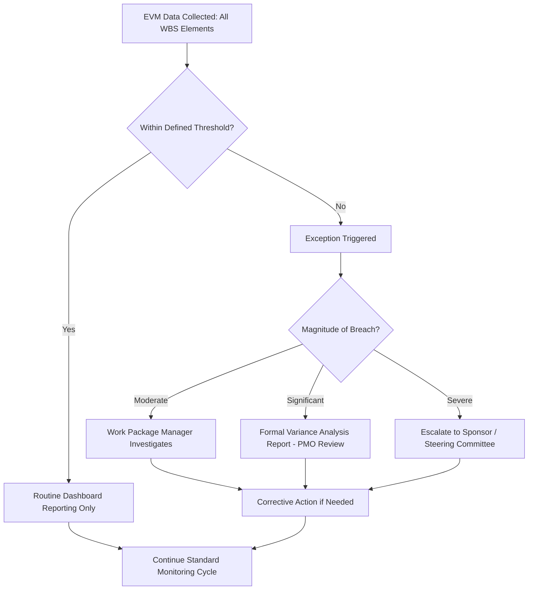

## Management by Exception Principles

### Definition

Management by exception (MBE) is a governance philosophy in which management attention and formal reporting effort are directed only toward performance deviations that exceed pre-defined tolerances, while activities performing within normal bounds proceed with routine, lightweight monitoring. In the EVM context, MBE is the organizing principle behind variance thresholds, tiered escalation, and the entire structure of exception-driven reporting — it exists to allocate scarce management attention efficiently rather than spreading it evenly across every data point regardless of significance.

### Why Management by Exception Matters in EVM

EVM generates continuous, granular performance data — CV, SV, CPI, SPI calculated at potentially every WBS element, every reporting period. Without a filtering principle, this volume of data creates two failure modes:

- **Information overload**: management cannot meaningfully review every variance on every work package every period, leading to superficial review or selective, inconsistent attention
- **Diluted signal**: genuinely significant variances get lost among routine, statistically normal fluctuations if all variances receive equal reporting weight

MBE resolves this by establishing that *routine* performance requires no special reporting beyond standard dashboards, while only *exceptional* performance (breaching a defined threshold) triggers formal analysis, narrative explanation, and escalation.

### Core Components of MBE in EVM

**1. Defined Tolerances/Thresholds**

Explicit numeric limits on CV, SV, CPI, or SPI (e.g., ±10% of BAC) beyond which a variance is considered "exceptional" rather than routine. These thresholds are the operational trigger mechanism for the entire MBE structure.

**2. Tiered Escalation Levels**

Different magnitudes of exception route to different levels of authority:

| Variance Magnitude | Response Level |
| --- | --- |
| Within tolerance | Routine monitoring, dashboard only |
| Moderate breach | Work package manager investigates and reports |
| Significant breach | Project manager/PMO formal variance analysis report |
| Severe breach | Sponsor/steering committee escalation, possible rebaseline review |

**3. Standardized Exception Reporting**

Once a threshold is breached, a structured response (e.g., a Variance Analysis Report) is triggered automatically, ensuring exceptions receive consistent, rigorous treatment rather than ad hoc explanation.

**4. Routine Reporting Remains Lightweight**

Performance within tolerance still gets reported — via dashboards, S-curves, or summary tables — but without requiring narrative justification, root cause analysis, or corrective action planning, preserving management bandwidth for genuine issues.

### MBE Applied Across the EVM Workflow

MBE is not a single tool but a principle that shapes several EVM practices already covered:

- **Variance thresholds and reporting triggers** operationalize MBE by defining exactly what counts as an "exception"
- **Variance analysis reports** are the standardized exception-response artifact MBE requires once a threshold is crossed
- **Tiered escalation** (work package → PM → sponsor) reflects MBE's principle that exception severity should determine which level of authority engages
- **Contract Performance Report narrative sections (Format 5)** typically apply MBE explicitly, requiring explanation only for variances exceeding a specified dollar or percentage threshold, not for every WBS line item

### Worked Example

A project with 15 WBS elements is reviewed monthly. Applying a ±10% of work-package BAC threshold on CV:

| WBS Element | BAC | CV | % of BAC | MBE Action |
| --- | --- | --- | --- | --- |
| 1.0 Design | $200,000 | -$8,000 | -4% | Within tolerance — routine monitoring only |
| 2.0 Construction | $800,000 | -$95,000 | -11.9% | Exceeds threshold — formal VAR required |
| 3.0 Testing | $100,000 | -$3,000 | -3% | Within tolerance — routine monitoring only |

Under MBE, management's formal review effort for this reporting period concentrates entirely on Construction — the only element requiring root cause analysis and a corrective action plan — while Design and Testing continue with standard dashboard-level tracking. Without MBE, all 15 WBS elements (in a full project) might otherwise receive equal narrative scrutiny regardless of whether they show any meaningful deviation.

### Setting Appropriate Thresholds — The Core MBE Design Challenge

The effectiveness of MBE depends entirely on threshold calibration:

- **Too tight**: generates excessive "exceptions," defeating MBE's purpose of concentrating attention, and produces alarm fatigue
- **Too loose**: allows genuinely significant problems to go unreported until they become severe, undermining MBE's early-warning function
- **Uniform vs. risk-adjusted thresholds**: some organizations apply tighter thresholds to higher-risk or higher-value work packages and looser thresholds to well-understood, lower-risk work — a risk-adjusted MBE approach rather than a single uniform rule

### Benefits of Applying MBE

- **Efficient use of management time**: attention concentrates where it has the most value
- **Faster response to genuine problems**: exception-triggered reporting typically moves faster than reporting buried among routine updates
- **Consistent treatment of similar-magnitude issues**: standardized thresholds and reporting formats reduce the risk of one manager's "concerning" variance being another's "no big deal"
- **Scalability**: MBE allows EVM to function effectively even on very large, complex programs with hundreds of WBS elements, where uniform detailed review of every element would be impractical

### Common Pitfalls

- **Setting thresholds without periodic review**: as a project matures or its risk profile changes, thresholds calibrated at project start may no longer be appropriate later
- **Applying MBE only to cost, ignoring schedule**: effective MBE requires thresholds on both CV/CPI and SV/SPI (and ideally SPI(t)), since a project can breach schedule tolerance while remaining within cost tolerance or vice versa
- **No defined escalation path for exceptions**: identifying an exception without a clear "then what" (who reviews it, what response is required, by when) produces reports that sit unactioned
- **Confusing "within tolerance" with "no action needed ever"**: a variance within tolerance for several consecutive periods but trending steadily toward the threshold may warrant proactive attention before it formally breaches, even under a strict MBE structure
- **Static thresholds applied uniformly regardless of work package risk**: treating a well-understood, low-risk task and a novel, high-risk task with identical tolerance bands can under-monitor the riskier item

### Visual: Management by Exception Filtering Logic

### Related Topics

- Variance thresholds and reporting triggers
- Variance analysis reports
- Corrective action planning
- Contract Performance Reports (CPR) and Format 5 narrative thresholds
- Risk-adjusted project controls approaches
- Rebaselining criteria and change control