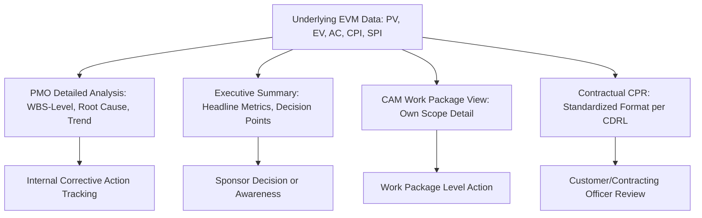

## Communicating EVM Data to Stakeholders

### Purpose

Calculating accurate EVM metrics is only half the value proposition — that value is only realized if the data is communicated in a way stakeholders can understand, trust, and act on. Different stakeholders need different levels of detail, different framing, and different emphasis, and effective EVM communication requires deliberately tailoring the same underlying data to each audience rather than presenting one undifferentiated report to everyone.

### Stakeholder Segmentation

**Executive Sponsors / Steering Committees**

Need high-level, decision-oriented summaries: is the project on track, and if not, what decision is being requested of them? Detailed WBS-level variance tables are typically inappropriate at this level — they need the headline CPI/SPI, VAC, forecasted completion date, and a clear statement of any decision or approval required.

**Project/Program Management (PMO)**

Need full analytical detail: WBS-level variances, root cause narratives, corrective action status, and trend data across reporting periods, to actively manage the project day-to-day.

**Control Account Managers (CAMs) / Work Package Owners**

Need granular, actionable data specific to their assigned scope: their own work package's PV, EV, AC, and variance, plus context on how it rolls up to overall project performance.

**External Customers / Contracting Officers**

Need contractually formatted, auditable data (e.g., Contract Performance Reports) with defined narrative thresholds and formal variance explanations, per contract requirements.

**Technical Teams / Delivery Staff**

Often need minimal direct EVM exposure — their primary interface is typically through schedule and task status updates that feed into EVM behind the scenes, rather than raw CPI/SPI figures, unless they are directly accountable as a CAM.

### Matching Content Depth to Audience

| Audience | Key Metrics | Level of Detail | Framing |
| --- | --- | --- | --- |
| Executive Sponsor | CPI, SPI(t), VAC, forecasted completion date | Project-level summary | Decision-oriented: "here's the situation, here's what we need from you" |
| PMO | Full CV/SV/CPI/SPI by WBS, trend charts | Detailed, multi-period | Analytical: root cause, corrective action tracking |
| CAM | Own work package's PV/EV/AC/variance | Granular, work-package-specific | Operational: what needs to happen next |
| External Customer | Contractually specified format (e.g., CPR) | As specified in contract | Formal, auditable, standardized |

### Principles for Effective Communication

**1. Lead with the "so what," not the raw numbers.**

Stating "CPI is 0.83" without context requires the audience to interpret significance themselves. Stating "the project is trending toward a $100,000 overrun if current performance continues, requiring a decision on additional funding or scope reduction" gives the audience the actionable conclusion directly.

**2. Use visuals to convey trend and magnitude, not just tables.**

S-curves, trend line charts of CPI/SPI across periods, and simple variance bar charts communicate direction and magnitude far more immediately than tables of numbers, particularly for non-technical stakeholders.

**3. Separate "what happened" from "what we're doing about it."**

Every significant variance communicated to a decision-making audience should be paired with the corrective action already taken or proposed — presenting a problem without a response invites the audience to demand one on the spot, often without full context.

**4. Be consistent in cadence and format.**

Stakeholders build trust in reporting through predictability — the same metrics, presented in the same format, at the same recurring interval, make it easier to spot genuine change versus reporting inconsistency.

**5. Disclose forecast assumptions, not just forecast numbers.**

As covered under EAC forecasting, a single EAC or IEAC(t) figure depends on which formula/assumption was used. Communicating "EAC is $600,000, assuming current cost efficiency continues" is more honest and useful than presenting a bare number as if it were certain.

### Worked Example — Tailoring One Data Set to Two Audiences

Underlying data: $BAC = \$500{,}000$, cumulative $EV = \$300{,}000$, $AC = \$360{,}000$, $CPI \approx 0.833$, forecasted $EAC \approx \$600{,}240$, $VAC \approx -\$100{,}240$.

**To the Executive Sponsor:**

"The project is currently tracking about 20% over its original budget. If this trend continues, we forecast a total cost of approximately $600,000 against the $500,000 baseline. We've identified the root cause as a resource bottleneck in inspection services and have a corrective action in progress; we expect to confirm its effectiveness within one reporting cycle. No funding decision is needed yet, but I want to flag this now in case additional budget approval becomes necessary next quarter."

**To the PMO (internal working detail):**

"Cumulative CPI is 0.833, driven primarily by WBS element 2.0 Construction, where CV is -$95,000 against a threshold of -$80,000. Root cause: inspector resource conflict causing authorized overtime. Corrective action: engaging a secondary inspection vendor, estimated added cost $15,000, targeting CPI recovery to 0.90 for remaining work. EAC recalculated at $600,240 under current-trend assumption; TCPI against original BAC is 1.43, confirming the original budget is not realistically achievable without this intervention. Next checkpoint: September reporting period."

The same underlying numbers, presented with different depth, framing, and call to action appropriate to each audience's role and decision authority.

### Common Pitfalls

- **One-size-fits-all reporting**: sending PMO-level WBS detail to an executive sponsor, or an oversimplified summary to a PMO that needs full analytical depth, both fail their respective audiences
- **Presenting metrics without narrative context**: raw CPI/SPI numbers without an accompanying "what this means and what we're doing" narrative leave the audience to draw their own — potentially incorrect or alarmist — conclusions
- **Burying the critical finding**: leading a report with routine, within-tolerance data before mentioning a significant exception violates the management-by-exception principle of surfacing what matters most, first
- **Inconsistent terminology across reports**: using different labels for the same metric across different reports or periods (e.g., "cost overrun" in one report, "negative CV" in another) creates confusion and undermines trust in the reporting process
- **Overloading visuals with excessive data series**: an S-curve or dashboard trying to show too many WBS elements or metrics simultaneously can obscure rather than clarify the key message
- **Failing to close the loop on previously communicated issues**: if a variance was flagged and a corrective action proposed in one reporting cycle, subsequent communications should explicitly report on whether that action worked — leaving prior issues unaddressed in later reports erodes stakeholder confidence

### Visual: Audience-Tailored Reporting Flow

### Related Topics

- Variance analysis reports
- S-curve development and interpretation
- Contract Performance Reports (CPR)
- Management by exception principles
- Estimate at Completion (EAC) formulas and scenarios — forecast assumption disclosure
- Corrective action planning and follow-up tracking