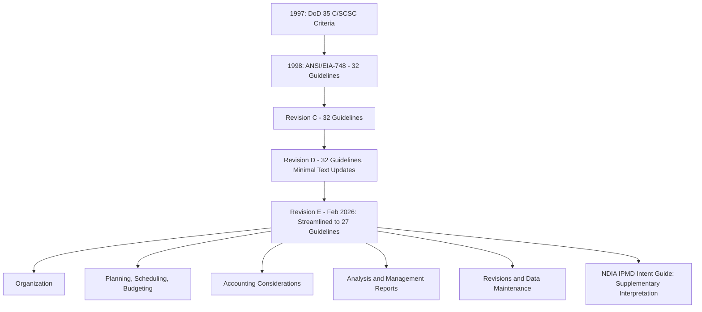

## ANSI/EIA-748 EVMS Guidelines Overview

### Definition

ANSI/EIA-748 is the industry standard defining the requirements an Earned Value Management System (EVMS) must satisfy to be considered compliant, particularly for U.S. government contracts exceeding defined dollar thresholds. It specifies a set of guidelines covering how an organization structures work, plans and budgets, tracks actual costs, analyzes performance, and controls changes to the baseline — providing the governing framework that underlies everything from Contract Performance Reports to Integrated Baseline Reviews.

### Standard History and Evolution

Until 1997, the U.S. Department of Defense exclusively defined EVMS requirements, mandating that contractors on major defense programs implement systems meeting 35 Cost/Schedule Control Systems Criteria (C/SCSC). In 1995, a National Defense Industrial Association (NDIA) committee began rewriting these criteria to be more adaptable to commercial environments, producing a streamlined, industry-led version with 32 core requirements, formalized in 1998 as the ANSI/EIA-748 standard.

The standard has historically been maintained by the National Defense Industrial Association (NDIA) together with SAE International, the standards body that sponsors EIA-748; in the past, American National Standards Institute (ANSI) held that role. [AcqNotes](https://acqnotes.com/acqnote/tasks/ansi-eia-748-earned-value-management)

**Revision history:**

| Revision | Guideline Count | Notes |
| --- | --- | --- |
| Original (1998) | 32 | Formalized from the NDIA rewrite of the 35 C/SCSC criteria |
| Revision C | 32 | Defines requirements an EVMS must meet as the governing document for its application |
| Revision D | 32 | Minimal text updates to the original 32-guideline structure |
| **Revision E (current, Feb 2026)** | **27** | A streamlined set of 27 guidelines, reorganized for clarity and improved life cycle alignment, with minimal impact to existing EVMS implementations |

Revision E was released as a major structural overhaul in February 2026, condensing the legacy 32 criteria into 27 modernized guidelines to enhance operational flexibility and remove redundancies.

### The Five Guideline Process Categories

Across revisions, the guidelines remain organized into five core process categories:

1. **Organization** — defining work structure and responsibilities
2. **Planning, Scheduling and Budgeting** — establishing time-phased budgets and work packages
3. **Accounting Considerations** — tracking costs against budgets
4. **Analysis and Management Reports** — comparing planned vs. actual costs and schedules
5. **Revisions and Data Maintenance** — controlling changes to performance data [Scribd](https://www.scribd.com/document/177520720/32-Guidelines-pdf)

The Revision E guidelines remain organized into these same five process categories, with an update to the name of one category to improve clarity.

### What Changed in Revision E

Revision E merged, revised, and deleted guidelines to improve clarity and strengthen progress assessment, analysis, and change management. A specific example: the Revisions and Data Maintenance category was significantly improved to eliminate redundancy, clearly separating three types of changes — customer-directed, internal replanning (which merged the former Guidelines 29 and 32), or an Over Target Baseline/Over Target Schedule (OTB/OTS) situation — with retroactive changes required to be controlled in all instances.

**Practical impact for contractors:** most EVM System Descriptions will need remapping and potentially minor updates for estimated costs and ETC/EAC processes at the control account and program level, and training and internal surveillance materials will need to be updated. However, organizations whose EVM System Description is already organized in alignment with the five guideline process categories should see minimal impact, since the underlying requirements are largely unchanged — simplified and streamlined rather than substantively new.

### Guideline Category Focus Areas (Illustrative)

Representative examples of what each category addresses (not an exhaustive list):

| Category | Example Focus |
| --- | --- |
| Organization | Identifying interim measures of progress, such as milestones and products |
| Planning, Scheduling, Budgeting | Time-phased budget establishment, work package definition |
| Accounting Considerations | Accurate material cost accumulation by control accounts, EV measurement timing, and full accountability of materials |
| Analysis and Management Reports | Control account monthly summaries, identification of Cost Variance and Schedule Variance, and summarizing data elements and variances through the WBS/OBS for management |
| Revisions and Data Maintenance | Making adjustments to the program budget only for authorized changes, and documenting changes to the performance measurement baseline |

### Scalability Principle

The guidelines provide a consistent basis to assist government and contractor organizations in implementing and maintaining acceptable EVM systems, with the objective of providing integrated program management information using an EVMS implementation scaled to meet the management needs of the specific project — a scaled EVMS applies the guidelines to reflect the size, complexity, and type of work effort necessary to manage the project successfully. This means smaller or lower-risk projects are not expected to implement the full rigor appropriate to a large, complex government program — the standard is explicitly designed to flex with project context.

### Surveillance and Compliance

Earned Value Management Surveillance is required for all contract efforts requiring implementation of an EVMS compliant with the ANSI/EIA-748 guidelines, regardless of whether a formal system validation is also required. Within the U.S. Department of Defense, the Office of Acquisition Analytics and Policy (AAP) is accountable for EVM policy, oversight, and governance, and maintains the DoD EVMS Interpretation Guide (EVMSIG) as the basis for assessing EVMS compliance against the guidelines, developed in collaboration with DoD EVMS experts and the organizations responsible for conducting compliance reviews. [AcqNotes](https://acqnotes.com/acqnote/tasks/ansi-eia-748-earned-value-management)

### Supplementary Guidance

While the core EIA-748 standard itself must be acquired via commercial license through SAE International, the NDIA Integrated Program Management Division (IPMD) provides an open-access companion resource — the NDIA EVMS Intent Guide — which offers detailed insight into each guideline's underlying management intent and compliance expectations for federal validation reviews. Following Revision E's publication, the NDIA IPMD updated this companion documentation to provide practitioners with translation paths from the legacy 32 criteria to the new 27 guidelines.

### Transition Considerations for Existing Contractors

- **Remapping required**: at minimum, current approved EVM System Descriptions will need to be remapped to the Revision E set of 27 guidelines.
- **Priority review areas**: organizations should specifically review content related to use of estimated costs (a specific guideline) and managing changes as part of the transition. [Humphreys-assoc](https://blog.humphreys-assoc.com/planning-ahead-for-the-eia-748-standard-for-evms-revision-e/)
- **Opportunity for improvement**: the publication of Revision E is treated as an opportunity to make broader EVM System Description content improvements, not merely a compliance relabeling exercise. [Humphreys-assoc](https://blog.humphreys-assoc.com/planning-ahead-for-the-eia-748-standard-for-evms-revision-e/)

### Common Pitfalls

- **Assuming a fixed 32-guideline structure**: given the February 2026 transition to Revision E's 27 guidelines, reference material, training content, and internal compliance checklists built against the older 32-guideline structure are now outdated and require updating
- **Treating remapping as purely administrative**: since requirements were merged and reorganized rather than simply renumbered, a careful crosswalk (using the NDIA Intent Guide translation path) is needed to ensure no substantive requirement is inadvertently dropped
- **Applying full-rigor EVMS requirements uniformly regardless of project scale**: the standard's explicit scalability principle means smaller projects should tailor implementation depth, not adopt the same detailed process appropriate to a large defense program
- **Confusing surveillance with formal validation**: surveillance applies to all EVMS-compliant contract efforts regardless of whether formal system validation is separately required — these are related but distinct compliance activities

### Visual: ANSI/EIA-748 Structure and Evolution

### Related Topics

- Contract Performance Reports (CPR) and their relationship to EVMS compliance
- Integrated Baseline Reviews (IBR)
- Performance Measurement Baseline (PMB) and change control
- EVM system validation and surveillance reviews
- Over Target Baseline (OTB) and Over Target Schedule (OTS) situations
- NDIA IPMD EVMS Intent Guide as supplementary interpretation resource