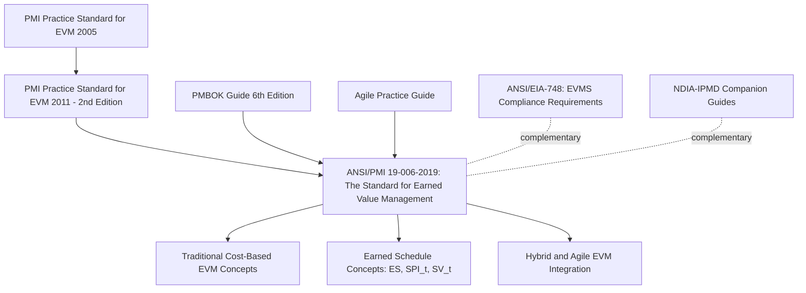

## The Standard for Earned Value Management ANSI/PMI 19-006

### Definition

The Standard for Earned Value Management (ANSI/PMI 19-006-2019) is a Project Management Institute (PMI) publication, elevated to American National Standard status by ANSI, that provides comprehensive guidance on applying Earned Value Management across predictive, agile, and hybrid project delivery approaches. Published in December 2019, it represents PMI's modernized successor to its earlier EVM guidance, explicitly designed to align earned value performance measurement with contemporary project, program, and portfolio management practice.

### Origin and Relationship to Prior PMI Guidance

PMI has published EVM guidance for over a decade prior to this standard. The document history shows this standard revises the PMI Practice Standard for Earned Value Management, Second Edition (PSF-EVM-2011), which itself revised an original 2005 edition. The 2019 standard represents a significant elevation and expansion of that lineage — it can be considered an update to the 2011 PMI EVM Practice Standard, now retitled The Standard for Earned Value Management and elevated to full ANSI standard status, similar to the PMBOK Guide. [ANSI](https://webstore.ansi.org/standards/pmi/pmipsfevm2011)[Pinnaclemanagement](https://www.pinnaclemanagement.com/blog/new-ansi-standard-for-earned-value-management-published)

This is distinct from — and complementary to — the older, separately maintained ANSI/EIA-748 standard. EIA-748 traces back to 1998, when the National Defense Industrial Association updated the older government C/SCSC EVM criteria into a set of 32 guidelines published with the Electronics Industry Alliance. The two standards serve different purposes: EIA-748 defines the compliance requirements an EVM *system* must meet (particularly for government contracting), while ANSI/PMI 19-006 provides broader conceptual and methodological guidance on *applying* EVM across a wider range of project delivery contexts. [Pinnaclemanagement](https://www.pinnaclemanagement.com/blog/new-ansi-standard-for-earned-value-management-published)

### Purpose and Scope

The standard defines earned value management as a management methodology for integrating scope, schedule, and resources, objectively measuring project performance and progress, and forecasting project outcome — considered by many to be one of the most effective performance measurement and feedback tools for managing projects. It provides a perspective on EVM consistent with current practice, broadening the choices and decisions available regarding the optimal approach for planning and delivering projects, which in turn supports project teams and stakeholders in tailoring their planning, management, and delivery framework accordingly. [ANSI](https://webstore.ansi.org/preview-pages/pmi/preview_fs-evm-2019.pdf)[ANSI](https://webstore.ansi.org/preview-pages/pmi/preview_fs-evm-2019.pdf)

Critically, the standard provides guidance on using EVM in agile, hybrid, and predictive contexts — a significant expansion beyond the traditional, purely predictive/waterfall orientation of classic EVM as codified in EIA-748. [ANSI](https://webstore.ansi.org/preview-pages/pmi/preview_fs-evm-2019.pdf)

### Integration with Broader PMI Frameworks

The standard builds on concepts described in the earlier Practice Standard for Earned Value Management and includes enhanced project delivery information by integrating concepts and practices from the PMBOK Guide, Sixth Edition, and the Agile Practice Guide. This integration is a defining feature: rather than treating EVM as a standalone discipline, the standard positions it as one component within PMI's broader project management body of knowledge, explicitly cross-referenced against agile and hybrid delivery guidance. [ANSI](https://webstore.ansi.org/standards/pmi/ansipmi190062019)

### Expanded Definition of "Value" in EVM

A central theme of the standard is the recognition that the definition of value in EVM has expanded — while the term retains its traditional definition in terms of project cost, it now also embraces the concept of earned schedule. This formal incorporation of Earned Schedule (ES) methodology into the primary EVM standard reflects the maturation of ES from an independent innovation (originally developed by Walt Lipke) into a recognized, standard-endorsed extension of core EVM practice — the same ES concepts (ES, SPI(t), SV(t), IEAC(t)) covered under the Earned Schedule Method chapter. [ANSI](https://webstore.ansi.org/standards/pmi/ansipmi190062019)

The standard also integrates hybrid methodologies that blend historical EVM concepts with the needs of the agile practitioner, with the aim of helping project teams enhance overall project delivery. [ANSI](https://webstore.ansi.org/standards/pmi/ansipmi190062019)

### Relationship to Other EVM-Adjacent Standards

The broader EVM standards landscape includes several related documents that reference or complement ANSI/PMI 19-006:

- **ANSI/EIA-748** (current: Revision E, 2026) — defines EVMS compliance requirements, particularly for government contracting
- **NDIA-IPMD companion guides to EIA-748** — including the Predictive Measures Guide (2017) and the Planning and Scheduling Excellence Guide (PASEG), which are cited alongside ANSI/PMI 19-006-2019 as part of the broader EVM and Earned Schedule reference literature [Pmworldjournal](https://pmworldjournal.com/wp-content/uploads/2023/03/pmwj127-Mar2023-Weaver-Earned-schedule-the-first-20-years.pdf)
- **AS 4817:2019** — an Australian standard for earned value management in project and programme management, modified from ISO 21508:2018, representing international standardization of similar concepts [Pmworldjournal](https://pmworldjournal.com/wp-content/uploads/2023/03/pmwj127-Mar2023-Weaver-Earned-schedule-the-first-20-years.pdf)

This layered standards landscape means an organization's EVM practice is typically informed by ANSI/PMI 19-006 for conceptual and methodological guidance, EIA-748 for formal system compliance (where contractually required), and supplementary NDIA guides for specific technical practices like scheduling.

### Use Cases and Applicability

- **Organizations using PMI frameworks broadly** (PMBOK-aligned project management practice) benefit from a standard explicitly designed to integrate with that broader body of knowledge, rather than treating EVM as a disconnected specialty topic
- **Agile and hybrid delivery environments** seeking to apply EVM-style objective performance measurement without abandoning agile practices have explicit standard-level guidance to draw from, rather than having to adapt purely predictive-context EVM guidance themselves
- **Organizations already implementing Earned Schedule** gain standard-level validation and terminology alignment, since ES concepts are now incorporated into the primary EVM standard rather than existing as a separate, supplementary technique
- **Contractors also subject to EIA-748 compliance** typically use ANSI/PMI 19-006 as complementary conceptual guidance alongside, not instead of, their EIA-748 compliance obligations, since the two standards serve different (though related) purposes

### Common Pitfalls

- **Conflating ANSI/PMI 19-006 with ANSI/EIA-748**: these are separate standards from different bodies (PMI/ANSI versus the NDIA/EIA-748 lineage now maintained with SAE International) serving different purposes — compliance requirements versus methodological guidance — and confusing them can lead to citing the wrong standard for a given compliance or guidance need
- **Assuming the standard only addresses predictive/waterfall projects**: given its explicit integration of agile and hybrid guidance, organizations with agile or hybrid delivery models should not assume classic EVM standards are inapplicable to their context
- **Treating Earned Schedule as a separate, optional add-on**: since the standard formally incorporates ES as part of the expanded definition of "value" in EVM, treating ES as a niche supplementary technique understates its now-standard-level status
- **Using the standard in isolation from the PMBOK Guide and Agile Practice Guide**: since the standard is explicitly designed to integrate with these other PMI publications, reading it in isolation may miss context on how EVM concepts connect to broader project management practice

### Visual: ANSI/PMI 19-006 Within the EVM Standards Landscape

### Related Topics

- ANSI/EIA-748 EVMS guidelines overview
- Earned Schedule calculation and time-based Schedule Performance Index
- Applying earned schedule to forecasting
- Agile and hybrid EVM integration approaches
- PMBOK Guide and Agile Practice Guide as complementary PMI frameworks
- NDIA-IPMD Predictive Measures Guide and Planning and Scheduling Excellence Guide (PASEG)