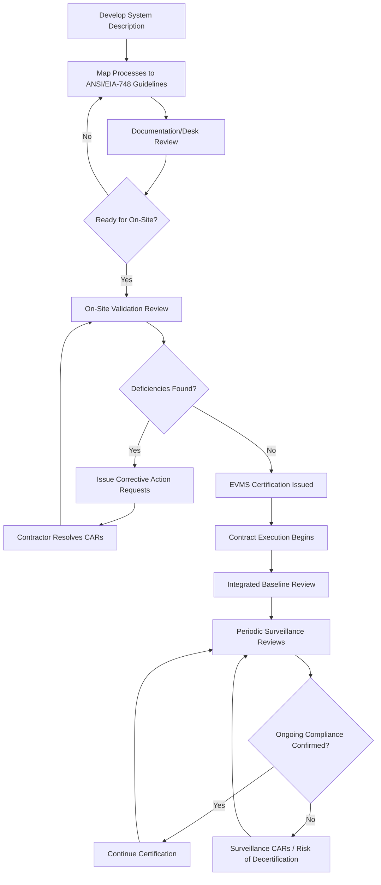

## EVMS Validation and Surveillance Reviews

### Definition and Purpose

An **Earned Value Management System (EVMS)** is the integrated set of management processes, tools, and data (scheduling, cost accounting, work breakdown structure, organizational breakdown structure, and performance measurement) an organization uses to plan, measure, and report project performance via earned value. **EVMS validation** is the formal process by which a government agency, customer, or authorized body certifies that an organization's EVMS complies with a governing standard — most commonly **ANSI/EIA-748**, the Earned Value Management Systems standard maintained by the National Defense Industrial Association (NDIA). **Surveillance reviews** are the recurring, post-certification audits that confirm the certified system continues to be applied correctly on a live contract, rather than merely existing on paper.

Validation answers: *"Does this organization's EVMS, as designed, satisfy the required guidelines?"* Surveillance answers: *"Is this EVMS, as certified, actually being followed in practice on this contract?"*

### The ANSI/EIA-748 Standard and Its 32 Guidelines

ANSI/EIA-748 organizes EVMS requirements into five guideline categories. [Unverified: exact guideline count and grouping have evolved across revisions of the standard; the following reflects the commonly referenced structure]

**Key Points**

- **Organization (5 guidelines)**: Define the Work Breakdown Structure (WBS), identify the organizational structure (OBS) responsible for work, and integrate the two so cost and schedule can be tied to specific management accountability (the WBS/OBS intersection is often called a Control Account).
- **Planning, Scheduling, and Budgeting (10 guidelines)**: Establish a logical, time-phased network schedule; assign budgets to Control Accounts and Work Packages; establish objective measures of progress (earned value techniques); identify a Management Reserve and Undistributed Budget separately from the Performance Measurement Baseline (PMB).
- **Accounting Considerations (6 guidelines)**: Record direct costs consistent with the budgeting structure; summarize costs from the Control Account level upward; identify unit and lot costs when applicable; and reconcile with the organization's formal accounting system.
- **Analysis and Management Reports (6 guidelines)**: Generate monthly variance analysis (cost variance, schedule variance) at the Control Account level; identify significant variances against predetermined thresholds; forecast Estimate at Completion (EAC) based on performance.
- **Revisions and Data Maintenance (5 guidelines)**: Incorporate authorized changes to the PMB in a timely manner; prevent unauthorized retroactive changes; reconcile budget changes against the contract's negotiated value.

### The EVMS Validation Process

**Key Points**

- **System description development**: The organization documents its EVMS processes in a **System Description**, mapping each internal process explicitly to the 32 guidelines it must satisfy.
- **Documentation review (desk review)**: The certifying body (e.g., the U.S. Defense Contract Management Agency, DCMA, for defense contracts) reviews the System Description and supporting procedures before any on-site activity, checking for guideline traceability and internal consistency.
- **Pre-validation ("acceptance") review**: A readiness assessment sometimes conducted before the full validation review, checking whether the system is mature enough to proceed to formal validation without a high risk of failure.
- **Formal validation review (on-site demonstration)**: A team-based review, typically 3-5 days, in which the organization must demonstrate — using live contract data — that the EVMS as documented is actually operating as described. This typically includes interviews with Control Account Managers (CAMs), traces of specific transactions from planning through variance analysis and corrective action, and confirmation that Management Reserve and baseline change control are functioning correctly.
- **Corrective Action Requests (CARs)**: Deficiencies identified during the review are documented as CARs, which the organization must resolve — often within a defined timeframe — before certification is granted.
- **Formal acceptance/certification letter**: Upon successful resolution of CARs, the certifying authority issues a formal determination that the EVMS complies with ANSI/EIA-748, valid contract-wide or enterprise-wide depending on the certifying body's scope determination.

### Surveillance Reviews

**Key Points**

- **Purpose distinct from validation**: Surveillance does not re-certify the system's design; it verifies the certified system is being **applied consistently** on the specific contract(s) in question, since real-world application can drift from the certified process over time (e.g., CAMs bypassing formal baseline change control under schedule pressure).
- **Risk-based sampling**: Surveillance reviews typically sample a subset of Control Accounts, Work Packages, and specific guideline areas each cycle rather than reviewing the entire system exhaustively every time, often prioritized by contract risk, dollar value, or prior CAR history.
- **Recurring cadence**: Surveillance is typically conducted annually or per a schedule defined by the certifying authority/contract requirements, supplemented by more frequent internal self-governance surveillance performed by the contractor's own EVMS Focal Point or Program Management Office.
- **Data traces**: Reviewers trace specific transactions end-to-end — for example, following a single Work Package from its original budget assignment, through its schedule logic, its progress measurement method, its recorded actual costs, and into the resulting variance analysis narrative — to confirm the system's outputs are internally consistent and guideline-compliant.
- **Findings classification**: Findings are typically categorized by severity (e.g., significant deficiency vs. minor observation), with significant deficiencies potentially triggering a formal CAR process similar to validation, and in serious cases risking suspension or withdrawal of the system's certification.
- **Continuous Surveillance / Integrated Baseline Reviews (IBR)**: Many organizations implement ongoing self-surveillance between formal external reviews, and conduct **Integrated Baseline Reviews** — a joint government/contractor review shortly after contract award or major re-baselining — to confirm the Performance Measurement Baseline is realistic and resourced, which is a related but distinct review from both validation and surveillance.

### Roles and Responsibilities

| Role | Responsibility |
| --- | --- |
| EVMS Focal Point / PMO | Owns the System Description; coordinates validation and surveillance logistics; tracks CARs to closure |
| Control Account Manager (CAM) | Executes EVM at the Control Account level; primary interviewee during on-site reviews; must demonstrate command of their account's budget, schedule, and variance status |
| Certifying Authority (e.g., DCMA) | Conducts/approves validation and surveillance reviews; issues certification and CARs; determines certification scope |
| Program Manager | Accountable for overall EVMS compliance and corrective action resolution at the program level |
| Internal EVMS Audit/Compliance function | Performs continuous self-surveillance between external review cycles |

### Worked Example: A Sample Surveillance Finding

During a surveillance review, a reviewer traces Work Package WP-4471 ("Fabricate Assembly B") and finds:

1. The Work Package was budgeted at $85,000 with an Earned Value technique of "0/100" (0% credit until 100% complete).
2. Actual costs of $62,000 have been recorded, and the CAM's status report shows the work package as "50% complete" in a separate progress tracking tool.
3. However, because the 0/100 technique means earned value cannot be claimed until full completion, the EVM system correctly shows $0 in Earned Value for this Work Package — creating an apparent large negative Cost Variance ($CV = EV - AC = 0 - 62{,}000$) that does not reflect the CAM's own informal assessment of 50% physical progress.

This is flagged not as a system defect but as a **planning technique mismatch** — a Corrective Action Request may recommend re-planning the Work Package with a more granular earned value technique (e.g., weighted milestones) for future similar work, since 0/100 techniques on large-dollar, long-duration work packages tend to produce EVM data that is technically compliant but poor for early warning, since Cost Variance and Schedule Variance:

$$CV = EV - AC \qquad SV = EV - PV$$

remain artificially depressed until the single completion event, masking interim performance trends that stakeholders rely on for early corrective action.

### Mermaid Diagram: Validation and Surveillance Lifecycle

### SVG Illustration: Validation vs. Surveillance Scope Comparison

<svg xmlns="http://www.w3.org/2000/svg" viewBox="0 0 700 280">
<text x="350" y="25" text-anchor="middle" font-size="16" font-weight="bold" fill="#222">Validation vs. Surveillance Scope (svg_diagram)</text>
<rect x="60" y="60" width="270" height="180" fill="#eaf2fb" stroke="#3498db" stroke-width="2" rx="8" />
<text x="195" y="85" text-anchor="middle" font-size="14" font-weight="bold" fill="#2c3e50">Validation</text>
<text x="80" y="110" font-size="11" fill="#333">• Reviews full System Description</text>
<text x="80" y="130" font-size="11" fill="#333">• Confirms design meets ANSI/EIA-748</text>
<text x="80" y="150" font-size="11" fill="#333">• One-time (per certification scope)</text>
<text x="80" y="170" font-size="11" fill="#333">• Enterprise or contract-wide</text>
<text x="80" y="190" font-size="11" fill="#333">• Output: Certification / CARs</text>
<text x="80" y="210" font-size="11" fill="#333">• Owner: Certifying Authority</text>
<rect x="370" y="60" width="270" height="180" fill="#fdf2e9" stroke="#e67e22" stroke-width="2" rx="8" />
<text x="505" y="85" text-anchor="middle" font-size="14" font-weight="bold" fill="#2c3e50">Surveillance</text>
<text x="390" y="110" font-size="11" fill="#333">• Samples live contract data</text>
<text x="390" y="130" font-size="11" fill="#333">• Confirms application matches design</text>
<text x="390" y="150" font-size="11" fill="#333">• Recurring (e.g., annual)</text>
<text x="390" y="170" font-size="11" fill="#333">• Risk-based, sampled scope</text>
<text x="390" y="190" font-size="11" fill="#333">• Output: Findings / Surveillance CARs</text>
<text x="390" y="210" font-size="11" fill="#333">• Owner: Certifying Authority + PMO</text>
</svg>

### Integration with CPM Scheduling

EVMS validation reviews explicitly examine whether the **Integrated Master Schedule (IMS)** — the CPM-based network schedule — is properly linked to the cost/budget structure being certified. Reviewers commonly check:

- Whether Work Packages in the cost system have corresponding, logically sequenced activities in the CPM schedule (no "orphan" budget with no schedule representation)
- Whether the critical path and near-critical paths are being actively monitored and reflected in schedule variance narratives
- Whether schedule logic changes are subject to the same formal baseline change control as budget changes (Guideline category: Revisions and Data Maintenance)
- Whether Schedule Performance Index (SPI) trends reported in EVM analysis are consistent with independently observable CPM float erosion, since a divergence between the two is often an early indicator of data integrity problems in one system or the other

### Common Pitfalls

- **Treating validation as a one-time event with no ongoing rigor**: Certification can be suspended or withdrawn if surveillance repeatedly identifies significant deficiencies, so organizations must sustain the discipline established for validation.
- **CAM turnover eroding system fidelity**: New Control Account Managers unfamiliar with formal EVM discipline are a common source of surveillance findings; training and onboarding are frequently cited as a root cause in CARs. [Inference] This is a commonly cited but not universally quantifiable root cause across all organizations.
- **Over-reliance on 0/100 or 50/50 earned value techniques**: As shown in the worked example, coarse earned value techniques on large or long-duration Work Packages can produce compliant-but-uninformative variance data, undermining the analytical intent of the guidelines even when technically passing review.
- **Disconnected scheduling and cost teams**: When the IMS and the cost/EVM system are maintained by separate teams without close coordination, schedule and cost data can drift out of sync, a frequent surveillance finding under the Organization and Analysis guideline categories.
- **Inadequate Management Reserve documentation**: Failing to clearly separate Management Reserve and Undistributed Budget from the Performance Measurement Baseline is a recurring validation and surveillance finding, since commingling these obscures the true baseline against which performance is measured.

**Related Topics**

- ANSI/EIA-748 Guideline Deep Dive by Category
- Integrated Baseline Review (IBR) Process and Objectives
- Control Account Manager (CAM) Training and Certification
- Earned Value Techniques (0/100, 50/50, Weighted Milestones, Percent Complete)
- Integrated Master Schedule (IMS) and CPM-EVM Data Integration
- Corrective Action Request (CAR) Lifecycle Management
- Estimate at Completion (EAC) Forecasting Methods
- DCMA 14-Point Schedule Health Assessment