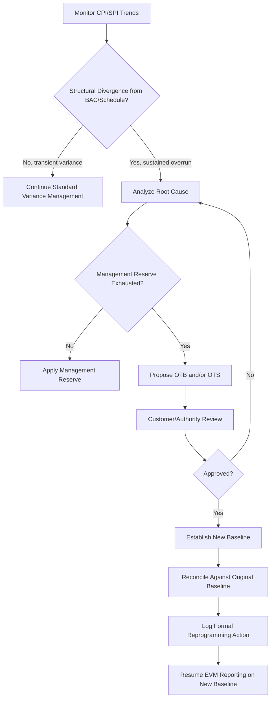

## Over Target Baseline and Over Target Schedule

### Definition and Purpose

**Over Target Baseline (OTB)** and **Over Target Schedule (OTS)** are formal re-planning actions used in Earned Value Management when a project's original Performance Measurement Baseline (PMB) — its time-phased budget plan — is no longer achievable within the authorized budget and/or schedule. Rather than continuing to report against a baseline that has become statistically meaningless (i.e., variances so large they no longer provide useful management insight), the organization formally re-plans the remaining work using a new, more realistic budget (OTB) and/or a new, more realistic schedule (OTS).

- **OTB**: A re-planning of the *cost* dimension — the total budget for remaining work is reset upward (or restructured) beyond the original contract value/Budget at Completion (BAC), because the original budget is no longer achievable.
- **OTS**: A re-planning of the *schedule* dimension — the time-phased plan for remaining work is reset because the original schedule dates are no longer achievable, independent of whether the budget itself changes.

OTB and OTS are distinct actions and can occur separately or together: a project may need to re-baseline its schedule without necessarily exceeding its budget, or vice versa, though in practice significant cost growth and schedule slippage frequently occur together.

### Why OTB/OTS Becomes Necessary

**Key Points**

- **Estimate at Completion (EAC) has diverged substantially from BAC**: When the Cost Performance Index (CPI) trend indicates the project will overrun its Budget at Completion by a magnitude that renders remaining variance reporting non-actionable, formal re-planning is considered.
- **Root causes typically include**: underestimated original scope, unanticipated technical problems, external delays (permits, supply chain, regulatory), scope growth not yet captured in approved changes, or a combination of these.
- **Variance thresholds exceeded structurally, not just temporarily**: OTB/OTS is distinguished from routine variance management by being a structural, not transient, divergence — a single bad month does not justify an OTB; a sustained trend that makes the baseline permanently unachievable does.
- **Management Reserve exhausted**: When Management Reserve (budget held back for unforeseen but in-scope work) has been fully consumed and further known risks or overruns remain, OTB is frequently the mechanism used to inject additional realistic budget.

### The Formal Determination Process

**Key Points**

- **Variance analysis and trend confirmation**: Before pursuing OTB/OTS, the Cost Performance Index (CPI) and Schedule Performance Index (SPI) trends are analyzed over multiple reporting periods to confirm the divergence is structural:

$$CPI = \frac{EV}{AC} \qquad SPI = \frac{EV}{PV}$$

- **Customer/authority approval**: In government contracting contexts (notably U.S. Department of Defense programs governed by EVMS policy), OTB and OTS require formal review and approval from the customer/procuring authority before implementation — this is not a unilateral contractor decision, since it changes the baseline against which contract performance is measured and reported.
- **Reconciliation requirement**: The new OTB/OTS baseline must be formally reconciled against the original contract baseline, preserving a documented, auditable trail showing both the original and revised baselines — the original baseline's historical performance data is not discarded, only superseded going forward.
- **Log of Formal Reprogramming**: Organizations maintain a formal log of all baseline changes including OTB/OTS actions, since repeated or undocumented re-baselining undermines the credibility of the EVM system and can trigger EVMS surveillance findings (see EVMS Validation and Surveillance Reviews).

### OTB vs. OTS: Comparison Table

| Aspect | Over Target Baseline (OTB) | Over Target Schedule (OTS) |
| --- | --- | --- |
| Dimension re-planned | Cost/Budget | Schedule/Time |
| Trigger | EAC exceeds BAC with no realistic recovery path | Forecast finish date exceeds contractual/planned finish with no realistic recovery path |
| Typical driver | Cost growth, underestimation, unplanned rework | Delays, resource constraints, external dependencies |
| Independent of the other? | Can occur without OTS | Can occur without OTB |
| Approval | Requires customer/authority concurrence | Requires customer/authority concurrence |
| Effect on BAC | New, higher authorized budget baseline established | Original BAC may remain unchanged if only schedule shifts |
| Reporting impact | New CPI/SPI trend line starts from re-plan point | New SPI trend line starts from re-plan point |

### Worked Example

A project has a BAC of $10,000,000 and an original 24-month schedule. At month 18:

- Cumulative Planned Value (PV) = $8,000,000
- Cumulative Earned Value (EV) = $6,200,000
- Cumulative Actual Cost (AC) = $8,900,000

$$CPI = \frac{6{,}200{,}000}{8{,}900{,}000} \approx 0.70 \qquad SPI = \frac{6{,}200{,}000}{8{,}000{,}000} \approx 0.775$$

A CPI of 0.70, sustained over the trailing six months, implies (using the standard EAC formula assuming continued CPI performance):

$$EAC = AC + \frac{BAC - EV}{CPI} = 8{,}900{,}000 + \frac{10{,}000{,}000 - 6{,}200{,}000}{0.70} \approx 14{,}329{,}000$$

An EAC of approximately $14.3M against a $10M BAC represents a 43% overrun with no plausible recovery path given remaining scope and schedule. The organization determines this justifies both:

- **OTB**: Establishing a new, realistic budget baseline (e.g., $14.3M, subject to negotiation and approval) for remaining work.
- **OTS**: Since the SPI of 0.775 also indicates the original 24-month schedule is unachievable, a revised schedule baseline (e.g., extending to 30 months) is established concurrently.

Going forward, variance analysis, CPI, and SPI are calculated against the new OTB/OTS baseline, while the original baseline's historical data remains preserved for audit and lessons-learned purposes.

### Mermaid Diagram: OTB/OTS Decision and Re-Baselining Process

### SVG Illustration: EAC Trajectory Before and After OTB

<svg xmlns="http://www.w3.org/2000/svg" viewBox="0 0 700 300">
<text x="350" y="25" text-anchor="middle" font-size="16" font-weight="bold" fill="#222">EAC Trajectory and OTB Re-Plan Point (svg_diagram)</text>
<line x1="80" y1="250" x2="650" y2="250" stroke="#333" stroke-width="2" />
<line x1="80" y1="50" x2="80" y2="250" stroke="#333" stroke-width="2" />
<text x="30" y="255" font-size="11" fill="#333">Cost</text>
<text x="600" y="270" font-size="11" fill="#333">Time</text>
<line x1="80" y1="180" x2="650" y2="180" stroke="#999" stroke-dasharray="4,4" />
<text x="560" y="175" font-size="11" fill="#666">Original BAC: \$10M</text>
<polyline points="80,220 200,205 320,175 400,150" fill="none" stroke="#e74c3c" stroke-width="3" />
<circle cx="400" cy="150" r="5" fill="#e74c3c" />
<text x="405" y="145" font-size="11" fill="#e74c3c">Divergence detected</text>
<line x1="400" y1="150" x2="400" y2="250" stroke="#7f8c8d" stroke-dasharray="3,3" />
<text x="405" y="240" font-size="10" fill="#7f8c8d">Month 18: OTB approved</text>
<polyline points="400,150 500,110 600,75" fill="none" stroke="#f39c12" stroke-width="3" stroke-dasharray="6,3" />
<text x="605" y="70" font-size="11" fill="#f39c12">Projected EAC ~\$14.3M</text>
<polyline points="400,150 500,140 600,130" fill="none" stroke="#27ae60" stroke-width="3" />
<text x="605" y="128" font-size="11" fill="#27ae60">New OTB baseline</text>
<rect x="500" y="50" width="14" height="14" fill="#e74c3c" />
<text x="520" y="62" font-size="11">Actual/original trend</text>
<rect x="500" y="72" width="14" height="14" fill="#f39c12" />
<text x="520" y="84" font-size="11">Unrecovered forecast</text>
<rect x="500" y="94" width="14" height="14" fill="#27ae60" />
<text x="520" y="106" font-size="11">New baseline (OTB)</text>
</svg>

### Relationship to CPM Scheduling

OTS re-planning requires a corresponding update to the CPM Integrated Master Schedule (IMS): the network logic, remaining durations, and constraints must be revised so the new schedule baseline is internally consistent and traceable via forward/backward-pass recalculation, exactly as with any schedule re-baseline. Critical and near-critical paths must be re-identified against the new dates, since an OTS action fundamentally resets which path constrains the finish date. Schedule Risk Analysis (Monte Carlo simulation) is commonly re-run against the new OTS baseline to confirm the revised dates carry a defensible confidence level, avoiding the risk of an immediate second overrun against the newly re-planned schedule.

### Alternatives to OTB/OTS

**Key Points**

- **Estimate at Completion (EAC) revision without formal re-baselining**: Simply updating the EAC forecast while continuing to report variance against the original BAC — appropriate when overruns are significant but the baseline still provides useful management information.
- **Replanning remaining work within existing BAC**: Restructuring the remaining Work Packages and schedule logic to attempt recovery within the original budget/schedule envelope, avoiding the formality of OTB/OTS if still plausible.
- **Contract modification**: If the overrun stems from a customer-directed scope change rather than performance issues, a formal contract modification (which increases BAC through the normal change control process) may be the more appropriate mechanism rather than OTB, since OTB is specifically for re-planning to address unfavorable performance/estimating issues, not authorized scope growth.

### Common Pitfalls

- **Using OTB/OTS to mask poor performance rather than address root cause**: Re-baselining without a genuine root-cause corrective action risks repeating the same overrun pattern against the new baseline. [Inference] This is a widely cited risk in EVM literature and surveillance practice, though the frequency of occurrence varies by organization and cannot be generalized numerically.
- **Losing historical traceability**: Failing to properly archive and reconcile the original baseline against the new OTB/OTS baseline undermines audit trails and can trigger EVMS surveillance findings.
- **Proceeding without customer/authority approval**: Implementing OTB/OTS unilaterally in contexts where formal approval is contractually or regulatorily required can itself become a compliance violation.
- **Treating OTB and OTS as automatically paired**: Assuming a budget re-plan automatically requires a schedule re-plan (or vice versa) rather than evaluating each dimension independently against its own performance data.
- **Repeated OTB/OTS actions eroding baseline credibility**: Multiple re-baselining events on a single contract raise questions about the fundamental realism of planning practices and are a common focus area in subsequent EVMS surveillance reviews.

**Related Topics**

- EVMS Validation and Surveillance Reviews
- Estimate at Completion (EAC) Forecasting Methods
- Management Reserve and Undistributed Budget Management
- Performance Measurement Baseline (PMB) Change Control
- Integrated Baseline Review (IBR) Process
- Schedule Risk Analysis and Monte Carlo Simulation
- Contract Modifications vs. Formal Re-Baselining
- Root Cause Analysis for Cost and Schedule Overruns