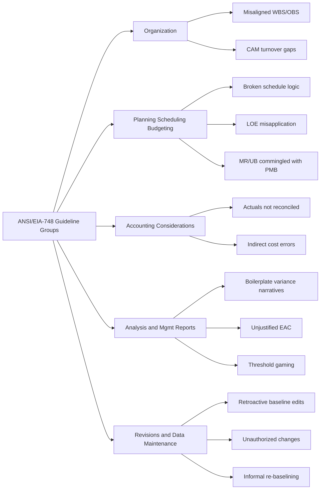

## Common EVMS Compliance Pitfalls

### Overview

Even organizations with a formally validated Earned Value Management System (EVMS) — certified compliant with ANSI/EIA-748 — routinely encounter recurring compliance pitfalls during surveillance reviews and day-to-day execution. These pitfalls typically fall into predictable categories tied to the standard's five guideline groups: Organization; Planning, Scheduling, and Budgeting; Accounting Considerations; Analysis and Management Reports; and Revisions and Data Maintenance. Understanding these common failure modes is essential both for passing surveillance reviews and, more importantly, for ensuring the EVM data produced is actually useful for management decision-making rather than merely compliant on paper.

### Organizational and WBS/OBS Pitfalls

**Key Points**

- **Misaligned WBS and OBS**: Work Breakdown Structure elements that don't cleanly map to a single accountable Control Account Manager (CAM) or organizational unit, creating ambiguity about who owns cost and schedule performance for a given scope of work.
- **Control Accounts that are too large or too coarse**: Control Accounts spanning excessive scope or duration make variance analysis less actionable — a large negative variance can be difficult to root-cause when it aggregates many dissimilar work activities.
- **Undocumented informal work assignments**: Work being performed outside the WBS/OBS structure (informally requested "off the books" tasks) that never gets captured in the formal budget and schedule baseline, breaking the fundamental integration the standard requires.
- **CAM turnover without knowledge transfer**: New Control Account Managers inheriting accounts without adequate handoff of variance history, risk context, or baseline rationale, leading to degraded variance analysis quality even though the formal system remains technically intact.

### Planning, Scheduling, and Budgeting Pitfalls

**Key Points**

- **Schedule not logically networked (missing or invalid dependencies)**: Activities with no predecessors/successors, "dangling" logic, hard constraint dates overriding logical calculation, or excessive use of Start-No-Earlier-Than constraints that mask the true critical path — all of which undermine the credibility of Schedule Variance and the Integrated Master Schedule (IMS).
- **Overuse of Level of Effort (LOE) earned value technique**: LOE work packages earn value automatically as time passes regardless of actual physical progress, which is appropriate for genuinely level-of-effort activities (e.g., program management) but is sometimes misapplied to discrete, measurable work to artificially smooth variance reporting — a well-known integrity issue that surveillance reviewers specifically screen for.
- **Coarse or poorly chosen earned value techniques (0/100, 50/50) on large/long Work Packages**: As discussed in EVMS validation and surveillance reviews, techniques that only credit earned value at a single milestone can produce technically compliant but analytically uninformative variance data for long-duration work.
- **Management Reserve and Undistributed Budget commingled with the Performance Measurement Baseline (PMB)**: Failing to keep Management Reserve clearly segregated so the true baseline against which performance is measured becomes ambiguous — this is one of the most frequently cited findings across EVMS surveillance literature. [Inference] While widely cited as a common finding, no single authoritative frequency statistic applies universally across all EVMS programs.
- **Unrealistic or "hockey stick" planning**: Time-phasing planned value such that a disproportionate amount of budget is planned for late in the schedule with an unrealistic assumption that performance will accelerate to catch up — often a symptom of political pressure to show near-term green status rather than genuine planning realism.

### Accounting and Data Integration Pitfalls

**Key Points**

- **Actual costs not reconciled with the formal accounting system**: EVM actual cost data that diverges from the organization's official general ledger/accounting system, breaking the guideline requirement that EVM data trace back to auditable financial records.
- **Timing mismatches between cost recognition and schedule/progress reporting**: Costs recorded in a different period than the corresponding progress is claimed (e.g., invoice lag), distorting Cost Variance in a given reporting period even though the underlying performance is sound.
- **Indirect cost allocation errors**: Overhead, G&A, and other indirect costs applied inconsistently across Control Accounts, distorting comparative variance analysis between accounts or projects.
- **Inconsistent treatment of materials and subcontractor costs**: Material costs recorded at the point of purchase commitment rather than usage (or vice versa, inconsistently applied), creating artificial cost variances unrelated to actual execution performance.

### Analysis and Management Reporting Pitfalls

**Key Points**

- **Variance analysis narratives that are generic or boilerplate**: Monthly variance reports that repeat the same generic explanation ("labor inefficiency") without specific root cause, corrective action, and expected resolution date — a top surveillance finding, since the guideline requires *meaningful* analysis, not merely the presence of a report.
- **Missing or unrealistic Estimate at Completion (EAC) rationale**: An EAC that doesn't reconcile with the current Cost Performance Index (CPI) trend, or that is not re-derived using a documented, consistent methodology period over period:

$$EAC_{statistical} = AC + \frac{BAC - EV}{CPI \times SPI}$$

(one common composite index formula among several accepted EAC methods) — reviewers frequently flag EACs that appear to be management-asserted "best case" numbers disconnected from the statistical trend without documented justification for the divergence.

- **Variance Threshold gaming**: Structuring Control Account boundaries or reporting thresholds specifically to keep individual variances just under the mandatory reporting threshold, avoiding the formal narrative requirement while the aggregate variance remains significant.
- **Ignoring near-critical path schedule risk in reporting**: Reporting only against the single current critical path while ignoring near-critical paths that carry material risk of becoming critical (see Near-Critical and Multiple Critical Paths), leaving management under-informed about emerging schedule risk.

### Revisions and Data Maintenance Pitfalls

**Key Points**

- **Retroactive changes to the Performance Measurement Baseline (PMB)**: Modifying budget or schedule data for periods that have already been reported as actuals, which corrupts the historical variance trend and is one of the clearest and most serious guideline violations, since it can be used (deliberately or inadvertently) to mask poor performance after the fact.
- **Unauthorized or undocumented baseline changes**: Budget or schedule revisions implemented without going through the formal change control board/process, breaking the audit trail the standard requires.
- **Excessive, frequent re-baselining without formal OTB/OTS process**: Repeated informal "re-plans" that don't follow the formal Over Target Baseline/Over Target Schedule process (see Over Target Baseline and Over Target Schedule) — this both violates the standard and erodes the credibility of the baseline as a performance measurement tool.
- **Poor reconciliation logs**: Failing to maintain a clear, auditable log tying the current baseline back through all authorized revisions to the original contract baseline, making it difficult for both internal management and external surveillance to trace how the current plan was derived.

### Worked Example: A Composite Surveillance Finding

During a surveillance review, a reviewer samples Control Account CA-220 ("Systems Integration Testing") and finds three compounding issues:

1. **LOE misapplication**: Discrete testing tasks with clear completion criteria were planned using the LOE technique, meaning earned value accrues automatically regardless of whether tests actually pass — masking a real schedule slip in test completion.
2. **Generic variance narrative**: The CAM's monthly variance report states "cost variance due to labor inefficiency" for four consecutive months with no specific root cause or corrective action identified.
3. **EAC disconnected from CPI trend**: The CAM's submitted EAC assumes a return to on-budget performance (CPI = 1.0) for all remaining work, despite a sustained CPI of 0.75 over the same four-month period, without documented justification for the assumed recovery.

Individually, each issue might be a minor observation; together, they indicate a systemic pattern — the reviewer classifies this as a significant deficiency requiring a formal Corrective Action Request, since the combination suggests the EVM data for this account is not providing management with an accurate picture of actual performance or realistic forecasts.

### Mermaid Diagram: Common Pitfall Categories Mapped to Guideline Groups

### SVG Illustration: Pitfall Frequency by Guideline Category (Illustrative)

<svg xmlns="http://www.w3.org/2000/svg" viewBox="0 0 700 300">
<text x="350" y="25" text-anchor="middle" font-size="16" font-weight="bold" fill="#222">Illustrative Surveillance Finding Distribution (svg_diagram)</text>
<line x1="100" y1="260" x2="650" y2="260" stroke="#333" stroke-width="2" />
<line x1="100" y1="50" x2="100" y2="260" stroke="#333" stroke-width="2" />
<rect x="130" y="140" width="60" height="120" fill="#3498db" />
<text x="160" y="280" text-anchor="middle" font-size="11">Org</text>
<rect x="230" y="90" width="60" height="170" fill="#e74c3c" />
<text x="260" y="280" text-anchor="middle" font-size="11">Plan/Sched</text>
<rect x="330" y="180" width="60" height="80" fill="#f39c12" />
<text x="360" y="280" text-anchor="middle" font-size="11">Accounting</text>
<rect x="430" y="110" width="60" height="150" fill="#9b59b6" />
<text x="460" y="280" text-anchor="middle" font-size="11">Analysis/Reports</text>
<rect x="530" y="160" width="60" height="100" fill="#27ae60" />
<text x="560" y="280" text-anchor="middle" font-size="11">Revisions</text>

<text x="20" y="55" font-size="10" fill="#666">Illustrative only —</text>

<text x="20" y="68" font-size="10" fill="#666">not derived from a cited dataset</text>

</svg>

### Prevention and Mitigation Strategies

**Key Points**

- **Continuous internal self-surveillance**: Conducting regular internal audits using the same sampling and tracing methodology as formal external surveillance, catching issues before they surface in a customer review.
- **CAM training and certification programs**: Standardized onboarding and periodic refresher training for Control Account Managers on EVM discipline, variance analysis quality, and baseline change control procedures.
- **Earned value technique review during planning**: Formal review of the proposed earned value technique for each Work Package during initial planning, specifically screening for inappropriate LOE use or overly coarse techniques on large-dollar or long-duration work.
- **Automated data integrity checks**: Systematic reconciliation checks between the cost accounting system, the IMS, and the EVM reporting tool to catch data integration errors before they accumulate into significant surveillance findings.
- **Formal, documented root-cause and corrective action requirements for variance narratives**: Requiring narratives to explicitly cite root cause, corrective action, and expected resolution date/cost, rather than accepting generic explanations, directly targeting the most commonly cited Analysis and Management Reports pitfall.

**Related Topics**

- EVMS Validation and Surveillance Reviews
- Over Target Baseline and Over Target Schedule
- Earned Value Techniques (LOE, 0/100, 50/50, Weighted Milestones)
- Estimate at Completion (EAC) Forecasting Methods
- Integrated Master Schedule (IMS) Health Assessment
- Control Account Manager (CAM) Training and Certification
- Baseline Change Control and Configuration Management
- Near-Critical and Multiple Critical Paths