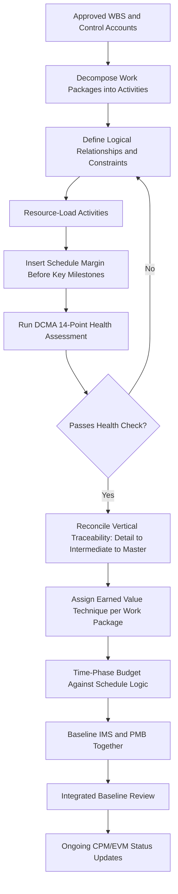

## Integrated Master Schedule Development

### Definition and Purpose

The **Integrated Master Schedule (IMS)** is the single, comprehensive, logically networked CPM schedule that represents all authorized work required to complete a program or project, structured to directly support Earned Value Management reporting. It is "integrated" in two senses: it integrates all subordinate schedules (design, procurement, manufacturing, test, integration) into one coherent network, and it integrates schedule data with the cost/budget structure (WBS, Control Accounts, Work Packages) so that Schedule Variance and Schedule Performance Index can be meaningfully derived from the same network used for critical path analysis.

The IMS is the schedule artifact that EVMS validation and surveillance reviews specifically examine to confirm cost and schedule are properly linked (Guideline category: Planning, Scheduling, and Budgeting), and it is the foundation from which Over Target Schedule re-planning, what-if scenario analysis, and near-critical path monitoring are all performed.

### Core Structural Requirements

**Key Points**

- **Complete logical networking**: Every activity must have at least one predecessor and one successor (except true start and finish milestones), with minimal use of hard date constraints that override calculated logic — constraints should represent genuine external commitments (contractual dates, regulatory windows), not scheduler convenience.
- **WBS/Control Account traceability**: Every IMS activity must map to a specific Work Breakdown Structure element and, ultimately, a Control Account, so that schedule status directly supports cost/schedule integration required by EVMS guidelines.
- **Appropriate activity duration granularity**: Activities are typically sized so no single activity spans more than one or two reporting periods (commonly a rule of thumb of ≤ 2 months, though this varies by program size and reporting cadence), ensuring objective progress measurement is possible within each EVM reporting cycle. [Unverified: specific duration thresholds vary by organizational policy and program scale]
- **Defined earned value technique per activity/Work Package**: Each schedule activity or its parent Work Package must have an assigned, documented earned value technique (0/100, 50/50, percent complete, weighted milestones, LOE, apportioned effort) consistent with EVMS guideline requirements.
- **Horizontal and vertical traceability**: *Horizontal* traceability means logical predecessor/successor relationships correctly connect related work across functional areas (design feeds procurement feeds fabrication); *vertical* traceability means summary-level schedules (Master Schedule, Intermediate Schedule) correctly roll up from the detailed IMS without discrepancy.

### IMS Development Process

**Key Points**

- **Define the schedule hierarchy**: Establish the multi-tiered structure — typically a Master Summary Schedule (executive-level milestones), an Intermediate Schedule (major deliverables and phase gates), and the detailed IMS itself (activity-level network) — ensuring each tier reconciles precisely with the level below it.
- **Decompose the WBS into schedule activities**: Working from the approved Work Breakdown Structure, decompose each Control Account's Work Packages into discrete, sequenced activities with defined start/finish logic, following the same decomposition principles as standard CPM network development.
- **Establish activity relationships and constraints**: Define Finish-to-Start, Start-to-Start, Finish-to-Finish, or Start-to-Finish relationships with appropriate leads/lags, minimizing "hard" constraints (Must Start On, Must Finish On) in favor of "soft" constraints (As Soon As Possible) wherever the underlying logic genuinely allows it.
- **Resource-load the schedule**: Assign labor, equipment, and material resources to activities, enabling resource-constrained critical path analysis and supporting cost estimate reconciliation with the EVM budget.
- **Establish schedule margin/reserve**: Distinct from Management Reserve (a cost/budget concept), **schedule margin** is time buffer explicitly and visibly built into the network — typically placed just before key contractual milestones — to absorb normal risk without consuming contingency in an undocumented way; schedule margin should never be silently embedded within individual activity duration estimates.
- **Conduct schedule health assessment**: Before baselining, run a structural quality check — the U.S. Defense Contract Management Agency's **DCMA 14-Point Assessment** is a widely used checklist (logic, leads, lags, relationship types, hard constraints, high float, negative float, high duration, invalid dates, resources, missed tasks, critical path test, critical path length index, baseline execution index) used to validate the IMS is fit for CPM calculation and EVM integration before it becomes the baseline. [Unverified: exact point thresholds for each of the 14 checks vary by program-specific tailoring of the DCMA assessment]
- **Baseline the IMS concurrently with the cost baseline**: The schedule baseline (dates) and the cost baseline (time-phased budget, forming the Performance Measurement Baseline) must be established together and remain mutually consistent, since EVM calculations depend on both being synchronized.

### Vertical Traceability Example

| Tier | Content | Example |
| --- | --- | --- |
| Master Summary Schedule | Executive milestones only | "System Critical Design Review — Month 14" |
| Intermediate Schedule | Major deliverables/phase gates | "Complete Subsystem B Design — Month 12" |
| Integrated Master Schedule (detailed) | All discrete activities | "Draft Subsystem B Schematic (5 days) → Peer Review (2 days) → Finalize Schematic (3 days)" |

Each tier must reconcile: the detailed IMS activities summing to "Complete Subsystem B Design" must actually finish by Month 12 in the calculated forward pass, or the Intermediate Schedule is not a valid roll-up of the underlying network — a common finding in both DCMA 14-Point assessments and EVMS surveillance reviews.

### The DCMA 14-Point Schedule Health Assessment (Summary)

**Key Points**

1. **Logic** — percentage of activities missing predecessor or successor logic
2. **Leads** — presence of negative lag (leads), generally discouraged as they can distort float calculations
3. **Lags** — excessive positive lag potentially masking missing activities
4. **Relationship Types** — over-reliance on Finish-to-Start versus a healthy mix appropriate to actual logic
5. **Hard Constraints** — proportion of activities with Must Start On/Must Finish On constraints overriding calculated logic
6. **High Float** — activities with unusually high total float, often indicating missing logic rather than genuine flexibility
7. **Negative Float** — activities where Late dates precede Early dates, indicating the schedule cannot achieve an imposed constraint
8. **High Duration** — activities exceeding a duration threshold (commonly cited around 44 working days), signaling a need for further decomposition
9. **Invalid Dates** — actual dates recorded in the future, or forecast dates in the past
10. **Resources** — activities lacking assigned resources where resource loading is required
11. **Missed Tasks** — completed activities that finished after their baseline finish date
12. **Critical Path Test** — verifying that a delay artificially inserted into the schedule properly propagates to the project finish date, confirming the critical path calculation is logically sound
13. **Critical Path Length Index (CPLI)** — ratio comparing the critical path length to the length including total float to the status date, indicating schedule health trend
14. **Baseline Execution Index (BEI)** — ratio of completed tasks to baseline-planned tasks through the current status date, indicating overall execution pace against plan

### Worked Example: Reconciling IMS Activities to a Control Account

Control Account CA-310 ("Fabricate and Test Prototype Housing") has an approved budget of $240,000. During IMS development, this Control Account is decomposed into a Work Package with the following schedule activities:

| Activity | Duration | Predecessor | Earned Value Technique |
| --- | --- | --- | --- |
| Procure Raw Material | 10d | — | 0/100 |
| Machine Housing | 15d | Procure Raw Material | Percent Complete |
| Inspect Machined Part | 3d | Machine Housing | 0/100 |
| Environmental Test | 8d | Inspect Machined Part | Weighted Milestones |
| Final Acceptance | 2d | Environmental Test | 0/100 |

The forward pass calculates a Work Package duration of 38 working days. This duration and sequence must be reflected in the time-phased budget spread for CA-310's $240,000, so that Planned Value (PV) accrues according to the same schedule logic the IMS calculates — a direct, auditable link between the CPM network and the EVM budget spread required by the guideline category, and the specific check point examined during Integrated Baseline Reviews.

### Mermaid Diagram: IMS Development and Integration Workflow

### SVG Illustration: Three-Tier Schedule Hierarchy

<svg xmlns="http://www.w3.org/2000/svg" viewBox="0 0 700 320">
<text x="350" y="25" text-anchor="middle" font-size="16" font-weight="bold" fill="#222">Schedule Hierarchy and Traceability (svg_diagram)</text>
<rect x="220" y="50" width="260" height="50" fill="#3498db" rx="6" />
<text x="350" y="80" text-anchor="middle" font-size="13" fill="#fff">Master Summary Schedule</text>
<line x1="350" y1="100" x2="350" y2="130" stroke="#333" stroke-width="2" />
<polygon points="345,125 355,125 350,135" fill="#333" />
<rect x="150" y="135" width="400" height="50" fill="#5dade2" rx="6" />
<text x="350" y="165" text-anchor="middle" font-size="13" fill="#fff">Intermediate Schedule (Deliverables/Gates)</text>
<line x1="350" y1="185" x2="350" y2="215" stroke="#333" stroke-width="2" />
<polygon points="345,210 355,210 350,220" fill="#333" />
<rect x="60" y="220" width="580" height="70" fill="#aed6f1" rx="6" />
<text x="350" y="245" text-anchor="middle" font-size="13" fill="#1b2631">Integrated Master Schedule (Detailed Activities)</text>
<text x="350" y="265" text-anchor="middle" font-size="11" fill="#1b2631">Networked activities · Resource-loaded · EV technique assigned · WBS-traced</text>
<line x1="350" y1="290" x2="350" y2="305" stroke="#7f8c8d" stroke-dasharray="3,3" />
<text x="350" y="315" text-anchor="middle" font-size="10" fill="#7f8c8d">Must reconcile vertically at every tier</text>
</svg>

### Ongoing IMS Maintenance and Status Updates

**Key Points**

- **Periodic status updates aligned to the EVM reporting cycle**: Actual start/finish dates and remaining duration estimates are updated on the same cadence as EVM reporting (typically monthly), ensuring Schedule Variance calculations reflect current, consistent data.
- **Formal baseline change control**: Any change to the IMS baseline (logic, durations, constraints) must go through the same formal change control process required for cost baseline changes, since schedule and cost baselines must remain mutually consistent.
- **Critical path re-verification each cycle**: Given that logic and duration changes can shift which path is critical, the critical path (and near-critical paths) must be re-identified at every status update rather than assumed static from the original baseline.
- **Schedule margin consumption tracking**: Monitoring how much of the explicitly reserved schedule margin has been consumed over time is a leading indicator similar to Management Reserve consumption tracking on the cost side.

### Common Pitfalls

- **Schedule and cost teams working in silos**: Producing an IMS that is logically sound as a schedule but poorly traced to Control Accounts, breaking the cost/schedule integration EVMS guidelines require — one of the most common findings in both DCMA assessments and EVMS surveillance.
- **Excessive hard constraints masking the true critical path**: Overuse of Must Start On/Must Finish On constraints can make a schedule appear on-track when the underlying logical network would show significant float erosion or an emerging near-critical path.
- **Embedding schedule margin invisibly within activity durations**: Padding individual activity estimates rather than using an explicit, visible schedule margin activity undermines the schedule's credibility and makes true risk exposure impossible to assess.
- **Failing the DCMA 14-Point Assessment silently**: Treating the health assessment as a one-time gate rather than an ongoing discipline, allowing schedule quality to degrade between checks as status updates and logic changes accumulate.
- **Vertical traceability drift**: Allowing the Master Summary and Intermediate Schedules to diverge from the detailed IMS over time as status updates are applied only at the detail level without periodic reconciliation upward.

**Related Topics**

- DCMA 14-Point Schedule Health Assessment (Detailed)
- Near-Critical and Multiple Critical Paths
- What-If Scenario Analysis
- EVMS Validation and Surveillance Reviews
- Over Target Baseline and Over Target Schedule
- Schedule Margin versus Management Reserve
- Integrated Baseline Review (IBR) Process
- Critical Path Length Index (CPLI) and Baseline Execution Index (BEI)