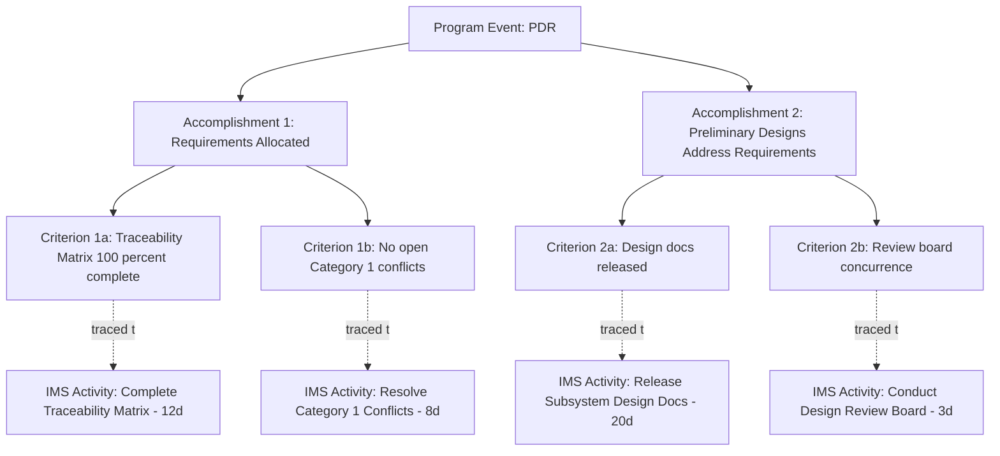

## Integrated Master Plan Structure

### Definition and Purpose

The **Integrated Master Plan (IMP)** is an event-driven, narrative document that defines the significant accomplishments required for program success and the specific criteria that must be satisfied to consider each accomplishment complete. Unlike the Integrated Master Schedule (IMS), which is a calendar-based, activity-level CPM network, the IMP is deliberately **not** a schedule at all — it contains no dates, durations, or resource assignments. The IMP defines *what* must be true for the program to be considered successfully progressing; the IMS defines *when* and *how* that work will be executed.

The IMP and IMS together form a paired planning structure common in defense and complex systems acquisition: the IMP provides the top-down, event-driven definition of success criteria, while the IMS provides the bottom-up, time-phased network that executes against those criteria. Every IMS activity should ultimately trace back to satisfying an IMP Criterion.

### The IMP Hierarchy: Events, Accomplishments, Criteria

**Key Points**

- **Program Events**: The highest level of the IMP hierarchy — significant, typically review-based milestones in the program's life (e.g., System Requirements Review, Critical Design Review, First Article Test). Events are *not* tied to a specific calendar date within the IMP itself; they are defined by what must be accomplished, and the corresponding date lives in the IMS.
- **Accomplishments**: Each Event is supported by one or more Accomplishments — specific, tangible outcomes that must be achieved to consider the Event successfully completed (e.g., under a "Critical Design Review" Event: "Subsystem designs finalized and verified against requirements").
- **Criteria**: Each Accomplishment is supported by one or more Criteria — objective, measurable, often binary (yes/no) conditions that must be satisfied to claim the Accomplishment complete (e.g., "All Subsystem B design drawings released and peer-reviewed with zero open critical action items").

This three-tier structure (Event → Accomplishment → Criteria) is the defining feature of IMP construction, and it is deliberately narrative and qualitative rather than quantitative/temporal — the entire purpose is to define success unambiguously before the schedule (IMS) determines the timeline for achieving it.

### IMP Structure Diagram (Conceptual)

| Level | Nature | Example |
| --- | --- | --- |
| Program Event | Milestone/review point, no fixed date within the IMP | "Critical Design Review (CDR)" |
| Accomplishment | Tangible outcome required for the Event | "Subsystem B design verified against requirements" |
| Criteria | Objective, measurable completion condition | "Design drawings released; peer review complete with zero open critical items" |

A single Event typically has multiple Accomplishments, and each Accomplishment typically has multiple Criteria — the resulting structure resembles a decomposition tree rather than a linear sequence, since the IMP's purpose is definitional completeness, not temporal sequencing.

### Relationship Between IMP and IMS

**Key Points**

- **IMP defines "what"; IMS defines "when"**: The IMP's Criteria become the completion conditions that specific IMS activities are built to satisfy; the IMS then sequences, durations, and resource-loads the actual work needed to meet each Criterion by a calculated date.
- **Traceability matrix**: Programs typically maintain a formal cross-reference (often called an IMP/IMS traceability matrix) mapping every IMP Criterion to the specific IMS activity or activities responsible for satisfying it, and conversely confirming no IMS activity exists without a traceable purpose back to the IMP (or is clearly identified as supporting, non-IMP-traced effort such as routine overhead).
- **IMP is baselined at contract award (or major re-plan) and changes infrequently**: Because it defines success criteria rather than dates, the IMP is relatively stable; the IMS, by contrast, is updated on a recurring (often monthly) status cycle as actual execution unfolds.
- **Verification at Event closure**: A Program Event is formally declared complete only when all of its subordinate Accomplishments and Criteria are satisfied and independently verified (often at a formal review board), which is distinct from and typically more rigorous than an IMS activity simply reaching 100% earned value.

### Worked Example

**IMP Event**: "Preliminary Design Review (PDR)"

**Accomplishment 1**: "System-level requirements allocated to subsystems"

- Criterion 1a: "Requirements traceability matrix complete for 100% of Level 2 requirements"
- Criterion 1b: "No open Category 1 (safety-critical) requirement conflicts"

**Accomplishment 2**: "Preliminary subsystem designs address all allocated requirements"

- Criterion 2a: "Preliminary design documentation released for all subsystems"
- Criterion 2b: "Independent design review board concurs with technical approach"

Corresponding IMS activities (with dates, durations, and resources) are then built to produce each Criterion's evidence — for example, "Complete Requirements Traceability Matrix" (12 days, Systems Engineering Control Account) directly satisfies Criterion 1a. The IMP itself contains no reference to the 12-day duration or the specific Control Account; that detail lives entirely in the IMS, connected only through the traceability matrix.

### Mermaid Diagram: IMP Hierarchy and IMS Linkage

### SVG Illustration: IMP Three-Tier Structure with IMS Boundary

<svg xmlns="http://www.w3.org/2000/svg" viewBox="0 0 700 340">
<text x="350" y="25" text-anchor="middle" font-size="16" font-weight="bold" fill="#222">IMP Structure and IMS Boundary (svg_diagram)</text>
<rect x="60" y="45" width="580" height="180" fill="none" stroke="#3498db" stroke-width="2" stroke-dasharray="6,3" rx="8" />
<text x="350" y="65" text-anchor="middle" font-size="12" fill="#3498db" font-weight="bold">Integrated Master Plan (no dates)</text>
<rect x="250" y="80" width="200" height="35" fill="#2c3e50" rx="5" />
<text x="350" y="102" text-anchor="middle" font-size="12" fill="#fff">Event: PDR</text>
<rect x="110" y="135" width="200" height="35" fill="#34495e" rx="5" />
<text x="210" y="157" text-anchor="middle" font-size="11" fill="#fff">Accomplishment 1</text>
<rect x="390" y="135" width="200" height="35" fill="#34495e" rx="5" />
<text x="490" y="157" text-anchor="middle" font-size="11" fill="#fff">Accomplishment 2</text>
<rect x="80" y="190" width="110" height="25" fill="#5d6d7e" rx="4" />
<text x="135" y="207" text-anchor="middle" font-size="9" fill="#fff">Criterion 1a</text>
<rect x="200" y="190" width="110" height="25" fill="#5d6d7e" rx="4" />
<text x="255" y="207" text-anchor="middle" font-size="9" fill="#fff">Criterion 1b</text>
<rect x="390" y="190" width="110" height="25" fill="#5d6d7e" rx="4" />
<text x="445" y="207" text-anchor="middle" font-size="9" fill="#fff">Criterion 2a</text>
<rect x="510" y="190" width="110" height="25" fill="#5d6d7e" rx="4" />
<text x="565" y="207" text-anchor="middle" font-size="9" fill="#fff">Criterion 2b</text>
<line x1="135" y1="215" x2="135" y2="250" stroke="#e67e22" stroke-width="2" stroke-dasharray="4,2" />
<line x1="255" y1="215" x2="255" y2="250" stroke="#e67e22" stroke-width="2" stroke-dasharray="4,2" />
<line x1="445" y1="215" x2="445" y2="250" stroke="#e67e22" stroke-width="2" stroke-dasharray="4,2" />
<line x1="565" y1="215" x2="565" y2="250" stroke="#e67e22" stroke-width="2" stroke-dasharray="4,2" />
<rect x="60" y="250" width="580" height="70" fill="#fdebd0" stroke="#e67e22" stroke-width="2" rx="8" />
<text x="350" y="272" text-anchor="middle" font-size="12" fill="#7d4a00" font-weight="bold">Integrated Master Schedule (dated, resourced activities)</text>
<text x="350" y="292" text-anchor="middle" font-size="10" fill="#7d4a00">Each Criterion traced to specific IMS activities with durations and Control Accounts</text>
</svg>

### Governance and Development Process

**Key Points**

- **Developed collaboratively during proposal or early planning phase**: The IMP is typically drafted during proposal development (in competitive procurement contexts) or early program planning, requiring cross-functional input from systems engineering, program management, and technical leads to correctly define Events, Accomplishments, and Criteria.
- **Customer/stakeholder review and negotiation**: In contractual contexts, the IMP is often a negotiated, contractually incorporated document, since its Events and Criteria effectively define the contractual definition of program success at each major milestone.
- **Change control**: Because the IMP defines success criteria rather than execution timing, changes to the IMP (adding, removing, or redefining Events/Accomplishments/Criteria) are typically subject to more formal, higher-level change control than routine IMS schedule updates, since they can affect the fundamental definition of contractual success.
- **Verification and objective evidence**: Each Criterion should be written to be objectively verifiable — auditors and program reviewers specifically assess whether Criteria are written in measurable, binary terms rather than vague or subjective language, since ambiguous Criteria undermine the entire purpose of event-driven planning.

### Common Pitfalls

- **Writing Criteria in vague, unmeasurable language**: Criteria such as "design is mature" rather than an objective, binary condition undermine the ability to verify Event closure and are a frequent point of contention during program reviews.
- **Embedding dates or durations directly in the IMP**: Blurring the IMP/IMS distinction by including calendar dates in the IMP defeats its purpose as an event-driven (not time-driven) planning document and creates conflicting sources of truth when the IMS schedule inevitably shifts.
- **Incomplete IMP/IMS traceability**: IMS activities that exist with no traceable link back to an IMP Criterion (or vice versa, Criteria with no supporting IMS activity) indicate either unplanned/unauthorized work or an incomplete schedule — both are common findings in Integrated Baseline Reviews.
- **Treating IMP Event completion as automatic upon IMS activity completion**: Declaring an Event complete purely because linked IMS activities show 100% earned value, without the independent verification review the IMP structure is meant to require, undermines the qualitative rigor the IMP is designed to add beyond simple schedule completion.
- **Over-decomposing the IMP into schedule-like detail**: Adding excessive numbers of granular Accomplishments/Criteria that effectively duplicate IMS-level detail defeats the IMP's purpose as a high-level, definitional document and creates unnecessary maintenance burden as the program evolves.

**Related Topics**

- Integrated Master Schedule Development
- IMP/IMS Traceability Matrix Construction
- Integrated Baseline Review (IBR) Process
- EVMS Validation and Surveillance Reviews
- Event-Driven versus Calendar-Driven Planning
- Program Review Governance (SRR, PDR, CDR Milestones)
- Contractual Incorporation of Planning Documents in Defense Acquisition