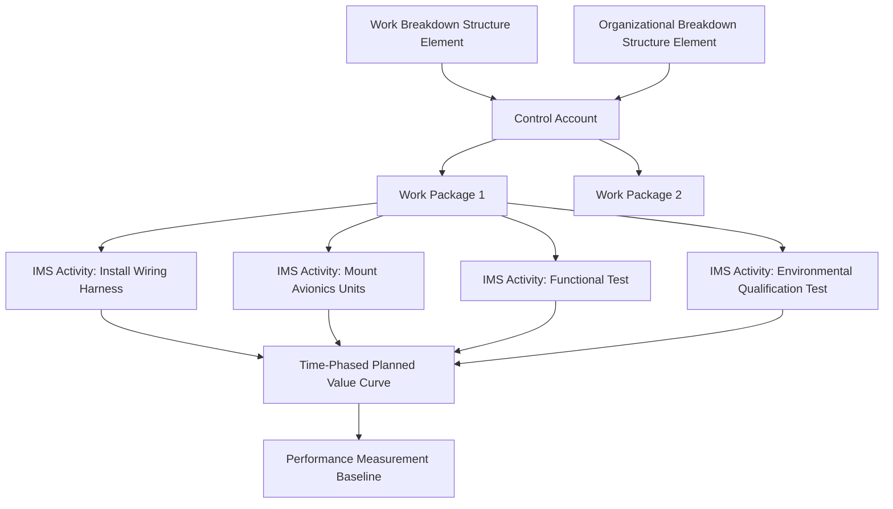

## Linking Schedule Activities to Cost Accounts

### Definition and Purpose

Linking schedule activities to cost accounts is the structural and procedural discipline of tying each activity in the Integrated Master Schedule (IMS) to a specific Control Account within the project's cost/budget structure, so that schedule progress and cost expenditure can be measured against the same underlying scope of work. This linkage is the operational mechanism by which CPM scheduling and Earned Value Management become genuinely integrated, rather than two parallel but disconnected reporting systems — it is the practical implementation of what the Integrated Master Plan/Integrated Master Schedule relationship and ANSI/EIA-748 Organization guidelines require at the most granular level.

Without this linkage, an organization may have a technically valid CPM network and a technically valid cost accounting system, yet be unable to answer the fundamental EVM question: "How much of the *authorized budget* for *this specific scope of work* has been *earned* by the *physical progress* shown in the schedule?"

### The WBS/OBS/Control Account/Work Package Hierarchy

**Key Points**

- **Work Breakdown Structure (WBS)**: A hierarchical decomposition of total project scope into progressively smaller, deliverable-oriented elements — the "what" of the work.
- **Organizational Breakdown Structure (OBS)**: A hierarchical representation of the organization's management structure responsible for executing that scope — the "who."
- **Control Account (CA)**: The intersection point of a specific WBS element and a specific OBS element — the level at which a single, accountable Control Account Manager (CAM) owns both budget and schedule performance for a defined scope of work. This is the primary management control point in EVM.
- **Work Package (WP)**: A further decomposition of a Control Account into discrete, near-term, schedulable units of work with specific start/finish dates, assigned resources, and a defined earned value technique — this is the level at which schedule activities are directly defined and linked.
- **Planning Package**: Budget for far-term work within a Control Account that has not yet been decomposed into detailed Work Packages/schedule activities, used when detailed planning that far in advance would not be meaningful; Planning Packages are converted into Work Packages (and correspondingly detailed IMS activities) as the work approaches near-term execution — a process often called "rolling wave planning."

### Mechanics of the Linkage

**Key Points**

- **Coding structure alignment**: Each IMS activity carries a code (commonly a WBS code, Control Account code, or a combined identifier) that maps it unambiguously to exactly one Control Account/Work Package — most scheduling tools (Primavera P6, Microsoft Project) support custom fields or activity codes specifically for this purpose, often synchronized with the cost system via integration tools or a common Enterprise Resource Planning (ERP)/EVM software backbone.
- **One-to-many, not many-to-many, relationship**: Best practice is that each schedule activity belongs to exactly one Work Package/Control Account; an activity representing scope spanning multiple Control Accounts should be split into separate activities, since ambiguous ownership breaks the accountability the Control Account structure is designed to establish.
- **Time-phasing the budget against the schedule**: Once linked, the Control Account's total budget is distributed across time (forming the Planned Value curve) according to the actual calculated dates of its constituent schedule activities — this time-phased distribution *is* the Performance Measurement Baseline (PMB) at the detail level, meaning the schedule network directly determines the shape of the budget spread, not an independently assumed curve.
- **Earned value technique applied at the Work Package level, informed by schedule structure**: The choice of earned value technique (0/100, 50/50, percent complete, weighted milestones, LOE, apportioned effort) is applied to the Work Package as a whole, but is often informed by how its constituent schedule activities are structured — e.g., a Work Package with several sequential milestone-style activities is well suited to a weighted milestone technique, with each schedule milestone's completion triggering its assigned percentage of earned value.
- **Change control synchronization**: Because schedule and budget are linked at this level, any change to Work Package scope, budget, or the underlying schedule activities must be processed through a single, synchronized change control action — updating one without the other breaks the PMB's internal consistency, a frequent EVMS surveillance finding (see Common EVMS Compliance Pitfalls).

### Worked Example

Control Account CA-410 ("Integrate and Test Avionics Bay"), owned by CAM Maria Santos, has an approved budget of $180,000. It decomposes into a single Work Package containing these IMS activities:

| Activity | Duration | Planned Start | Planned Finish | % of WP Budget |
| --- | --- | --- | --- | --- |
| Install Wiring Harness | 6d | Day 1 | Day 6 | 25% |
| Mount Avionics Units | 4d | Day 7 | Day 10 | 20% |
| Functional Test | 5d | Day 11 | Day 15 | 30% |
| Environmental Qualification Test | 7d | Day 16 | Day 22 | 25% |

Using a **weighted milestone** earned value technique, each activity's completion triggers its corresponding percentage of the $180,000 budget as Earned Value. The time-phased Planned Value curve for CA-410 is derived directly from these dates — for example, by Day 10 (cumulative), the schedule implies $\$180{,}000 \times (25\% + 20\%) = \$81{,}000$ of Planned Value should have accrued, and the Earned Value calculation at that point compares actual completion of "Install Wiring Harness" and "Mount Avionics Units" against that $81,000 baseline. If "Mount Avionics Units" is only 50% physically complete by Day 10, Earned Value would be:

$$EV = (\$180{,}000 \times 25\%) + (\$180{,}000 \times 20\% \times 0.5) = \$45{,}000 + \$18{,}000 = \$63{,}000$$

against a Planned Value of $81,000, yielding a Schedule Variance of $SV = EV - PV = \$63{,}000 - \$81{,}000 = -\$18{,}000$ — a direct, traceable result of the schedule/cost linkage at the activity level.

### Mermaid Diagram: WBS/OBS/Control Account/Schedule Linkage

### SVG Illustration: Budget Time-Phasing Derived from Schedule Dates

<svg xmlns="http://www.w3.org/2000/svg" viewBox="0 0 700 300">
<text x="350" y="25" text-anchor="middle" font-size="16" font-weight="bold" fill="#222">Planned Value Curve Derived from IMS Dates (svg_diagram)</text>
<line x1="80" y1="250" x2="650" y2="250" stroke="#333" stroke-width="2" />
<line x1="80" y1="50" x2="80" y2="250" stroke="#333" stroke-width="2" />
<text x="30" y="255" font-size="11" fill="#333">$</text>
<text x="600" y="270" font-size="11" fill="#333">Day</text>
<rect x="90" y="195" width="120" height="55" fill="#3498db" />
<text x="150" y="270" text-anchor="middle" font-size="10">Wiring (D1-6)</text>
<text x="150" y="190" text-anchor="middle" font-size="10">25%</text>
<rect x="210" y="150" width="90" height="100" fill="#5dade2" />
<text x="255" y="270" text-anchor="middle" font-size="10">Mount (D7-10)</text>
<text x="255" y="145" text-anchor="middle" font-size="10">20%</text>
<rect x="300" y="85" width="110" height="165" fill="#85c1e9" />
<text x="355" y="270" text-anchor="middle" font-size="10">Test (D11-15)</text>
<text x="355" y="80" text-anchor="middle" font-size="10">30%</text>
<rect x="410" y="50" width="150" height="200" fill="#aed6f1" />
<text x="485" y="270" text-anchor="middle" font-size="10">Qual Test (D16-22)</text>
<text x="485" y="45" text-anchor="middle" font-size="10">25%</text>

<text x="80" y="40" font-size="11" fill="#666">Cumulative budget accrues in step with IMS activity finish dates</text>

</svg>

### Software and Data Integration Mechanisms

**Key Points**

- **Direct integration between scheduling and cost/EVM tools**: Enterprise EVM platforms integrate with CPM scheduling tools (e.g., Primavera P6, Microsoft Project) through native connectors, shared databases, or standardized data exchange formats (commonly XML-based schedule exchange formats), reducing manual re-entry errors and improving traceability. [Unverified: specific vendor integration architectures and supported formats change over product versions]
- **Common activity coding taxonomy**: Establishing a single, organization-wide coding standard for WBS, OBS, and Control Account identifiers used consistently in both the scheduling and cost systems avoids the reconciliation drift that is a top EVMS surveillance finding.
- **Automated variance flagging**: Integrated systems can automatically flag Control Accounts where schedule status (from the IMS) and cost status (from the accounting system) diverge beyond a defined threshold, surfacing potential linkage or data integrity problems before they accumulate into significant findings.
- **Reconciliation reporting**: Periodic (typically monthly) reconciliation reports comparing the sum of IMS activity-level time-phased budgets against the corresponding Control Account's total authorized budget, confirming no orphaned budget or unbudgeted schedule activities exist.

### Common Pitfalls

- **Orphaned schedule activities**: IMS activities that exist with no corresponding Control Account/Work Package linkage, representing either unauthorized work or a broken coding structure — a frequent and serious EVMS surveillance finding, since it means schedule progress is being tracked for work with no traceable budget authorization.
- **Many-to-many mapping ambiguity**: Schedule activities that span multiple Control Accounts (or Control Accounts with no clearly corresponding schedule activities) undermine the single-point accountability the Control Account structure exists to establish.
- **Manual re-entry between disconnected systems**: Organizations lacking direct tool integration that manually re-key schedule dates into the cost/EVM system (or vice versa) introduce transcription errors and timing lags that distort variance calculations.
- **Earned value technique misaligned with schedule granularity**: Assigning a technique like weighted milestones to a Work Package whose underlying schedule activities are too coarse or ambiguously sequenced to support objective milestone verification, undermining the technique's intended precision.
- **Failing to update the linkage after schedule logic changes**: Adding or restructuring IMS activities without correspondingly updating the Control Account/Work Package linkage, so the recorded time-phased budget no longer matches the actual current schedule network.

**Related Topics**

- Integrated Master Schedule Development
- Integrated Master Plan Structure
- Earned Value Techniques (0/100, 50/50, Weighted Milestones, LOE, Apportioned Effort)
- Common EVMS Compliance Pitfalls
- Control Account Manager (CAM) Roles and Responsibilities
- Rolling Wave Planning and Planning Packages
- Performance Measurement Baseline (PMB) Construction
- Integrated Baseline Review (IBR) Process