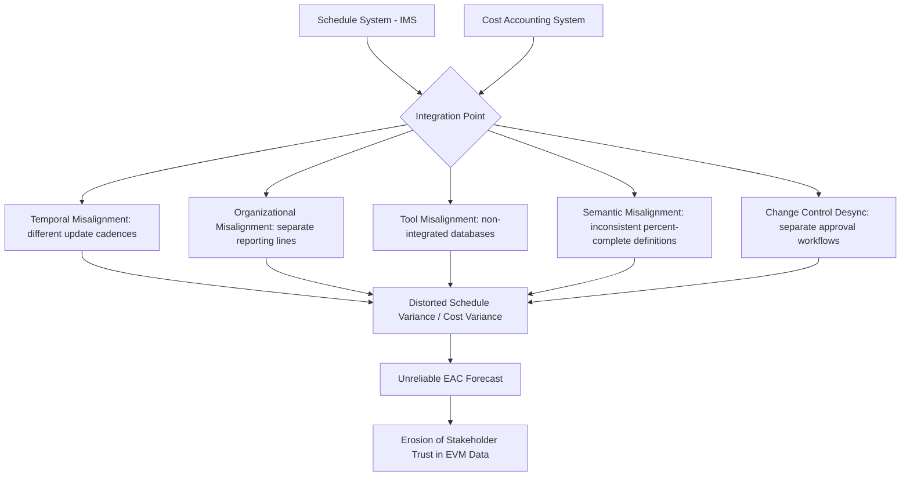

## Schedule-Cost Integration Challenges

### Overview

Even when an organization has formally linked schedule activities to Control Accounts (as described in Linking Schedule Activities to Cost Accounts) and validated its EVMS against ANSI/EIA-748, sustaining genuine, day-to-day schedule-cost integration is one of the most persistent operational challenges in program management. The linkage that appears clean in a system description or at Integrated Baseline Review time frequently degrades during execution as the two systems are updated on different cadences, by different teams, using different tools and assumptions.

This topic addresses the *systemic and organizational* challenges of maintaining integration over the life of a program, as distinct from the *structural/mechanical* linkage mechanisms already covered.

### Categories of Integration Challenges

**Key Points**

- **Temporal misalignment**: Schedule status is often updated more frequently (e.g., weekly) than cost accounting closes (e.g., monthly), creating a structural lag where schedule progress claims and recorded actual costs never reflect precisely the same point in time, distorting Cost Variance and Schedule Variance in any given snapshot.
- **Organizational misalignment**: Schedulers/planners and cost analysts frequently sit in different functional reporting lines (Program Planning vs. Business Management/Controls), with different incentives, vocabularies, and tool proficiencies, making sustained collaboration harder than the org chart might suggest.
- **Tool and data architecture misalignment**: CPM scheduling tools (Primavera P6, Microsoft Project) and cost/EVM systems (often ERP-based or specialized EVM software) may not share a common database, requiring manual or semi-automated data exchange that introduces latency, transcription error, and version-control ambiguity about which dataset is authoritative at a given moment.
- **Semantic/definitional misalignment**: "Percent complete" can mean different things to a scheduler (percentage of duration elapsed) versus a cost analyst applying an earned value technique (percentage of budget earned) versus a technical lead (percentage of engineering effort remaining) — without a rigorously enforced shared definition, these different senses of "complete" produce inconsistent inputs to the same integrated calculation.
- **Change control desynchronization**: Schedule logic changes and cost/budget changes are sometimes processed through separate change control boards or approval workflows operating on different timelines, so a schedule change can be implemented before its corresponding budget re-plan is approved (or vice versa), temporarily breaking the Performance Measurement Baseline's internal consistency.

### The Root Cause: Two Different Domains of Truth

**Key Points**

- **Schedule truth is logical/sequential**: The IMS answers "in what order, and how long" — its correctness depends on network logic, resource availability, and duration estimation accuracy.
- **Cost truth is transactional/financial**: The accounting system answers "what was actually spent, and when" — its correctness depends on invoice processing, labor charging accuracy, and financial period closing procedures that are largely independent of schedule logic.
- **EVM sits at the intersection and inherits both domains' imperfections**: Because Earned Value calculations depend on both a credible schedule-derived Planned Value and an accurate Actual Cost, any imperfection or lag in either domain propagates directly into misleading Cost Variance, Schedule Variance, and forecasted Estimate at Completion figures — meaning schedule-cost integration challenges are not merely an administrative inconvenience but a direct threat to the analytical validity of EVM itself.

### Worked Example: A Compounding Integration Failure

Control Account CA-500 ("Software Integration Testing") illustrates several challenges compounding:

1. **Temporal misalignment**: The scheduler updates the IMS weekly and marks "System Integration Test Phase 1" as 80% complete based on the technical lead's informal estimate at the Friday status meeting. The cost accounting system, however, closes actual labor costs only at month-end, so the Actual Cost figure used in that week's informal EVM snapshot is nearly a month stale relative to the schedule claim.
2. **Semantic misalignment**: The technical lead's "80% complete" reflects engineering judgment about remaining defect-fixing effort, not the formally assigned earned value technique (in this case, "percent complete" tied to specific, weighted test case completion) — so the informally reported 80% does not match what the EVM system would calculate if it strictly applied the documented technique (in this example, only 62% of weighted test cases have actually passed).
3. **Result**: When month-end EVM figures are formally calculated, Earned Value based on the correct technique (62%) is lower than the informally reported schedule status (80%) suggested, producing an unexpected negative Schedule Variance that surprises stakeholders who had been tracking the informal 80% figure — a classic symptom of insufficiently rigorous, systemically unsynchronized status reporting.

$$SV_{formal} = EV_{62\%} - PV \qquad \text{vs.} \qquad SV_{informal\ perceived} = EV_{80\%(assumed)} - PV$$

The formally correct calculation reveals a materially worse schedule position than informal status meetings had communicated, undermining stakeholder trust in both systems once the discrepancy surfaces.

### Mermaid Diagram: Sources of Schedule-Cost Divergence

### SVG Illustration: Timing Gap Between Schedule Status and Cost Actuals

<svg xmlns="http://www.w3.org/2000/svg" viewBox="0 0 700 260">
<text x="350" y="25" text-anchor="middle" font-size="16" font-weight="bold" fill="#222">Update Cadence Mismatch (svg_diagram)</text>
<line x1="80" y1="220" x2="650" y2="220" stroke="#333" stroke-width="2" />
<text x="350" y="240" text-anchor="middle" font-size="11">Time (weeks)</text>
<circle cx="120" cy="100" r="6" fill="#3498db" />
<circle cx="200" cy="100" r="6" fill="#3498db" />
<circle cx="280" cy="100" r="6" fill="#3498db" />
<circle cx="360" cy="100" r="6" fill="#3498db" />
<text x="220" y="80" font-size="11" fill="#3498db">Schedule status updated weekly</text>
<circle cx="600" cy="160" r="6" fill="#e74c3c" />
<text x="600" y="180" text-anchor="middle" font-size="11" fill="#e74c3c">Cost actuals close monthly</text>
<line x1="120" y1="106" x2="120" y2="220" stroke="#3498db" stroke-dasharray="2,2" />
<line x1="200" y1="106" x2="200" y2="220" stroke="#3498db" stroke-dasharray="2,2" />
<line x1="280" y1="106" x2="280" y2="220" stroke="#3498db" stroke-dasharray="2,2" />
<line x1="360" y1="106" x2="360" y2="220" stroke="#3498db" stroke-dasharray="2,2" />
<line x1="600" y1="166" x2="600" y2="220" stroke="#e74c3c" stroke-dasharray="2,2" />

<text x="70" y="105" text-anchor="end" font-size="10" fill="#666">W1</text>

<text x="70" y="225" text-anchor="end" font-size="10" fill="#666">0</text>

<rect x="115" y="145" width="490" height="20" fill="`#f9e79f`" opacity="0.6" />

<text x="360" y="159" text-anchor="middle" font-size="10" fill="`#7d6608`">Gap: schedule claims precede cost confirmation</text>

</svg>

### Mitigation Strategies

**Key Points**

- **Shared, enforced definitions of progress measurement**: Formally documenting and training all CAMs, schedulers, and technical leads on the specific earned value technique and its objective completion criteria for each Work Package, eliminating informal or intuitive "percent complete" judgments from entering the formal system.
- **Aligned update cadences where feasible**: Structuring schedule status cutoffs to coincide as closely as possible with cost accounting period closes, even if this means the schedule update cycle is slightly less frequent than technically possible, in exchange for a consistent, reconcilable EVM snapshot.
- **Cross-functional Control Account reviews**: Regular (often monthly) joint reviews involving the CAM, scheduler, and cost analyst together for each Control Account, specifically designed to catch semantic or timing discrepancies before they propagate into formal EVM reports.
- **Integrated tool architecture investment**: Where organizationally and financially feasible, investing in scheduling/cost tool integration (shared databases, automated data exchange, or a unified EVM platform) to reduce manual re-entry and the associated latency/error risk — though full integration is not always achievable given legacy systems, and manual reconciliation processes with strong governance can partially substitute.
- **Single-source-of-truth governance for Control Account status**: Designating one authoritative dataset (typically the formally documented, technique-based EVM calculation) as the only status communicated in formal reporting, explicitly discouraging informal percent-complete figures from circulating in parallel, which prevents the kind of stakeholder-trust erosion illustrated in the worked example.
- **Data integrity audits as part of internal EVMS self-surveillance**: Periodically sampling Control Accounts specifically to test schedule-cost timing and semantic consistency, treating this as a distinct audit dimension alongside the broader EVMS compliance pitfalls already tracked.

### Common Pitfalls

- **Assuming structural linkage guarantees ongoing integration**: Believing that because activities are coded to Control Accounts (structural linkage exists), the data flowing through that linkage remains accurate and synchronized without active governance — structural linkage is necessary but not sufficient.
- **Allowing informal status to substitute for formal EVM data in stakeholder communication**: As in the worked example, informal percent-complete estimates that circulate ahead of formally calculated EVM figures create expectation mismatches that damage trust once the formal numbers are reported.
- **Under-resourcing the reconciliation function**: Treating schedule-cost reconciliation as a part-time, informal responsibility rather than a resourced, accountable function, especially on smaller or lower-visibility Control Accounts that receive less scrutiny than flagship program elements.
- **Ignoring tool limitations until they cause a visible failure**: Continuing with manual, error-prone data transfer between disconnected scheduling and cost systems without proactively assessing integration risk, until a significant EVMS surveillance finding or an embarrassing stakeholder-facing discrepancy forces the issue.
- **Treating integration as solved after Integrated Baseline Review**: Assuming the schedule-cost linkage validated at IBR remains valid throughout execution without ongoing verification, when in practice linkage integrity is most likely to erode during the routine, unglamorous months of steady-state execution rather than at major review milestones.

**Related Topics**

- Linking Schedule Activities to Cost Accounts
- Common EVMS Compliance Pitfalls
- Integrated Baseline Review (IBR) Process
- Earned Value Techniques and Objective Progress Measurement
- Control Account Manager (CAM) Roles and Cross-Functional Coordination
- EVMS Validation and Surveillance Reviews
- Data Governance for Integrated Program Management Systems