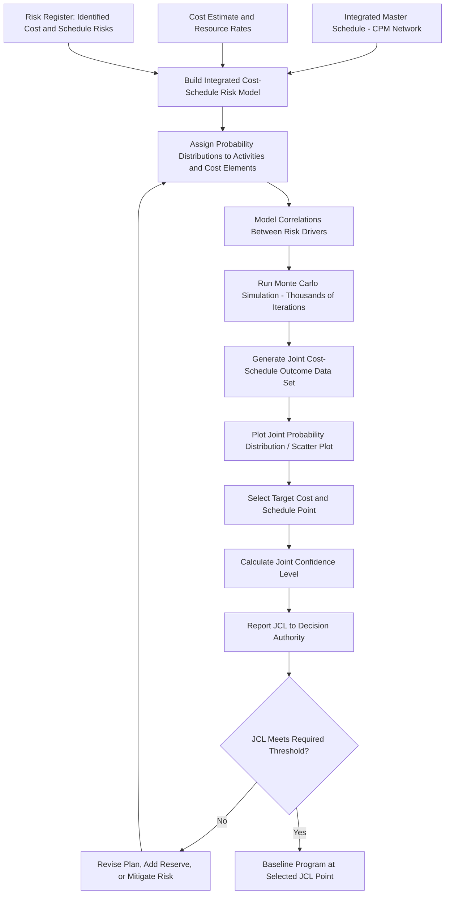

## Joint Confidence Level Analysis

### Definition and Purpose

**Joint Confidence Level (JCL) analysis** is a probabilistic risk analysis technique that integrates cost risk and schedule risk into a single, combined probability distribution, producing a statement of the joint probability that a program will complete *both* at or under a specified cost *and* at or before a specified date. JCL is a direct extension of Schedule Risk Analysis (Monte Carlo simulation applied to the CPM network) combined with Cost Risk Analysis, explicitly modeling the correlation between schedule slippage and cost growth rather than treating them as independent risk dimensions.

The core insight motivating JCL is that cost and schedule risk are rarely independent: schedule delays typically drive cost growth (extended labor, facility, and overhead costs), and cost-constrained decisions (e.g., reduced staffing) typically drive schedule delays. Analyzing cost confidence and schedule confidence *separately* — as many organizations historically did — can produce a misleadingly optimistic picture, since a program might have (for example) a 70% probability of meeting its cost target *and* a 70% probability of meeting its schedule target considered independently, while the probability of meeting *both simultaneously* is meaningfully lower due to their correlation.

$$JCL \neq P(Cost \leq Target) \times P(Schedule \leq Target) \quad \text{(when cost and schedule are correlated)}$$

The joint probability must be computed from a model that explicitly captures the cost-schedule correlation structure, not simply multiplied from independently derived marginal probabilities.

### Mathematical and Modeling Foundations

**Key Points**

- **Integrated cost-schedule risk model**: JCL analysis requires a single model where schedule risk (activity duration uncertainty in the CPM network, typically modeled with triangular, beta, or PERT distributions) and cost risk (cost estimate uncertainty, resource rate uncertainty, and schedule-driven cost — i.e., cost that varies directly with duration, such as time-dependent overhead) are linked, so that a given Monte Carlo iteration's schedule outcome directly informs that same iteration's cost outcome.
- **Monte Carlo simulation across the integrated model**: Running thousands of iterations where activity durations (and their downstream schedule-driven costs) are randomly sampled according to their assigned probability distributions, recalculating both the critical path/project finish date and the resulting total cost for each iteration.
- **Joint probability distribution output**: Rather than two separate S-curves (one for cost, one for schedule), JCL analysis produces a two-dimensional probability surface (or a scatter plot of cost versus schedule outcomes across all iterations) from which the joint probability of meeting any specific cost-schedule pair can be read.
- **Correlation modeling between risk drivers**: Explicitly modeling correlations between individual risk factors (e.g., a delay in a specific critical activity correlating with increased labor cost for that same activity, or broader programmatic risks like funding instability affecting multiple activities simultaneously) is essential to producing a realistic joint distribution rather than an artificially narrow one that understates true combined risk.

### The JCL Scatter Plot and Reading Joint Probability

A common visualization is a scatter plot with cost on one axis and schedule (finish date) on the other, where each point represents one Monte Carlo iteration's simultaneous cost and schedule outcome. A rectangular region can then be drawn representing "at or below target cost AND at or before target date," and the JCL is the proportion of all simulated iterations falling within that region.

| Target Point | JCL (Illustrative) | Interpretation |
| --- | --- | --- |
| Cost ≤ $120M, Finish ≤ Month 36 | 50% | Point estimate — commonly the baseline reported |
| Cost ≤ $135M, Finish ≤ Month 40 | 80% | Often used as a more conservative, higher-confidence planning point |
| Cost ≤ $110M, Finish ≤ Month 32 | 15% | Illustrates low-confidence, aggressive targets |

[Unverified: illustrative figures only — actual JCL values are entirely dependent on the specific program's risk model inputs and are not derivable from general principles alone]

### Worked Example (Simplified)

A program's integrated cost-schedule risk model produces 5,000 Monte Carlo iterations. The analyst wants the JCL for the target: total cost ≤ $95M and finish date ≤ Month 30.

- Of the 5,000 iterations, 5,000 × Schedule marginal probability of finishing by Month 30 alone might show 3,500 iterations (70%) meeting the schedule target independently.
- Separately, 3,750 iterations (75%) might meet the cost target independently.
- However, because cost and schedule are correlated (iterations with late finish dates tend to also show cost growth from extended program office overhead and labor), only 2,900 iterations (58%) meet *both* targets simultaneously.

$$JCL = \frac{2{,}900}{5{,}000} = 58\%$$

This demonstrates the central JCL insight: the naive product of independent marginal probabilities ($70\% \times 75\% = 52.5\%$) does not equal the true joint probability (58% in this illustrative case, though the direction and magnitude of the gap depends entirely on the correlation structure modeled — positive correlation between cost and schedule risk can push the true joint probability either above or below the naive independent product depending on the specific distribution shapes involved). [Inference] The illustrative direction shown here is one plausible outcome; actual results depend entirely on the specific correlation structure of the underlying risk model.

### Mermaid Diagram: JCL Analysis Process Flow

### SVG Illustration: Joint Confidence Level Scatter Plot Concept

<svg viewBox="0 0 700 320" xmlns="http://www.w3.org/2000/svg">
<text x="350" y="25" text-anchor="middle" font-size="16" font-weight="bold" fill="#222">Joint Confidence Level Scatter Plot (svg_diagram)</text>
<line x1="90" y1="270" x2="650" y2="270" stroke="#333" stroke-width="2"/>
<line x1="90" y1="50" x2="90" y2="270" stroke="#333" stroke-width="2"/>
<text x="360" y="295" text-anchor="middle" font-size="12">Schedule Finish (Month)</text>
<text x="30" y="160" text-anchor="middle" font-size="12" transform="rotate(-90 30 160)">Cost ($M)</text>
<rect x="90" y="50" width="260" height="120" fill="#d5f5e3" opacity="0.6" stroke="#27ae60" stroke-dasharray="4,2"/>
<text x="220" y="65" text-anchor="middle" font-size="10" fill="#1e8449">Target region: Cost&le;\$95M, Finish&le;M30</text>
<circle cx="150" cy="90" r="4" fill="#27ae60"/>
<circle cx="180" cy="110" r="4" fill="#27ae60"/>
<circle cx="200" cy="130" r="4" fill="#27ae60"/>
<circle cx="230" cy="100" r="4" fill="#27ae60"/>
<circle cx="260" cy="140" r="4" fill="#27ae60"/>
<circle cx="300" cy="120" r="4" fill="#27ae60"/>
<circle cx="320" cy="150" r="4" fill="#27ae60"/>
<circle cx="400" cy="180" r="4" fill="#e74c3c"/>
<circle cx="420" cy="200" r="4" fill="#e74c3c"/>
<circle cx="450" cy="160" r="4" fill="#e74c3c"/>
<circle cx="470" cy="220" r="4" fill="#e74c3c"/>
<circle cx="500" cy="190" r="4" fill="#e74c3c"/>
<circle cx="530" cy="230" r="4" fill="#e74c3c"/>
<circle cx="380" cy="140" r="4" fill="#e74c3c"/>
<circle cx="550" cy="170" r="4" fill="#e74c3c"/>
<rect x="540" y="55" width="12" height="12" fill="#27ae60"/>
<text x="558" y="65" font-size="10">Meets both targets</text>
<rect x="540" y="72" width="12" height="12" fill="#e74c3c"/>
<text x="558" y="82" font-size="10">Misses one or both targets</text>
</svg>

### Application Context and Governance

**Key Points**

- **Primarily used in large government/defense acquisition programs**: JCL analysis is most prominently associated with U.S. government acquisition policy (notably applied historically within NASA and Department of Defense major program milestones), where programs are required to report a JCL at key decision points to support budgeting and schedule commitment decisions. [Unverified: specific current policy mandates and required JCL thresholds vary by agency and have evolved over time; verify against current agency-specific guidance for any compliance-driven application]
- **JCL as a decision-support tool, not merely a compliance artifact**: Beyond satisfying reporting requirements, JCL analysis is intended to inform genuine trade-off decisions — e.g., whether to add schedule margin, cost reserve, or both, and at what confidence level the program should be baselined.
- **Selecting the target JCL point**: Organizations must decide what confidence level is appropriate to baseline against (e.g., 50th percentile "most likely," or a more conservative 70th-80th percentile point), balancing the risk of an overly optimistic baseline (high probability of later overrun) against the risk of an overly conservative one (excess reserve that could otherwise fund other priorities).
- **Relationship to Management Reserve and Schedule Margin**: The gap between the JCL-selected confidence point and the deterministic (single-point) CPM/cost estimate is often used to inform the appropriate sizing of Management Reserve (cost) and Schedule Margin (time), connecting JCL analysis directly back to baseline construction practices.

### Common Pitfalls

- **Treating cost and schedule risk as independent when correlation exists**: As shown in the worked example, calculating JCL as the simple product of independently derived marginal probabilities produces a materially inaccurate joint probability whenever meaningful correlation exists between cost and schedule risk drivers.
- **Underestimating correlation strength**: Failing to adequately model the degree to which schedule slippage drives cost growth (and vice versa) produces an artificially narrow joint distribution and an overstated JCL, giving decision-makers false confidence.
- **Using a JCL model not genuinely integrated with the IMS**: Running cost risk and schedule risk analyses in separate, loosely coordinated models rather than a single model where the CPM network directly drives schedule-dependent cost elements undermines the fundamental premise of the analysis.
- **Selecting an inappropriately low or high confidence point for baselining**: Choosing to baseline at too low a JCL (e.g., 50%) without acknowledging the correspondingly high probability of overrun, or at too high a JCL (e.g., 90%+) without acknowledging the opportunity cost of the reserve required, both distort program planning if the selected point and its implications are not clearly communicated to decision-makers.
- **Static JCL analysis not updated as the program executes**: Treating JCL as a one-time analysis at program baseline rather than periodically re-running it as actual performance data (CPI, SPI trends) becomes available, missing the opportunity to refine risk understanding as uncertainty resolves over time.

**Related Topics**

- Schedule Risk Analysis and Monte Carlo Simulation
- Schedule Cost Integration Challenges
- Management Reserve and Schedule Margin Sizing
- Over Target Baseline and Over Target Schedule
- Risk Register Development and Correlation Modeling
- Integrated Baseline Review (IBR) Process
- What-If Scenario Analysis