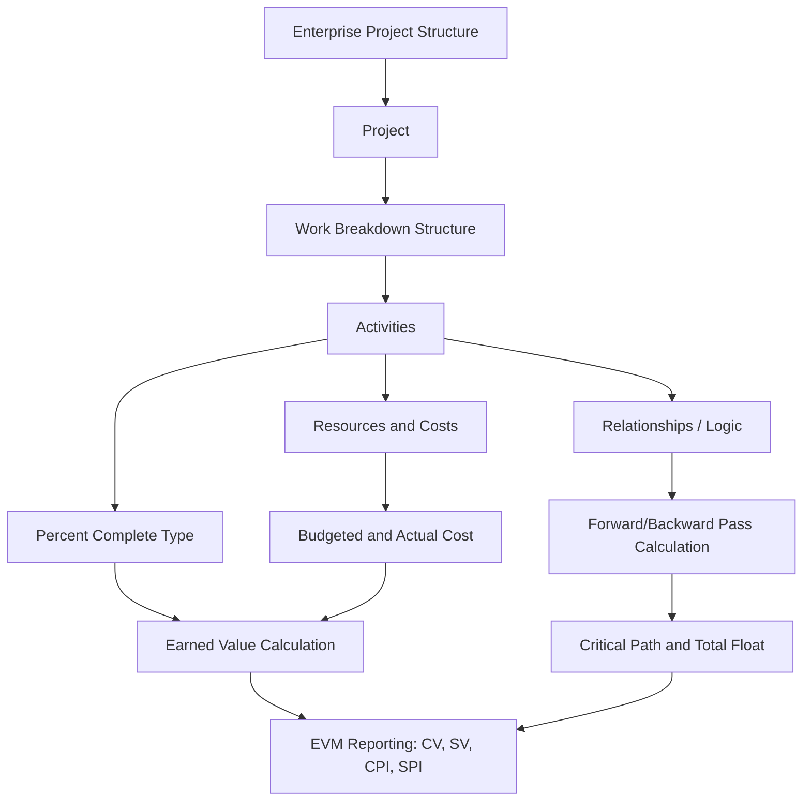

## Oracle Primavera P6 Fundamentals

### Overview and Purpose

**Oracle Primavera P6** (commonly "P6") is an enterprise project, program, and portfolio management software platform widely used for Critical Path Method scheduling on large, complex programs — particularly in construction, engineering, defense, aerospace, and other capital-intensive industries where formal EVMS compliance (ANSI/EIA-748) is often required. P6 exists in two primary deployment forms: **P6 Professional** (a Windows client application, often used standalone or connected to a shared database) and **P6 EPPM** (Enterprise Project Portfolio Management, a web-based, browser-accessible version built for broader enterprise-wide visibility, resource management, and portfolio-level reporting). Both share the same underlying data model and scheduling engine, differing primarily in interface and deployment architecture. [Unverified: exact current feature parity between P6 Professional and P6 EPPM changes across Oracle releases]

### Core Data Hierarchy in P6

**Key Points**

- **Enterprise Project Structure (EPS)**: The top-level hierarchical organization of all projects within a P6 database, typically structured by division, program, or business unit, allowing portfolio-level rollup and reporting across many individual projects.
- **Organizational Breakdown Structure (OBS)**: Represents the management hierarchy responsible for projects and can be used to control security access and assign project-level responsibility, mirroring the OBS concept used in EVM Control Account structures.
- **Work Breakdown Structure (WBS)**: Within each individual project, activities are organized into a WBS hierarchy, which in EVM-compliant implementations directly maps to the cost/Control Account WBS structure discussed under Linking Schedule Activities to Cost Accounts.
- **Activities**: The fundamental schedulable unit in P6, each with a unique Activity ID, duration, calendar assignment, relationships (predecessors/successors), and — in EVM-integrated implementations — a code or custom field linking it to a specific Control Account/Work Package.
- **Activity Codes and Global/Project-Specific Codes**: User-definable classification fields (beyond WBS) used for filtering, grouping, and reporting activities by criteria such as responsible discipline, location, or contract line item, frequently including the WBS/Control Account coding used for cost integration.
- **Resources and Roles**: P6 supports resource-loading activities with labor, material, and equipment resources (or generic "Roles" before specific resource assignment), enabling resource-constrained scheduling and cost calculation directly within the tool.

### Building a Schedule in P6: Core Workflow

**Key Points**

1. **Create the project and define calendars**: Establish project-specific or global calendars defining working days, holidays, and shift patterns that govern how durations translate into calendar dates.
2. **Build the WBS**: Decompose project scope into a WBS hierarchy, ideally pre-coordinated with the cost/EVM Control Account structure if EVM compliance is required.
3. **Add activities and assign durations**: Create activities under appropriate WBS elements, assigning original duration estimates and the appropriate calendar.
4. **Establish relationships (logic)**: Define Finish-to-Start (FS), Start-to-Start (SS), Finish-to-Finish (FF), or Start-to-Finish (SF) relationships between activities, with leads (negative lag) or lags (positive lag) as needed to reflect actual logical dependency — consistent with sound CPM network-building practice and the health checks described under the DCMA 14-Point Assessment.
5. **Assign constraints sparingly**: Apply date constraints (Must Finish By, Start On or After, etc.) only where a genuine external commitment requires them, since overuse distorts the calculated critical path.
6. **Run the schedule (F9 calculation)**: P6's scheduling engine performs the forward and backward pass, calculating Early Start/Finish, Late Start/Finish, and Total Float for every activity based on the network logic and calendars, exactly per standard CPM mathematics:

$$ES_{successor} = \max(EF_{predecessors}) \qquad LF_{predecessor} = \min(LS_{successors}) \qquad TF = LS - ES$$

7. **Assign resources and costs**: Load labor, material, and equipment resources onto activities, enabling P6 to calculate resource-driven costs and supporting the schedule-cost linkage required for EVM.
8. **Set the baseline**: Once the schedule is validated (often after a DCMA-style health check), save it as a formal baseline, against which future progress will be measured for Schedule Variance and EVM calculations.

### Progressing and Updating the Schedule

**Key Points**

- **Status Date (Data Date)**: P6 uses a defined "Data Date" (also called Status Date) representing the point in time as of which progress is being reported; all EVM calculations (Planned Value cumulative through the Data Date) are anchored to this date.
- **Actual Start/Finish and Remaining Duration entry**: For each activity, the scheduler enters actual start/finish dates for completed or in-progress work, and a revised remaining duration for incomplete activities, which the engine uses to recalculate forward-looking dates.
- **Percent Complete Types**: P6 supports multiple percent-complete calculation types per activity — **Duration % Complete** (based on elapsed vs. total duration), **Physical % Complete** (a manually entered, judgment-based value, or one tied to an earned value technique), and **Units % Complete** (based on resource units consumed) — the choice of type should align with the formally assigned earned value technique for EVM-compliant schedules.
- **Retained Logic vs. Progress Override**: A scheduling calculation option governing how P6 treats out-of-sequence progress (work completed before its logical predecessor per the network) — Retained Logic preserves the original logical relationships even when progress appears out of sequence, while Progress Override allows the successor to proceed based on actual reported progress regardless of predecessor logic; the choice affects calculated dates and is a frequently examined setting in DCMA 14-Point health assessments, since inconsistent or inappropriate selection can produce misleading critical path results.

### Reporting and Analysis Features Relevant to CPM/EVM

**Key Points**

- **Filters and Layouts**: Customizable views allowing schedulers to isolate activities by float threshold (supporting near-critical path identification), WBS/Control Account, resource, or any activity code — directly supporting the float-sorting techniques described under Near-Critical and Multiple Critical Paths.
- **Total Float and Longest Path filtering**: P6 supports both a simple zero (or threshold) float filter and a "Longest Path" trace function, the latter being the more reliable method for identifying true criticality in schedules containing constraints, consistent with best practice guidance on avoiding float-based misclassification.
- **What-If scheduling via project copies**: Because P6 supports saving multiple baselines and copying entire projects, scenario/what-if analysis (as covered under What-If Scenario Analysis) is commonly performed by duplicating the live schedule into a separate "what-if" project, modifying it, and comparing results against the baseline without disturbing the live schedule.
- **Earned Value and EVM reporting fields**: P6 natively calculates and displays standard EVM fields at the activity, WBS, and project level, including Planned Value (BCWS), Earned Value (BCWP), Actual Cost (ACWP), Cost Variance, Schedule Variance, CPI, and SPI, when resources/costs and an earned value technique are properly assigned — directly supporting the schedule-cost integration discussed earlier.
- **Schedule Log and Audit Trail**: P6 maintains a log of schedule changes, which — combined with formal baseline change control procedures — supports the auditability required by EVMS surveillance reviews regarding unauthorized retroactive baseline changes.
- **Import/Export and Integration**: P6 supports data exchange via XER files (P6's native exchange format) and XML, as well as integration with external EVM/cost systems, supporting the schedule-cost tool integration strategies discussed under Schedule Cost Integration Challenges. [Unverified: specific supported integration connectors and file format versions evolve across P6 releases; consult current Oracle documentation for a specific version's capabilities]

### Worked Example: Setting Up a Simple EVM-Ready Activity

An activity "Fabricate Bracket Assembly" in P6 is configured as follows for EVM compliance:

| Field | Value |
| --- | --- |
| Activity ID | FAB-1120 |
| WBS | 2.3.1 (mapped to Control Account CA-310) |
| Original Duration | 15 days |
| Calendar | 5-day workweek, standard holidays |
| Predecessor | FS relationship from "Procure Raw Material" |
| Resource | 2x Machinist (Labor), Material cost loaded |
| Percent Complete Type | Physical % Complete (tied to weighted milestone technique) |
| Budgeted Cost | Derived from resource/material loading, reconciled to CA-310's Work Package budget |

Once the Data Date advances and the CAM reports 40% physical completion (per the documented weighted milestone criteria), P6 calculates Earned Value as $0.40 \times BudgetedCost$, which then feeds into the project's overall EVM rollup — directly demonstrating the schedule-cost linkage mechanics in a live tool context.

### Mermaid Diagram: P6 Data Hierarchy and EVM Data Flow

### SVG Illustration: P6 Enterprise Structure Layers

<svg xmlns="http://www.w3.org/2000/svg" viewBox="0 0 700 300">
<text x="350" y="25" text-anchor="middle" font-size="16" font-weight="bold" fill="#222">P6 Enterprise Data Hierarchy (svg_diagram)</text>
<rect x="220" y="45" width="260" height="40" fill="#2c3e50" rx="5" />
<text x="350" y="70" text-anchor="middle" font-size="12" fill="#fff">Enterprise Project Structure (EPS)</text>
<line x1="350" y1="85" x2="350" y2="105" stroke="#333" stroke-width="2" />
<rect x="240" y="105" width="220" height="40" fill="#34495e" rx="5" />
<text x="350" y="130" text-anchor="middle" font-size="12" fill="#fff">Project</text>
<line x1="350" y1="145" x2="350" y2="165" stroke="#333" stroke-width="2" />
<rect x="260" y="165" width="180" height="35" fill="#5d6d7e" rx="5" />
<text x="350" y="187" text-anchor="middle" font-size="11" fill="#fff">Work Breakdown Structure</text>
<line x1="350" y1="200" x2="200" y2="225" stroke="#333" stroke-width="1.5" />
<line x1="350" y1="200" x2="350" y2="225" stroke="#333" stroke-width="1.5" />
<line x1="350" y1="200" x2="500" y2="225" stroke="#333" stroke-width="1.5" />
<rect x="130" y="225" width="140" height="35" fill="#85929e" rx="5" />
<text x="200" y="247" text-anchor="middle" font-size="10" fill="#fff">Activity: Design</text>
<rect x="280" y="225" width="140" height="35" fill="#85929e" rx="5" />
<text x="350" y="247" text-anchor="middle" font-size="10" fill="#fff">Activity: Fabricate</text>
<rect x="430" y="225" width="140" height="35" fill="#85929e" rx="5" />
<text x="500" y="247" text-anchor="middle" font-size="10" fill="#fff">Activity: Test</text>

<text x="350" y="285" text-anchor="middle" font-size="10" fill="#666">Each Activity: relationships, resources, percent-complete type, Control Account link</text>

</svg>

### Common Pitfalls

- **Overuse of hard constraints**: New or undertrained schedulers frequently over-apply Must Finish By/Must Start On constraints to "lock in" desired dates rather than relying on genuine logical relationships, distorting the calculated critical path and float — a top DCMA 14-Point finding in P6-based schedules.
- **Inconsistent Retained Logic/Progress Override settings across updates**: Switching this calculation setting between reporting periods produces inconsistent, non-comparable float and date calculations period over period.
- **Activity Codes not synchronized with the cost system's WBS/Control Account structure**: Leads directly to the "orphaned schedule activity" pitfall described under Linking Schedule Activities to Cost Accounts, since P6's own coding structure is the primary mechanism for that linkage.
- **Excessive activity duration without decomposition**: Long-duration activities (commonly flagged above roughly 44 working days in DCMA-style assessments) reduce the objectivity of percent-complete reporting and are a frequent schedule health finding.
- **Manual, undisciplined baseline management**: Failing to formally save and protect baselines through P6's baseline management features, risking the kind of unauthorized retroactive changes that constitute serious EVMS guideline violations.
- **Underutilizing the Longest Path filter**: Relying solely on a zero-float filter to identify the critical path in schedules containing constraints, when the Longest Path trace function is the more reliable method, as discussed under Integrated Master Schedule Development.

**Related Topics**

- Integrated Master Schedule Development
- DCMA 14-Point Schedule Health Assessment
- Linking Schedule Activities to Cost Accounts
- Near-Critical and Multiple Critical Paths
- What-If Scenario Analysis
- Microsoft Project Fundamentals (Comparative Tool)
- Schedule Cost Integration Challenges
- XER File Format and Schedule Data Exchange