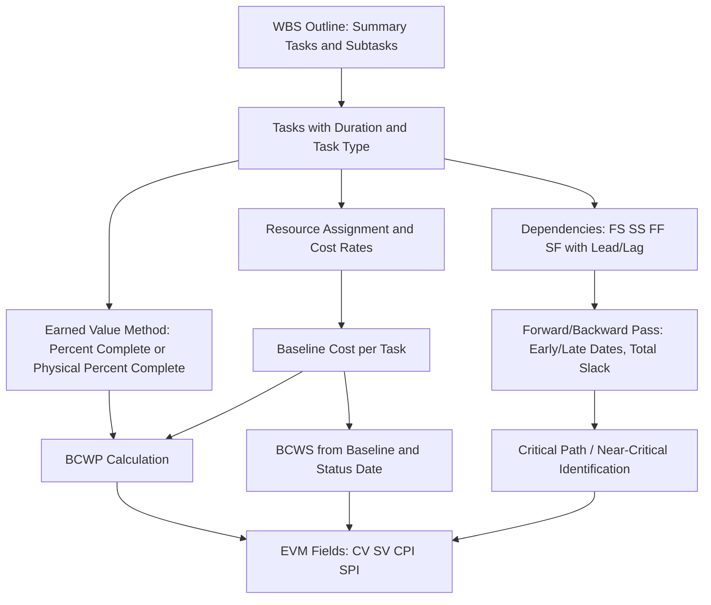

## Microsoft Project and Project Online

### Overview and Purpose

**Microsoft Project** is a widely used CPM scheduling tool available primarily in two forms: **Project Desktop/Standalone** (a Windows client application, historically "Project Professional" or "Project Standard") and **Project Online/Project for the Web** (cloud-based, subscription/enterprise offerings integrated with Microsoft 365 and Power Platform). **Project Online** specifically refers to Microsoft's enterprise project and portfolio management (PPM) cloud service, providing centralized schedule management, resource management, and portfolio-level reporting across an organization, roughly analogous in market position to Primavera's P6 EPPM offering. [Unverified: Microsoft's specific product naming and feature packaging (Project Online vs. Project for the Web vs. current "Planner"/Project branding) has changed across release cycles; verify current terminology against Microsoft's current documentation]

Microsoft Project is common in commercial, IT, and mid-sized construction/engineering contexts, while Primavera P6 remains more dominant in large-scale, EVMS-compliant defense, aerospace, and heavy construction programs — though both tools are used across industries and both can support EVMS-compliant scheduling when configured appropriately.

### Core Scheduling Concepts and Data Structure

**Key Points**

- **Project file structure**: A Microsoft Project schedule is organized around Tasks (the equivalent of P6's Activities), organized into a WBS-like outline hierarchy (summary tasks and subtasks), with Resources assigned to tasks and Calendars governing working time.
- **Task types**: Tasks can be configured as **Fixed Units**, **Fixed Work**, or **Fixed Duration**, governing how the scheduling engine recalculates the remaining two variables (duration, work, units/resource assignment) when one is changed — a foundational configuration choice that significantly affects how the schedule behaves under resource or scope changes.
- **Task dependencies (links)**: Microsoft Project supports the same four standard CPM relationship types as P6 — Finish-to-Start (FS), Start-to-Start (SS), Finish-to-Finish (FF), Start-to-Finish (SF) — with lead/lag time, calculated via the standard forward/backward pass to derive Early/Late dates and Total Slack (Microsoft Project's terminology for Total Float):

$$TotalSlack = LateFinish - EarlyFinish = LateStart - EarlyStart$$

- **Critical Path identification**: Microsoft Project's default "Critical" task flag is based on a configurable slack threshold (default is typically zero slack, but this is a user-adjustable setting), meaning — as noted under Near-Critical and Multiple Critical Paths — the default flag can misclassify tasks in schedules containing constraints or negative slack if the threshold setting is not deliberately verified.
- **Baselines**: Microsoft Project supports saving up to multiple numbered baselines (Baseline through Baseline 10 in desktop versions), against which Schedule Variance and EVM-related fields are calculated.

### Building and Managing a Schedule

**Key Points**

1. **Set up the project calendar and options**: Define working time, and critically, set the scheduling calculation mode (Automatic vs. Manual) and the default task type before significant schedule-building begins, since retroactively changing these can alter previously entered data's behavior.
2. **Build the WBS outline and enter tasks**: Create summary tasks and subtasks reflecting project scope decomposition, ideally coordinated with the cost/EVM WBS structure as discussed under Linking Schedule Activities to Cost Accounts.
3. **Establish dependencies**: Link tasks using the four standard relationship types; Microsoft Project by default often auto-schedules using Finish-to-Start unless explicitly changed, so schedulers must actively define more nuanced logic (SS, FF with appropriate lag) rather than relying on defaults.
4. **Assign resources**: Assign named resources or generic resource pools to tasks, enabling resource-driven cost calculation and resource-leveling analysis.
5. **Review and resolve constraint usage**: Similar to P6, minimize hard constraints (Must Start On, Must Finish On) in favor of flexible constraints (As Soon As Possible), reserving hard constraints for genuine external commitments.
6. **Set the baseline**: Save the validated schedule as Baseline (or a numbered baseline) once ready, establishing the reference against which future variance is measured.
7. **Track progress against the Status Date**: Enter Actual Start/Finish dates and % Complete or Physical % Complete values as of a defined status date, allowing the tool to recalculate remaining work and forward dates.

### Percent Complete Tracking and EVM Fields

**Key Points**

- **% Complete vs. Physical % Complete**: Microsoft Project distinguishes between **% Complete** (a duration-based calculation, similar to P6's Duration % Complete) and **Physical % Complete** (a manually entered, judgment- or milestone-based value) — for EVM-compliant tracking, Physical % Complete is generally the field that should be tied to the formally documented earned value technique, exactly analogous to the percent-complete-type distinction discussed under Primavera P6 Fundamentals.
- **Earned Value fields**: Microsoft Project natively provides Earned Value fields including **BCWS** (Budgeted Cost of Work Scheduled — Planned Value), **BCWP** (Budgeted Cost of Work Performed — Earned Value), **ACWP** (Actual Cost of Work Performed — Actual Cost), along with calculated **CV** (Cost Variance), **SV** (Schedule Variance), **CPI**, and **SPI** fields available in Earned Value tables and views.
- **Earned Value Method per task**: Within task-level options, Microsoft Project allows specifying whether a task's earned value is calculated using **% Complete** or **Physical % Complete**, directly determining which progress input drives the EVM calculation for that task.
- **Status date dependency**: All EVM field calculations in Microsoft Project are anchored to the defined Status Date, exactly analogous to P6's Data Date concept — an incorrectly set status date is a common source of EVM calculation errors in both tools.

### Project Online / Enterprise Features

**Key Points**

- **Enterprise Project Types and centralized templates**: Project Online supports standardized project templates and workflows across an organization, helping enforce consistent WBS/coding structures — directly supporting the schedule-cost coding consistency discussed under Schedule Cost Integration Challenges.
- **Resource Engagement and enterprise resource pools**: Enables organization-wide visibility into resource allocation and availability across multiple concurrent projects, supporting portfolio-level resource-constrained analysis beyond what a single standalone schedule file can show.
- **Portfolio-level reporting via Power BI integration**: Project Online is commonly paired with Power BI for enterprise dashboards, including EVM-related metrics rolled up across a program or portfolio of projects. [Unverified: specific current integration architecture and reporting templates depend on the organization's Microsoft 365/Power Platform licensing and configuration]
- **Governance and workflow features**: Project Online supports approval workflows for project initiation and stage-gate governance, which can be configured to align with formal baseline change control requirements needed for EVMS compliance, though — unlike P6, which has a longer track record in formally EVMS-validated defense/aerospace environments — organizations using Microsoft Project for EVMS-compliant work often need to build more custom governance and integration around the tool to meet ANSI/EIA-748 guideline requirements. [Inference] This relative positioning reflects general industry usage patterns rather than a documented, quantified comparison.

### Worked Example: Configuring a Task for EVM Tracking

A task "Complete Structural Analysis Report" is configured in Microsoft Project as follows:

| Field | Value |
| --- | --- |
| Task Type | Fixed Duration |
| Duration | 10 days |
| Predecessor | FS from "Gather Load Requirements" |
| Resource | 1x Structural Engineer (cost rate loaded) |
| Earned Value Method | Physical % Complete |
| Baseline Cost | $18,000 (reconciled to Control Account CA-205) |

At the Status Date, the engineer reports 60% Physical % Complete based on documented milestone criteria (e.g., "draft calculations complete" = 60% per the agreed weighted milestone schedule). Microsoft Project then calculates:

$$BCWP = 0.60 \times \$18{,}000 = \$10{,}800$$

which flows into the project's rolled-up Earned Value totals, exactly mirroring the mechanics demonstrated for P6 in the Primavera worked example, confirming that despite differing terminology (BCWP vs. Earned Value; Physical % Complete field placement), the underlying EVM calculation logic is consistent across both major scheduling tools.

### Mermaid Diagram: Microsoft Project EVM Data Flow

### SVG Illustration: Task Type Behavior Comparison

<svg xmlns="http://www.w3.org/2000/svg" viewBox="0 0 700 300">
<text x="350" y="25" text-anchor="middle" font-size="16" font-weight="bold" fill="#222">Task Type Effect on Recalculation (svg_diagram)</text>
<rect x="40" y="55" width="190" height="210" fill="#eaf2fb" stroke="#3498db" stroke-width="2" rx="6" />
<text x="135" y="80" text-anchor="middle" font-size="12" font-weight="bold" fill="#2c3e50">Fixed Units</text>
<text x="55" y="105" font-size="10" fill="#333">Units held constant</text>
<text x="55" y="125" font-size="10" fill="#333">Changing Work</text>
<text x="55" y="140" font-size="10" fill="#333">recalculates Duration</text>
<text x="55" y="165" font-size="10" fill="#333">Changing Duration</text>
<text x="55" y="180" font-size="10" fill="#333">recalculates Work</text>
<rect x="255" y="55" width="190" height="210" fill="#fdf2e9" stroke="#e67e22" stroke-width="2" rx="6" />
<text x="350" y="80" text-anchor="middle" font-size="12" font-weight="bold" fill="#2c3e50">Fixed Work</text>
<text x="270" y="105" font-size="10" fill="#333">Work held constant</text>
<text x="270" y="125" font-size="10" fill="#333">Adding Units</text>
<text x="270" y="140" font-size="10" fill="#333">shortens Duration</text>
<text x="270" y="165" font-size="10" fill="#333">Removing Units</text>
<text x="270" y="180" font-size="10" fill="#333">extends Duration</text>
<rect x="470" y="55" width="190" height="210" fill="#eafaf1" stroke="#27ae60" stroke-width="2" rx="6" />
<text x="565" y="80" text-anchor="middle" font-size="12" font-weight="bold" fill="#2c3e50">Fixed Duration</text>
<text x="485" y="105" font-size="10" fill="#333">Duration held constant</text>
<text x="485" y="125" font-size="10" fill="#333">Adding Units</text>
<text x="485" y="140" font-size="10" fill="#333">increases Work</text>
<text x="485" y="165" font-size="10" fill="#333">Common choice for</text>
<text x="485" y="180" font-size="10" fill="#333">EVM-tracked activities</text>
</svg>

### Common Pitfalls

- **Misunderstanding task type behavior**: Changing resource assignments or durations without understanding the active task type (Fixed Units/Work/Duration) produces unexpected recalculations that can silently distort the schedule, a frequent source of confusion for schedulers moving between tools or inexperienced with the setting's implications.
- **Relying on the default zero-slack critical flag without verification**: As with P6's default critical flag, assuming Microsoft Project's built-in "Critical" designation is reliable without checking the configured slack threshold, especially in schedules with hard constraints or negative slack.
- **Conflating % Complete with Physical % Complete for EVM purposes**: Using the default, duration-based % Complete field to drive Earned Value calculations when the formally documented earned value technique requires milestone- or judgment-based Physical % Complete produces EVM data inconsistent with the approved technique — directly echoing the "coarse earned value technique" and "informal progress reporting" pitfalls discussed under Common EVMS Compliance Pitfalls and Schedule Cost Integration Challenges.
- **Manual mode causing stale calculations**: If Manual (rather than Automatic) scheduling calculation mode is active, changes to predecessor tasks do not automatically ripple through the network until the scheduler explicitly recalculates, risking review or reporting against a stale critical path.
- **Inadequate enterprise governance in Project Online implementations for EVMS-compliant work**: Since Project Online's out-of-the-box governance is less purpose-built for formal EVMS validation than tools with a longer defense/aerospace track record, organizations pursuing EVMS compliance need to deliberately architect change control, coding structures, and audit trails rather than assuming default configurations satisfy ANSI/EIA-748 guidelines.

**Related Topics**

- Oracle Primavera P6 Fundamentals
- Near-Critical and Multiple Critical Paths
- Linking Schedule Activities to Cost Accounts
- DCMA 14-Point Schedule Health Assessment
- Schedule Cost Integration Challenges
- Common EVMS Compliance Pitfalls
- Resource Leveling and Resource-Constrained Scheduling
- Power BI and Enterprise EVM Portfolio Reporting