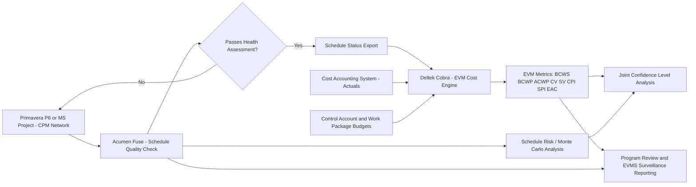

## Deltek Cobra and Acumen Fuse

### Overview and Purpose

**Deltek Cobra** and **Acumen Fuse** are two specialized software tools that operate alongside (rather than replace) primary CPM scheduling tools like Primavera P6 or Microsoft Project, each addressing a distinct gap in the integrated CPM/EVM toolchain. **Deltek Cobra** is a dedicated Earned Value Management and cost control engine, purpose-built for formal EVMS compliance and complex cost/budget calculations. **Acumen Fuse** (developed by Deltek, following its acquisition of the original Acumen product line) is a schedule and cost quality analytics tool, purpose-built for automated schedule health assessment, risk analysis, and metrics reporting across large or numerous schedules. [Unverified: current corporate ownership, product bundling, and branding for both tools may have changed since training data was compiled; verify current status against Deltek's official documentation]

Together, these tools illustrate a common enterprise pattern in EVMS-compliant environments: rather than relying on a single all-in-one platform, organizations often assemble a toolchain — a CPM scheduling engine (P6/MS Project) for the network, a dedicated EVM/cost engine (Cobra) for compliant cost calculation and reporting, and a schedule analytics tool (Fuse) for quality assurance and risk insight — integrated through data exchange rather than a single shared database.

### Deltek Cobra: Core Purpose and Architecture

**Key Points**

- **Dedicated EVM cost engine**: Cobra is built specifically to handle the complex cost accounting, resource rate application, and earned value calculation requirements of formal EVMS-compliant programs, offering more granular control over cost elements (labor categories, overhead pools, escalation rates, multiple rate tables) than typical CPM scheduling tools provide natively.
- **Control Account and Work Package management**: Cobra is structured explicitly around the WBS/OBS/Control Account/Work Package hierarchy central to ANSI/EIA-748 compliance, supporting formal budget baselining, Management Reserve tracking, and baseline change control as first-class features rather than adaptations of a general-purpose scheduling tool.
- **Multiple earned value technique support**: Cobra natively supports the full range of earned value techniques (0/100, 50/50, percent complete, weighted milestones, LOE, apportioned effort, Level of Effort variants) with configuration at the Work Package level, directly supporting the objective progress measurement requirements discussed under Common EVMS Compliance Pitfalls.
- **Schedule data import**: Cobra typically imports schedule status (dates, percent complete, remaining duration) from the CPM scheduling tool (P6 or Microsoft Project) rather than performing its own CPM network calculation, reinforcing its role as a cost/EVM specialist tool that depends on an external, authoritative schedule source — directly implicating the schedule-cost integration architecture discussed under Schedule Cost Integration Challenges.
- **EAC and variance reporting**: Cobra generates the full suite of standard EVM management reports (Cost Performance Reports, variance analysis reports, EAC calculations using multiple statistical formulas) formatted to support formal customer/EVMS surveillance reporting requirements.

### Acumen Fuse: Core Purpose and Architecture

**Key Points**

- **Automated schedule quality assessment**: Fuse is designed to rapidly assess CPM schedule quality against structural health metrics, essentially automating and extending the kind of analysis embodied in the DCMA 14-Point Assessment, across one or many schedules simultaneously.
- **Schedule risk and Monte Carlo analysis**: Fuse includes built-in schedule risk analysis capability, applying probability distributions to activity durations and running Monte Carlo simulation to generate confidence-level forecasts for project completion — supporting the same kind of analysis discussed under Schedule Risk Analysis and, when extended to cost, Joint Confidence Level Analysis.
- **Metrics dashboards and trend analysis**: Fuse generates configurable dashboards tracking schedule health metrics (logic quality, float distribution, constraint usage, critical path length index) over time across reporting periods, supporting the kind of ongoing, structural schedule discipline discussed under Integrated Master Schedule Development.
- **Cost and EVM metrics integration**: Beyond pure schedule health, Fuse can incorporate cost/EVM data (often imported from Cobra or another cost system) to produce combined cost-schedule performance dashboards, including CPI/SPI trending and variance threshold flagging.
- **Portfolio-level benchmarking**: A commonly cited use case is applying Fuse's automated metrics across a portfolio of many schedules simultaneously, enabling program management offices to rapidly identify which specific schedules exhibit the poorest structural health or highest risk exposure without manually reviewing each network individually. [Inference] This portfolio-benchmarking use case is a commonly cited application in industry literature but specific adoption patterns vary by organization.

### Comparison Table: Cobra vs. Fuse vs. Primary CPM Tools

| Aspect | Primavera P6 / MS Project | Deltek Cobra | Acumen Fuse |
| --- | --- | --- | --- |
| Primary function | CPM network scheduling | EVM cost engine and reporting | Schedule/cost quality analytics and risk |
| Computes critical path | Yes (native) | No (imports schedule status) | No (analyzes imported schedules) |
| Formal EVM cost calculations | Basic/native EVM fields | Comprehensive, EVMS-compliant | Reporting/dashboard layer, not primary calculation engine |
| Schedule health/DCMA-style checks | Manual or add-in | Not primary focus | Core purpose, automated |
| Monte Carlo risk simulation | Not native (requires add-in) | Not primary focus | Core capability |
| Typical role in toolchain | Source of truth for schedule/network | Source of truth for cost/EVM | Quality assurance and analytics layer |

### Typical Integrated Toolchain Workflow

**Key Points**

1. **Schedule development and maintenance in P6 or Microsoft Project**: The CPM network is built, maintained, and statused in the primary scheduling tool, as covered under Oracle Primavera P6 Fundamentals and Microsoft Project and Project Online.
2. **Schedule quality check in Acumen Fuse**: Before or alongside baselining, the schedule is imported into Fuse for automated structural health assessment, flagging logic gaps, excessive constraints, high-duration activities, and other DCMA-style issues for correction in the source scheduling tool.
3. **Cost/EVM calculation in Deltek Cobra**: Schedule status (dates, percent complete) is imported into Cobra, where it is combined with the formally maintained cost/budget structure (Control Accounts, Work Packages, resource rates) to calculate formal EVM metrics (BCWS/PV, BCWP/EV, ACWP/AC, CV, SV, CPI, SPI, EAC).
4. **Risk analysis in Acumen Fuse (or a dedicated risk tool)**: Schedule risk (and, where integrated, cost risk) analysis is run to support Joint Confidence Level Analysis or standalone Schedule Risk Analysis, informing Management Reserve and Schedule Margin sizing.
5. **Reporting rollup and surveillance support**: Outputs from Cobra (formal EVM reports) and Fuse (schedule health/risk dashboards) together support monthly program reviews and are the artifacts most commonly examined during EVMS Validation and Surveillance Reviews.

### Worked Example: A Toolchain-Level Finding

A program uses P6 for scheduling, Cobra for EVM, and Fuse for quality checks. During a monthly cycle:

- **Fuse flags** that 12% of activities in the current IMS have zero predecessors or successors (a logic gap), and that the schedule's Critical Path Length Index (CPLI) has declined from 0.98 to 0.89 over the past three months — a structural health warning.
- **Cobra reports** a CPI of 0.85 and SPI of 0.91 for the same period, with a generic variance narrative attached by the CAM.
- **Cross-referencing** the Fuse logic-gap finding against the specific Control Accounts showing the worst CPI in Cobra reveals that the majority of missing schedule logic clusters within exactly the Control Accounts driving the unfavorable cost variance — suggesting the CAMs managing those accounts may be updating schedule status informally (bypassing proper logic-driven date calculation) rather than through disciplined network-based scheduling, directly echoing the semantic/organizational misalignment pitfalls discussed under Schedule Cost Integration Challenges.

This kind of cross-tool correlation — schedule structural quality data from Fuse combined with cost/EVM performance data from Cobra — is a distinctive value proposition of maintaining a specialized toolchain rather than relying solely on a single scheduling tool's native, more limited EVM fields.

### Mermaid Diagram: Integrated CPM/EVM Toolchain

### SVG Illustration: Toolchain Roles and Data Flow

<svg xmlns="http://www.w3.org/2000/svg" viewBox="0 0 700 300">
<text x="350" y="25" text-anchor="middle" font-size="16" font-weight="bold" fill="#222">Specialized EVM Toolchain Roles (svg_diagram)</text>
<rect x="40" y="60" width="180" height="180" fill="#eaf2fb" stroke="#3498db" stroke-width="2" rx="6" />
<text x="130" y="85" text-anchor="middle" font-size="12" font-weight="bold" fill="#2c3e50">P6 / MS Project</text>
<text x="55" y="110" font-size="10" fill="#333">CPM network</text>
<text x="55" y="128" font-size="10" fill="#333">Critical path calc</text>
<text x="55" y="146" font-size="10" fill="#333">Activity logic</text>
<text x="55" y="164" font-size="10" fill="#333">Resource loading</text>
<line x1="220" y1="150" x2="260" y2="150" stroke="#666" stroke-width="2" marker-end="url(#arrow)" />
<rect x="260" y="60" width="180" height="180" fill="#fdf2e9" stroke="#e67e22" stroke-width="2" rx="6" />
<text x="350" y="85" text-anchor="middle" font-size="12" font-weight="bold" fill="#2c3e50">Deltek Cobra</text>
<text x="275" y="110" font-size="10" fill="#333">EVM cost engine</text>
<text x="275" y="128" font-size="10" fill="#333">Control Accounts</text>
<text x="275" y="146" font-size="10" fill="#333">CV SV CPI SPI EAC</text>
<text x="275" y="164" font-size="10" fill="#333">Formal EVM reports</text>
<line x1="130" y1="240" x2="130" y2="260" stroke="#666" stroke-width="2" />
<line x1="130" y1="260" x2="480" y2="260" stroke="#666" stroke-width="2" />
<line x1="480" y1="260" x2="480" y2="240" stroke="#666" stroke-width="2" marker-end="url(#arrow)" />
<rect x="480" y="60" width="180" height="180" fill="#eafaf1" stroke="#27ae60" stroke-width="2" rx="6" />
<text x="570" y="85" text-anchor="middle" font-size="12" font-weight="bold" fill="#2c3e50">Acumen Fuse</text>
<text x="495" y="110" font-size="10" fill="#333">Schedule health check</text>
<text x="495" y="128" font-size="10" fill="#333">DCMA-style metrics</text>
<text x="495" y="146" font-size="10" fill="#333">Monte Carlo risk</text>
<text x="495" y="164" font-size="10" fill="#333">Dashboards/trends</text>
</svg>

### Common Pitfalls

- **Data synchronization lag between tools**: Because Cobra and Fuse typically import (rather than natively generate) schedule data, delays or errors in the import/export cycle between P6/MS Project and these downstream tools reproduce the same temporal misalignment risks discussed under Schedule Cost Integration Challenges, now compounded across a three-tool chain.
- **Treating Fuse's automated health scores as a substitute for scheduler judgment**: Automated metrics flag structural symptoms (logic gaps, excessive constraints) but don't replace the scheduler's understanding of genuine project logic; over-reliance on automated scoring without expert review can miss context-dependent issues or trigger unnecessary rework of legitimately justified schedule structures.
- **Configuring Cobra's earned value techniques inconsistently with the schedule's percent-complete methodology**: If the CPM tool's percent-complete tracking and Cobra's configured earned value technique for a given Work Package aren't aligned, imported schedule status can be misinterpreted by Cobra's EVM calculation engine, producing inaccurate EVM figures despite both tools individually functioning correctly.
- **Underinvesting in toolchain integration governance**: Assuming that owning multiple specialized tools automatically produces integrated, reliable EVM data, when in practice the data governance, mapping, and reconciliation discipline connecting the tools is what actually determines data quality — the tools themselves are necessary but not sufficient.
- **License and licensing complexity underestimation**: Multi-tool EVMS toolchains involve separate licensing, administration, and training requirements for each tool, which organizations sometimes underestimate when planning for EVMS compliance infrastructure, potentially leading to inconsistent tool adoption across CAMs and schedulers. [Inference] This is a commonly cited organizational challenge in EVMS implementation literature rather than a tool-specific technical limitation.

**Related Topics**

- Oracle Primavera P6 Fundamentals
- Microsoft Project and Project Online
- EVMS Validation and Surveillance Reviews
- DCMA 14-Point Schedule Health Assessment
- Schedule Risk Analysis and Monte Carlo Simulation
- Joint Confidence Level Analysis
- Schedule Cost Integration Challenges
- Common EVMS Compliance Pitfalls