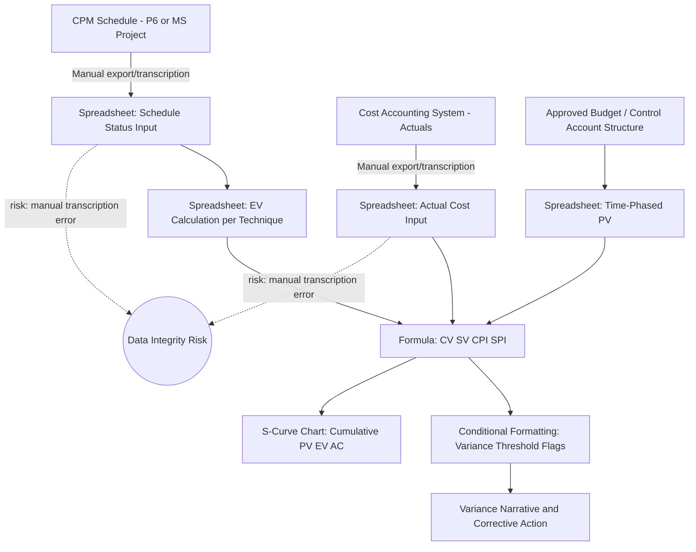

## Spreadsheet-Based EVM Tracking

### Overview and Purpose

**Spreadsheet-based EVM tracking** refers to implementing Earned Value Management calculations, reporting, and variance analysis using general-purpose spreadsheet software (most commonly Microsoft Excel) rather than a dedicated EVM engine (Deltek Cobra) or the native EVM fields within a CPM scheduling tool (Primavera P6, Microsoft Project). This approach remains widespread, particularly among smaller programs, organizations not subject to formal EVMS validation requirements, internal/informal project tracking, and as a supplementary analysis and reporting layer even alongside dedicated EVM software on larger programs.

Spreadsheet-based EVM is not inherently non-compliant with ANSI/EIA-748 — the standard specifies required processes and data characteristics, not a mandated software platform — but achieving and sustaining formal EVMS compliance using spreadsheets requires significantly more manual discipline, since spreadsheets lack the built-in structural safeguards (Control Account hierarchy enforcement, baseline change control, audit trails) that dedicated EVM software provides natively.

### Core EVM Calculations Implementable in a Spreadsheet

**Key Points**

- **Foundational EVM metrics**: The three core EVM data points — Planned Value (PV/BCWS), Earned Value (EV/BCWP), and Actual Cost (AC/ACWP) — can be tracked in a spreadsheet as time-phased rows/columns per Work Package or Control Account, with standard variance and index formulas applied directly:

$$CV = EV - AC \qquad SV = EV - PV \qquad CPI = \frac{EV}{AC} \qquad SPI = \frac{EV}{PV}$$

- **Estimate at Completion (EAC) formulas**: Multiple statistically accepted EAC formulas can be implemented as spreadsheet formulas, referencing cumulative EV, AC, and BAC (Budget at Completion) cells:

$$EAC_{CPI} = AC + \frac{BAC - EV}{CPI} \qquad EAC_{CPI \times SPI} = AC + \frac{BAC - EV}{CPI \times SPI} \qquad EAC_{new\ estimate} = AC + ETC_{bottom-up}$$

- **To-Complete Performance Index (TCPI)**: Calculable directly from BAC, EV, and AC (or a revised EAC), supporting the recovery-feasibility analysis discussed under What-If Scenario Analysis:

$$TCPI_{BAC} = \frac{BAC - EV}{BAC - AC} \qquad TCPI_{EAC} = \frac{BAC - EV}{EAC - AC}$$

- **Variance threshold flagging**: Conditional formatting or formula-driven flags (e.g., highlighting any Control Account with CPI or SPI below a defined threshold, such as 0.90) can automate the identification of accounts requiring formal variance narratives, mirroring a core function of dedicated EVM software.

### Typical Spreadsheet EVM Structure

**Key Points**

- **Control Account/Work Package rows**: Each row (or block of rows) typically represents one Control Account or Work Package, with columns for budget, time-phased PV, cumulative EV and AC, and calculated variance/index fields.
- **Time-phased columns**: Columns typically represent reporting periods (weeks or months), allowing both period and cumulative-to-date EVM calculations — cumulative-to-date is generally the standard for formal CPI/SPI reporting, since period-only figures can be noisy and less representative of overall trend.
- **Summary/rollup tabs**: A master or summary tab aggregates all Control Account-level data into project-level EVM totals, typically using SUM or SUMIF-style formulas referencing the detail tabs.
- **Manual schedule status linkage**: Because spreadsheets don't natively compute a CPM network, schedule-derived Planned Value time-phasing and Physical % Complete inputs must be manually transcribed from the CPM scheduling tool (P6 or Microsoft Project) into the spreadsheet — this manual transcription step is the single greatest structural risk point in spreadsheet-based EVM, directly reproducing (and often amplifying) the tool-integration and temporal-misalignment challenges discussed under Schedule Cost Integration Challenges.
- **Chart-based S-curve reporting**: Spreadsheet EVM implementations commonly generate cumulative PV/EV/AC "S-curve" line charts, a standard and effective visualization for communicating program trend to stakeholders regardless of the underlying calculation platform.

### Worked Example: A Simple Spreadsheet EVM Tracker

| Period | PV (cumulative) | EV (cumulative) | AC (cumulative) | CV | SV | CPI | SPI |
| --- | --- | --- | --- | --- | --- | --- | --- |
| Month 1 | $50,000 | $48,000 | $52,000 | -$4,000 | -$2,000 | 0.923 | 0.960 |
| Month 2 | $110,000 | $102,000 | $115,000 | -$13,000 | -$8,000 | 0.887 | 0.927 |
| Month 3 | $180,000 | $160,000 | $190,000 | -$30,000 | -$20,000 | 0.842 | 0.889 |

Each cell in the CV, SV, CPI, and SPI columns is a formula referencing the corresponding PV/EV/AC cells (e.g., `=D3-C3` for CV at Month 3, where columns are arranged EV, AC, PV accordingly). The declining CPI trend across three months (0.923 → 0.887 → 0.842) is immediately visible and would typically trigger the kind of structural divergence analysis discussed under Over Target Baseline and Over Target Schedule if the trend continues, illustrating that even a simple spreadsheet can surface the same early-warning signal a dedicated EVM tool would.

### Mermaid Diagram: Spreadsheet EVM Data Flow and Risk Points

### SVG Illustration: EVM S-Curve Chart Concept

<svg xmlns="http://www.w3.org/2000/svg" viewBox="0 0 700 300">
<text x="350" y="25" text-anchor="middle" font-size="16" font-weight="bold" fill="#222">Cumulative PV/EV/AC S-Curve (svg_diagram)</text>
<line x1="80" y1="260" x2="650" y2="260" stroke="#333" stroke-width="2" />
<line x1="80" y1="40" x2="80" y2="260" stroke="#333" stroke-width="2" />
<text x="30" y="150" font-size="11" fill="#333" transform="rotate(-90 30 150)">Cumulative $</text>
<text x="360" y="285" text-anchor="middle" font-size="11">Reporting Period</text>
<polyline points="80,240 200,190 320,130 440,80 560,50" fill="none" stroke="#3498db" stroke-width="3" />
<text x="565" y="45" font-size="10" fill="#3498db">PV (Planned)</text>
<polyline points="80,245 200,205 320,160 440,125 560,105" fill="none" stroke="#27ae60" stroke-width="3" />
<text x="565" y="100" font-size="10" fill="#27ae60">EV (Earned)</text>
<polyline points="80,242 200,195 320,140 440,95 560,60" fill="none" stroke="#e74c3c" stroke-width="3" stroke-dasharray="5,3" />
<text x="565" y="60" font-size="10" fill="#e74c3c">AC (Actual)</text>

<text x="90" y="55" font-size="10" fill="#666">Gap between EV and PV = SV</text>

<text x="90" y="70" font-size="10" fill="#666">Gap between EV and AC = CV</text>

</svg>

### When Spreadsheet-Based EVM Is Appropriate

**Key Points**

- **Small programs or internal tracking without formal EVMS validation requirements**: Where the overhead of dedicated EVM software licensing and administration isn't justified by program size or contractual requirements, spreadsheets can provide adequate rigor if disciplined manual processes are followed.
- **Supplementary analysis layer even with dedicated tools**: Program analysts commonly export data from Cobra, P6, or Microsoft Project into spreadsheets for ad hoc analysis, custom visualization, or specific stakeholder-requested cuts of the data not natively supported by the primary tool's standard reports.
- **Pilot or transitional implementations**: Organizations building EVM discipline before investing in dedicated software sometimes start with spreadsheet-based tracking to establish processes, terminology, and reporting habits before a larger tooling investment.
- **Not generally appropriate for large, formally validated EVMS programs at scale**: As Control Account counts grow into the hundreds or thousands, and formal change control/audit trail requirements intensify, the manual, error-prone nature of spreadsheet-based tracking becomes a significant compliance and data-integrity risk, which is why large defense/aerospace programs overwhelmingly favor dedicated tools like Cobra.

### Common Pitfalls

- **Manual transcription errors between schedule, cost, and spreadsheet**: The single most significant structural risk — since PV time-phasing and Physical % Complete data must be manually re-entered from the CPM tool, and Actual Cost data manually re-entered from the accounting system, each transcription step introduces error and timing-lag risk absent in integrated toolchains.
- **Formula errors propagating silently**: A single incorrect cell reference or formula (e.g., referencing the wrong period's PV in a CPI calculation) can silently corrupt an entire variance trend without any built-in validation to catch it, unlike dedicated EVM software with more rigorous internal data validation.
- **No formal baseline change control mechanism**: Spreadsheets have no native mechanism preventing retroactive editing of prior-period actuals or baseline figures, making them structurally vulnerable to exactly the kind of unauthorized retroactive baseline change that constitutes a serious ANSI/EIA-748 guideline violation — version control and access permissions must be manually and rigorously enforced as a substitute.
- **Inconsistent earned value technique application across analysts**: Without software-enforced technique assignment per Work Package, different analysts maintaining different tabs or sections of a spreadsheet EVM tracker may apply inconsistent judgment in calculating percent complete, undermining data comparability across Control Accounts.
- **Scalability breakdown as program size grows**: Spreadsheet-based EVM that worked adequately for a small program often breaks down — becoming slow, error-prone, and difficult to audit — as Control Account counts and reporting period history accumulate, frequently forcing a disruptive mid-program transition to dedicated software under time pressure.
- **Lack of audit trail for surveillance purposes**: Formal EVMS surveillance reviews specifically look for traceable, auditable revision history; spreadsheets without rigorous version control (e.g., saved snapshots per reporting period, change logs) cannot easily demonstrate this, a significant vulnerability if the organization is or becomes subject to formal EVMS validation and surveillance reviews.

**Related Topics**

- Deltek Cobra and Acumen Fuse
- Common EVMS Compliance Pitfalls
- Schedule Cost Integration Challenges
- EVMS Validation and Surveillance Reviews
- Estimate at Completion (EAC) Forecasting Methods
- Linking Schedule Activities to Cost Accounts
- Over Target Baseline and Over Target Schedule
- Baseline Change Control and Configuration Management