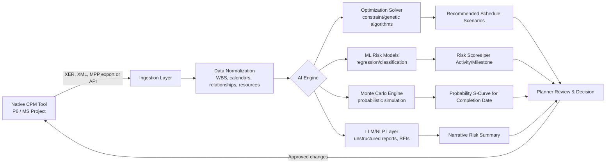

## AI-Driven Schedule Optimization and Risk Forecasting Platforms

### Overview

AI-driven schedule optimization and risk forecasting platforms apply machine learning (ML), probabilistic simulation, and optimization algorithms to project schedule data (typically CPM networks) to (1) automatically generate or improve schedules, (2) predict the probability of delay or cost overrun, and (3) recommend corrective actions. These platforms sit on top of or alongside traditional CPM/EVM tools (Primavera P6, MS Project) rather than replacing the underlying network logic — they consume schedule and progress data via APIs or file imports (XER, XML, MPP) and layer analytics on top.

### Core Capabilities

**Key Points**

- **Automated schedule generation/optimization**: Uses constraint-based solvers or genetic algorithms to sequence activities given resource, logic, and calendar constraints, searching for near-optimal duration/cost/resource trade-offs faster than manual what-if analysis.
- **Delay risk prediction**: Trains classification/regression models on historical project data (similar activities, weather, contractor performance) to forecast probability of an activity or milestone slipping.
- **Anomaly and logic-error detection**: Flags missing predecessors/successors, out-of-sequence progress, excessive constraints, negative float, and other DCMA 14-point-style violations automatically, at scale, across large programs.
- **Natural-language querying and reporting**: Many platforms embed large language models (LLMs) to let planners ask questions like "which activities are most likely to drive delay next month?" and receive narrative summaries drawn from underlying schedule/EVM data.
- **EVM-integrated forecasting**: Combines EVM indices (CPI, SPI, TCPI) with ML-based trend extrapolation to produce more dynamic EAC/ETC forecasts than static formulas.

### Underlying Techniques

**Monte Carlo Simulation (statistical baseline for AI layers)**

Most "AI risk forecasting" features still rely on Monte Carlo simulation as the statistical backbone, with ML added to improve input distributions or interpret outputs.

For an activity with three-point estimates (optimistic $O$, most likely $M$, pessimistic $P$), the PERT-Beta expected duration is:

$$T_E = \frac{O + 4M + P}{6}$$

and standard deviation:

$$\sigma = \frac{P - O}{6}$$

Running thousands of iterations across the network (varying durations per their distributions and recalculating the critical path each time) produces a probability distribution of project completion dates — the basis of a schedule risk analysis (SRA) "S-curve."

**Machine Learning Layers**

- **Regression models** (e.g., gradient boosting, random forests) trained on historical activity data to predict actual duration given planned duration, crew size, weather, and location.
- **Classification models** to flag "at-risk" activities (binary: will slip / will not slip) using features like float consumption rate, percent-complete lag, and resource loading.
- **NLP/LLM layers** to parse unstructured data — daily reports, RFIs, meeting minutes, submittal logs — and correlate qualitative risk signals ("awaiting permit," "subcontractor understaffed") with schedule impact.
- **Reinforcement learning (emerging)**: [Inference] Some vendors are exploring RL agents that iteratively resequence activities to optimize an objective function (cost, duration, resource leveling) subject to constraints, though this remains less mature and less transparently documented than supervised ML approaches in most commercial tools.

### Representative Platform Landscape

[Unverified] Specific feature sets and market positioning below reflect publicly available vendor material as of recent search; exact capabilities change frequently as vendors iterate, so verify against current documentation before procurement decisions.

Searched the webAI schedule risk forecasting construction software 2026 Primavera P6 integration

Based on current vendor landscape, representative platform categories:

| Category | Example(s) | Primary Function |
| --- | --- | --- |
| Schedule optimization | ALICE Technologies (ALICE Optimize/Core) | Ingests schedules from P6/OPC in XER, XML, XLSX, or CSV, then simulates scenarios against defined goals — Targeted Optimization for acceleration, Resource Optimization for resource-constrained analysis — generating risk-reduced solutions plotted on time-vs-cost curves |
| Historical-data risk forecasting | nPlan | [Unverified — not directly retrieved in this search] Commonly cited in industry coverage as a schedule-risk analytics vendor trained on large historical schedule datasets to forecast delay probability; verify current capabilities directly with vendor |
| LLM-powered portfolio risk scoring | ProjAI.io | Connects to Procore, MS Project, and Primavera P6, applying LLM-powered analytics to surface predictive risk scores, schedule health, and portfolio insights, positioned as a plugin layer rather than a scheduler replacement, flagging slipping milestones, budget overruns, and weather exposure, with continuous checks on critical path, float consumption, and logic anomalies |
| Native vendor AI extensions | Oracle Primavera P6 (2026 roadmap) | [Unverified — vendor marketing/early-access material] A natural-language interface allowing schedule queries and modification in plain language (e.g., impact of a fabrication delay on critical path), plus pattern recognition on WBS structures to suggest dependencies and calendars based on similar past projects. A "Predictive Performance Analytics" engine trained on large volumes of historical project activities is described as forecasting schedule slippage, cost overrun, or resource conflict several weeks ahead. An early-access customer reportedly cited roughly a 40% reduction in initial schedule development time [Unverified — single vendor-supplied testimonial]. |
| Live progress + BIM tracking | Buildots | [Unverified — not directly retrieved] Commonly cited alongside ALICE/nPlan for camera-based live progress capture feeding back into schedule risk models |

A common combination on large capital projects pairs ALICE for preconstruction optimization, a risk-forecasting tool for ongoing delay prediction, and a progress-tracking tool for live field data — these tools tend to complement rather than duplicate each other, since they address different project lifecycle stages. [Found On AI](https://foundonai.com/ai-tools-construction-scheduling-planning/)[Found On AI](https://foundonai.com/ai-tools-construction-scheduling-planning/)

### Typical Data Pipeline / Architecture Pattern

### Integration Methods

**Key Points**

- **File-based**: Export/import via XER (P6 native), MPP (MS Project), or generic XML/CSV — simplest but batch-oriented, not real-time.
- **API-based**: REST APIs (P6 EPPM web services, MS Project Online API) enabling near-real-time sync; preferred for continuous risk monitoring.
- **Browser extension overlay**: [Unverified — vendor-specific] Some platforms inject risk overlays directly into web-based scheduler UIs (e.g., a lightweight browser extension overlaying risk scores and AI insights directly inside Procore, Smartsheet, or browser-based schedulers) rather than requiring data export. [Projai](https://www.projai.io/)
- **BIM/4D linkage**: Some solutions pull information directly from a P6 schedule, or for more complex projects, via a 3D building model, linking spatial sequencing to schedule logic. [Alicetechnologies](https://blog.alicetechnologies.com/news/how-ai-can-get-the-most-from-a-p6-schedule)

### Worked Example: Risk-Adjusted Forecast Calculation

Consider a milestone with a deterministic CPM finish date of Day 180. An ML risk model, trained on historical similar activities, outputs the following delay-probability distribution instead of a single date:

| Scenario | Probability | Delay (days) |
| --- | --- | --- |
| No delay | 40% | 0 |
| Minor delay (weather/logistics) | 35% | +7 |
| Moderate delay (subcontractor issue) | 20% | +21 |
| Major delay (permit/design change) | 5% | +45 |

Expected delay (probability-weighted):

$$E[\text{delay}] = (0.40)(0) + (0.35)(7) + (0.20)(21) + (0.05)(45) = 0 + 2.45 + 4.2 + 2.25 = 8.9 \text{ days}$$

Risk-adjusted forecast finish:

$$\text{Forecast Finish} = \text{Day } 180 + 8.9 \approx \text{Day } 189$$

This probabilistic output (rather than a single deterministic date) is the core value proposition distinguishing AI/ML forecasting from classical CPM float calculation — it quantifies confidence rather than asserting certainty. [Inference] Actual vendor implementations typically layer many more features (weather APIs, subcontractor historical performance, resource loading) into the model beyond this simplified illustration.

### EVM Integration Pattern

AI layers commonly enhance classical EVM forecasting formulas by replacing static assumptions with learned trend coefficients.

Classical EAC (assuming current CPI trend continues):

$$EAC = \frac{BAC}{CPI}$$

AI-enhanced variant applies a learned correction factor $\hat{\beta}$ derived from regression against similar historical projects:

$$EAC_{AI} = \frac{BAC}{CPI} \times \hat{\beta}$$

where $\hat{\beta}$ adjusts for systematic patterns the model has detected (e.g., cost performance tends to further erode in the final 10% of similar projects). [Inference] This is a generalized pattern description; exact model formulations are proprietary and vary by vendor — treat this as illustrative of the underlying logic rather than a specific product's formula.

### Risk Register Automation (SVG Diagram)

<svg xmlns="http://www.w3.org/2000/svg" viewBox="0 0 760 320" font-family="Arial, sans-serif">
<text x="380" y="24" text-anchor="middle" font-size="16" font-weight="bold">AI Risk Scoring Pipeline (svg_diagram)</text>
<rect x="20" y="60" width="150" height="60" rx="8" fill="#dbeafe" stroke="#2563eb" />
<text x="95" y="85" text-anchor="middle" font-size="12">Schedule Data</text>
<text x="95" y="102" text-anchor="middle" font-size="10">(activities, logic,</text>
<text x="95" y="114" text-anchor="middle" font-size="10">float, % complete)</text>
<rect x="220" y="60" width="150" height="60" rx="8" fill="#dbeafe" stroke="#2563eb" />
<text x="295" y="85" text-anchor="middle" font-size="12">Field/Report Data</text>
<text x="295" y="102" text-anchor="middle" font-size="10">(daily logs, RFIs,</text>
<text x="295" y="114" text-anchor="middle" font-size="10">weather, submittals)</text>
<rect x="420" y="90" width="160" height="60" rx="8" fill="#fef3c7" stroke="#d97706" />
<text x="500" y="115" text-anchor="middle" font-size="12" font-weight="bold">ML Risk Model</text>
<text x="500" y="132" text-anchor="middle" font-size="10">(classification/regression)</text>
<rect x="620" y="60" width="120" height="50" rx="8" fill="#dcfce7" stroke="#16a34a" />
<text x="680" y="88" text-anchor="middle" font-size="11">High Risk</text>
<text x="680" y="101" text-anchor="middle" font-size="9">(escalate)</text>
<rect x="620" y="120" width="120" height="50" rx="8" fill="#dcfce7" stroke="#16a34a" />
<text x="680" y="148" text-anchor="middle" font-size="11">Low Risk</text>
<text x="680" y="161" text-anchor="middle" font-size="9">(monitor)</text>
<line x1="170" y1="90" x2="420" y2="115" stroke="#333" stroke-width="1.5" marker-end="url(#arrow)" />
<line x1="370" y1="90" x2="420" y2="115" stroke="#333" stroke-width="1.5" marker-end="url(#arrow)" />
<line x1="580" y1="105" x2="620" y2="85" stroke="#333" stroke-width="1.5" marker-end="url(#arrow)" />
<line x1="580" y1="125" x2="620" y2="145" stroke="#333" stroke-width="1.5" marker-end="url(#arrow)" />
<rect x="20" y="220" width="720" height="80" rx="8" fill="#f3f4f6" stroke="#9ca3af" />
<text x="30" y="240" font-size="11" font-weight="bold">Output feeds back to:</text>
<text x="30" y="258" font-size="10">• Automated risk register entries (probability × impact scoring)</text>
<text x="30" y="274" font-size="10">• EVM forecast adjustment (EAC/ETC correction factors)</text>
<text x="30" y="290" font-size="10">• Planner dashboard alerts and recommended mitigation actions</text>
</svg>

### Common Anomaly/Logic-Error Detection Rules (Automated)

**Key Points**

- Missing predecessor or successor logic (open ends)
- Excessive use of hard constraints (Must Finish On, Mandatory Start) overriding network logic
- Negative float (indicates schedule already behind imposed deadline)
- High-float activities near-critical without contingency review
- Out-of-sequence progress (actual progress recorded before logical predecessor completion)
- Excessive activity durations relative to typical benchmarks for that activity type
- Relationship type misuse (over-reliance on Finish-to-Finish/Start-to-Start where Finish-to-Start is standard)

[Inference] These map closely to established manual audit frameworks such as the DCMA 14-point assessment; AI platforms typically automate and scale this checklist across large multi-project portfolios rather than introducing fundamentally new criteria.

### Limitations and Practical Considerations

**Key Points**

- **Data quality dependency**: Model outputs are only as reliable as the historical data used for training; sparse or non-representative historical datasets reduce forecast accuracy. Behavior may vary by organization's data maturity.
- **Explainability**: ML-driven risk scores can be difficult to audit or justify to stakeholders/owners compared to transparent CPM float calculations; some platforms now include explainability layers, but this varies by vendor.
- **Change management/adoption**: Schedulers accustomed to manual P6 workflows may resist AI-recommended resequencing, particularly on contractually binding baselines.
- **Contractual and audit implications**: Recommended schedule changes must still pass through change-control and claims-defensible documentation processes; AI recommendations are not, by themselves, contractually binding logic.
- **Vendor lock-in and data portability**: Integration typically requires exporting proprietary schedule data to third-party cloud platforms, raising data governance considerations for public-sector or classified programs.

### Practical Example: Applying AI Risk Forecasting in a Public-Sector LGU Context

For a government infrastructure or IT project (e.g., a document management system rollout with phased go-live milestones):

1. Baseline CPM schedule exported from P6 or MS Project via XER/XML.
2. Historical data from prior LGU projects (permitting delays, procurement lead times) used to train or calibrate a risk model, if sufficient historical volume exists.
3. AI/ML layer flags procurement-dependent milestones as elevated risk given historically slow government procurement cycles.
4. Risk-adjusted forecast presented to steering committee alongside deterministic CPM date, supporting contingency planning and reserve allocation.
5. [Inference] For smaller public-sector projects without a large historical dataset, Monte Carlo simulation using expert three-point estimates is likely a more practical near-term approach than full ML model training, since ML models generally require substantial historical data volume to generalize reliably.

### Related Topics

- Monte Carlo simulation methods for schedule risk analysis (SRA)
- DCMA 14-point schedule quality assessment
- Earned Schedule (ES) as an alternative to traditional EVM time metrics
- 4D BIM scheduling integration
- Resource leveling and constraint-based optimization algorithms
- Explainable AI (XAI) in project controls decision support
- Data governance and API security for cloud-based schedule analytics platforms