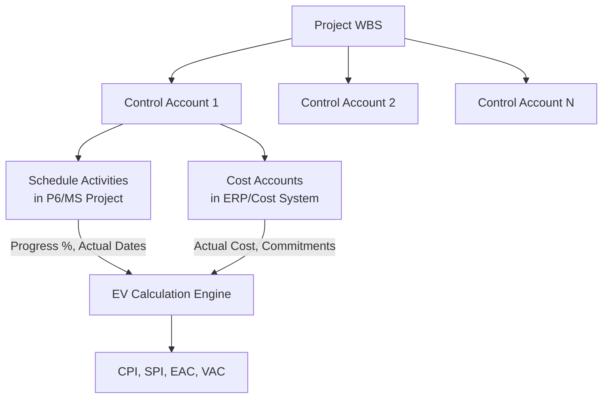
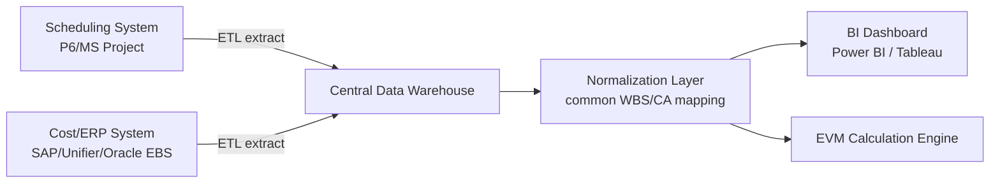

## Data Integration Between Scheduling and Cost Systems

### Overview

Data integration between scheduling and cost systems is the process of linking time-phased schedule data (activities, durations, logic, progress) from a CPM tool (e.g., Primavera P6, MS Project) with cost data (budgets, actuals, commitments) from a cost/ERP system (e.g., Primavera Unifier, SAP, Oracle EBS, or standalone cost-control spreadsheets) so that Earned Value Management (EVM) metrics can be calculated consistently. Without this integration, schedule progress and cost data live in silos, making it impossible to produce accurate CPI, SPI, or EAC figures.

### Why Integration Is Necessary for EVM

**Key Points**

- EVM requires three synchronized data streams: Planned Value (PV) from the schedule/budget baseline, Actual Cost (AC) from the accounting/cost system, and Earned Value (EV) from physical progress measurement.
- If schedule activities and cost accounts use different coding structures, EV cannot be reliably mapped to AC, breaking the CPI/SPI calculation chain.
- Manual reconciliation (spreadsheet-based) between disconnected systems is time-consuming and error-prone, especially on large programs with thousands of activities.

### The Common Coding Structure: Control Accounts and WBS Alignment

The foundational integration mechanism is a shared Work Breakdown Structure (WBS) or Control Account (CA) structure that both the schedule and cost systems reference.

Each Control Account (CA) is the point where schedule activities and cost accounts intersect — it is the lowest level at which EV, PV, and AC are formally measured and reported, per standard EVM System (EVMS) guidelines such as ANSI/EIA-748.

### Integration Architectures

**1. File-Based Batch Integration**

Periodic (typically weekly or monthly) export/import cycles using standard file formats.

| Format | Source System | Typical Use |
| --- | --- | --- |
| XER | Primavera P6 | Full project schedule export including WBS, activities, relationships, resources |
| MPP | MS Project | Native MS Project file interchange |
| XML | P6, MS Project | Structured schedule data, often used for cross-tool import |
| CSV | Generic | Simple activity ID/cost code mapping tables |

Batch integration is straightforward to implement but introduces latency — cost and schedule data may be out of sync between update cycles, which can distort EVM metrics during the reporting period.

**2. API-Based Real-Time/Near-Real-Time Integration**

Modern platforms expose REST APIs enabling continuous or on-demand synchronization.

- **Primavera P6 EPPM Web Services / P6 REST API**: Allows external systems to read/write activity data, progress updates, and WBS structures programmatically.
- **Primavera Unifier ↔ P6 integration**: A commonly cited native integration pattern where cost codes in Unifier are tied to the cost breakdown structure and WBS in P6, allowing budget and forecast data to flow bidirectionally — Unifier's cash flow curve is fed by both its own cost sheet and the P6 schedule for continuous cash flow visibility.
- **Middleware/ETL layers**: Custom or off-the-shelf integration platforms (e.g., MuleSoft, Boomi, or custom scripts) that transform and route data between systems with incompatible native APIs.

**3. Data Warehouse / BI Layer Integration**

For portfolio-level reporting, both schedule and cost data are extracted into a central data warehouse, normalized against a common WBS/CA taxonomy, and surfaced via BI dashboards (Power BI, Tableau) rather than integrating the source systems directly with each other.

### Key Data Elements That Must Map Consistently

**Key Points**

- **Activity ID ↔ Cost Account Code**: Every schedule activity must map to exactly one (or a clearly defined subset of) cost account(s) to avoid double-counting or gaps in EV calculation.
- **Baseline dates ↔ Budgeted cost phasing**: The time-phased budget (PV curve) must derive from the same baseline schedule dates used for progress measurement.
- **Percent complete methodology**: Schedule percent-complete (often duration-based) must align with, or be reconciled against, the cost system's earned value method (0/100, 50/50, units complete, milestone weighting) — these are not always the same number, and mismatches are a common source of EVM distortion.
- **Currency, calendars, and units**: Multi-currency or multi-calendar programs require normalization before aggregation.

### Worked Example: PV/EV/AC Reconciliation Across Systems

Consider a Control Account with a Budget at Completion (BAC) of $500,000, scheduled evenly over 10 months ($50,000/month planned).

At the end of Month 4:

- **Schedule system** reports the activity as 45% complete (duration-based progress).
- **Cost system** reports Actual Cost incurred of $210,000.

$$PV = \frac{4}{10} \times BAC = \frac{4}{10} \times 500{,}000 = \$200{,}000$$

$$EV = 0.45 \times BAC = 0.45 \times 500{,}000 = \$225{,}000$$

$$AC = \$210{,}000 \text{ (from cost system)}$$

Resulting indices:

$$SPI = \frac{EV}{PV} = \frac{225{,}000}{200{,}000} = 1.125 \quad \text{(ahead of schedule)}$$

$$CPI = \frac{EV}{AC} = \frac{225{,}000}{210{,}000} \approx 1.071 \quad \text{(under budget)}$$

This calculation is only valid if the 45% figure from the schedule system and the $210,000 figure from the cost system both refer to the *same* Control Account scope and reporting cutoff date — a mismatch in cutoff dates between the two source systems (a common integration failure point) would silently corrupt both indices.

### Common Integration Challenges

**Key Points**

- **Cutoff date misalignment**: Schedule status dates and cost system accounting periods often close on different calendars (e.g., schedule updated weekly, cost system closes monthly), requiring interpolation or a synchronized data-date policy.
- **Coding structure drift**: Over a project's life, WBS or cost account structures may be revised in one system without corresponding updates in the other, breaking the mapping table.
- **Commitment vs. actual cost timing**: Cost systems often track committed costs (POs, subcontracts) separately from actual cost incurred; schedule-driven EV calculations must clearly define which cost basis feeds AC.
- **Change order/baseline revision synchronization**: When scope changes are approved, both the schedule baseline and the cost budget must be revised together (integrated baseline change control) — desynchronized revisions produce inconsistent BAC values between systems.
- **System of record ambiguity**: Organizations must define which system is authoritative for which data element (e.g., P6 is authoritative for logic/dates, ERP is authoritative for actual cost) to avoid conflicting updates.

### Practical Example: Government/LGU Document Management System Project

For a project such as a phased LGU document management system rollout:

1. WBS defined jointly by the project schedule (P6 or MS Project) and the procurement/finance system tracking contract payments.
2. Each schedule phase (e.g., "Requirements," "Development," "UAT," "Deployment") maps to a corresponding budget line item in the LGU's financial system.
3. Monthly reconciliation cycle: scheduler exports percent-complete by phase; finance office provides actual disbursements against each budget line.
4. [Inference] For smaller public-sector IT projects without a dedicated ERP-to-P6 API integration, a shared spreadsheet-based mapping table (Activity ID → Budget Line Item) combined with a fixed monthly cutoff date is a practical and common near-term approach, since full API integration may not be cost-justified at that project scale.
5. Reconciled data feeds a simplified CPI/SPI dashboard for steering committee reporting.

### Governance Practices Supporting Reliable Integration

**Key Points**

- Establish a single, documented WBS/CA dictionary before project baseline approval, shared by both scheduling and cost teams.
- Define and enforce a common data-date/cutoff policy across both systems.
- Implement integrated baseline change control so schedule and cost baselines are revised together, never independently.
- Assign clear system-of-record ownership for each data element (schedule logic vs. cost actuals).
- Periodically audit the mapping table for drift, especially after organizational or contract restructuring.

### Limitations and Considerations

[Unverified] Specific vendor integration capabilities (e.g., exact API endpoints, native connector availability) change frequently; verify current documentation directly with the vendor before architecting an integration. Behavior of third-party middleware or custom ETL scripts may vary based on system versions and configuration, and is not guaranteed to remain stable across software updates.

### Related Topics

- Earned Value Management System (EVMS) standards (ANSI/EIA-748)
- Integrated baseline review (IBR) and baseline change control
- Control Account Manager (CAM) roles and responsibilities
- Percent-complete measurement methods (0/100, 50/50, units complete)
- Primavera Unifier and P6 integration architecture
- Data warehouse design for portfolio-level project controls
- API security and data governance for cross-system project data flows