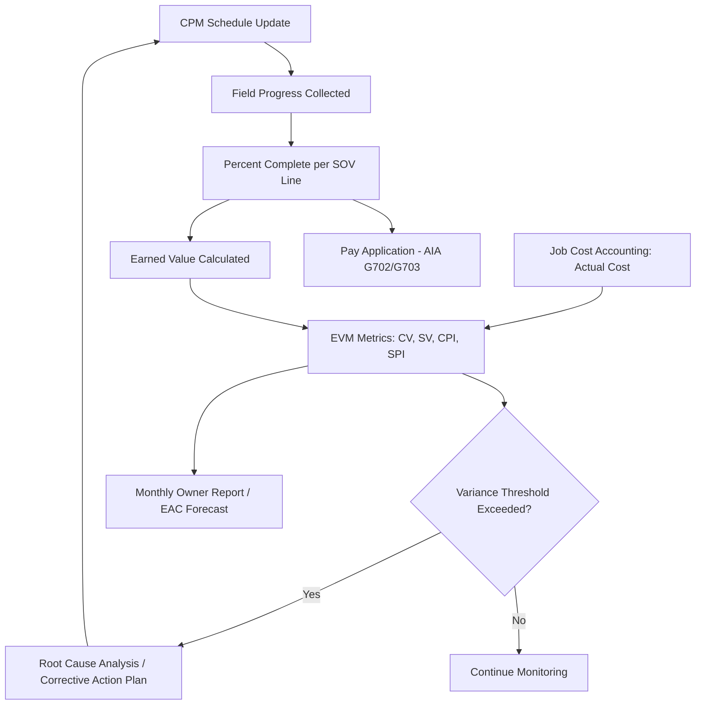

## Construction Industry Scheduling and Cost Control

### Overview

Construction is the primary industry from which both Critical Path Method (CPM) scheduling and Earned Value Management (EVM) originated and matured into formalized practice. Unlike software or manufacturing projects, construction work is characterized by fixed-location production, heavy dependency on sequential physical trades, weather exposure, regulatory inspections, and high capital intensity. As a result, CPM and EVM in construction are typically applied together, augmented by industry-specific practices: schedule-of-values-based billing, retainage, submittal/procurement tracking, and specialized software ecosystems (Primavera P6, Microsoft Project, and increasingly 4D/5D BIM-integrated platforms).

**Key Points**

- Construction schedules are almost universally CPM-based due to contractual requirements (many public and private contracts mandate CPM submission).
- Cost control in construction is tightly coupled to the **Schedule of Values (SOV)**, which forms the basis of both progress billing and EVM cost accounts.
- Float ownership, delay analysis, and change order impacts are legally and financially significant in construction, more so than in most other industries.
- Weather days, permitting, and inspection holds are recurring, industry-specific sources of schedule risk.

---

### Construction-Specific CPM Practices

#### Activity Definition Conventions

Construction CPM schedules typically break work into activities by:

- **Location** (building, floor, zone, area — e.g., "Level 3 - East Wing")
- **Trade/discipline** (structural, MEP, finishes)
- **Work sequence** (rough-in vs. trim-out vs. finish)

This "location-based" or "line-of-balance"-influenced breakdown is common enough that many practitioners hybridize CPM with **Location-Based Scheduling (LBS)** for repetitive work (e.g., multi-story buildings, highway segments, pipeline runs).

#### Common Constraint Types in Construction Schedules

| Constraint | Typical Use |
| --- | --- |
| Start No Earlier Than (SNET) | Material delivery dates, permit issuance |
| Finish No Later Than (FNLT) | Contractual milestones, occupancy dates |
| Mandatory Finish | Substantial completion date |

[Inference] Overuse of hard constraints (as opposed to logic-driven relationships) is a commonly cited cause of schedules that fail independent CPM review, since constraints can mask true critical path logic.

#### Calendars

Construction schedules almost always use **multiple calendars** — a 5-day workweek for most trades, 7-day for concrete curing or specialty crews, and weather-adjusted calendars for exterior work. Incorrect calendar assignment is a frequent source of float miscalculation.

#### Retained Logic vs. Progress Override

When updating construction schedules, two rules govern how remaining duration is calculated relative to actual progress:

- **Retained Logic**: remaining work respects original predecessor logic even if progress has been made out of sequence.
- **Progress Override**: remaining work is rescheduled based on current status, potentially ignoring original logic.

[Inference] Retained Logic is more common in contractually-scrutinized schedules because it preserves the audit trail of planned sequence, which matters in delay claims.

---

### Delay Analysis and Float Ownership

Construction contracts frequently specify **who owns float** — the contractor, the owner, or the project jointly. This has direct financial consequences during disputes.

#### Common Delay Analysis Methodologies

- **As-Planned vs. As-Built**: Compares the original CPM schedule to actual execution.
- **Time Impact Analysis (TIA)**: Inserts a delay-causing activity into an as-of-date schedule fragnet to measure its effect on critical path completion.
- **Windows Analysis**: Divides the project timeline into discrete windows and analyzes critical path shifts within each.
- **Collapsed As-Built**: Removes delay events from the as-built schedule to see what completion date would have resulted.

[Unverified] The preferred methodology often varies by jurisdiction and is frequently a matter of contractual specification (e.g., AACE International Recommended Practice 29R-03 catalogs these methods but does not mandate one universally).

#### Concurrent Delay

When both owner-caused and contractor-caused delays affect the critical path in the same period, **concurrent delay** doctrines (which vary by jurisdiction) determine whether either party may recover damages for that period.

---

### Schedule of Values (SOV) and Its Link to EVM

The SOV is the construction industry's foundational cost-control document, itemizing the contract sum across line items (e.g., "Sitework," "Concrete," "Structural Steel," "Electrical Rough-In").

- Each SOV line typically becomes (or maps to) an EVM **cost account** or **control account**.
- **Percent complete** on each SOV line, certified monthly via **AIA G702/G703** forms (or equivalent), directly drives **Earned Value (EV)**.

$$EV = \sum_{i=1}^{n} (\%\ Complete_i \times BAC_i)$$

Where $BAC_i$ is the Budget at Completion for SOV line item $i$.

#### Common Percent-Complete Methods in Construction

| Method | Description | Typical Use |
| --- | --- | --- |
| Units Complete | Physical units installed ÷ total units | Linear/repetitive work (pipe, conduit, rebar) |
| Incremental Milestone | Fixed % credit at defined milestones | Equipment installation, submittals |
| Cost Ratio | Actual cost incurred ÷ budgeted cost | Overhead, indirect costs |
| Weighted/Equivalent Units | Different work stages weighted by effort | Concrete (form/pour/strip/cure) |

[Inference] Units Complete and Incremental Milestone methods are generally preferred over Cost Ratio for direct-labor-heavy trades because Cost Ratio can overstate EV when costs are incurred faster than actual physical progress (a common source of EVM distortion in construction).

---

### EVM Metrics Applied to Construction

Using standard EVM formulas with construction-specific inputs:

- **Planned Value (PV)**: Budgeted cost of work scheduled per the CPM schedule and SOV, as of the data date.
- **Earned Value (EV)**: Budgeted cost of work actually completed, per certified percent-complete.
- **Actual Cost (AC)**: Costs recorded in job cost accounting (labor, material, equipment, subcontractor invoices) — often distinct from **billed** amounts due to retainage.

$$CV = EV - AC$$

$$SV = EV - PV$$

$$CPI = \frac{EV}{AC}, \quad SPI = \frac{EV}{PV}$$

#### Construction-Specific Nuance: Committed Cost

Because construction relies heavily on subcontracts and purchase orders, many contractors track **Committed Cost** (subcontract/PO value, whether or not yet invoiced) alongside AC, since committed cost represents financial exposure before it becomes an actual, recorded cost.

$$Exposure = Committed\ Cost - AC$$

[Inference] This is not part of the canonical EVM formula set (per PMI's *Practice Standard for Earned Value Management*) but is a widely adopted construction industry augmentation for cash flow and risk management.

#### Retainage's Effect on Cost Tracking

Owners typically withhold a percentage (commonly 5–10%) of each pay application as **retainage**, released at substantial or final completion. Retainage affects **cash flow** (money received) but should generally **not** distort **AC** (money spent/owed for work performed) if job cost accounting is done correctly — a frequent point of confusion between billing systems and true EVM.

---

### Integration: 4D and 5D BIM

- **4D BIM**: Links the 3D BIM model to the CPM schedule (time), allowing visual sequencing simulation of construction activities.
- **5D BIM**: Adds cost data to the 4D model, linking model elements to both schedule activities and SOV/cost codes, enabling near-real-time EV calculation as model elements are marked complete.

[Speculation] Adoption of true 5D BIM-driven EVM (fully automated EV calculation from model status) remains uneven across the industry as of recent years; many firms still rely on manually reported percent-complete rather than model-derived progress, per general industry commentary rather than a specific benchmark study.

---

### Example: Simplified Construction EVM Scenario

**Example**

A contractor is 6 months into a 12-month, $2,400,000 structural and enclosure package.

| SOV Line | BAC | % Complete | EV | AC |
| --- | --- | --- | --- | --- |
| Sitework/Foundations | $600,000 | 100% | $600,000 | $620,000 |
| Structural Steel | $900,000 | 80% | $720,000 | $780,000 |
| Building Envelope | $700,000 | 40% | $280,000 | $260,000 |
| General Conditions | $200,000 | 50% | $100,000 | $110,000 |
| **Total** | **$2,400,000** | — | **$1,700,000** | **$1,770,000** |

Assume PV at this point (per baseline CPM/SOV schedule) = $1,850,000.

$$CPI = \frac{1{,}700{,}000}{1{,}770{,}000} \approx 0.96$$

$$SPI = \frac{1{,}700{,}000}{1{,}850{,}000} \approx 0.92$$

**Output**

- $CPI \approx 0.96$ indicates a modest cost overrun (spending ~$1.04 for every $1.00 of value earned).
- $SPI \approx 0.92$ indicates the project is behind schedule relative to plan.
- The Sitework and Structural Steel lines are both over budget (AC > EV), suggesting subcontractor cost overruns or productivity issues concentrated in early-sequence trades — worth root-causing before they compound on downstream trades that depend on this work finishing on time.

---

### Diagram: Construction Cost/Schedule Control Data Flow (svg_diagram)

<svg xmlns="http://www.w3.org/2000/svg" viewBox="0 0 900 460">
<text x="450" y="24" font-family="Arial" font-size="18" font-weight="bold" text-anchor="middle" fill="#222">Construction Cost/Schedule Control Data Flow (svg_diagram)</text>
<rect x="30" y="60" width="180" height="60" rx="8" fill="#dce9f9" stroke="#3b6ea5" stroke-width="1.5" />
<text x="120" y="85" font-family="Arial" font-size="13" text-anchor="middle" fill="#1b3654">CPM Schedule</text>
<text x="120" y="103" font-family="Arial" font-size="11" text-anchor="middle" fill="#1b3654">(P6 / MS Project)</text>
<rect x="30" y="180" width="180" height="60" rx="8" fill="#dce9f9" stroke="#3b6ea5" stroke-width="1.5" />
<text x="120" y="205" font-family="Arial" font-size="13" text-anchor="middle" fill="#1b3654">Schedule of Values</text>
<text x="120" y="223" font-family="Arial" font-size="11" text-anchor="middle" fill="#1b3654">(AIA G702/G703)</text>
<rect x="360" y="60" width="180" height="60" rx="8" fill="#fde7c7" stroke="#b5791a" stroke-width="1.5" />
<text x="450" y="85" font-family="Arial" font-size="13" text-anchor="middle" fill="#5c3d09">Field Progress</text>
<text x="450" y="103" font-family="Arial" font-size="11" text-anchor="middle" fill="#5c3d09">(% Complete Reports)</text>
<rect x="360" y="180" width="180" height="60" rx="8" fill="#fde7c7" stroke="#b5791a" stroke-width="1.5" />
<text x="450" y="205" font-family="Arial" font-size="13" text-anchor="middle" fill="#5c3d09">Job Cost Accounting</text>
<text x="450" y="223" font-family="Arial" font-size="11" text-anchor="middle" fill="#5c3d09">(Labor, Material, Subs)</text>
<rect x="690" y="120" width="180" height="60" rx="8" fill="#dff0d8" stroke="#3c763d" stroke-width="1.5" />
<text x="780" y="145" font-family="Arial" font-size="13" text-anchor="middle" fill="#254c26">EVM Engine</text>
<text x="780" y="163" font-family="Arial" font-size="11" text-anchor="middle" fill="#254c26">PV / EV / AC</text>
<rect x="690" y="260" width="180" height="60" rx="8" fill="#f2dede" stroke="#a94442" stroke-width="1.5" />
<text x="780" y="285" font-family="Arial" font-size="13" text-anchor="middle" fill="#5c1a1a">Variance &amp; Forecast</text>
<text x="780" y="303" font-family="Arial" font-size="11" text-anchor="middle" fill="#5c1a1a">CV / SV / CPI / SPI / EAC</text>
<rect x="360" y="340" width="180" height="60" rx="8" fill="#e8dff5" stroke="#6a3d9a" stroke-width="1.5" />
<text x="450" y="365" font-family="Arial" font-size="13" text-anchor="middle" fill="#3a1d5c">Progress Billing</text>
<text x="450" y="383" font-family="Arial" font-size="11" text-anchor="middle" fill="#3a1d5c">(Pay Application)</text>
<line x1="210" y1="90" x2="360" y2="90" stroke="#333" stroke-width="1.5" marker-end="url(#arrow)" />
<line x1="210" y1="210" x2="360" y2="210" stroke="#333" stroke-width="1.5" marker-end="url(#arrow)" />
<line x1="540" y1="90" x2="690" y2="140" stroke="#333" stroke-width="1.5" marker-end="url(#arrow)" />
<line x1="540" y1="210" x2="690" y2="160" stroke="#333" stroke-width="1.5" marker-end="url(#arrow)" />
<line x1="780" y1="180" x2="780" y2="260" stroke="#333" stroke-width="1.5" marker-end="url(#arrow)" />
<line x1="450" y1="240" x2="450" y2="340" stroke="#333" stroke-width="1.5" marker-end="url(#arrow)" />
<line x1="690" y1="290" x2="540" y2="370" stroke="#333" stroke-width="1.5" stroke-dasharray="4,3" marker-end="url(#arrow)" />
<text x="600" y="335" font-family="Arial" font-size="10" fill="#555">informs next update</text>
</svg>

---

### Process Flow: Monthly Update Cycle

---

### Common Pitfalls in Construction CPM/EVM Integration

- **Front-loading the SOV**: Inflating early line items (e.g., mobilization, sitework) relative to actual cost to accelerate cash flow — this distorts EV/AC comparisons and can mask true cost performance early in the project.
- **Misaligned WBS and SOV**: When the CPM schedule's activity breakdown doesn't map cleanly to SOV lines, EV calculation requires manual reconciliation, introducing error and delay.
- **Billing progress ≠ physical progress**: Percent billed on a pay application does not always equal percent physically complete, especially for stored materials or partially fabricated equipment.
- **Ignoring float consumption trends**: Tracking total float at each update (not just critical path status) helps detect emerging schedule risk before it becomes critical.

[Inference] These pitfalls are widely discussed in construction scheduling literature and professional practice guidance (e.g., AACE International recommended practices) rather than tied to a single authoritative source.

---

### Related Software Ecosystem

| Tool | Role |
| --- | --- |
| Primavera P6 | Industry-standard CPM scheduling for large/complex projects |
| Microsoft Project | CPM scheduling for small-to-mid projects |
| Procore, Autodesk Construction Cloud | Field progress, SOV/pay app management, document control |
| Sage 300 CRE, Viewpoint | Job cost accounting integration |
| Synchro, Navisworks | 4D/5D BIM sequencing and cost integration |

---

**Related Topics**

- Schedule of Values structuring and AIA G702/G703 documentation
- Time Impact Analysis (TIA) and delay claim preparation
- Location-Based Scheduling (LBS) / Line of Balance for repetitive construction
- Retainage, cash flow curves (S-curves), and construction financing
- 4D/5D BIM workflows and model-based progress tracking
- Concurrent delay doctrine and float ownership clauses in contracts
- Percent-complete methodologies (units, milestone, cost ratio) in cost account design