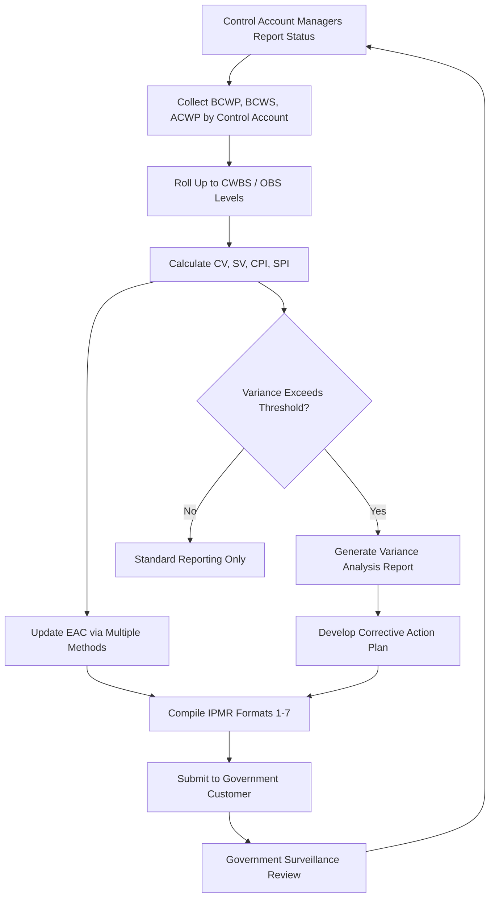

## Aerospace and Defense Program Management


### Overview

Aerospace and defense (A&D) is the industry in which formal Earned Value Management originated — the U.S. Department of Defense's Cost/Schedule Control Systems Criteria (C/SCSC), introduced in 1967, is the direct ancestor of modern EVM. A&D programs are typically large-scale, long-duration (multi-year to multi-decade), high-complexity efforts involving strict regulatory oversight, security classification constraints, and contractual mandates for integrated cost and schedule control. CPM scheduling and EVM are not optional best practices in this industry — for U.S. government contracts above certain dollar thresholds, they are **mandatory contractual requirements** enforced through formal compliance standards.

**Key Points**

- EVM is contractually mandated on most major U.S. DoD and NASA acquisition programs via **EIA-748** (the Standard for Earned Value Management Systems).
- Programs require a **validated EVMS** (Earned Value Management System) that has passed formal government surveillance/certification.
- The **Integrated Master Schedule (IMS)** and **Integrated Master Plan (IMP)** are the aerospace/defense-specific artifacts that structure CPM scheduling at the program level.
- Work is organized through a **Contract Work Breakdown Structure (CWBS)** and **Control Accounts**, per **MIL-STD-881** WBS guidance.
- Reporting to the government customer follows standardized formats — historically the **Contract Performance Report (CPR)**, now largely digitized as the **Integrated Program Management Report (IPMR)**.

---

### Regulatory and Standards Framework

#### EIA-748 (EVMS Guidelines)

The **EIA-748 Standard for Earned Value Management Systems**, maintained by the Government Electronics and Information Technology Association (GEIA)/SAE, defines **32 guidelines** organized into five categories:

| Category | Focus |
| --- | --- |
| Organization | WBS/OBS structure, integration of scope-schedule-cost |
| Planning, Scheduling, Budgeting | Baseline development, control account planning |
| Accounting Considerations | Cost collection, indirect cost allocation |
| Analysis and Management Reports | Variance analysis, EAC development |
| Revisions and Data Maintenance | Baseline change control |

[Inference] Compliance with all 32 guidelines, rather than partial adoption, is generally required for a contractor's EVMS to pass formal DoD or NASA certification review, though specific applicability can vary by contract type and dollar threshold.

#### Contract Types and EVM Applicability

EVM reporting requirements are typically tied to contract type and value:

- **Cost-reimbursement contracts** above DoD-specified thresholds generally require full EVMS compliance.
- **Firm-fixed-price (FFP)** contracts often have reduced or no EVM reporting requirements, since the government bears less direct cost risk.

[Unverified] Specific dollar thresholds triggering EVMS applicability (e.g., historically around $20M for full reporting, $100M for formal system validation) have changed over time via DFARS updates; current programs should reference the latest DFARS 234.2 and applicable contract clauses rather than a fixed historical figure.

---

### Integrated Master Plan (IMP) and Integrated Master Schedule (IMS)

#### IMP

The **Integrated Master Plan** is an event-based, top-level document defining:

- **Program Events** (e.g., Preliminary Design Review, Critical Design Review)
- **Significant Accomplishments** required to achieve each event
- **Accomplishment Criteria** — objective, measurable evidence that an accomplishment is complete

The IMP is intentionally **not time-based**; it defines the logical sequence of technical maturity, not dates.

#### IMS

The **Integrated Master Schedule** is the detailed, time-phased, networked CPM schedule that traces directly back to the IMP's events, accomplishments, and criteria. Every IMS activity should be traceable to an IMP element, and the IMS is where actual CPM mechanics (durations, dependencies, critical path, float) live.

**Key Points**

- IMS activities are grouped into **Control Accounts**, each owned by a **Control Account Manager (CAM)**.
- The IMS typically integrates **hundreds to tens of thousands of activities** across contractor and subcontractor schedules.
- **Schedule health metrics** (e.g., GAO 14-point schedule assessment, DCMA 14-point check) are used to formally audit IMS quality.

#### DCMA 14-Point Schedule Assessment

A widely used metric set for evaluating IMS quality includes checks such as:

1. Logic (missing predecessor/successor links)
2. Leads (negative lag)
3. Lags
4. Relationship types (excessive use of non-Finish-to-Start links)
5. Hard constraints
6. High float
7. Negative float
8. High duration activities
9. Invalid dates
10. Resources
11. Missed tasks
12. Critical path test
13. Critical Path Length Index (CPLI)
14. Baseline Execution Index (BEI)

[Inference] While the DCMA 14-point check is widely referenced in defense scheduling practice, its use as a formal contractual pass/fail gate versus an informational health indicator can vary by contracting agency and program office.

---

### Contract Work Breakdown Structure (CWBS)

Aerospace/defense programs structure work using **MIL-STD-881** as the reference for standard WBS elements by system type (aircraft, ship, missile, space system, etc.), ensuring consistency across programs and enabling cross-program cost comparison.

**Example** CWBS excerpt for an aircraft system program (per MIL-STD-881 conventions):



```
1.0 Air Vehicle
  1.1 Airframe
  1.2 Propulsion
  1.3 Avionics
  1.4 Software
2.0 Systems Engineering/Program Management
3.0 Training
4.0 Data
5.0 Peculiar Support Equipment
6.0 Common Support Equipment
7.0 Operational/Site Activation
8.0 Industrial Facilities
9.0 Initial Spares and Repair Parts
```

Each **Control Account** sits at the intersection of the CWBS (what) and the **Organizational Breakdown Structure (OBS)** (who) — this WBS × OBS intersection is a core EIA-748 requirement, ensuring every dollar and every hour of scope has a single accountable owner.

---

### EVM Metrics and Formulas (A&D Context)

Standard EVM formulas apply, with A&D-specific terminology and reporting conventions:

$$CV = BCWP - ACWP \quad (\text{legacy terms: Cost Variance})$$


$$SV = BCWP - BCWS \quad (\text{legacy terms: Schedule Variance})$$

Where the classic DoD terminology maps to modern PMI terminology as follows:

| Legacy DoD Term | Modern PMI Term |
| --- | --- |
| BCWS (Budgeted Cost of Work Scheduled) | PV (Planned Value) |
| BCWP (Budgeted Cost of Work Performed) | EV (Earned Value) |
| ACWP (Actual Cost of Work Performed) | AC (Actual Cost) |
| BAC (Budget at Completion) | BAC (same) |

$$CPI = \frac{BCWP}{ACWP}, \quad SPI = \frac{BCWP}{BCWS}$$

#### Estimate at Completion (EAC) Methods

A&D programs formally document multiple EAC calculation methods, since a single EAC is often insufficient for large, multi-year programs:

$$EAC_{CPI} = \frac{BAC}{CPI}$$


$$EAC_{composite} = ACWP + \frac{BAC - BCWP}{CPI \times SPI}$$


$$EAC_{manual} = ACWP + ETC_{bottom\text{-}up}$$

**Example**

A satellite subsystem control account has $BAC = \$45{,}000{,}000$, $BCWP = \$18{,}000{,}000$, $ACWP = \$21{,}000{,}000$, $BCWS = \$20{,}000{,}000$.

$$CPI = \frac{18{,}000{,}000}{21{,}000{,}000} \approx 0.857$$


$$SPI = \frac{18{,}000{,}000}{20{,}000{,}000} = 0.90$$


$$EAC_{CPI} = \frac{45{,}000{,}000}{0.857} \approx \$52{,}500{,}000$$

**Output**

- A CPI of ~0.857 indicates significant cost overrun (spending $1.17 for every $1.00 of earned value).
- The composite EAC would likely project even higher than $EAC_{CPI}$ alone, since both cost and schedule inefficiency compound in that formula — this combination is a common trigger for formal **Over Target Baseline (OTB)** or **Over Target Schedule (OTS)** review on DoD programs when variances exceed contractual thresholds.

---

### Contract Performance Reporting: CPR / IPMR

Contractors report EVM data to the government customer via standardized formats:

- **CPR (Contract Performance Report)** — the legacy five-format report (Formats 1–5: WBS, OBS, Baseline, Staffing, Explanations/Variance Analysis).
- **IPMR (Integrated Program Management Report, DI-MGMT-81861)** — the current DoD standard, combining CPR and IMS reporting into a unified, XML-based data deliverable (Formats 1–7).

| IPMR Format | Content |
| --- | --- |
| Format 1 | Cost/schedule data by WBS |
| Format 2 | Cost/schedule data by OBS |
| Format 3 | Baseline (PMB) data |
| Format 4 | Staffing (workforce) |
| Format 5 | Variance analysis (narrative explanations) |
| Format 6 | Integrated Master Schedule |
| Format 7 | Time-phased historical data for EAC analysis |

[Inference] The shift from CPR to IPMR reflects a broader DoD push toward machine-readable, standardized program data (via UN/CEFACT XML schemas) to support automated analysis tools rather than manual report review, consistent with DoD's stated digital engineering modernization direction.

---

### Variance Analysis and Thresholds

A&D contracts specify **variance thresholds** (e.g., cost or schedule variance exceeding a percentage or dollar amount) that trigger mandatory **Variance Analysis Reports (VARs)**, requiring the CAM to document:

- **Cause** of the variance
- **Impact** on program cost/schedule
- **Corrective Action Plan (CAP)**

**Example** variance threshold rule (illustrative, contract-specific):

> "Any control account with cumulative CV or SV exceeding ±10% or $100,000 (whichever is smaller) requires a documented VAR in the monthly IPMR Format 5 submission."

[Unverified] Actual thresholds are negotiated per-contract and vary significantly; the above is illustrative of the mechanism, not a universal figure.

---

### Baseline Change Control

Because A&D programs run for years, the **Performance Measurement Baseline (PMB)** must be formally protected from uncontrolled changes:

- Changes require documented **Baseline Change Requests (BCRs)**.
- **Management Reserve (MR)** — budget held back from the PMB, controlled by the Program Manager — absorbs unforeseen in-scope risk without requiring a formal baseline revision.
- **Undistributed Budget (UB)** — budget for authorized but not-yet-detail-planned scope, distributed into control accounts as planning matures.

$$Contract\ Budget\ Base = PMB + MR$$


$$PMB = \sum (Control\ Account\ Budgets) + Undistributed\ Budget$$


---

### Diagram: A&D EVM Structural Hierarchy (svg_diagram)

<svg xmlns="http://www.w3.org/2000/svg" viewBox="0 0 900 480">
<text x="450" y="26" font-family="Arial" font-size="18" font-weight="bold" text-anchor="middle" fill="#222">A&amp;D EVM Structural Hierarchy (svg_diagram)</text>
<rect x="340" y="55" width="220" height="55" rx="8" fill="#dce9f9" stroke="#3b6ea5" stroke-width="1.5" />
<text x="450" y="87" font-family="Arial" font-size="13" text-anchor="middle" fill="#1b3654">Contract Budget Base</text>
<rect x="200" y="140" width="200" height="55" rx="8" fill="#fde7c7" stroke="#b5791a" stroke-width="1.5" />
<text x="300" y="172" font-family="Arial" font-size="13" text-anchor="middle" fill="#5c3d09">Performance Measurement Baseline</text>
<rect x="500" y="140" width="200" height="55" rx="8" fill="#f2dede" stroke="#a94442" stroke-width="1.5" />
<text x="600" y="172" font-family="Arial" font-size="13" text-anchor="middle" fill="#5c1a1a">Management Reserve</text>
<rect x="60" y="225" width="200" height="55" rx="8" fill="#dff0d8" stroke="#3c763d" stroke-width="1.5" />
<text x="160" y="257" font-family="Arial" font-size="13" text-anchor="middle" fill="#254c26">Control Accounts (CWBS x OBS)</text>
<rect x="290" y="225" width="200" height="55" rx="8" fill="#dff0d8" stroke="#3c763d" stroke-width="1.5" />
<text x="390" y="257" font-family="Arial" font-size="13" text-anchor="middle" fill="#254c26">Undistributed Budget</text>
<rect x="20" y="310" width="200" height="55" rx="8" fill="#e8dff5" stroke="#6a3d9a" stroke-width="1.5" />
<text x="120" y="335" font-family="Arial" font-size="12" text-anchor="middle" fill="#3a1d5c">Work Packages</text>
<text x="120" y="352" font-family="Arial" font-size="11" text-anchor="middle" fill="#3a1d5c">(discrete, measurable)</text>
<rect x="240" y="310" width="200" height="55" rx="8" fill="#e8dff5" stroke="#6a3d9a" stroke-width="1.5" />
<text x="340" y="335" font-family="Arial" font-size="12" text-anchor="middle" fill="#3a1d5c">Planning Packages</text>
<text x="340" y="352" font-family="Arial" font-size="11" text-anchor="middle" fill="#3a1d5c">(far-term, summary)</text>
<rect x="130" y="400" width="300" height="55" rx="8" fill="#f9e3c6" stroke="#b5791a" stroke-width="1.5" />
<text x="280" y="425" font-family="Arial" font-size="12" text-anchor="middle" fill="#5c3d09">Integrated Master Schedule (IMS)</text>
<text x="280" y="442" font-family="Arial" font-size="11" text-anchor="middle" fill="#5c3d09">traces to IMP events/accomplishments</text>
<line x1="450" y1="110" x2="300" y2="140" stroke="#333" stroke-width="1.5" marker-end="url(#arrow2)" />
<line x1="450" y1="110" x2="600" y2="140" stroke="#333" stroke-width="1.5" marker-end="url(#arrow2)" />
<line x1="300" y1="195" x2="160" y2="225" stroke="#333" stroke-width="1.5" marker-end="url(#arrow2)" />
<line x1="300" y1="195" x2="390" y2="225" stroke="#333" stroke-width="1.5" marker-end="url(#arrow2)" />
<line x1="160" y1="280" x2="120" y2="310" stroke="#333" stroke-width="1.5" marker-end="url(#arrow2)" />
<line x1="160" y1="280" x2="340" y2="310" stroke="#333" stroke-width="1.5" marker-end="url(#arrow2)" />
<line x1="120" y1="365" x2="280" y2="400" stroke="#333" stroke-width="1.5" marker-end="url(#arrow2)" />
<line x1="340" y1="365" x2="280" y2="400" stroke="#333" stroke-width="1.5" marker-end="url(#arrow2)" />
</svg>

---

### Process Flow: Monthly EVMS Reporting Cycle



---

### Common Pitfalls in A&D EVM Implementation

- **Retroactive changes to actuals**: Adjusting ACWP after the fact without proper baseline change control undermines EVMS integrity and can trigger findings during government surveillance reviews.
- **Disconnected IMP and IMS**: When IMS activities cannot be traced back to IMP accomplishment criteria, schedule health reviews (e.g., DCMA 14-point) typically flag broken traceability.
- **Over-reliance on a single EAC method**: Programs that report only $EAC_{CPI}$ without bottom-up ETC validation risk masking true cost-to-complete risk, especially late in the program when remaining work profile differs from historical performance.
- **Management Reserve depletion**: Drawing down MR too early in the program lifecycle leaves no buffer for later technical risk realization — a recurring finding in troubled major defense acquisition program reviews (e.g., GAO reports).

[Inference] These pitfalls are broadly discussed in DoD program management and GAO oversight literature rather than attributable to one single source, and severity/frequency varies by program and service branch.

---

### Related Software Ecosystem

| Tool | Role |
| --- | --- |
| Deltek Cobra | EVM cost engine, widely used for DoD EVMS compliance |
| Deltek Open Plan / Primavera P6 | IMS scheduling |
| wInsight, Encore Analytics EVM tools | EVM analysis and IPMR generation |
| MPM (Microsoft Project Server) variants | Used on smaller/less formal programs |

---

**Related Topics**

- EIA-748 32 guidelines in detail and EVMS validation/surveillance process
- DCMA 14-point schedule health assessment methodology
- Integrated Master Plan (IMP) event/accomplishment/criteria structuring
- Over Target Baseline (OTB) and Over Target Schedule (OTS) rebaselining
- MIL-STD-881 Work Breakdown Structure standards by system type
- IPMR data schema (UN/CEFACT XML) and automated EVM analytics tools
- Management Reserve and Undistributed Budget governance practices