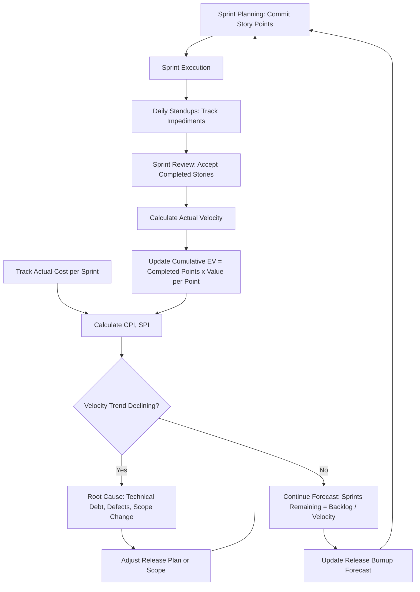

## IT and Software Development Project Tracking


### Overview

Applying Critical Path Method (CPM) and Earned Value Management (EVM) to IT and software development projects requires adapting techniques originally built for construction and defense hardware programs to work whose "product" is intangible, whose scope is frequently uncertain at the outset, and whose delivery methodology is often iterative (Agile/Scrum) rather than sequential (Waterfall). This creates a persistent tension: EVM assumes a stable, well-decomposed baseline, while much of modern software development deliberately embraces changing scope. The industry has responded with hybrid approaches — Agile EVM, story-point-based earned value, and release-train-level CPM — that preserve the governance value of EVM/CPM without forcing rigid Waterfall structure onto adaptive teams.

**Key Points**

- Pure CPM is most directly applicable to Waterfall or hybrid software projects with well-defined phase gates (requirements → design → build → test → deploy).
- Agile projects require **Agile EVM** or **story-point earned value** adaptations, since traditional work packages don't map cleanly onto sprints and backlogs.
- **Technical debt**, **defect density**, and **velocity variability** are IT-specific risk factors with no direct construction/defense analog.
- Government and enterprise IT programs (e.g., under the U.S. Federal IT Acquisition Reform Act context) increasingly require EVM reporting even when development is Agile, creating a documented need for hybrid metrics.

---

### CPM in Waterfall and Hybrid Software Projects

#### Typical Phase-Gate Network

A traditional software CPM schedule sequences activities through discrete phases with milestone dependencies:



```
Requirements → System Design → Detailed Design → Development → 
Unit Testing → Integration Testing → UAT → Deployment → Hypercare
```

Each phase typically has internal parallel paths (e.g., front-end and back-end development proceeding concurrently, converging at integration testing), making the **critical path** often run through **integration and testing**, since these activities depend on the completion of the slowest upstream parallel component.

#### Common Constraint Patterns

- **Environment availability** (test/staging/production environment provisioning) frequently acts as a resource constraint independent of task logic.
- **Third-party API/vendor dependencies** often introduce **external constraints** (Start No Earlier Than) tied to vendor delivery dates outside the project team's control.
- **Code freeze** and **regression testing windows** are common hard constraints near release dates.

[Inference] In practice, many software CPM schedules understate true critical path risk because they model only development tasks and omit environment, data migration, and third-party integration dependencies — a commonly cited cause of late-stage schedule slips in enterprise IT projects.

---

### Work Breakdown Structure for Software

Unlike construction (physical/location-based) or defense (MIL-STD-881 system-based), software WBS decomposition typically follows one of:

| Approach | Structure |
| --- | --- |
| Functional decomposition | By module/component (e.g., Authentication, Payments, Reporting) |
| Phase-based decomposition | By SDLC phase (Requirements, Design, Build, Test) |
| Feature-based decomposition | By user-facing feature or epic |

**Example** functional WBS excerpt:



```
1.0 Customer Portal
  1.1 Authentication Module
  1.2 Account Dashboard
  1.3 Payment Processing
2.0 Backend Services
  2.1 API Gateway
  2.2 Data Layer
3.0 Infrastructure
  3.1 CI/CD Pipeline
  3.2 Cloud Environment Setup
4.0 Quality Assurance
  4.1 Test Automation Framework
  4.2 UAT Coordination
```

---

### Agile EVM: Adapting Earned Value to Sprints

Because Agile projects use **story points** or **velocity** rather than dollar-budgeted work packages as their primary unit of planning, EVM must be reinterpreted.

#### Core Substitutions

| Traditional EVM | Agile EVM Equivalent |
| --- | --- |
| BAC (Budget at Completion) | Total planned story points (or total release backlog) |
| PV (Planned Value) | Cumulative story points planned per sprint (per release burnup) |
| EV (Earned Value) | Cumulative story points actually completed (accepted) |
| AC (Actual Cost) | Actual cost incurred per sprint (team cost × sprint duration) |

$$PV_{sprint} = \frac{BAC}{Total\ Planned\ Sprints} \times Sprint\ Number \quad \text{(if velocity is planned as linear)}$$

More commonly, PV is derived directly from the **release plan's planned burnup curve** rather than assumed linear.

$$EV = \left( \frac{Story\ Points\ Completed}{Total\ Story\ Points} \right) \times BAC$$

**Example**

A release is planned at 400 total story points over 8 two-week sprints, with a total budget of $800,000 (so $2,000 per story point). By the end of Sprint 5, the team has completed 220 story points, and actual cost incurred is $460,000. The release plan anticipated 250 story points completed by this point.

$$PV = 250 \times 2{,}000 = \$500{,}000$$


$$EV = 220 \times 2{,}000 = \$440{,}000$$


$$AC = \$460{,}000$$


$$CPI = \frac{440{,}000}{460{,}000} \approx 0.957$$


$$SPI = \frac{440{,}000}{500{,}000} = 0.88$$

**Output**

- $SPI = 0.88$ indicates the team is completing story points more slowly than planned — velocity is below plan, which should prompt a look at backlog refinement quality, story sizing accuracy, or unaddressed impediments rather than an assumption of "the team isn't working hard enough."
- $CPI \approx 0.957$ indicates a mild cost overrun relative to value delivered, though [Inference] in fixed-team-cost Agile models (where AC accrues at a constant burn rate regardless of output), CPI in Agile EVM often functions more as a **velocity-vs-cost-efficiency indicator** than a true cost-control lever, since the team's cost is typically fixed per sprint regardless of story points completed.

#### Velocity-Based Forecasting (Agile Alternative to EAC)

Rather than $EAC = BAC / CPI$, Agile teams commonly forecast completion using observed velocity:

$$Sprints\ Remaining = \frac{Total\ Remaining\ Story\ Points}{Average\ Velocity\ (last\ N\ sprints)}$$

[Inference] This approach is generally considered more reliable than dollar-based EAC for Agile teams because velocity directly reflects throughput, whereas cost-based EAC can be distorted by fixed team costs that don't vary with output.

---

### Hybrid Scaled Agile: SAFe and Program-Level EVM

In **Scaled Agile Framework (SAFe)** environments common in large enterprise and government IT programs, EVM is often applied at the **Program Increment (PI)** or **Value Stream** level rather than at the individual sprint/team level:

- **Features** and **Epics** become the work package equivalent.
- **PI Objectives** (business-value-weighted) can substitute for dollar-based BAC weighting, using **Business Value (BV) points** assigned during PI Planning.
- The **Program Kanban** and **PI roadmap** provide the schedule network for CPM-style dependency and critical path analysis across teams (specifically, **cross-team dependencies** are the primary source of "critical path" risk in SAFe, since inter-team blocking dependencies — not individual task duration — most often determine PI completion risk).

[Unverified] The degree to which formal EVM (as opposed to simpler burnup/burndown and predictability metrics) is applied at scale varies significantly by organization; SAFe's official guidance emphasizes flow metrics and Predictability Measure over full EIA-748-style EVM, except where contractually mandated (e.g., government contracts).

---

### IT-Specific Risk Factors Affecting Schedule and Cost

#### Technical Debt

Accumulated technical debt reduces future velocity and increases defect rates, effectively acting as a **hidden schedule risk** not captured in standard CPM logic. [Speculation] Some organizations attempt to quantify technical debt as a "shadow backlog" with estimated story points, feeding it into capacity planning, though this practice is not standardized industry-wide.

#### Defect Density and Rework

Unlike physical construction defects (which are typically visible immediately), software defects can surface late (in UAT or production), causing **rework loops** that don't appear as planned activities in the original CPM network. Some mature organizations model an explicit **"Bug Fix" buffer activity** with duration estimated from historical defect density (defects per KLOC or per story point) on similar past releases.

#### Velocity Variability

Because velocity is an empirical measurement (not a fixed resource rate like construction labor productivity), early-sprint velocity is a weak predictor of steady-state velocity. [Inference] Many Agile practitioners recommend waiting 3–5 sprints before using velocity data for reliable EVM-style forecasting, since new teams typically show a "ramp-up" period.

#### Scope Volatility

Software scope, especially in Agile contexts, changes more frequently than construction or hardware scope. This requires more frequent **baseline rebaselining** or **rolling wave planning**, where only the near-term sprints/phases are planned in detail and later phases remain at a summary level until closer to execution.

---

### Diagram: Software CPM Network with Testing Bottleneck (svg_diagram)

<svg viewBox="0 0 900 380" xmlns="http://www.w3.org/2000/svg">
<defs>
<marker id="arrow3" markerWidth="10" markerHeight="10" refX="8" refY="3" orient="auto" markerUnits="strokeWidth">
<path d="M0,0 L0,6 L9,3 z" fill="#333"/>
</marker>
</defs>
<text x="450" y="26" font-family="Arial" font-size="18" font-weight="bold" text-anchor="middle" fill="#222">Software CPM Network with Testing Bottleneck (svg_diagram)</text>
<circle cx="60" cy="190" r="30" fill="#dce9f9" stroke="#3b6ea5" stroke-width="1.5"/>
<text x="60" y="185" font-family="Arial" font-size="10" text-anchor="middle" fill="#1b3654">Reqs</text>
<text x="60" y="198" font-family="Arial" font-size="10" text-anchor="middle" fill="#1b3654">Done</text>
<rect x="150" y="90" width="140" height="50" rx="8" fill="#fde7c7" stroke="#b5791a" stroke-width="1.5"/>
<text x="220" y="112" font-family="Arial" font-size="12" text-anchor="middle" fill="#5c3d09">Frontend Dev</text>
<text x="220" y="128" font-family="Arial" font-size="10" text-anchor="middle" fill="#5c3d09">10 days</text>
<rect x="150" y="240" width="140" height="50" rx="8" fill="#f2dede" stroke="#a94442" stroke-width="1.5"/>
<text x="220" y="262" font-family="Arial" font-size="12" text-anchor="middle" fill="#5c1a1a">Backend Dev</text>
<text x="220" y="278" font-family="Arial" font-size="10" text-anchor="middle" fill="#5c1a1a">18 days (CP)</text>
<rect x="340" y="240" width="140" height="50" rx="8" fill="#f2dede" stroke="#a94442" stroke-width="1.5"/>
<text x="410" y="262" font-family="Arial" font-size="12" text-anchor="middle" fill="#5c1a1a">API Integration</text>
<text x="410" y="278" font-family="Arial" font-size="10" text-anchor="middle" fill="#5c1a1a">6 days (CP)</text>
<rect x="530" y="165" width="160" height="50" rx="8" fill="#dff0d8" stroke="#3c763d" stroke-width="1.5"/>
<text x="610" y="187" font-family="Arial" font-size="12" text-anchor="middle" fill="#254c26">Integration Testing</text>
<text x="610" y="203" font-family="Arial" font-size="10" text-anchor="middle" fill="#254c26">8 days (CP)</text>
<rect x="740" y="165" width="140" height="50" rx="8" fill="#e8dff5" stroke="#6a3d9a" stroke-width="1.5"/>
<text x="810" y="187" font-family="Arial" font-size="12" text-anchor="middle" fill="#3a1d5c">UAT</text>
<text x="810" y="203" font-family="Arial" font-size="10" text-anchor="middle" fill="#3a1d5c">5 days (CP)</text>
<line x1="90" y1="190" x2="150" y2="115" stroke="#333" stroke-width="1.5" marker-end="url(#arrow3)"/>
<line x1="90" y1="190" x2="150" y2="265" stroke="#333" stroke-width="2" stroke="#a94442" marker-end="url(#arrow3)"/>
<line x1="290" y1="265" x2="340" y2="265" stroke="#333" stroke-width="2" stroke="#a94442" marker-end="url(#arrow3)"/>
<line x1="220" y1="140" x2="580" y2="165" stroke="#333" stroke-width="1.5" marker-end="url(#arrow3)"/>
<line x1="480" y1="265" x2="590" y2="215" stroke="#333" stroke-width="2" stroke="#a94442" marker-end="url(#arrow3)"/>
<line x1="690" y1="190" x2="740" y2="190" stroke="#333" stroke-width="2" stroke="#a94442" marker-end="url(#arrow3)"/>

<text x="450" y="345" font-family="Arial" font-size="11" fill="`#5c1a1a`" text-anchor="middle">Red path = Critical Path (Backend Dev is longer than Frontend, driving overall completion)</text>

</svg>

---

### Process Flow: Hybrid Agile EVM Reporting Cycle



---

### Common Pitfalls in IT/Software CPM-EVM Application

- **Forcing story points into dollar-based EVM without translation**: Reporting story point burndown as if it were a validated EVMS baseline can mislead stakeholders unfamiliar with the difference between "points completed" and "value delivered," especially when point estimation is inconsistent across teams.
- **Ignoring integration and environment dependencies in CPM logic**: As noted above, schedules that only model coding tasks tend to underestimate the true critical path.
- **Treating velocity as a fixed rate too early**: Using first-sprint or first-two-sprint velocity for long-range forecasting produces unreliable EAC-equivalent projections.
- **Scope creep disguised as "backlog reprioritization"**: In Agile contexts, uncontrolled scope addition can be harder to detect than in Waterfall projects because there's no single baseline document being visibly revised — it's disguised as normal backlog grooming, which can undermine the credibility of any EVM-style tracking layered on top.

[Inference] These pitfalls reflect commonly discussed challenges in Agile-EVM integration literature (e.g., from PMI and Agile Alliance practitioner writing) rather than a single canonical source.

---

### Related Software Ecosystem

| Tool | Role |
| --- | --- |
| Jira, Azure DevOps | Sprint/backlog tracking, velocity reporting |
| Jira Align, Rally (Broadcom) | SAFe-scale program tracking, PI planning, dependency mapping |
| Microsoft Project, Smartsheet | Waterfall/hybrid CPM scheduling for IT programs |
| Empower, nTask, Deltek Cobra (govt IT) | Agile EVM / hybrid EVM reporting |
| Tempo, Everhour | Time tracking feeding AC calculations |

---

**Related Topics**

- Agile EVM formula derivations and story-point-to-dollar conversion methods
- Rolling wave planning for scope-volatile software projects
- SAFe Program Increment planning and cross-team dependency mapping
- Technical debt quantification and its integration into capacity/schedule models
- DevOps/CI-CD pipeline scheduling constraints and their effect on release critical path
- Federal IT Acquisition (FITARA) EVM requirements for Agile government contracts
- Defect density and rework buffer estimation in test-phase CPM activities