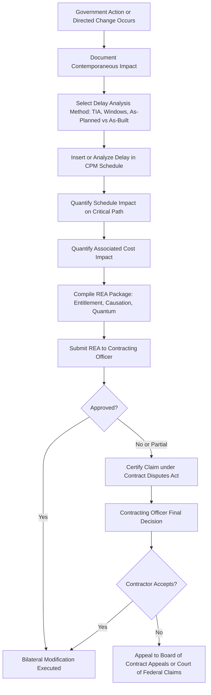

## Government Contracting Requirements

### Overview

Government contracting introduces a distinct layer of contractual, regulatory, and compliance obligations onto CPM scheduling and Earned Value Management that private-sector commercial work generally does not face. While the technical mechanics of CPM (network logic, critical path calculation) and EVM (PV/EV/AC, CPI/SPI) are identical across sectors, **government contracts convert these techniques from management best practices into legally binding contract deliverables**, subject to audit, surveillance, and formal acceptance criteria. This applies across federal, state, and local government work — federal defense and civilian agency contracts, state department of transportation (DOT) infrastructure projects, and municipal capital works all impose varying degrees of formalized scheduling and cost-reporting obligations.

**Key Points**

- Government contracts specify CPM/EVM requirements through **contract clauses** (e.g., FAR/DFARS clauses at the federal level) rather than leaving methodology to contractor discretion.
- **EVMS validation and surveillance** (for larger contracts) requires the contractor's earned value system itself — not just its outputs — to be formally reviewed and accepted by the government.
- **Contract type** (cost-reimbursement vs. fixed-price) is the primary driver of how much formal EVM/CPM reporting is required.
- **Changes and claims** (Requests for Equitable Adjustment, Change Orders, delay claims) are processed through formal, often adversarial contractual mechanisms in which CPM schedule analysis is the primary technical evidence.
- Distinct contracting regimes exist at federal (FAR/DFARS), state/local (state procurement codes, DOT specifications), and international/multilateral (World Bank, MDB procurement guidelines) levels, each with its own scheduling and cost-reporting expectations.

---

### Federal Acquisition Regulation (FAR) Framework

The **Federal Acquisition Regulation (FAR)** is the primary regulatory framework governing U.S. federal government contracting. Relevant scheduling/cost-control provisions include:

| FAR/DFARS Reference | Subject |
| --- | --- |
| FAR Part 16 | Contract types (cost-reimbursement, fixed-price, incentive) |
| FAR Part 34 | Major system acquisition, includes EVM policy reference |
| FAR 52.234-2 through 52.234-4 | Earned Value Management System clauses |
| DFARS 234.2 | DoD-specific EVMS policy, applicability thresholds |
| DFARS 252.234-7001/7002 | Notice of Earned Value Management System / EVMS clause |

[Unverified] Specific dollar thresholds for EVMS applicability (historically distinguishing "EVM reporting required" from "formal EVMS validation required") are periodically revised; current contracts should reference the applicable DFARS/FAR clause text in effect at time of award rather than a fixed historical number.

#### Contract Type and Its Effect on Required Reporting

- **Cost-Reimbursement Contracts (CPFF, CPIF, CPAF)**: Government bears cost risk, so formal EVM reporting is typically required to protect government interests — the contractor is essentially being paid to perform work whose cost isn't fixed, so the government needs an independent, standardized way to verify progress matches spending.
- **Fixed-Price Incentive (FPI) Contracts**: May require EVM reporting depending on contract value and risk profile, since incentive/award fee structures often reference cost/schedule performance.
- **Firm-Fixed-Price (FFP) Contracts**: Generally exempt from formal EVMS requirements, since the contractor bears full cost risk and the government's interest is primarily in on-time, on-spec delivery rather than cost transparency.

---

### EVMS Validation and Surveillance

For contracts requiring a **validated EVM System** (typically large cost-reimbursement contracts above a specified threshold), the contractor's entire management system — not just periodic reports — must pass formal government review.

#### Validation Process

1. **System Description Development**: Contractor documents its EVMS policies/procedures against the 32 EIA-748 guidelines.
2. **Application for Validation Review**: Contractor requests formal review (historically via **DCMA** for DoD contracts, or the relevant agency's EVM focal point).
3. **Integrated Baseline Review (IBR)**: A joint government-contractor review confirming the Performance Measurement Baseline (PMB) realistically reflects the technical scope, schedule, and resources.
4. **Compliance Review**: Government team examines actual system operation (not just documentation) across a sample of control accounts.
5. **Certification**: Formal acceptance letter validating the EVMS for use on the specific contract(s).

#### Ongoing Surveillance

Once validated, the EVMS remains subject to **periodic government surveillance reviews** to confirm continued compliance — a lapse can result in **corrective action requests (CARs)** or, in serious cases, **decertification**, which can trigger contractual penalties or withheld payments tied to non-compliant reporting.

[Inference] Decertification is generally treated as a serious event with contractual and reputational consequences (potential ineligibility for future EVMS-required contracts until re-validated), though specific consequences are contract- and agency-specific rather than uniformly defined.

---

### Integrated Baseline Review (IBR)

The **IBR** deserves specific attention as a government-contracting-specific practice with no direct private-sector analog of the same formality. Conducted shortly after contract award (and after major re-baselining events), the IBR is a structured government-contractor review verifying:

- The **technical scope** in the Statement of Work (SOW) is fully represented in the WBS.
- **Schedule logic** in the IMS is realistic and traceable to the IMP.
- **Resources** (budget, staffing) assigned to control accounts are adequate for the defined scope.
- **Risks** have been identified and are reflected in schedule/cost contingency or Management Reserve.

**Example** IBR finding (illustrative):

> "Control Account CA-2200 (Software Integration) shows 400 hours budgeted for a scope that historically requires 650–700 hours on comparable prior contracts. Recommend CAM review budget adequacy before baseline acceptance."

[Inference] IBRs conducted early and thoroughly are generally associated with fewer downstream variance disputes, since many later cost/schedule variances trace back to unrealistic baselines accepted without adequate IBR scrutiny — though this is a general pattern observed in program management practice rather than a strictly quantified causal claim.

---

### Progress Payments, Milestone Billing, and Cost Control Linkage

Government contracts tie **payment mechanisms** directly to schedule and cost performance data:

| Mechanism | How It Works |
| --- | --- |
| Progress Payments (cost-based) | Contractor billed a percentage of incurred allowable costs, subject to audit |
| Performance-Based Payments (PBPs) | Payments tied to completion of specific, objectively verifiable events/milestones (not just cost incurred) |
| Award/Incentive Fees | Fee amount tied to CPI/SPI performance or other objective metrics defined in the contract |

[Inference] The shift toward Performance-Based Payments over cost-based progress payments in many federal contracts reflects a policy preference for paying for **demonstrated progress** rather than **cost incurred**, reducing the government's exposure to contractors that spend without corresponding physical/technical progress — though PBP adoption varies by agency and contract vehicle.

---

### Changes, Claims, and Requests for Equitable Adjustment (REA)

Government contracting has formalized mechanisms for handling scope changes and their schedule/cost impacts, distinct from typical commercial change order processes:

#### Request for Equitable Adjustment (REA)

When government action (or inaction) causes cost or schedule impact, the contractor may submit an **REA** under the applicable **Changes clause** (e.g., FAR 52.243), requiring:

- Quantified cost impact (often via total cost, modified total cost, or discrete/measured mile methodologies)
- Quantified schedule impact, typically substantiated through a **Time Impact Analysis (TIA)** or comparable CPM-based delay analysis
- Causal linkage between the government action and the claimed impact

#### Contract Disputes Act (CDA) Claims

If an REA is denied or a formal dispute arises, contractors may pursue a **certified claim** under the **Contract Disputes Act**, which can proceed to the agency's **Contracting Officer's Final Decision (COFD)**, and if still unresolved, to a **Board of Contract Appeals (BCA)** or the **U.S. Court of Federal Claims**.

[Unverified] The specific procedural timelines and certification thresholds under the CDA are defined in statute and FAR Part 33 and should be verified against current regulation text for any active claim, since procedural non-compliance (e.g., improper certification) can be case-dispositive regardless of the claim's technical merits.

---

### CPM Schedule Submission Requirements

Government construction and infrastructure contracts frequently specify **CPM schedule submission requirements** directly in the specifications (particularly common in federal construction under **UFGS Section 01 32 01.00 10 "Project Schedule"** and many state DOT specifications):

**Example** typical specification requirements:

- Baseline CPM schedule due within **X calendar days** of Notice to Proceed (NTP)
- Monthly schedule updates with **narrative report** explaining variances
- Minimum/maximum activity duration limits (e.g., no activity >20 working days without further breakdown)
- Prohibition or restriction on use of certain constraint types without written justification
- Government right to reject a schedule that fails independent CPM review (logic errors, unjustified constraints, unrealistic durations)

[Inference] These requirements are broadly consistent across federal and many state agencies because UFGS-based specifications are widely adapted/referenced, though exact thresholds (submission deadlines, duration limits) vary by contracting agency and should be confirmed against the specific contract's Division 01 specifications.

---

### State, Local, and International Variations

#### State DOT and Public Works

State Departments of Transportation typically maintain their own CPM scheduling specifications (often derived from or similar to federal UFGS conventions) and increasingly require **electronic schedule submission** in native scheduling software formats (e.g., .XER for Primavera P6) for independent government review.

#### International/Multilateral Development Bank Contracts

Contracts funded by institutions such as the **World Bank** or regional development banks typically follow **FIDIC** (International Federation of Consulting Engineers) contract conditions, which include their own schedule submission and progress reporting obligations (e.g., FIDIC's Programme/Schedule clause requiring contractor submission and Engineer's review/no-objection).

[Unverified] FIDIC's specific schedule and reporting clauses vary by contract form (Red Book, Yellow Book, Silver Book) and edition year; the general submission/no-objection mechanism is consistent, but exact clause numbers and timelines should be checked against the specific FIDIC form and edition governing a given contract.

---

### Diagram: Government EVMS Contract Lifecycle (svg_diagram)

<svg xmlns="http://www.w3.org/2000/svg" viewBox="0 0 900 420">
<text x="450" y="26" font-family="Arial" font-size="18" font-weight="bold" text-anchor="middle" fill="#222">Government EVMS Contract Lifecycle (svg_diagram)</text>
<rect x="30" y="70" width="160" height="55" rx="8" fill="#dce9f9" stroke="#3b6ea5" stroke-width="1.5" />
<text x="110" y="102" font-family="Arial" font-size="12" text-anchor="middle" fill="#1b3654">Contract Award</text>
<rect x="230" y="70" width="160" height="55" rx="8" fill="#fde7c7" stroke="#b5791a" stroke-width="1.5" />
<text x="310" y="95" font-family="Arial" font-size="12" text-anchor="middle" fill="#5c3d09">Baseline Schedule</text>
<text x="310" y="112" font-family="Arial" font-size="11" text-anchor="middle" fill="#5c3d09">&amp; PMB Development</text>
<rect x="430" y="70" width="160" height="55" rx="8" fill="#dff0d8" stroke="#3c763d" stroke-width="1.5" />
<text x="510" y="102" font-family="Arial" font-size="12" text-anchor="middle" fill="#254c26">Integrated Baseline Review</text>
<rect x="630" y="70" width="220" height="55" rx="8" fill="#e8dff5" stroke="#6a3d9a" stroke-width="1.5" />
<text x="740" y="95" font-family="Arial" font-size="12" text-anchor="middle" fill="#3a1d5c">EVMS Validation Review</text>
<text x="740" y="112" font-family="Arial" font-size="11" text-anchor="middle" fill="#3a1d5c">(if formally required)</text>
<rect x="230" y="180" width="220" height="55" rx="8" fill="#f2dede" stroke="#a94442" stroke-width="1.5" />
<text x="340" y="205" font-family="Arial" font-size="12" text-anchor="middle" fill="#5c1a1a">Monthly Performance Reporting</text>
<text x="340" y="222" font-family="Arial" font-size="11" text-anchor="middle" fill="#5c1a1a">(IPMR / CPR submission)</text>
<rect x="500" y="180" width="200" height="55" rx="8" fill="#f2dede" stroke="#a94442" stroke-width="1.5" />
<text x="600" y="212" font-family="Arial" font-size="12" text-anchor="middle" fill="#5c1a1a">Government Surveillance</text>
<rect x="230" y="290" width="200" height="55" rx="8" fill="#dce9f9" stroke="#3b6ea5" stroke-width="1.5" />
<text x="330" y="315" font-family="Arial" font-size="12" text-anchor="middle" fill="#1b3654">Change/Claim Arises</text>
<text x="330" y="332" font-family="Arial" font-size="11" text-anchor="middle" fill="#1b3654">(REA process)</text>
<rect x="470" y="290" width="200" height="55" rx="8" fill="#fde7c7" stroke="#b5791a" stroke-width="1.5" />
<text x="570" y="315" font-family="Arial" font-size="12" text-anchor="middle" fill="#5c3d09">CDA Claim / Dispute</text>
<text x="570" y="332" font-family="Arial" font-size="11" text-anchor="middle" fill="#5c3d09">(if unresolved)</text>
<line x1="190" y1="97" x2="230" y2="97" stroke="#333" stroke-width="1.5" marker-end="url(#arrow4)" />
<line x1="390" y1="97" x2="430" y2="97" stroke="#333" stroke-width="1.5" marker-end="url(#arrow4)" />
<line x1="590" y1="97" x2="630" y2="97" stroke="#333" stroke-width="1.5" marker-end="url(#arrow4)" />
<line x1="510" y1="125" x2="340" y2="180" stroke="#333" stroke-width="1.5" marker-end="url(#arrow4)" />
<line x1="450" y1="207" x2="500" y2="207" stroke="#333" stroke-width="1.5" marker-end="url(#arrow4)" />
<line x1="340" y1="235" x2="330" y2="290" stroke="#333" stroke-width="1.5" marker-end="url(#arrow4)" />
<line x1="430" y1="317" x2="470" y2="317" stroke="#333" stroke-width="1.5" marker-end="url(#arrow4)" />
<line x1="600" y1="235" x2="340" y2="290" stroke="#333" stroke-width="1.5" stroke-dasharray="4,3" marker-end="url(#arrow4)" />
</svg>

---

### Process Flow: REA/Claim Development Using CPM Analysis

---

### Common Pitfalls in Government Contract CPM/EVM Compliance

- **Treating the IBR as a formality**: Skipping thorough IBR scrutiny of budget/resource adequacy often surfaces later as unfavorable cost variances that are harder to substantiate as government-caused once work is underway.
- **Inadequate contemporaneous documentation**: REA and claim success often depends heavily on documentation created **at the time** of the impact (daily reports, schedule updates, correspondence) rather than reconstructed after the fact — reconstructed narratives are typically far less persuasive to a Contracting Officer or Board.
- **Non-compliant CDA claim certification**: Procedural defects in claim certification (e.g., improper certifying official, missing required certification language) can result in dismissal regardless of the claim's underlying technical merit.
- **EVMS "check the box" compliance**: Building an EVMS that technically satisfies EIA-748 documentation requirements without genuine integration into program management decision-making is a commonly cited finding in government surveillance reviews, since the guidelines are meant to reflect how the system is actually used, not merely how it's documented.

[Inference] These pitfalls reflect patterns commonly discussed in government contracts and program management practitioner literature (e.g., NCMA, PMI government-focused publications) rather than a single canonical source.

---

### Related Software and Reference Standards

| Tool/Standard | Role |
| --- | --- |
| Primavera P6 (.XER format) | De facto standard for government CPM schedule submission |
| Deltek Cobra, wInsight | EVMS cost engines commonly used for compliant IPMR generation |
| EIA-748 | Governing EVMS guideline standard |
| FAR/DFARS | Federal contract clause framework |
| UFGS 01 32 01.00 10 | Federal construction schedule specification reference |
| FIDIC Forms | International/MDB-funded contract conditions |

---

**Related Topics**

- EIA-748 32 guidelines and formal EVMS validation review process in depth
- Integrated Baseline Review (IBR) planning and execution best practices
- Request for Equitable Adjustment (REA) preparation and quantum methodologies
- Contract Disputes Act (CDA) claim certification and Board of Contract Appeals process
- UFGS Section 01 32 01.00 10 CPM schedule specification requirements
- FIDIC contract forms and international infrastructure schedule/reporting obligations
- Performance-Based Payments versus cost-based progress payments in federal contracting