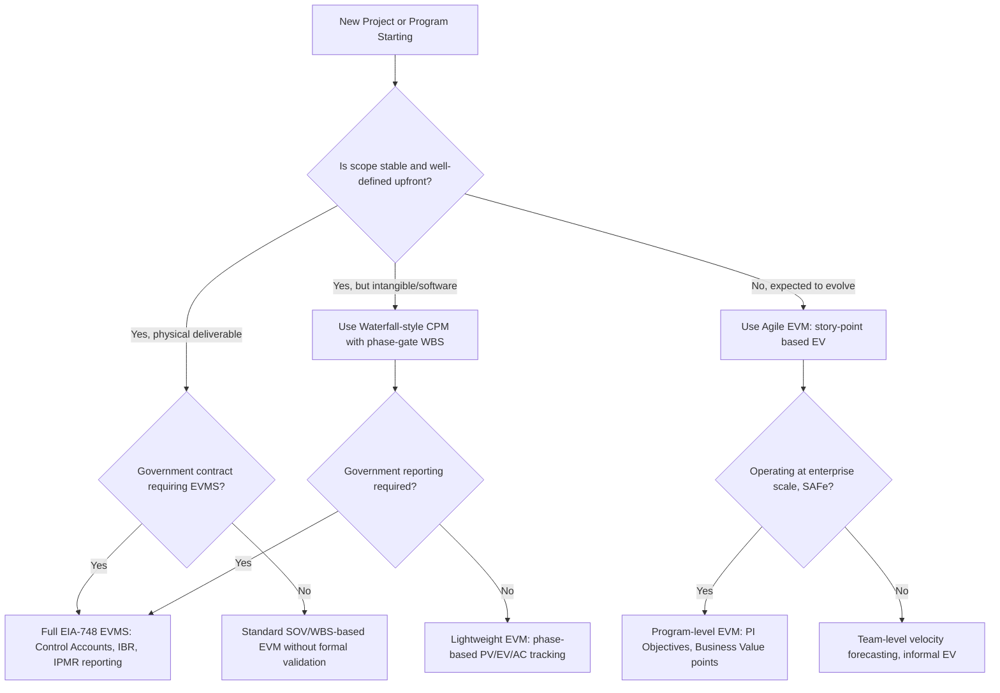

## Comparing Industry Practices and Adaptations


### Overview

Having examined CPM and EVM implementations across construction, aerospace/defense, IT/software, and government contracting individually, this topic synthesizes the comparison directly: how the same underlying mathematics (network scheduling, PV/EV/AC) gets reshaped by each industry's contracting norms, product characteristics, and regulatory environment. The core insight is that **CPM/EVM mechanics are portable, but their inputs, granularity, and governance are not** — a technique's fidelity in one industry can be a poor fit, or even actively misleading, when transplanted without adaptation to another.

**Key Points**

- All four industries examined use the same core EVM formulas (PV, EV, AC, CV, SV, CPI, SPI) — the differences lie in **what counts as a work package**, **how percent-complete is measured**, and **who governs the baseline**.
- Regulatory formality varies from **highly informal** (much commercial IT) to **contractually mandated with government surveillance** (aerospace/defense, large government contracts).
- The industries diverge sharply on **scope stability assumptions**: construction and defense assume a largely fixed baseline; software (especially Agile) assumes scope will evolve.
- Physical/tangible-product industries (construction, aerospace hardware) can use direct physical measurement for percent-complete; intangible-product industries (software) must rely on proxy measures (story points, feature completion).

---

### Cross-Industry Comparison Matrix

| Dimension | Construction | Aerospace/Defense | IT/Software | Government Contracting (cross-cutting) |
| --- | --- | --- | --- | --- |
| Primary governing standard | Contract specs, AIA documents | EIA-748, MIL-STD-881 | None universal; PMI/Agile Alliance guidance | FAR/DFARS, EIA-748 |
| Work package granularity | SOV line items | Control Accounts (WBS x OBS) | Features/Epics/Stories or WBS phases | Control Accounts (when EVMS required) |
| Percent-complete method | Units complete, milestone, cost ratio | Milestone, weighted, LOE | Story points, feature acceptance | Same as underlying industry, plus formal CAM sign-off |
| Baseline stability assumption | High (change orders formally processed) | Very high (formal baseline change control) | Low to moderate (Agile expects evolution) | High (formal baseline change control required) |
| Physical progress measurement | Direct (visual/physical inspection) | Direct for hardware; indirect for software-heavy systems | Indirect only (no physical artifact) | Depends on underlying industry |
| Typical schedule tool | Primavera P6, MS Project | Primavera P6, Deltek Open Plan | Jira/Azure DevOps (Agile), MS Project (Waterfall) | Primavera P6 (.XER) common requirement |
| Reporting cadence to owner/customer | Monthly (tied to pay application) | Monthly (IPMR) | Sprint-based (1-4 weeks) or monthly rollups | Monthly (IPMR/CPR) |
| Dispute resolution mechanism | Delay claims, TIA/Windows analysis | Formal REA/claims process | Rare formal EVM disputes; scope negotiation instead | REA, CDA claims, BCA/COFC |

---

### Why Percent-Complete Methodology Diverges So Sharply

The single biggest source of cross-industry divergence in EVM fidelity is **how percent-complete is measured**, because it directly determines EV, which in turn drives every downstream metric.

$$EV = \%\ Complete \times BAC$$

- **Construction**: Percent-complete is often near-directly observable — a superintendent can visually verify that a slab is poured or that drywall is 60% installed by area.
- **Aerospace/Defense hardware**: Similarly observable for physical components, though software-intensive subsystems within a hardware program (e.g., avionics software) inherit the same measurement problem as IT/software generally.
- **IT/Software**: Percent-complete has no direct physical analog. "80% done" on a feature is inherently a **proxy judgment** — often based on story point burndown, task checklist completion, or developer self-report — all of which are more subjective and more prone to the well-known **90% syndrome**, where reported progress stalls near completion because remaining integration/bug-fixing work was underestimated.

[Inference] This measurement asymmetry is likely the primary reason EVM adoption in software has historically lagged construction and defense — not lack of awareness of the technique, but the genuine difficulty of producing a percent-complete number with comparable reliability to a poured concrete slab.

---

### Baseline Stability: The Central Philosophical Divide

#### Fixed-Baseline Industries (Construction, Aerospace/Defense)

These industries treat the **Performance Measurement Baseline as a controlled, near-immutable reference** against which all variance is measured. Changes require formal governance (Baseline Change Requests, Change Orders) precisely because the entire value of EVM depends on comparing performance against a stable yardstick.

#### Evolving-Scope Industries (Agile Software)

Agile explicitly embraces the idea that **the backlog will change** as learning occurs. This creates genuine tension with classical EVM, which assumes BAC is fixed. The industry's response (Agile EVM, story-point EV, velocity-based forecasting — covered in the IT/Software topic) is fundamentally a set of **workarounds to preserve EVM's governance value without violating Agile's adaptive-planning principle**.

[Inference] This is arguably the deepest cross-industry philosophical divide covered in this comparison: whether "earned value" measures progress against a **promise made once** (construction/defense) or progress against a **continuously renegotiated plan** (Agile software) — and hybrid approaches like SAFe attempt to sit between these two positions by fixing scope at the Program Increment level while allowing flexibility within it.

---

### Regulatory Formality Spectrum



```
Highly Informal -------------------------------------------------→ Highly Formal
Commercial IT        Commercial          Government          Government
(startups,           Construction        Construction        Aerospace/Defense
internal projects)   (owner-driven,      (FAR/DFARS,         (EIA-748 validated
                      contract-driven)    UFGS specs)         EVMS, IBR, surveillance)
```

[Inference] Government contracting acts as a "formality multiplier" applied on top of whichever industry it touches — government construction is more formally scheduled than commercial construction, and government IT (subject to Federal IT Acquisition requirements) is more formally tracked than commercial software development, even though the underlying industry techniques are similar.

---

### Common Threads Across All Industries

Despite the divergence above, several EVM/CPM principles hold constant regardless of industry:

- **The critical path drives schedule risk everywhere**: Whether it's structural steel erection, avionics integration testing, or backend API development, the longest dependent chain of activities determines project duration, and non-critical-path delays (within their float) don't threaten the end date.
- **CPI and SPI trends matter more than single-period snapshots**: A one-month dip in CPI is far less informative than a consistent downward trend across the trailing 3-6 reporting periods, across every industry examined.
- **Variance thresholds trigger the same management response pattern**: identify cause → assess impact → develop corrective action — whether formalized as a government-mandated VAR or an informal team retrospective action item.
- **Baseline integrity is the foundation of EVM's credibility**: In every industry, an EVM system loses analytical value the moment the baseline is manipulated to avoid showing unfavorable variance (whether through SOV front-loading in construction or "point inflation" in Agile story estimation).

---

### Adapting CPM/EVM When Moving Between Industries: Practical Guidance

**Example** scenario: A defense contractor's Program Management Office is asked to apply its EIA-748-compliant EVMS approach to an internal Agile software modernization initiative that has no external government reporting requirement.

**Output** — recommended adaptations:

- Retain the **governance discipline** (baseline change control, regular variance review, root-cause analysis) since these have value independent of contract type.
- Replace **dollar-weighted Control Accounts** with **story-point-weighted Features/Epics**, since the software team's natural unit of estimation is points, not budgeted labor hours per discrete task.
- Relax the **formal IBR-equivalent** to a lighter-weight **release planning review**, since there's no external customer requiring formal joint baseline acceptance.
- Preserve the **CPI/SPI-equivalent reporting cadence** but recalculate it every sprint rather than monthly, matching the natural feedback loop of the delivery methodology.

[Inference] This kind of selective adaptation — keeping the governance principles while discarding the industry-specific mechanics that don't fit — is a commonly recommended approach in hybrid EVM literature, rather than either fully importing a heavyweight EVMS or abandoning EVM discipline altogether.

---

### Diagram: Industry Comparison Across Key EVM Dimensions (svg_diagram)

<svg xmlns="http://www.w3.org/2000/svg" viewBox="0 0 900 460">
<text x="450" y="26" font-family="Arial" font-size="18" font-weight="bold" text-anchor="middle" fill="#222">Industry Comparison Across Key EVM Dimensions (svg_diagram)</text>
<line x1="150" y1="60" x2="150" y2="420" stroke="#888" stroke-width="1" />
<line x1="150" y1="420" x2="850" y2="420" stroke="#888" stroke-width="1" />

<text x="90" y="105" font-family="Arial" font-size="12" text-anchor="end" fill="#333">Baseline Rigidity</text>

<text x="90" y="185" font-family="Arial" font-size="12" text-anchor="end" fill="#333">Physical Measurability</text>

<text x="90" y="265" font-family="Arial" font-size="12" text-anchor="end" fill="#333">Regulatory Formality</text>

<text x="90" y="345" font-family="Arial" font-size="12" text-anchor="end" fill="#333">Reporting Frequency</text>

<text x="260" y="440" font-family="Arial" font-size="12" text-anchor="middle" fill="#333">Construction</text>

<text x="430" y="440" font-family="Arial" font-size="12" text-anchor="middle" fill="#333">Aero/Defense</text>

<text x="600" y="440" font-family="Arial" font-size="12" text-anchor="middle" fill="#333">IT/Software</text>

<text x="770" y="440" font-family="Arial" font-size="12" text-anchor="middle" fill="#333">Gov't Contracting</text>

<rect x="230" y="85" width="60" height="30" fill="#3b6ea5" opacity="0.8" />
<rect x="400" y="80" width="60" height="35" fill="#3b6ea5" opacity="0.9" />
<rect x="570" y="95" width="60" height="20" fill="#3b6ea5" opacity="0.5" />
<rect x="740" y="80" width="60" height="35" fill="#3b6ea5" opacity="1.0" />
<rect x="230" y="165" width="60" height="30" fill="#b5791a" opacity="0.9" />
<rect x="400" y="165" width="60" height="30" fill="#b5791a" opacity="0.85" />
<rect x="570" y="180" width="60" height="15" fill="#b5791a" opacity="0.4" />
<rect x="740" y="170" width="60" height="25" fill="#b5791a" opacity="0.7" />
<rect x="230" y="245" width="60" height="30" fill="#3c763d" opacity="0.6" />
<rect x="400" y="235" width="60" height="40" fill="#3c763d" opacity="1.0" />
<rect x="570" y="255" width="60" height="20" fill="#3c763d" opacity="0.3" />
<rect x="740" y="230" width="60" height="45" fill="#3c763d" opacity="1.0" />
<rect x="230" y="330" width="60" height="30" fill="#6a3d9a" opacity="0.7" />
<rect x="400" y="330" width="60" height="30" fill="#6a3d9a" opacity="0.7" />
<rect x="570" y="310" width="60" height="50" fill="#6a3d9a" opacity="1.0" />
<rect x="740" y="330" width="60" height="30" fill="#6a3d9a" opacity="0.7" />

<text x="450" y="30" font-family="Arial" font-size="10" text-anchor="middle" fill="#888" />

</svg>

---

### Decision Flow: Selecting an EVM Adaptation Approach



---

### Common Pitfalls When Comparing or Transplanting Practices

- **Assuming EVM percentages are equally reliable across industries**: A CPI of 0.95 in construction (physically verified progress) carries different evidentiary weight than a CPI of 0.95 in an Agile project (self-reported story completion) — treating them as equivalently rigorous is a common analytical error.
- **Importing government-contract formality into contexts that don't need it**: Applying full EIA-748-style Control Account governance to an internal, no-external-reporting software project can create bureaucratic overhead disproportionate to the actual risk being managed.
- **Underestimating how much industry culture shapes tool adoption**: A scheduling tool or metric that succeeds in one industry (e.g., DCMA 14-point schedule health checks in defense) may see little uptake in another (commercial software) not because it's technically inferior, but because the receiving industry lacks the contractual/regulatory forcing function that drove its adoption.
- **Comparing raw SPI/CPI numbers across industries without context**: Because BAC composition, percent-complete methodology, and reporting cadence differ, cross-industry benchmarking of raw EVM metrics without adjusting for methodology is generally not meaningful.

[Inference] These pitfalls reflect general observations about cross-domain technique transfer discussed in program/project management practitioner literature rather than a single canonical source.

---

**Related Topics**

- Hybrid EVM frameworks bridging Waterfall and Agile governance models
- Industry-specific percent-complete methodology selection criteria
- Cross-industry benchmarking limitations for EVM metrics (CPI/SPI comparability)
- Organizational change management when adopting EVM discipline in low-formality industries
- Selecting the right level of EVMS rigor based on contract risk and value (scalable EVM)
- Case studies of EVM adaptation failures from over- or under-applying industry-specific rigor