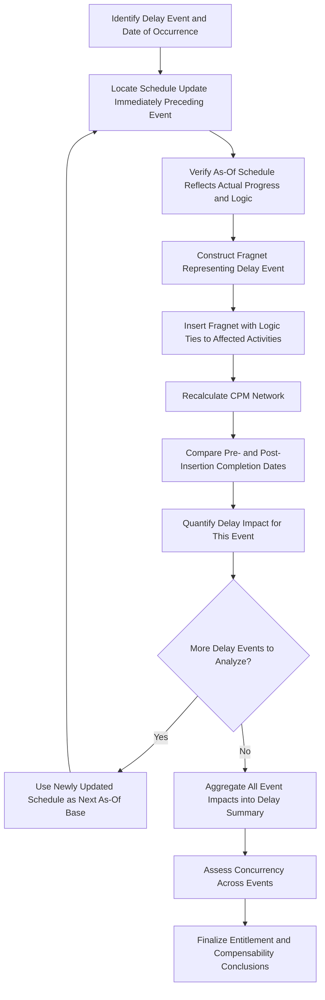

## Delay Analysis Methodologies


### Overview

Delay analysis is the forensic application of CPM scheduling techniques to determine **what caused a project delay, who is responsible, and how much time and cost resulted**. Unlike routine schedule updates performed during project execution, delay analysis is typically conducted **after the fact** (or during an active dispute) to support claims, defend against claims, or simply understand what happened on a troubled project. The methodologies below are drawn primarily from established forensic scheduling practice, most comprehensively codified in **AACE International Recommended Practice 29R-03: Forensic Schedule Analysis**, which catalogs and compares the major techniques used across construction, engineering, and program management disputes.

**Key Points**

- No single delay analysis methodology is universally mandated; selection depends on **contract requirements, data availability, delay timing, and dispute forum preferences**.
- Methodologies split broadly into **as-planned vs. as-built comparison** approaches and **CPM network-based simulation** approaches (inserting or removing delays from a model).
- **Concurrent delay** analysis is a distinct, often contentious sub-discipline determining whether overlapping owner-caused and contractor-caused delays offset each other's compensability.
- The **quality and contemporaneousness of schedule updates** during project execution directly determines which methodologies are even feasible after the fact — you cannot perform a rigorous Windows Analysis on a project with only two schedule updates.

---

### AACE RP 29R-03 Methodology Taxonomy

AACE RP 29R-03 organizes forensic schedule analysis methods into categories based on two key characteristics: whether the analysis is **observational** (comparing what happened) or **modeled** (simulating a scenario), and whether it's **additive** (inserting delays into a schedule) or **subtractive** (removing delays from a schedule).

| Method Family | Observational/Modeled | Additive/Subtractive | Typical Data Requirement |
| --- | --- | --- | --- |
| As-Planned vs. As-Built | Observational | N/A (comparison only) | Baseline schedule + as-built record |
| Impacted As-Planned (Time Impact Analysis variant) | Modeled | Additive | Baseline schedule + delay events |
| Time Impact Analysis (TIA) | Modeled | Additive | Periodic updates + delay events |
| Windows Analysis (Contemporaneous Period Analysis) | Observational/Modeled hybrid | N/A | Series of periodic schedule updates |
| Collapsed As-Built | Modeled | Subtractive | Detailed as-built schedule with logic |

---

### As-Planned vs. As-Built Analysis

The simplest and most widely understood method: overlay the **original baseline schedule** against the **actual as-built schedule** (a record of when activities actually started and finished) to visually identify where deviations occurred.

**Example** comparison:



```
Activity: Structural Steel Erection
Baseline (As-Planned):  Start Day 45  |  Finish Day 75  (30 days)
As-Built:               Start Day 52  |  Finish Day 95  (43 days)
Deviation: 7-day late start, 13-day duration overrun
```

**Strengths**: Simple, intuitive, requires minimal data (just baseline + as-built dates).

**Limitations**: [Inference] This method is generally considered the weakest for establishing **causation** because it shows *that* a deviation occurred but does not, by itself, explain *why* or which party's actions were responsible — it's frequently criticized in forensic scheduling literature and by triers of fact as insufficiently rigorous for complex, multi-causal delay disputes, though it remains useful for simple projects or as a starting point for more detailed analysis.

---

### Impacted As-Planned Method

A **single delay event (or set of events) is inserted into the original baseline schedule**, and the resulting shift in project completion is measured.

$$Delay\ Impact = Completion_{impacted} - Completion_{baseline}$$

**Example**: A baseline schedule shows project completion at Day 200. A newly discovered underground utility conflict (owner-caused) is inserted as a 15-day activity with appropriate logic ties into the original network. Re-running CPM calculation shows completion shifting to Day 213.

**Strengths**: Simple to explain, uses the originally agreed-upon baseline logic (harder for the other party to dispute the underlying network).

**Limitations**: [Inference] This method is often criticized because it ignores how the project **actually progressed** — it assumes the rest of the schedule proceeded exactly as originally planned, which is rarely true on any real project of significant duration, making it most defensible for early-project, single-event delays rather than complex, multi-event disputes spanning the whole project duration.

---

### Time Impact Analysis (TIA)

Widely regarded as one of the more rigorous and commonly required methodologies, particularly in government and defense contracting (see prior Government Contracting Requirements topic). TIA inserts a delay event into the **schedule update current as of the time the delay occurred** (not the original baseline), then measures the resulting impact on the critical path and completion date.

#### TIA Process Steps

1. Identify the **schedule update immediately preceding** the delay event (the "as-of" schedule).
2. Verify the as-of schedule accurately reflects actual progress and logic at that point in time.
3. Insert a **fragnet** (fragment network) representing the delay event, with appropriate logic ties to affected activities.
4. Recalculate the CPM network.
5. Compare the pre-insertion and post-insertion completion dates; the difference is the **quantified delay impact** attributable to that event.
6. Repeat sequentially for each subsequent delay event, using the newly updated schedule as the base for the next analysis.

$$Delay_{event} = Completion_{post\text{-}insertion} - Completion_{pre\text{-}insertion}$$

**Example**

As-of schedule (Update 6, as of Day 120) shows projected completion at Day 250. A design change directive is issued, requiring rework estimated at 12 days with logic ties into the affected structural and MEP activities. After fragnet insertion and recalculation, projected completion shifts to Day 258.

**Output**: The design change directive is quantified as causing an **8-day delay** to project completion (not the full 12-day fragnet duration, since 4 days were absorbed by available float in the network at that point).

[Inference] TIA's requirement to use the contemporaneous as-of schedule (rather than the original baseline) is generally considered its key strength, since it accounts for actual progress and evolving float conditions up to the point of each delay event — this is likely why TIA is frequently the specifically mandated method in government construction and defense contract clauses.

---

### Windows Analysis (Contemporaneous Period Analysis)

Divides the entire project duration into discrete **time windows** (typically aligned with periodic schedule updates — monthly, or between major milestones), then analyzes the **critical path and its shifts within each window** using the actual schedule updates from that period.

#### Windows Analysis Process

1. Divide project duration into windows based on available schedule updates (e.g., Window 1: Days 0-30, Window 2: Days 30-60, etc.).
2. For each window, identify the **critical path** as it existed during that period, using the schedule update data.
3. Identify which activities/delay events drove critical path movement within each window.
4. Attribute responsibility (owner, contractor, neither/excusable) for the delay-causing activities in each window.
5. Aggregate findings across all windows into an overall delay responsibility summary.

**Example** window summary table:

| Window | Period | Critical Path Driver | Delay Days | Responsibility |
| --- | --- | --- | --- | --- |
| 1 | Days 0-45 | Foundation permitting delay | 8 | Owner (permit approval delay) |
| 2 | Days 45-90 | Structural steel fabrication | 5 | Contractor (late submittal approval) |
| 3 | Days 90-135 | Weather (excessive rain days) | 6 | Excusable, non-compensable |
| 4 | Days 135-180 | Owner-directed scope change | 10 | Owner (compensable) |

**Strengths**: [Inference] Windows Analysis is often considered one of the more defensible methodologies for complex, long-duration projects with multiple, overlapping delay causes, because it captures how the critical path **actually shifted over time** rather than relying on a single static model — though it requires a robust set of periodic, well-maintained schedule updates to execute credibly, which is not always available on real projects.

**Limitations**: Highly data-intensive and time-consuming; results can be sensitive to how window boundaries are chosen, which can itself become a point of dispute between opposing experts.

---

### Collapsed As-Built Method

Works in reverse from TIA: starts with the **detailed as-built schedule** (with logic reconstructed to show what actually happened and why) and **removes (subtracts)** specific delay events to determine what the completion date **would have been** without them.

$$Hypothetical\ Completion = Completion_{as\text{-}built} - \sum(Delay\ Events\ Removed,\ net\ of\ float\ absorption)$$

**Example**: Actual as-built completion occurred at Day 265. Removing the owner-caused permit delay (8 days) and the owner-directed scope change (10 days) from the as-built logic network, while retaining all contractor-caused and excusable delays, yields a hypothetical completion of Day 247.

**Output**: The owner-caused delays are quantified as responsible for **18 days** of the total project overrun.

**Limitations**: [Inference] This method requires very detailed as-built logic reconstruction (which activities actually drove which subsequent activities, in fact, not in the original plan) — a labor-intensive and sometimes speculative exercise, since as-built logic is often reconstructed well after the fact from incomplete contemporaneous records, making this method more vulnerable to challenge on the reconstructed logic's accuracy than TIA or Windows Analysis.

---

### Concurrent Delay Analysis

**Concurrent delay** occurs when two or more independent delays — typically one attributable to the owner and one to the contractor — impact the **critical path during the same time period**, each independently capable of causing the same delay to completion.

#### Why Concurrency Matters

Most contracts and legal doctrines hold that during a period of **true concurrent delay**:

- The contractor is entitled to a **time extension** (since it cannot be held responsible for the owner-caused portion), but
- The contractor is **not entitled to compensation** for that period (since the contractor's own concurrent delay would have caused the same schedule impact regardless of the owner's delay)

[Unverified] The precise legal test for "true concurrency" (as opposed to sequential or overlapping-but-not-truly-concurrent delays) varies significantly by jurisdiction and applicable case law (e.g., differing approaches in U.S. federal, U.S. state, and UK common law), and specific contract clauses may define concurrency differently than default legal doctrine — this is an area where legal counsel input is essential alongside the scheduling analysis.

**Example** illustrative concurrency scenario:



```
Days 100-110: Owner fails to provide timely design approval (critical path activity)
Days 102-112: Contractor's steel subcontractor delayed due to fabrication error (also critical path activity, same period)
```

Both delays independently affect the critical path during an overlapping period — a hallmark fact pattern for a concurrency argument, though the actual legal determination depends on the specific facts, contract language, and governing law.

---

### Selecting a Methodology: Practical Decision Factors

| Factor | Favors |
| --- | --- |
| Contract specifies a required method | Use the specified method regardless of preference |
| Limited number of schedule updates available | As-Planned vs. As-Built or Impacted As-Planned |
| Robust, well-maintained periodic updates exist | Windows Analysis or TIA |
| Single, discrete delay event in question | TIA (Impacted As-Planned variant) |
| Multiple, overlapping, long-duration delays | Windows Analysis |
| Dispute forum has established preference (e.g., specific board or court precedent) | Match forum's historically accepted method |
| As-built logic is well-documented and reliable | Collapsed As-Built is feasible |

[Inference] In practice, forensic scheduling experts often perform more than one methodology on the same dispute (or at least sanity-check results across methods) since opposing experts frequently apply different methodologies to the same facts, and reconciling or explaining divergent results is a common feature of contested delay claims.

---

### Diagram: Delay Analysis Methodology Selection Logic (svg_diagram)

<svg xmlns="http://www.w3.org/2000/svg" viewBox="0 0 900 420">
<text x="450" y="26" font-family="Arial" font-size="18" font-weight="bold" text-anchor="middle" fill="#222">Delay Analysis Methodology Selection Logic (svg_diagram)</text>
<rect x="360" y="55" width="180" height="50" rx="8" fill="#dce9f9" stroke="#3b6ea5" stroke-width="1.5" />
<text x="450" y="85" font-family="Arial" font-size="12" text-anchor="middle" fill="#1b3654">Delay Dispute Arises</text>
<rect x="200" y="140" width="200" height="50" rx="8" fill="#fde7c7" stroke="#b5791a" stroke-width="1.5" />
<text x="300" y="162" font-family="Arial" font-size="11" text-anchor="middle" fill="#5c3d09">Contract specifies</text>
<text x="300" y="178" font-family="Arial" font-size="11" text-anchor="middle" fill="#5c3d09">a required method?</text>
<rect x="480" y="140" width="200" height="50" rx="8" fill="#fde7c7" stroke="#b5791a" stroke-width="1.5" />
<text x="580" y="162" font-family="Arial" font-size="11" text-anchor="middle" fill="#5c3d09">Robust periodic</text>
<text x="580" y="178" font-family="Arial" font-size="11" text-anchor="middle" fill="#5c3d09">updates available?</text>
<rect x="120" y="230" width="160" height="45" rx="8" fill="#dff0d8" stroke="#3c763d" stroke-width="1.5" />
<text x="200" y="257" font-family="Arial" font-size="11" text-anchor="middle" fill="#254c26">Use Specified Method</text>
<rect x="400" y="230" width="160" height="45" rx="8" fill="#dff0d8" stroke="#3c763d" stroke-width="1.5" />
<text x="480" y="248" font-family="Arial" font-size="11" text-anchor="middle" fill="#254c26">Windows Analysis</text>
<text x="480" y="264" font-family="Arial" font-size="10" text-anchor="middle" fill="#254c26">or TIA</text>
<rect x="600" y="230" width="180" height="45" rx="8" fill="#f2dede" stroke="#a94442" stroke-width="1.5" />
<text x="690" y="248" font-family="Arial" font-size="11" text-anchor="middle" fill="#5c1a1a">As-Planned vs As-Built</text>
<text x="690" y="264" font-family="Arial" font-size="10" text-anchor="middle" fill="#5c1a1a">or Impacted As-Planned</text>
<rect x="350" y="320" width="260" height="55" rx="8" fill="#e8dff5" stroke="#6a3d9a" stroke-width="1.5" />
<text x="480" y="342" font-family="Arial" font-size="11" text-anchor="middle" fill="#3a1d5c">Check for Concurrent Delay</text>
<text x="480" y="358" font-family="Arial" font-size="10" text-anchor="middle" fill="#3a1d5c">Assess compensability period-by-period</text>
<line x1="450" y1="105" x2="300" y2="140" stroke="#333" stroke-width="1.5" marker-end="url(#arrow5)" />
<line x1="450" y1="105" x2="580" y2="140" stroke="#333" stroke-width="1.5" marker-end="url(#arrow5)" />
<line x1="300" y1="190" x2="200" y2="230" stroke="#333" stroke-width="1.5" marker-end="url(#arrow5)" />
<line x1="580" y1="190" x2="480" y2="230" stroke="#333" stroke-width="1.5" marker-end="url(#arrow5)" />
<line x1="580" y1="190" x2="690" y2="230" stroke="#333" stroke-width="1.5" marker-end="url(#arrow5)" />
<line x1="200" y1="275" x2="400" y2="320" stroke="#333" stroke-width="1.5" marker-end="url(#arrow5)" />
<line x1="480" y1="275" x2="480" y2="320" stroke="#333" stroke-width="1.5" marker-end="url(#arrow5)" />
<line x1="690" y1="275" x2="560" y2="320" stroke="#333" stroke-width="1.5" marker-end="url(#arrow5)" />
</svg>

---

### Process Flow: Time Impact Analysis (TIA) Execution



---

### Common Pitfalls in Delay Analysis

- **Using the wrong as-of schedule for TIA**: Inserting a delay event into a schedule update that doesn't accurately reflect actual progress at that point undermines the entire analysis, since the "before" state is itself unreliable.
- **Cherry-picking window boundaries**: In Windows Analysis, choosing window breakpoints that conveniently isolate favorable periods (rather than aligning with actual, contemporaneously-created schedule updates) is a common point of challenge from opposing experts.
- **Conflating "delay to an activity" with "delay to the project"**: A delay-causing activity only impacts overall project completion if it was on (or became) the critical path at the time — delays to activities with available float do not extend the project unless the float is fully consumed.
- **Ignoring float ownership and consumption**: As noted in the Construction topic, contractual float ownership terms directly affect whether a given delay is compensable, non-compensable, or simply absorbed without consequence.
- **Overreliance on a single methodology without acknowledging limitations**: [Inference] Presenting one methodology's results as definitively conclusive, without addressing why alternative methodologies might reach different conclusions, is a commonly cited weakness that opposing experts and triers of fact often probe during cross-examination or rebuttal.

---

**Related Topics**

- AACE International Recommended Practice 29R-03 full methodology catalog and MIP (Method Implementation Protocol) taxonomy
- Concurrent delay legal doctrine and jurisdictional variation
- Fragnet construction best practices and logic tie selection
- Schedule update quality requirements for supporting credible forensic analysis
- Expert witness preparation and defending delay analysis methodology selection
- Pacing delays and constructive acceleration claims
- Global claims versus itemized/discrete delay claims