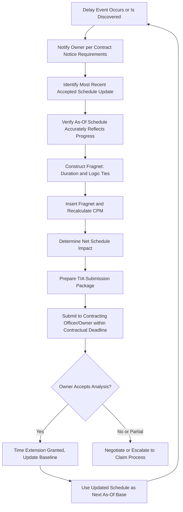

## Time Impact Analysis


### Overview

Time Impact Analysis (TIA) is a **prospective, additive, CPM-based forensic scheduling methodology** used to quantify the effect of a specific delay event on project completion by inserting that event into the schedule update that was current immediately prior to its occurrence. It is widely regarded — and frequently contractually mandated, particularly on government and defense projects — as one of the more analytically rigorous delay analysis methods precisely because it evaluates each delay against the **actual state of the project at the time the delay occurred**, rather than against a static original baseline or a fully reconstructed as-built record. This topic expands on the TIA methodology introduced in Delay Analysis Methodologies, covering its mechanics, variants, common execution challenges, and contractual context in greater depth.

**Key Points**

- TIA answers the specific question: **"Given everything that had actually happened on the project up to this point, how much did this specific delay event push out completion?"**
- The method is inherently **sequential** — each event is analyzed against the schedule as updated by the prior event's insertion, preserving the correct order of causation.
- TIA is frequently **required prospectively** by contract clause (i.e., performed contemporaneously as delays occur, to support real-time time extension requests) as well as **retrospectively** in post-completion claims and disputes.
- The quality of TIA results depends heavily on the accuracy and timeliness of the underlying periodic schedule updates used as the "as-of" base for each analysis.

---

### TIA Fundamentals: Why the As-Of Schedule Matters

The defining characteristic that distinguishes TIA from the simpler **Impacted As-Planned** method is the choice of base schedule into which the delay is inserted.

| Method | Base Schedule Used | Reflects Actual Progress? |
| --- | --- | --- |
| Impacted As-Planned | Original baseline (Day 0 schedule) | No |
| Time Impact Analysis | Most recent update immediately preceding the delay event | Yes |

Because construction and program schedules rarely proceed exactly as originally planned, inserting a delay into the **original baseline** produces a hypothetical scenario increasingly disconnected from reality as the project progresses. TIA avoids this by anchoring each analysis to the schedule's actual, contemporaneous state — including whatever float, logic changes, or prior delays had already occurred.

$$Base\ Schedule_{TIA} = Schedule\ Update_{t-1} \quad \text{(most recent update before delay event at time } t\text{)}$$


---

### The Fragnet: TIA's Core Analytical Tool

A **fragnet** (fragmentary network) is a small CPM sub-network representing the delay event itself — typically consisting of one or more activities with defined durations and logic ties into the existing schedule.

#### Fragnet Construction Requirements

1. **Accurately model the delay event's actual or reasonably estimated duration** — not an arbitrary round number, but a duration supportable by evidence (vendor correspondence, RFI response times, actual rework hours, etc.).
2. **Establish correct logic ties** to predecessor and successor activities in the existing network — this is often the most contested element of a TIA, since the choice of ties directly determines whether the fragnet lands on the critical path.
3. **Avoid "orphan" fragnets** with no logical connection justifying their placement — a fragnet must have a defensible causal relationship to the activities it's tied to.
4. **Reflect the correct relationship type** (Finish-to-Start, Start-to-Start with lag, etc.) consistent with how the delay event actually constrained subsequent work.

**Example** fragnet construction:



```
Delay Event: Owner-issued RFI response for foundation waterproofing detail
             took 22 calendar days (contractually allowed: 10 days)
Fragnet Activity: "RFI Response Delay - Waterproofing Detail"
             Duration: 12 days (22 actual - 10 contractually allowed = 12-day excess)
Logic Ties:
  Predecessor: Foundation Waterproofing Submittal (existing activity) — Finish-to-Start
  Successor:   Foundation Waterproofing Installation (existing activity) — Finish-to-Start
```

[Inference] Using the **excess** duration (actual minus contractually allowed) rather than the full actual duration in the fragnet is a common and generally defensible convention when the contract specifies a response time, since the contractually allowed portion was already anticipated in the baseline schedule's original logic and durations.

---

### Step-by-Step TIA Execution (Detailed)

#### Step 1: Establish the Delay Event Inventory

Compile a chronological list of discrete delay events, typically drawn from project correspondence, RFIs, change orders, meeting minutes, and daily reports. Each event should have a clear **start date**, **causal description**, and **preliminarily estimated duration**.

#### Step 2: Select the As-Of Schedule for Each Event

For each delay event, identify the schedule update whose data date is closest to, but before, the delay event's occurrence.

[Inference] If schedule updates are infrequent (e.g., only issued monthly) and a delay event occurs mid-period, using the prior month's update as the as-of base — rather than attempting to interpolate an intermediate state — is the generally accepted convention, though this introduces some imprecision that a well-documented, more frequently updated schedule would avoid.

#### Step 3: Verify As-Of Schedule Integrity

Before inserting any fragnet, confirm the as-of schedule:

- Accurately reflects actual start/finish dates and percent-complete for activities as of its data date
- Has valid, uncorrupted logic (no unexplained open ends, no illogical out-of-sequence progress without documented justification)
- Reflects the current, un-mitigated critical path

[Inference] Skipping this verification step is one of the most commonly cited weaknesses in disputed TIAs, since an unreliable base schedule undermines every subsequent calculation built on top of it, regardless of how carefully the fragnet itself is constructed.

#### Step 4: Insert the Fragnet and Recalculate

Add the fragnet activities and logic ties, then run the CPM forward/backward pass calculation to determine the network's new critical path and completion date.

#### Step 5: Measure the Delta

$$\Delta_{event} = Completion_{post\text{-}insertion} - Completion_{pre\text{-}insertion}$$

If $\Delta_{event} = 0$, the delay event did not affect the critical path at that point in time (it was absorbed entirely by available float) — an important and sometimes counterintuitive finding, since a "real" delay to an individual activity does not necessarily equal a "compensable" delay to the project.

#### Step 6: Roll Forward to the Next Event

Use the **post-insertion schedule** (with the fragnet now permanently incorporated) as the new as-of base for the next chronological delay event, preserving sequential causation.

#### Step 7: Aggregate and Summarize

Compile all individual event impacts into a summary table, then assess concurrency (see Delay Analysis Methodologies) across events that impacted the critical path during overlapping periods.

---

### Worked Example: Multi-Event TIA

**Example**

A commercial building project has a baseline completion date of Day 300. Three delay events occur sequentially:

| Step | Event | As-Of Schedule Completion | Fragnet Duration | Post-Insertion Completion | Net Impact |
| --- | --- | --- | --- | --- | --- |
| 1 | Owner-caused utility relocation delay | Day 300 | 10 days | Day 308 | 8 days (2 days absorbed by float) |
| 2 | Contractor-caused steel fabrication error | Day 308 | 7 days | Day 308 | 0 days (fully absorbed by float) |
| 3 | Owner-directed scope addition (elevator upgrade) | Day 308 | 15 days | Day 320 | 12 days (3 days absorbed by float) |

**Output**

- Total quantified delay to project completion: **8 + 0 + 12 = 20 days** (Day 300 → Day 320).
- Of this, **20 days are attributable to owner-caused events** (utility relocation + scope addition), and the contractor-caused fabrication error contributed **0 net days** to overall completion despite being a genuine 7-day delay to that specific activity, because it was fully absorbed by available float at that point in the schedule.
- This illustrates a key TIA insight: **event duration and event impact are not the same number**, and conflating them (assuming a 7-day delay event necessarily causes a 7-day project delay) is a common analytical error.

---

### Prospective vs. Retrospective TIA

#### Prospective (Contemporaneous) TIA

Performed **during** project execution, typically required by contract clause as the basis for a formal **time extension request** at or near the time the delay occurs. This is the intended, contract-compliant use of TIA on many government and large commercial contracts.

**Advantages**: [Inference] Contemporaneous TIA generally produces more reliable and less disputable results, since the as-of schedule and delay documentation are created close in time to the actual events, reducing reliance on reconstructed memory or after-the-fact assumptions.

#### Retrospective TIA

Performed **after project completion** (or well after the delay occurred), often during claim preparation or litigation/arbitration, reconstructing the sequential TIA process using historical schedule updates and documentation.

**Challenges**: [Inference] Retrospective TIA is generally considered more vulnerable to challenge, since selecting the "correct" as-of schedule and fragnet duration/logic long after the fact involves more interpretive judgment, and opposing experts may reasonably disagree on these choices in ways that are harder to resolve than if the analysis had been performed contemporaneously.

---

### Contractual Basis for TIA Requirements

Many government and large commercial contracts specify TIA (often by name) as the **required or preferred** method for evaluating time extension requests. As covered in the Government Contracting Requirements topic, this is particularly common in:

- **Federal construction specifications** (many derived from or referencing UFGS-style schedule specification language)
- **DoD and NASA program contracts**, where schedule impact substantiation ties directly to REA and equitable adjustment processes
- **State DOT specifications**, many of which explicitly require TIA submission within a specified number of days of a delay event's occurrence or discovery

**Example** illustrative contract clause language:

> "Contractor shall submit a Time Impact Analysis, using the schedule update most recently accepted prior to the delay event, within 15 calendar days of the event's occurrence or discovery, whichever is later, as a condition precedent to any time extension request."

[Unverified] Specific submission deadlines and procedural conditions vary significantly by contract and should be verified against the governing contract's actual specification language rather than assumed from this illustrative example.

---

### Diagram: TIA Sequential Insertion Process (svg_diagram)

<svg xmlns="http://www.w3.org/2000/svg" viewBox="0 0 900 400">
<text x="450" y="26" font-family="Arial" font-size="18" font-weight="bold" text-anchor="middle" fill="#222">TIA Sequential Insertion Process (svg_diagram)</text>
<rect x="30" y="70" width="160" height="55" rx="8" fill="#dce9f9" stroke="#3b6ea5" stroke-width="1.5" />
<text x="110" y="93" font-family="Arial" font-size="11" text-anchor="middle" fill="#1b3654">As-Of Schedule</text>
<text x="110" y="109" font-family="Arial" font-size="11" text-anchor="middle" fill="#1b3654">Completion: Day 300</text>
<rect x="240" y="70" width="160" height="55" rx="8" fill="#fde7c7" stroke="#b5791a" stroke-width="1.5" />
<text x="320" y="93" font-family="Arial" font-size="11" text-anchor="middle" fill="#5c3d09">Insert Fragnet 1</text>
<text x="320" y="109" font-family="Arial" font-size="11" text-anchor="middle" fill="#5c3d09">Utility Delay (10d)</text>
<rect x="450" y="70" width="160" height="55" rx="8" fill="#dff0d8" stroke="#3c763d" stroke-width="1.5" />
<text x="530" y="93" font-family="Arial" font-size="11" text-anchor="middle" fill="#254c26">New Completion</text>
<text x="530" y="109" font-family="Arial" font-size="11" text-anchor="middle" fill="#254c26">Day 308 (+8d net)</text>
<rect x="240" y="180" width="160" height="55" rx="8" fill="#fde7c7" stroke="#b5791a" stroke-width="1.5" />
<text x="320" y="203" font-family="Arial" font-size="11" text-anchor="middle" fill="#5c3d09">Insert Fragnet 2</text>
<text x="320" y="219" font-family="Arial" font-size="11" text-anchor="middle" fill="#5c3d09">Steel Error (7d)</text>
<rect x="450" y="180" width="160" height="55" rx="8" fill="#dff0d8" stroke="#3c763d" stroke-width="1.5" />
<text x="530" y="203" font-family="Arial" font-size="11" text-anchor="middle" fill="#254c26">New Completion</text>
<text x="530" y="219" font-family="Arial" font-size="11" text-anchor="middle" fill="#254c26">Day 308 (+0d net)</text>
<rect x="240" y="290" width="160" height="55" rx="8" fill="#fde7c7" stroke="#b5791a" stroke-width="1.5" />
<text x="320" y="313" font-family="Arial" font-size="11" text-anchor="middle" fill="#5c3d09">Insert Fragnet 3</text>
<text x="320" y="329" font-family="Arial" font-size="11" text-anchor="middle" fill="#5c3d09">Scope Addition (15d)</text>
<rect x="450" y="290" width="160" height="55" rx="8" fill="#e8dff5" stroke="#6a3d9a" stroke-width="1.5" />
<text x="530" y="313" font-family="Arial" font-size="11" text-anchor="middle" fill="#3a1d5c">Final Completion</text>
<text x="530" y="329" font-family="Arial" font-size="11" text-anchor="middle" fill="#3a1d5c">Day 320 (+12d net)</text>
<line x1="190" y1="97" x2="240" y2="97" stroke="#333" stroke-width="1.5" marker-end="url(#arrow6)" />
<line x1="400" y1="97" x2="450" y2="97" stroke="#333" stroke-width="1.5" marker-end="url(#arrow6)" />
<line x1="530" y1="125" x2="320" y2="180" stroke="#333" stroke-width="1.5" marker-end="url(#arrow6)" />
<line x1="400" y1="207" x2="450" y2="207" stroke="#333" stroke-width="1.5" marker-end="url(#arrow6)" />
<line x1="530" y1="235" x2="320" y2="290" stroke="#333" stroke-width="1.5" marker-end="url(#arrow6)" />
<line x1="400" y1="317" x2="450" y2="317" stroke="#333" stroke-width="1.5" marker-end="url(#arrow6)" />
</svg>

---

### Process Flow: Contemporaneous TIA Submission Under Contract



---

### Common Pitfalls in TIA Execution

- **Using an unverified or corrupted as-of schedule**: If the base schedule doesn't accurately reflect actual progress, every downstream calculation inherits that unreliability, regardless of how carefully the fragnet itself is built.
- **Overstating fragnet duration**: Using the full actual delay duration when a contractual allowance period should be netted out first overstates the compensable impact.
- **Arbitrary or self-serving logic ties**: Tying a fragnet to activities in a way that maximizes (or minimizes) impact without genuine causal justification is one of the most frequently challenged aspects of any TIA in dispute.
- **Failing to roll forward sequentially**: Analyzing multiple delay events independently against the same original as-of schedule (rather than sequentially, using each prior result as the next base) can produce double-counted or inconsistent impact totals.
- **Ignoring float consumption**: As the worked example shows, assuming an event's duration equals its schedule impact — without checking whether float absorbed some or all of it — is a common source of overstated claims.
- **Missing contractual submission deadlines**: Since many contracts treat timely TIA submission as a **condition precedent** to a time extension request, procedural non-compliance can bar an otherwise well-supported analysis on technical grounds alone.

---

**Related Topics**

- Fragnet construction standards and logic tie selection criteria in depth
- Windows Analysis as an alternative or complementary methodology for multi-event disputes
- Concurrent delay determination when multiple TIA-quantified events overlap
- Contractual notice and condition-precedent requirements for time extension claims
- Float ownership clauses and their effect on TIA-quantified impact allocation
- Constructive acceleration claims arising from denied or delayed time extension requests
- Schedule update quality standards required to support credible contemporaneous TIA