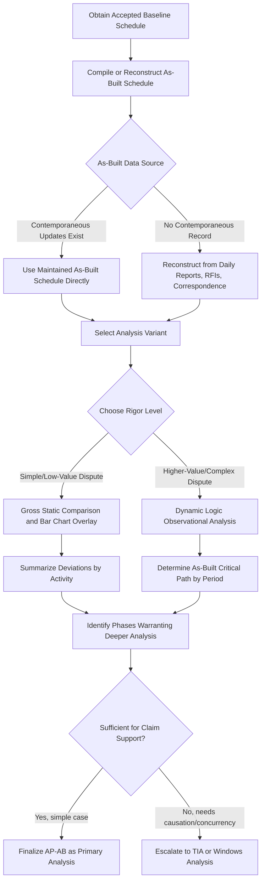

## As Planned Versus As Built Comparisons


### Overview

As-Planned versus As-Built (AP-AB) analysis is the most foundational and widely understood delay analysis methodology, comparing the **originally planned schedule** (the accepted baseline) against the **actual record of what happened** (the as-built schedule) to identify where, when, and by how much the project deviated from plan. It is often the **first analytical step** performed on any delayed project — even when a more rigorous methodology like Time Impact Analysis or Windows Analysis will ultimately be used — because it provides an accessible, visual overview of deviation before deeper causal analysis begins. This topic covers the method's mechanics, its several distinct variants (which differ meaningfully in analytical rigor), and the specific limitations that lead practitioners to treat it as a starting point rather than a conclusive determination of entitlement.

**Key Points**

- AP-AB is fundamentally an **observational, comparative** method — it documents *that* deviation occurred, and its variants differ in how much *causal* analysis is layered on top of that comparison.
- The method requires two core inputs: an **accepted baseline schedule** and a **reliable as-built record** (which itself must often be reconstructed from project documentation if not maintained contemporaneously as a schedule).
- AACE RP 29R-03 recognizes **several distinct sub-variants** of AP-AB analysis, ranging from simple bar-chart overlay to more sophisticated gross/net and observational approaches.
- Because it does not inherently model **float consumption** or **concurrent causation** with the same rigor as TIA or Windows Analysis, AP-AB is generally considered better suited to simple projects or as a preliminary diagnostic than as sole support for a complex, high-value claim.

---

### Core Inputs Required

#### The Baseline (As-Planned) Schedule

The **originally accepted CPM schedule** — ideally the specific baseline formally approved by the owner/customer at project start, since using an unapproved or superseded version can itself become a point of dispute about which "plan" is the correct reference point.

#### The As-Built Schedule

A record of **actual start and finish dates** for every activity, which can come from:

- A formally maintained **as-built schedule file** updated throughout the project (best case — contemporaneous and reliable)
- **Reconstruction after the fact** from daily reports, inspection records, RFIs, meeting minutes, photographs, and correspondence (more common in disputes, but more labor-intensive and more vulnerable to challenge on accuracy)

[Inference] The reliability of an AP-AB analysis is generally only as strong as the weaker of these two inputs — a perfectly maintained baseline compared against a poorly reconstructed as-built record (or vice versa) produces a comparison whose conclusions are only as trustworthy as the weakest link.

---

### AP-AB Variants per AACE RP 29R-03

AACE's forensic schedule analysis taxonomy distinguishes several AP-AB sub-methods that differ in analytical sophistication:

| Variant | Description | Rigor Level |
| --- | --- | --- |
| **Gross/Static Comparison** | Simple side-by-side comparison of planned vs. actual start/finish dates and durations, without further CPM recalculation | Lowest |
| **As-Planned vs. As-Built, Bar Chart Overlay** | Visual overlay of Gantt bars showing planned vs. actual timing, often color-coded by activity status | Low-Moderate |
| **Observational, Dynamic/Static Logic Method** | Applies the as-built logic (dynamic) or retains as-planned logic (static) while overlaying actual dates, allowing some critical path inference | Moderate |
| **Net Impact / As-Planned Total Time** | Aggregates total deviation across the project to reach an overall "net" delay figure, sometimes without granular event-by-event attribution | Low-Moderate |

[Inference] The "static logic" variant (retaining the original planned logic while substituting actual dates) tends to produce different — and sometimes contradictory — critical path conclusions compared to the "dynamic logic" variant (which allows the critical path to shift based on how activities actually related to each other), which is one reason opposing experts using nominally the "same" AP-AB method can still reach different conclusions.

---

### Basic Gross Comparison: Mechanics

**Example**



```
Activity: HVAC Rough-In
As-Planned: Start Day 60 | Finish Day 90 (30 days)
As-Built:   Start Day 68 | Finish Day 110 (42 days)

Deviation:
  Start Variance:    +8 days late
  Duration Variance: +12 days (40% longer than planned)
  Finish Variance:   +20 days late
```

Aggregating this across all activities produces a project-wide deviation summary, typically visualized as a bar chart with planned bars and actual bars stacked for comparison.

**Output** — a gross comparison summary table might show:

| Activity | Planned Duration | Actual Duration | Variance | Planned Finish | Actual Finish | Finish Variance |
| --- | --- | --- | --- | --- | --- | --- |
| Site Mobilization | 10d | 10d | 0d | Day 10 | Day 10 | 0d |
| Foundations | 35d | 48d | +13d | Day 45 | Day 58 | +13d |
| Structural Steel | 30d | 43d | +13d | Day 75 | Day 101 | +26d |
| HVAC Rough-In | 30d | 42d | +12d | Day 90 | Day 110 | +20d |
| Overall Project | 300d | 340d | +40d | Day 300 | Day 340 | +40d |

---

### Dynamic Logic Observational Method

A more sophisticated AP-AB variant applies the **as-built logic** (i.e., the actual relationships between activities as they occurred, which may differ from the original planned logic if work proceeded out of sequence) to determine what the **actual critical path** was during each period, rather than simply comparing static planned-vs-actual dates without further analysis.

#### Process

1. Reconstruct or confirm the **as-built logic network** — which activities actually drove which successors, based on physical/documentary evidence, not just the original plan.
2. Perform a **backward pass calculation using as-built durations and dates** to identify the as-built critical path.
3. Compare the as-built critical path to the as-planned critical path to identify where and when the critical path **shifted** and what drove each shift.
4. Attribute responsibility for critical-path-driving deviations to the appropriate party or cause (owner, contractor, excusable/weather, etc.).

[Inference] This dynamic approach begins to resemble Windows Analysis in its use of actual, period-specific critical path determination, and the line between a rigorous "Observational, Dynamic Logic" AP-AB analysis and a full Windows Analysis is [Inference] often more a matter of degree (number of discrete comparison points, granularity of periods) than a sharp categorical distinction — which is part of why AACE's taxonomy places them along a continuum rather than treating every method as fully distinct.

---

### What AP-AB Analysis Can and Cannot Establish

#### What It Can Establish

- **That** deviation occurred, and its magnitude (start variance, duration variance, finish variance) for any given activity.
- A **general visual pattern** of where the project fell behind, useful for identifying which project phases warrant deeper causal investigation.
- **Total project overrun** in aggregate (planned duration vs. actual duration), providing a starting quantum figure even before allocation to specific causes.

#### What It Generally Cannot Establish (Without Further Analysis)

- **Causation** — the mere fact that Structural Steel finished 26 days late does not, by itself, establish *why*, or whether the cause was excusable, compensable, or the contractor's own fault.
- **Float consumption accuracy** — simple gross comparison does not reliably distinguish between a delay that consumed available float (no net project impact) and one that directly extended the critical path.
- **Concurrency** — without period-by-period critical path determination, AP-AB alone struggles to identify whether two deviations occurred concurrently and how that should affect compensability.

[Inference] This gap between "documenting deviation" and "establishing causation and entitlement" is the central reason AACE RP 29R-03 and forensic scheduling practitioners generally treat basic AP-AB as **necessary but not sufficient** for a well-supported claim — it typically needs to be paired with, or superseded by, a more granular methodology like TIA or Windows Analysis when the dispute involves significant value or multiple competing causes.

---

### When AP-AB Is Appropriately Used as the Primary Method

Despite its limitations, AP-AB comparison can be an appropriate **standalone** method (rather than merely a preliminary step) in specific circumstances:

- **Simple, short-duration projects** with few activities and a single, clearly dominant cause of delay.
- **Preliminary claim assessment** — before investing in more labor-intensive TIA or Windows Analysis, to gauge whether the magnitude of deviation justifies the cost of deeper analysis.
- **Low-value disputes** where the cost of a more rigorous methodology would be disproportionate to the amount in controversy.
- **Situations with only two data points available** (baseline and final as-built), where no periodic updates exist to support Windows Analysis or a properly sequenced TIA.

[Inference] Practitioners often describe AP-AB as the "first pass" of a forensic schedule analysis engagement — useful for scoping the investigation and identifying which project phases warrant the deeper, more resource-intensive analysis that a formal claim will ultimately require.

---

### Diagram: As-Planned vs As-Built Bar Chart Overlay (svg_diagram)

<svg xmlns="http://www.w3.org/2000/svg" viewBox="0 0 900 380">
<text x="450" y="26" font-family="Arial" font-size="18" font-weight="bold" text-anchor="middle" fill="#222">As-Planned vs As-Built Bar Chart Overlay (svg_diagram)</text>

<text x="30" y="70" font-family="Arial" font-size="12" fill="#333">Site Mobilization</text>

<rect x="180" y="58" width="60" height="16" fill="`#3b6ea5`" opacity="0.6" />

<rect x="180" y="76" width="60" height="16" fill="`#a94442`" opacity="0.8" />

<text x="30" y="120" font-family="Arial" font-size="12" fill="#333">Foundations</text>

<rect x="240" y="108" width="180" height="16" fill="`#3b6ea5`" opacity="0.6" />

<rect x="240" y="126" width="248" height="16" fill="`#a94442`" opacity="0.8" />

<text x="30" y="170" font-family="Arial" font-size="12" fill="#333">Structural Steel</text>

<rect x="420" y="158" width="150" height="16" fill="`#3b6ea5`" opacity="0.6" />

<rect x="488" y="176" width="215" height="16" fill="`#a94442`" opacity="0.8" />

<text x="30" y="220" font-family="Arial" font-size="12" fill="#333">HVAC Rough-In</text>

<rect x="570" y="208" width="150" height="16" fill="`#3b6ea5`" opacity="0.6" />

<rect x="638" y="226" width="210" height="16" fill="`#a94442`" opacity="0.8" />

<rect x="30" y="280" width="18" height="14" fill="#3b6ea5" opacity="0.6" />
<text x="55" y="292" font-family="Arial" font-size="12" fill="#333">As-Planned</text>
<rect x="180" y="280" width="18" height="14" fill="#a94442" opacity="0.8" />
<text x="205" y="292" font-family="Arial" font-size="12" fill="#333">As-Built</text>
<line x1="30" y1="320" x2="870" y2="320" stroke="#888" stroke-width="1" />
<text x="180" y="335" font-family="Arial" font-size="10" fill="#666">Day 0</text>
<text x="500" y="335" font-family="Arial" font-size="10" fill="#666">Day 150</text>
<text x="850" y="335" font-family="Arial" font-size="10" fill="#666">Day 340</text>
</svg>

---

### Process Flow: AP-AB Analysis Workflow



---

### Common Pitfalls in As-Planned vs. As-Built Analysis

- **Using an unapproved or superseded baseline**: If the "as-planned" schedule wasn't the formally accepted baseline (e.g., using a later, already-revised schedule as if it were the original plan), the entire comparison's reference point is compromised.
- **Reconstructing as-built dates from unreliable sources**: As-built dates pieced together from incomplete daily reports or inconsistent correspondence are more vulnerable to challenge than a contemporaneously maintained as-built schedule.
- **Treating gross deviation as automatically compensable**: The most common substantive error — assuming that because an activity or the overall project finished late, someone owes compensation for that exact number of days, without addressing causation, concurrency, or float consumption.
- **Mixing static and dynamic logic inconsistently**: Applying as-planned logic to some parts of the comparison and as-built logic to others, without a clear and disclosed rationale, undermines the internal consistency of the analysis and invites challenge.
- **Presenting AP-AB as conclusive for a complex, high-value dispute**: As discussed above, this method's inherent limitations on causation and concurrency generally make it insufficient as the sole basis for entitlement determination once a dispute moves beyond a simple, low-value scenario.

---

**Related Topics**

- Time Impact Analysis as the natural escalation from AP-AB when causation must be established
- Windows Analysis and its relationship to the dynamic logic AP-AB variant
- As-built schedule reconstruction techniques from project documentation
- Baseline schedule acceptance and approval documentation requirements
- Float consumption analysis and its role in distinguishing activity delay from project delay
- AACE RP 29R-03 full Method Implementation Protocol (MIP) numbering and taxonomy
- Presenting forensic schedule analysis findings to non-technical decision-makers (mediators, arbitrators, boards)