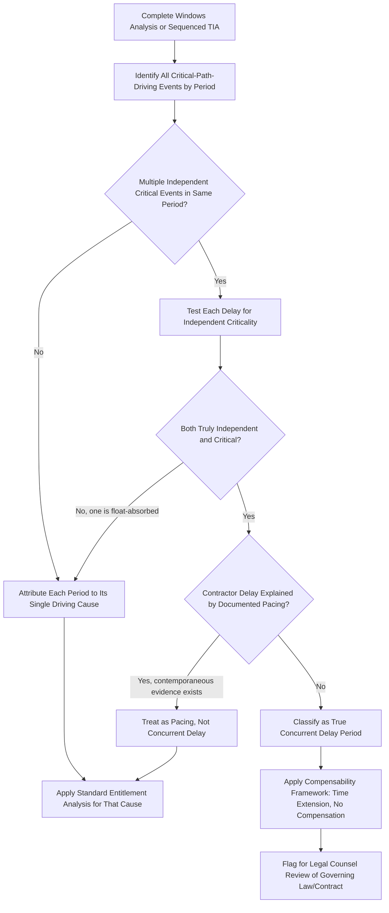

## Concurrent Delay Concepts


### Overview

Concurrent delay is one of the most analytically and legally complex sub-disciplines within forensic scheduling, addressing what happens when **two or more independent delay events, attributable to different parties, simultaneously affect the project's critical path**. Because standard delay analysis methodologies (TIA, Windows Analysis, AP-AB) are designed to isolate and quantify individual delay events, concurrent delay requires an additional analytical and legal layer to determine **entitlement and compensability** when responsibility for a single period of lost time cannot be cleanly attributed to one party alone. This topic builds directly on the methodologies covered in Delay Analysis Methodologies, Time Impact Analysis, and As-Planned vs. As-Built Comparisons, focusing specifically on how concurrency is identified, tested, and resolved.

**Key Points**

- Concurrent delay requires that both delays **independently** affect the **critical path** during an **overlapping time period** — a delay to a non-critical activity, or two delays occurring at different times, does not constitute true concurrency.
- The prevailing (though not universal) rule across many U.S. jurisdictions is that during a period of true concurrent delay, the contractor receives a **time extension but not monetary compensation**, since the owner-caused portion doesn't shorten the schedule if the contractor's own delay would have caused the same result anyway.
- **"Concurrency" is a heavily contested legal and factual issue**, not a purely mechanical scheduling calculation — reasonable experts frequently disagree on whether a given fact pattern meets the threshold for true concurrency.
- Distinguishing **true concurrent delay** from **sequential delay** or **pacing delay** (where a contractor deliberately slows non-critical work in response to an owner delay) is a recurring and often outcome-determinative analytical challenge.

---

### Defining True Concurrent Delay

For delay to be considered truly concurrent, forensic scheduling and legal practice generally require that the following conditions hold simultaneously:

1. **Both delays occur during the same time period** (temporal overlap).
2. **Both delays independently affect the critical path** — each one, on its own, would have caused the same (or materially similar) delay to project completion even in the absence of the other.
3. **The delays are attributable to different, non-related causes** — typically one to the owner (or excusable/force majeure) and one to the contractor.

$$True\ Concurrency: Delay_A \cap Delay_B \neq \emptyset \ \text{(temporal)}, \quad CP_A = True \ \text{AND} \ CP_B = True \ \text{(independently critical)}$$

[Unverified] This is a simplified conceptual formulation rather than a formally codified legal or mathematical test; the precise threshold for "independently critical" and how strictly overlapping periods must align varies across forensic scheduling literature and, more importantly, across governing law and specific contract language.

---

### Distinguishing Concurrency from Related but Distinct Concepts

#### Sequential (Non-Concurrent) Delay

Two delays that occur at **different times**, even if both eventually affect the critical path, are not concurrent — they are sequential, and each should generally be analyzed and attributed independently using TIA or Windows Analysis.

**Example**: An owner-caused permitting delay occurs in Month 1, and a contractor-caused fabrication delay occurs in Month 4. Even though both delayed the project, they did not overlap in time and are not concurrent.

#### Pacing Delay

A **pacing delay** occurs when a contractor, recognizing that the owner has already caused a delay that will extend the completion date regardless, deliberately **slows down** work on non-critical (or even critical) activities to match the owner-caused delay's pace, rather than continuing to work at full speed toward a completion date that will be extended anyway.

[Inference] Pacing is often confused with concurrent delay, but they are conceptually distinct: concurrency involves two delays that **independently** would have caused the same impact, while pacing involves a **deliberate, reasonable response** to an already-established owner delay — and many jurisdictions treat a properly documented pacing decision as **not** constituting contractor-caused concurrent delay, provided the contractor can demonstrate the pacing was a reasonable, intentional response (rather than the contractor's own independent inefficiency dressed up after the fact as "pacing").

**Example** of a defensible pacing scenario:



```
Owner-caused design delay: extends critical path by 20 days (Month 2)
Contractor response: reduces crew size on a now-less-urgent activity,
  documented in writing at the time as a deliberate pacing decision
  to avoid incurring unnecessary acceleration costs
```

[Inference] The key differentiator that tends to determine whether a pacing defense succeeds is **contemporaneous documentation** of the pacing decision and its rationale — pacing claimed only after the fact, without contemporaneous evidence of the deliberate decision, is generally viewed with more skepticism by triers of fact.

#### Concurrent Delay vs. Overlapping but Non-Critical Delay

If Delay A is on the critical path but Delay B, occurring in the same period, affects only an activity with available float (and does not independently drive the critical path), this is **not** true concurrency — only Delay A actually impacted the completion date, regardless of Delay B's overlapping timing.

---

### The Compensability Framework

Once true concurrency is established for a given period, the prevailing analytical framework (subject to jurisdictional and contractual variation) typically resolves as follows:

| Delay Type | Time Extension | Monetary Compensation |
| --- | --- | --- |
| Excusable, Compensable (owner-caused, non-concurrent) | Yes | Yes |
| Excusable, Non-Compensable (weather, force majeure, non-concurrent) | Yes | No |
| Non-Excusable (contractor-caused, non-concurrent) | No | No (may face liquidated damages) |
| **True Concurrent Delay (owner + contractor overlapping)** | **Yes** | **No (generally)** |

[Inference] The "time extension but no compensation" outcome for true concurrent delay reflects underlying reasoning common across various delay law approaches: the contractor should not be penalized with liquidated damages for a delay period during which the owner also independently caused delay (hence the time extension), but the contractor also should not be compensated for a delay period that its own concurrent, independent delay would have caused anyway (hence no monetary award) — though the exact legal reasoning, and whether this outcome is strictly followed, depends on the governing jurisdiction and specific contract terms.

---

### Jurisdictional and Contractual Variation

[Unverified] Approaches to concurrent delay vary meaningfully across legal systems and even across U.S. states and specific contract forms:

- Some approaches apply a **strict "but-for" test**: if the owner's delay alone would have caused the exact same completion date, full concurrency is found regardless of relatively minor timing misalignment.
- Other approaches require **closer temporal and causal alignment** before finding true concurrency, treating near-miss overlaps as sequential rather than concurrent.
- Some **contracts explicitly define concurrency** and its consequences in a "No Damage for Delay" clause or a specific concurrent delay provision, which can override default legal doctrine.
- Government contracts (as discussed in Government Contracting Requirements) often have specific regulatory or case-law-derived approaches (e.g., under the Contract Disputes Act framework) that may differ from private commercial contract treatment.

[Inference] Because of this variation, a forensic scheduler identifying a factual concurrency pattern should generally flag it for legal counsel review of the applicable jurisdiction's and contract's specific treatment, rather than assuming a universal default rule applies — concurrency determinations sit at the intersection of scheduling fact-finding and legal doctrine, and the scheduling analysis alone cannot resolve the legal question.

---

### Analyzing Concurrency Using Windows Analysis

**Windows Analysis** (covered in Delay Analysis Methodologies) is often considered the most natural methodology for concurrency determination, since it establishes the critical path **period-by-period**, making overlapping critical-path-driving events within the same window directly visible.

**Example** concurrency identification within a Windows Analysis:

| Window | Period | Critical Path Driver(s) | Responsibility |
| --- | --- | --- | --- |
| 3 | Days 90-120 | (a) Owner design revision AND (b) Contractor rebar delivery delay — both independently critical during this window | **Concurrent** — time extension likely, compensation likely denied for this window |
| 4 | Days 120-150 | Owner-directed scope change only | Owner-caused, non-concurrent — likely compensable |

[Inference] This period-by-period approach is generally viewed as more defensible for concurrency determination than a project-wide TIA event sequence, since TIA's sequential fragnet insertion process, while excellent for quantifying individual event impacts, does not as naturally reveal whether two events were both independently critical during the exact same window unless the analyst specifically checks for that overlap at each insertion step.

---

### Diagram: Concurrent Delay Identification Logic (svg_diagram)

<svg xmlns="http://www.w3.org/2000/svg" viewBox="0 0 900 400">
<text x="450" y="26" font-family="Arial" font-size="18" font-weight="bold" text-anchor="middle" fill="#222">Concurrent Delay Identification Logic (svg_diagram)</text>
<rect x="350" y="55" width="200" height="50" rx="8" fill="#dce9f9" stroke="#3b6ea5" stroke-width="1.5" />
<text x="450" y="85" font-family="Arial" font-size="12" text-anchor="middle" fill="#1b3654">Two Delays Overlap in Time?</text>
<rect x="120" y="140" width="220" height="50" rx="8" fill="#f2dede" stroke="#a94442" stroke-width="1.5" />
<text x="230" y="162" font-family="Arial" font-size="11" text-anchor="middle" fill="#5c1a1a">No: Analyze as</text>
<text x="230" y="178" font-family="Arial" font-size="11" text-anchor="middle" fill="#5c1a1a">Sequential Delays</text>
<rect x="560" y="140" width="220" height="50" rx="8" fill="#fde7c7" stroke="#b5791a" stroke-width="1.5" />
<text x="670" y="162" font-family="Arial" font-size="11" text-anchor="middle" fill="#5c3d09">Yes: Both Independently</text>
<text x="670" y="178" font-family="Arial" font-size="11" text-anchor="middle" fill="#5c3d09">Critical During Overlap?</text>
<rect x="440" y="230" width="220" height="50" rx="8" fill="#f2dede" stroke="#a94442" stroke-width="1.5" />
<text x="550" y="252" font-family="Arial" font-size="11" text-anchor="middle" fill="#5c1a1a">No: Only Attribute to the</text>
<text x="550" y="268" font-family="Arial" font-size="11" text-anchor="middle" fill="#5c1a1a">Delay Actually on Critical Path</text>
<rect x="680" y="230" width="200" height="50" rx="8" fill="#dff0d8" stroke="#3c763d" stroke-width="1.5" />
<text x="780" y="252" font-family="Arial" font-size="11" text-anchor="middle" fill="#254c26">Yes: Was Contractor</text>
<text x="780" y="268" font-family="Arial" font-size="11" text-anchor="middle" fill="#254c26">Pacing Deliberately?</text>
<rect x="580" y="320" width="180" height="50" rx="8" fill="#e8dff5" stroke="#6a3d9a" stroke-width="1.5" />
<text x="670" y="342" font-family="Arial" font-size="11" text-anchor="middle" fill="#3a1d5c">Yes: Documented Pacing,</text>
<text x="670" y="358" font-family="Arial" font-size="11" text-anchor="middle" fill="#3a1d5c">Not True Concurrency</text>
<rect x="780" y="320" width="100" height="50" rx="8" fill="#dce9f9" stroke="#3b6ea5" stroke-width="1.5" />
<text x="830" y="342" font-family="Arial" font-size="10" text-anchor="middle" fill="#1b3654">No: True</text>
<text x="830" y="358" font-family="Arial" font-size="10" text-anchor="middle" fill="#1b3654">Concurrency</text>
<line x1="350" y1="80" x2="230" y2="140" stroke="#333" stroke-width="1.5" marker-end="url(#arrow7)" />
<line x1="550" y1="80" x2="670" y2="140" stroke="#333" stroke-width="1.5" marker-end="url(#arrow7)" />
<line x1="620" y1="190" x2="550" y2="230" stroke="#333" stroke-width="1.5" marker-end="url(#arrow7)" />
<line x1="720" y1="190" x2="780" y2="230" stroke="#333" stroke-width="1.5" marker-end="url(#arrow7)" />
<line x1="750" y1="280" x2="700" y2="320" stroke="#333" stroke-width="1.5" marker-end="url(#arrow7)" />
<line x1="810" y1="280" x2="830" y2="320" stroke="#333" stroke-width="1.5" marker-end="url(#arrow7)" />
</svg>

---

### Process Flow: Concurrency Analysis Within a Claim



---

### Common Pitfalls in Concurrent Delay Analysis

- **Confusing "delays happening near each other" with true concurrency**: Two delays occurring in the same general month, where only one is actually driving the critical path, do not constitute concurrency — only genuinely independent, simultaneously critical delays qualify.
- **Failing to distinguish pacing from concurrency**: As discussed, treating a documented, deliberate contractor pacing decision as if it were an independent concurrent delay can unfairly shift responsibility that should remain with the owner's original delay.
- **Applying a "default" compensability rule without checking governing law/contract**: Since jurisdictional and contractual treatment of concurrency varies, assuming a single universal rule applies is a common and potentially case-dispositive error.
- **Retroactively characterizing contractor inefficiency as "pacing"**: Without contemporaneous documentation of a deliberate pacing decision, an after-the-fact pacing argument is generally viewed with skepticism, since it can be difficult to distinguish genuine pacing from ordinary underperformance dressed up as a strategic response.
- **Ignoring the need for period-specific (not project-wide) concurrency analysis**: Concurrency is typically a period-by-period determination — a project can have some windows with true concurrency and others without, and treating the entire project delay as uniformly concurrent (or uniformly non-concurrent) oversimplifies the analysis.

---

**Related Topics**

- Windows Analysis methodology as the primary tool for period-specific concurrency determination
- Pacing delay documentation standards and contemporaneous evidence requirements
- Jurisdictional survey of concurrent delay legal doctrine (U.S. federal, state, UK, international)
- No Damage for Delay clauses and their interaction with concurrency doctrine
- Constructive acceleration claims and their relationship to denied time extensions during concurrent periods
- Global claims versus itemized claims when concurrency complicates causal attribution
- Expert testimony strategies for presenting concurrency findings to a trier of fact