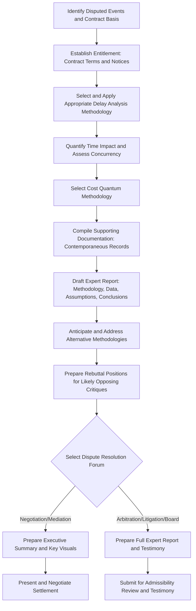

## Using CPM and EVM Data in Dispute Resolution


### Overview

This topic closes out the Claims, Delay Analysis, and Forensic Scheduling chapter by addressing how the delay analysis methodologies (TIA, Windows Analysis, AP-AB, concurrent delay determination) and EVM performance data covered throughout this course are actually **deployed within formal dispute resolution processes** — negotiation, mediation, arbitration, litigation, and specialized boards. Producing a technically sound schedule or cost analysis is necessary but not sufficient; the analysis must also be **presented persuasively, defended under scrutiny, and translated for decision-makers who are typically not scheduling or cost engineering experts**. This is the point where forensic scheduling and EVM analysis intersect most directly with legal process, expert witness practice, and negotiation strategy.

**Key Points**

- CPM and EVM data serve **three distinct dispute functions**: establishing **entitlement** (was there a compensable event), **causation** (did it affect the critical path), and **quantum** (how much time and money resulted).
- Dispute resolution forums vary widely in formality — informal negotiation, mediation, arbitration, formal litigation, and specialized government boards (e.g., Boards of Contract Appeals) — and each has different expectations for how technical analysis is presented.
- **Expert witness testimony** is the primary vehicle through which CPM/EVM analysis enters formal proceedings, subject to admissibility standards and cross-examination.
- **EVM data functions differently from CPM delay analysis in disputes**: EVM primarily supports **cost quantum and early warning/notice arguments**, while CPM delay analysis primarily supports **causation and time entitlement**.

---

### The Three Pillars: Entitlement, Causation, and Quantum

Virtually every construction, defense, or IT contract dispute involving schedule or cost impact can be organized around three analytically distinct questions:

| Pillar | Question | Primary Evidence Type |
| --- | --- | --- |
| **Entitlement** | Did a compensable event occur, and does the contract/law recognize a right to relief? | Contract terms, correspondence, notices, directives |
| **Causation** | Did that event actually affect the critical path or cost performance? | CPM delay analysis (TIA, Windows, AP-AB), EVM variance data |
| **Quantum** | How much time and/or money resulted? | Fragnet durations, cost records, EAC calculations, damages models |

[Inference] A common and often outcome-determinative error in dispute presentation is conflating these three pillars — for example, proving that an owner-caused event occurred (entitlement) without adequately demonstrating that it actually drove the critical path (causation), which a well-prepared opposing party will typically highlight as a gap in the claim.

---

### How CPM Delay Analysis Functions as Evidence

The methodologies covered earlier in this chapter (TIA, Windows Analysis, AP-AB, concurrency determination) serve primarily to establish **causation** and **time quantum** — connecting a specific event to a specific, measured impact on project completion.

#### Key Presentation Considerations

- **Methodology selection must be defensible, not just technically correct**: As discussed in Delay Analysis Methodologies, a technically valid analysis can still be challenged if the chosen methodology doesn't fit the available data or contract requirements (e.g., using AP-AB alone for a complex, multi-causal, high-value dispute).
- **The as-built/as-of schedule data must be traceable to contemporaneous records**: Analyses built on reconstructed, undocumented assumptions are significantly more vulnerable to cross-examination than those tied to dated, contemporaneous project records.
- **Visual aids matter disproportionately for non-expert decision-makers**: Judges, arbitrators, and mediators are typically not scheduling engineers; a clear bar-chart overlay or critical path timeline often carries more persuasive weight in the room than the underlying CPM calculation logic, even though the calculation is what actually supports the visual.

---

### How EVM Data Functions as Evidence

EVM data plays a somewhat different evidentiary role than CPM delay analysis, primarily supporting:

#### Cost Quantum Support

$$Cost\ Overrun\ Attributable\ to\ Disputed\ Event \approx AC_{actual} - AC_{but\text{-}for}$$

Where $AC_{but\text{-}for}$ is a modeled actual cost absent the disputed event — often estimated using historical productivity rates from unaffected, comparable work on the same project (a "measured mile" approach).

#### Early Notice and Mitigation Arguments

Consistent CPI/SPI trend data can support or undermine arguments about **when** a party knew or should have known about an emerging problem, which is often relevant to:

- **Notice provision compliance** (did the contractor provide timely notice as required by the contract once performance trends became apparent?)
- **Mitigation obligations** (did the party take reasonable steps to control cost/schedule impact once adverse trends were visible in the EVM data?)

**Example** illustrative EVM trend evidence:



```
Month 3: CPI = 0.98, SPI = 0.97 (within normal variance)
Month 4: CPI = 0.91, SPI = 0.89 (clear negative trend begins)
Month 5: CPI = 0.85, SPI = 0.82 (trend continues, worsening)
Month 6: CPI = 0.80, SPI = 0.75 (severe underperformance)
Contractor's first formal notice of impact: Month 6
```

**Output**: This trend data could be used by an owner to argue the contractor had visibility into worsening performance by Month 4 and had a duty to provide earlier notice or take mitigating action — while the contractor might counter that the Month 4-5 dip was within a normal range of variance for the type of work, or that root-cause investigation reasonably took until Month 6 to confirm a genuine, notice-triggering trend rather than routine noise.

[Inference] This dual-use nature of EVM trend data — supportive of either party's argument depending on framing — is a common feature of EVM's role in disputes, distinct from CPM delay analysis, which tends to more directly support one side's causation theory once a methodology is applied.

#### Measured Mile Analysis

A specific EVM/productivity-based quantum technique comparing **productivity during the disputed/impacted period** against **productivity during an unimpacted, comparable period** on the same project.

$$Productivity\ Loss = \frac{Unimpacted\ Productivity\ Rate - Impacted\ Productivity\ Rate}{Unimpacted\ Productivity\ Rate}$$

[Inference] Measured mile analysis is generally regarded as one of the more persuasive quantum methodologies (compared to, for example, total cost claims) because it uses the project's own actual performance data as the comparison baseline, rather than relying on external industry benchmarks or an unproven assumption that all cost variance is attributable to the disputed event.

---

### Dispute Resolution Forums and Their Distinct Expectations

#### Direct Negotiation

The least formal forum; CPM/EVM data here typically functions to **establish a credible starting position** and demonstrate the claiming party has done its analytical homework, often influencing whether the other side takes the claim seriously enough to negotiate in good faith versus dismissing it as unsupported.

#### Mediation

A facilitated, non-binding process where a neutral mediator helps parties reach settlement. Technical analysis here is typically presented in **summary form** (executive summaries, key charts) rather than exhaustive detail, since the mediator's role is to facilitate compromise, not adjudicate technical merit in detail.

#### Arbitration

A binding (usually) private dispute resolution process, often required by contract (many construction and government contracts include mandatory arbitration clauses). Arbitrators may have technical/industry expertise (especially in specialized construction arbitration panels), allowing somewhat more technical depth in presentation than a general court might permit, though this varies by arbitral institution and the specific arbitrator panel selected.

#### Litigation

Formal court proceedings, where expert testimony is subject to specific **admissibility standards** (e.g., in the U.S. federal system, the *Daubert* standard governing the reliability and relevance of expert methodology) before a judge or jury who may have no technical background at all.

#### Specialized Boards (Government Contracts)

As discussed in Government Contracting Requirements, government contract disputes often proceed through **Boards of Contract Appeals** or similar specialized tribunals with board members who frequently have substantial experience specifically with government contract disputes, including EVM and CPM scheduling issues — potentially allowing for more technically sophisticated engagement than a general civil court.

[Unverified] The degree of technical sophistication and specific admissibility standards applied varies significantly by jurisdiction, specific board, and arbitral institution; practitioners should confirm the specific forum's requirements and past treatment of similar technical evidence rather than assuming uniform practice across all forums.

---

### Expert Witness Considerations

Because CPM delay analysis and EVM interpretation require specialized expertise, **expert witnesses** (forensic schedulers, cost/damages experts) are typically the vehicle through which this analysis formally enters a dispute resolution proceeding.

#### Key Expert Witness Practice Points

- **Methodology transparency**: A well-prepared expert discloses not just conclusions but the full methodology, underlying data, and key assumptions, since undisclosed or opaque assumptions are prime targets for cross-examination.
- **Addressing alternative methodologies**: As noted in Delay Analysis Methodologies, addressing why an alternative methodology (that might reach a different conclusion) was not used, rather than ignoring it, tends to strengthen credibility.
- **Independence and objectivity**: [Inference] An expert perceived as an advocate rather than an objective analyst generally faces more effective cross-examination and reduced credibility with the trier of fact, regardless of the underlying technical merit of the analysis — this is a widely emphasized point in expert witness practice literature.
- **Rebuttal preparedness**: Anticipating and preparing responses to the opposing expert's likely critiques (methodology choice, data reliability, logic tie assumptions) before they're raised strengthens the overall presentation.

---

### Common Quantum Methodologies Beyond Measured Mile

| Method | Description | General Perception |
| --- | --- | --- |
| **Total Cost Method** | Actual cost minus original bid, claimed entirely as damages | [Inference] Generally viewed as the weakest method, since it assumes the original bid was accurate and all overrun is attributable to the disputed event(s), ignoring contractor-caused inefficiency |
| **Modified Total Cost Method** | Total cost method with adjustments removing known contractor-caused or unrelated cost items | Somewhat stronger than pure total cost, but still criticized for residual imprecision |
| **Discrete/Itemized Cost Method** | Cost impact quantified activity-by-activity or cost-code-by-cost-code, tied to specific causal events | [Inference] Generally regarded as the most defensible approach when sufficient granular data exists, since it ties quantum directly to specific, evidenced causes rather than relying on a residual/subtraction approach |
| **Measured Mile** | Productivity comparison between impacted and unimpacted periods | Discussed above; generally well-regarded when a genuinely comparable unimpacted period exists |

---

### Diagram: CPM/EVM Data Flow Into Dispute Resolution (svg_diagram)

<svg xmlns="http://www.w3.org/2000/svg" viewBox="0 0 900 420">
<text x="450" y="26" font-family="Arial" font-size="18" font-weight="bold" text-anchor="middle" fill="#222">CPM/EVM Data Flow Into Dispute Resolution (svg_diagram)</text>
<rect x="30" y="60" width="180" height="55" rx="8" fill="#dce9f9" stroke="#3b6ea5" stroke-width="1.5" />
<text x="120" y="83" font-family="Arial" font-size="12" text-anchor="middle" fill="#1b3654">CPM Delay Analysis</text>
<text x="120" y="99" font-family="Arial" font-size="10" text-anchor="middle" fill="#1b3654">(TIA/Windows/AP-AB)</text>
<rect x="30" y="150" width="180" height="55" rx="8" fill="#fde7c7" stroke="#b5791a" stroke-width="1.5" />
<text x="120" y="173" font-family="Arial" font-size="12" text-anchor="middle" fill="#5c3d09">EVM Performance Data</text>
<text x="120" y="189" font-family="Arial" font-size="10" text-anchor="middle" fill="#5c3d09">(CPI/SPI Trends)</text>
<rect x="290" y="105" width="180" height="55" rx="8" fill="#dff0d8" stroke="#3c763d" stroke-width="1.5" />
<text x="380" y="128" font-family="Arial" font-size="12" text-anchor="middle" fill="#254c26">Entitlement + Causation</text>
<text x="380" y="144" font-family="Arial" font-size="10" text-anchor="middle" fill="#254c26">+ Quantum Package</text>
<rect x="550" y="105" width="180" height="55" rx="8" fill="#e8dff5" stroke="#6a3d9a" stroke-width="1.5" />
<text x="640" y="128" font-family="Arial" font-size="12" text-anchor="middle" fill="#3a1d5c">Expert Witness Report</text>
<text x="640" y="144" font-family="Arial" font-size="10" text-anchor="middle" fill="#3a1d5c">&amp; Testimony</text>
<rect x="30" y="260" width="150" height="45" rx="8" fill="#f2dede" stroke="#a94442" stroke-width="1.5" />
<text x="105" y="286" font-family="Arial" font-size="11" text-anchor="middle" fill="#5c1a1a">Negotiation</text>
<rect x="210" y="260" width="150" height="45" rx="8" fill="#f2dede" stroke="#a94442" stroke-width="1.5" />
<text x="285" y="286" font-family="Arial" font-size="11" text-anchor="middle" fill="#5c1a1a">Mediation</text>
<rect x="390" y="260" width="150" height="45" rx="8" fill="#f2dede" stroke="#a94442" stroke-width="1.5" />
<text x="465" y="286" font-family="Arial" font-size="11" text-anchor="middle" fill="#5c1a1a">Arbitration</text>
<rect x="570" y="260" width="150" height="45" rx="8" fill="#f2dede" stroke="#a94442" stroke-width="1.5" />
<text x="645" y="286" font-family="Arial" font-size="11" text-anchor="middle" fill="#5c1a1a">Litigation</text>
<rect x="750" y="260" width="130" height="45" rx="8" fill="#f2dede" stroke="#a94442" stroke-width="1.5" />
<text x="815" y="279" font-family="Arial" font-size="10" text-anchor="middle" fill="#5c1a1a">Boards of</text>
<text x="815" y="293" font-family="Arial" font-size="10" text-anchor="middle" fill="#5c1a1a">Contract Appeals</text>
<line x1="210" y1="88" x2="290" y2="125" stroke="#333" stroke-width="1.5" marker-end="url(#arrow8)" />
<line x1="210" y1="177" x2="290" y2="140" stroke="#333" stroke-width="1.5" marker-end="url(#arrow8)" />
<line x1="470" y1="132" x2="550" y2="132" stroke="#333" stroke-width="1.5" marker-end="url(#arrow8)" />
<line x1="640" y1="160" x2="105" y2="260" stroke="#333" stroke-width="1" stroke-dasharray="4,3" marker-end="url(#arrow8)" />
<line x1="640" y1="160" x2="285" y2="260" stroke="#333" stroke-width="1" stroke-dasharray="4,3" marker-end="url(#arrow8)" />
<line x1="640" y1="160" x2="465" y2="260" stroke="#333" stroke-width="1.5" marker-end="url(#arrow8)" />
<line x1="640" y1="160" x2="645" y2="260" stroke="#333" stroke-width="1.5" marker-end="url(#arrow8)" />
<line x1="640" y1="160" x2="815" y2="260" stroke="#333" stroke-width="1.5" marker-end="url(#arrow8)" />
</svg>

---

### Process Flow: Building a Dispute-Ready Delay/Cost Claim Package



---

### Common Pitfalls in Using CPM/EVM Data for Dispute Resolution

- **Conflating entitlement, causation, and quantum**: As noted above, proving one pillar does not substitute for the others; a complete claim requires all three to be addressed with appropriate evidence.
- **Overloading non-expert decision-makers with excessive technical detail**: Presenting raw CPM logic diagrams or detailed EVM formulas without clear visual summaries and plain-language interpretation risks losing the decision-maker's engagement, regardless of the analysis's underlying rigor.
- **Selecting quantum methodology based on convenience rather than defensibility**: Using a Total Cost Method simply because granular data wasn't collected, rather than because it's the most appropriate method for the facts, is a commonly criticized practice that experienced opposing counsel and experts will typically target.
- **Failing to preserve contemporaneous records during project execution**: Every methodology discussed in this chapter depends on the quality of contemporaneous documentation — daily reports, schedule updates, correspondence — and gaps discovered only during dispute preparation cannot be retroactively created.
- **Treating EVM trend data as one-sided**: As discussed, EVM performance trends can cut either way (supporting notice/mitigation arguments for either party), and presenting them as unambiguously favorable without acknowledging the counterargument can undermine credibility.

---

**Related Topics**

- Expert witness qualification standards and admissibility (Daubert and equivalent standards)
- Measured mile productivity analysis in depth: comparability requirements and common challenges
- Total cost and modified total cost claim methodology and judicial/arbitral treatment
- Contemporaneous documentation practices to support future dispute readiness
- Boards of Contract Appeals procedure and government contract dispute resolution specifics
- Mediation and negotiation strategy for technically complex construction/program disputes
- Cross-examination techniques for challenging opposing forensic schedule and damages experts