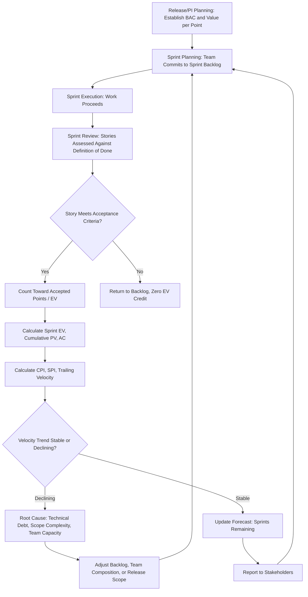

## Applying EVM in Agile Environments

### Overview

This topic opens the Agile and Hybrid Approaches chapter by consolidating and deepening the Agile EVM concepts introduced earlier (in IT and Software Development Project Tracking) into a standalone, comprehensive treatment. The central challenge remains unchanged: classical EVM was designed around a **fixed-scope, dollar-denominated Performance Measurement Baseline**, while Agile methodologies are built around **iterative delivery, evolving backlogs, and story-point-based estimation**. Rather than treating these as incompatible, this topic covers the full range of adaptation techniques — from lightweight informal approaches to formally validated Agile EVM frameworks used on government-contracted Agile programs — that preserve EVM's governance and forecasting value within an adaptive delivery model.

**Key Points**

- Agile EVM requires **redefining the unit of value** — from budgeted dollars per discrete task to budgeted dollars (or business value) per story point, feature, or backlog item.
- The **release/iteration backlog** functions as the Agile equivalent of the traditional baseline, but is explicitly expected to evolve, requiring a different approach to "baseline change control."
- Multiple formalized Agile EVM frameworks exist (including approaches recognized in government Agile contracting guidance), differing primarily in **granularity** (team-level sprint tracking vs. program-level release tracking) and **weighting scheme** (story points vs. business value vs. hours).
- **Velocity variability** is the single largest practical obstacle to reliable Agile EVM forecasting, particularly early in a team's or program's life.

---

### The Fundamental Adaptation Problem

Classical EVM assumes:

1. A stable, fully decomposed WBS with time-phased budget (BCWS/PV) established before work begins.
2. Work packages that, once planned, don't change in scope.
3. Percent-complete measured against that fixed decomposition.

Agile explicitly violates assumption #2 by design — the **backlog is expected to be refined, reprioritized, split, and re-estimated** throughout the project as the team learns more about the problem and the solution. [Inference] This is not a flaw to be corrected but a deliberate feature of Agile methodology, meaning any EVM adaptation must work *with* this expected evolution rather than trying to suppress it the way classical EVM's baseline change control process would.

---

### Redefining the Core EVM Inputs for Agile

#### BAC: From Fixed Dollar Budget to Total Scope Estimate

$$BAC_{Agile} = Total\ Planned\ Story\ Points \times Value\ per\ Point$$

Where **Value per Point** is typically derived by dividing the total approved budget for a release/program increment by the total estimated story points in the committed backlog.

$$Value\ per\ Point = \frac{Total\ Approved\ Budget}{Total\ Estimated\ Story\ Points}$$

**Example**: A Program Increment (PI) has an approved budget of $1,200,000 and a committed backlog of 300 story points across all teams.

$$Value\ per\ Point = \frac{1{,}200{,}000}{300} = \$4{,}000\ per\ point$$

#### PV: From Time-Phased Budget Curve to Planned Burnup

Rather than a smooth, often-linear time-phased budget curve, Agile PV is typically derived from the **planned burnup chart** established during release/PI planning — which may be intentionally non-linear (e.g., planning heavier delivery in later sprints once technical foundations from early sprints are in place).

#### EV: From Percent-Complete on Work Packages to Accepted Story Points

$$EV = Story\ Points\ Accepted \times Value\ per\ Point$$

Critically, **"accepted"** (meeting the team's Definition of Done, formally reviewed and approved) is the Agile equivalent of a certified percent-complete — a story that's "90% coded but not yet tested and accepted" earns **zero** EV under a properly disciplined Agile EVM approach, avoiding the classic "90% syndrome" that plagues percent-complete estimation in less rigorous implementations.

[Inference] This binary (done/not-done) treatment of story acceptance, rather than partial-credit percent-complete within a story, is generally considered one of Agile EVM's genuine improvements over traditional percent-complete estimation, since it removes much of the subjectivity that makes percent-complete unreliable in classical EVM, as discussed in the IT and Software Development Project Tracking topic.

#### AC: Largely Unchanged, But Often Fixed-Rate

$$AC = \sum (Team\ Cost\ per\ Sprint \times Number\ of\ Sprints\ Elapsed)$$

Because most Agile teams operate as a **fixed, dedicated team** (constant headcount and cost per sprint regardless of what's delivered), AC in Agile EVM often accrues at a near-constant rate, making **CPI variation driven primarily by velocity changes rather than by cost rate changes** — a meaningfully different cost dynamic than construction or hardware programs where labor and material costs can vary independently of schedule performance.

---

### Formal Frameworks for Agile EVM

#### Team-Level (Sprint) Agile EVM

Applied within a single Scrum team, tracking story points sprint-over-sprint against a release-level backlog. This is the lightest-weight approach, most common in commercial (non-government-mandated) settings.

#### Program-Level (SAFe/Scaled) Agile EVM

As introduced in the IT and Software Development Project Tracking topic, larger programs using **SAFe** or similar scaled frameworks typically apply EVM concepts at the **Program Increment (PI)** or **Value Stream** level, using **Features** and **Epics** (rather than individual stories) as the work package equivalent, and **Business Value points** assigned during PI Planning as an alternative or complementary weighting scheme to pure story points.

#### Government-Recognized Agile EVM Approaches

[Unverified] Various U.S. government agencies and DoD components have published guidance on applying EVM to Agile software development contracts (reflecting the tension noted in the Government Contracting Requirements topic between EIA-748's classical assumptions and Agile delivery methods), generally converging on similar principles to those described above: story-point-to-dollar conversion, backlog-based PV, and acceptance-based EV — but specific agency guidance documents and their current status should be verified directly, since this remains an evolving area of federal Agile acquisition policy.

---

### Worked Example: Full Release-Level Agile EVM Calculation

**Example**

A release is planned across 10 two-week sprints with a total budget of $1,600,000 and a committed backlog of 400 story points ($4,000/point). By the end of Sprint 6:

- **Planned burnup** (from release plan) anticipated 260 points accepted by this point.
- **Actual accepted points**: 230 (out of 250 points the team attempted; 20 points were coded but failed acceptance testing and remain in progress).
- **Actual cost incurred**: $1,050,000.

$$PV = 260 \times 4{,}000 = \$1{,}040{,}000$$

$$EV = 230 \times 4{,}000 = \$920{,}000$$

$$AC = \$1{,}050{,}000$$

$$CPI = \frac{920{,}000}{1{,}050{,}000} \approx 0.876$$

$$SPI = \frac{920{,}000}{1{,}040{,}000} \approx 0.885$$

**Output**

- Both CPI and SPI indicate underperformance: the team is both over budget relative to value delivered and behind the planned burnup curve.
- The gap between **points attempted (250)** and **points accepted (230)** — 20 points failing acceptance — is a valuable diagnostic beyond what CPI/SPI alone reveal: it suggests a **quality or Definition-of-Done problem** (work being started but not completing acceptance criteria) rather than simply a **capacity or estimation problem**, which would call for a different corrective action (e.g., strengthening acceptance testing practices or refining story splitting, rather than simply adding headcount).
- Velocity-based forecast: if the trailing 3-sprint average velocity is 35 points/sprint, and 170 points remain (400 - 230), $170 / 35 \approx 4.9$ additional sprints are needed — suggesting the release will likely require roughly 11 sprints total rather than the originally planned 10.

---

### Handling Backlog Change: Agile's Answer to Baseline Change Control

Because scope evolution is expected, Agile EVM requires a **lighter-weight but still disciplined** approach to what classical EVM handles through formal Baseline Change Requests:

| Classical EVM Baseline Change Control | Agile EVM Equivalent |
| --- | --- |
| Formal BCR documentation and approval | Backlog refinement/grooming sessions with documented rationale for significant re-scoping |
| Baseline frozen except through formal change | "Committed" sprint backlog frozen for the sprint; release backlog can evolve between sprints |
| Management Reserve for unforeseen risk | Product Owner-held backlog buffer / contingency story points reserved for emergent work |

[Inference] The key adaptation is **scoping the "frozen" period to the sprint** rather than the entire release — this preserves a meaningful, protected baseline for short-term EV measurement (you can't move the goalposts mid-sprint) while still allowing legitimate release-level scope evolution between sprints, which is the entire point of Agile's iterative learning model.

---

### Diagram: Agile EVM Input Mapping (svg_diagram)

<svg xmlns="http://www.w3.org/2000/svg" viewBox="0 0 900 400">
<text x="450" y="26" font-family="Arial" font-size="18" font-weight="bold" text-anchor="middle" fill="#222">Agile EVM Input Mapping (svg_diagram)</text>
<rect x="30" y="70" width="200" height="60" rx="8" fill="#dce9f9" stroke="#3b6ea5" stroke-width="1.5" />
<text x="130" y="95" font-family="Arial" font-size="12" text-anchor="middle" fill="#1b3654">Classical EVM: BAC</text>
<text x="130" y="112" font-family="Arial" font-size="10" text-anchor="middle" fill="#1b3654">Fixed dollar budget</text>
<rect x="30" y="160" width="200" height="60" rx="8" fill="#dce9f9" stroke="#3b6ea5" stroke-width="1.5" />
<text x="130" y="185" font-family="Arial" font-size="12" text-anchor="middle" fill="#1b3654">Classical EVM: PV</text>
<text x="130" y="202" font-family="Arial" font-size="10" text-anchor="middle" fill="#1b3654">Time-phased budget curve</text>
<rect x="30" y="250" width="200" height="60" rx="8" fill="#dce9f9" stroke="#3b6ea5" stroke-width="1.5" />
<text x="130" y="275" font-family="Arial" font-size="12" text-anchor="middle" fill="#1b3654">Classical EVM: EV</text>
<text x="130" y="292" font-family="Arial" font-size="10" text-anchor="middle" fill="#1b3654">% complete x budget</text>
<rect x="670" y="70" width="200" height="60" rx="8" fill="#dff0d8" stroke="#3c763d" stroke-width="1.5" />
<text x="770" y="95" font-family="Arial" font-size="12" text-anchor="middle" fill="#254c26">Agile EVM: BAC</text>
<text x="770" y="112" font-family="Arial" font-size="10" text-anchor="middle" fill="#254c26">Total points x value/point</text>
<rect x="670" y="160" width="200" height="60" rx="8" fill="#dff0d8" stroke="#3c763d" stroke-width="1.5" />
<text x="770" y="185" font-family="Arial" font-size="12" text-anchor="middle" fill="#254c26">Agile EVM: PV</text>
<text x="770" y="202" font-family="Arial" font-size="10" text-anchor="middle" fill="#254c26">Planned burnup curve</text>
<rect x="670" y="250" width="200" height="60" rx="8" fill="#dff0d8" stroke="#3c763d" stroke-width="1.5" />
<text x="770" y="275" font-family="Arial" font-size="12" text-anchor="middle" fill="#254c26">Agile EVM: EV</text>
<text x="770" y="292" font-family="Arial" font-size="10" text-anchor="middle" fill="#254c26">Accepted points x value/point</text>
<line x1="230" y1="100" x2="670" y2="100" stroke="#333" stroke-width="1.5" marker-end="url(#arrowA)" />
<line x1="230" y1="190" x2="670" y2="190" stroke="#333" stroke-width="1.5" marker-end="url(#arrowA)" />
<line x1="230" y1="280" x2="670" y2="280" stroke="#333" stroke-width="1.5" marker-end="url(#arrowA)" />
<text x="450" y="360" font-family="Arial" font-size="11" text-anchor="middle" fill="#555">Same governance intent, redefined units of measurement</text>
</svg>

---

### Process Flow: Sprint-Level Agile EVM Cycle

---

### Common Pitfalls in Applying EVM to Agile

- **Awarding partial credit for incomplete stories**: Undermines the acceptance-based EV discipline that is one of Agile EVM's genuine advantages; a story that's "80% coded" should generally not earn 80% of its point value.
- **Treating story points as directly comparable across teams**: Story point estimation is team-relative by design (a "5" for one team may not equal a "5" for another), so aggregating raw story points across multiple teams into a single program-level EVM calculation without a normalization approach (e.g., a common reference story) can distort results.
- **Using early-sprint velocity for long-range forecasting**: As discussed in IT and Software Development Project Tracking, new teams typically need several sprints before velocity stabilizes enough to support reliable forecasting.
- **Fixing the entire release backlog and treating any change as a "variance"**: This defeats the purpose of Agile methodology; the sprint-level (not release-level) backlog should be the frozen unit for EV measurement purposes, with release-level evolution expected and managed through backlog refinement rather than formal variance reporting.
- **Ignoring the acceptance failure signal**: As shown in the worked example, a gap between points attempted and points accepted is a distinct and valuable diagnostic that pure CPI/SPI trending can obscure if not tracked separately.

---

**Related Topics**

- Story point normalization techniques for cross-team program-level EVM aggregation
- Definition of Done standardization and its effect on EV measurement reliability
- SAFe Program Increment planning and Business Value point weighting in depth
- Velocity forecasting statistical techniques (Monte Carlo simulation, throughput-based forecasting)
- Government Agile acquisition policy and evolving EVM guidance for Agile contracts
- Technical debt tracking as a leading indicator for future velocity decline
- Hybrid Wagile (Waterfall-Agile) approaches and their EVM implications