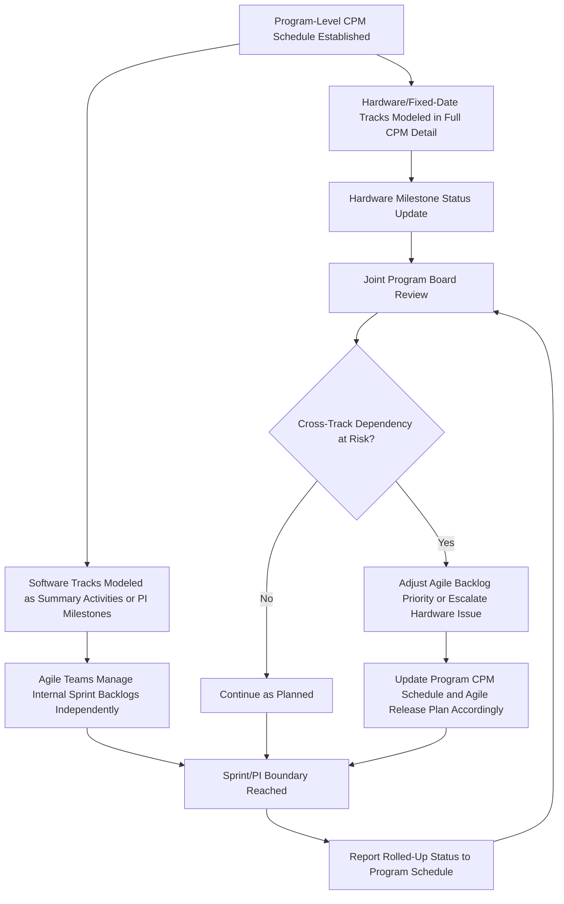

## Hybrid Scheduling Approaches


### Overview

Hybrid scheduling approaches combine elements of traditional CPM network scheduling with Agile/iterative delivery methods, addressing the reality that most large, complex programs are rarely purely one or the other. A construction megaproject may use classical CPM for site logistics and structural work while the building management system software is developed on an Agile cadence. A defense acquisition program may use a formal Integrated Master Schedule for hardware milestones while software-intensive subsystems are developed in sprints underneath it. This topic examines the architectural patterns, integration mechanics, and governance models that allow CPM and Agile scheduling to coexist productively on the same program, rather than treating them as mutually exclusive choices.

**Key Points**

- Hybrid scheduling is typically necessary — not optional — on any program with **both physical/hardware and software components**, since these naturally suit different planning paradigms.
- The most common hybrid pattern is a **"wrapper" CPM schedule at the program level**, with **Agile sprints nested underneath** specific software-related activities or work packages.
- **Milestone synchronization** — ensuring Agile release dates align with and feed into CPM milestone dependencies — is the central technical challenge of hybrid scheduling.
- Different hybrid models place the "master" schedule at different levels: some treat CPM as authoritative with Agile as a detail-level execution technique, while others (particularly SAFe-oriented approaches) treat Agile cadence (Program Increments) as the primary rhythm with CPM-style dependency mapping applied only to cross-team or cross-workstream constraints.

---

### Why Pure CPM or Pure Agile Often Doesn't Fit

#### Where Pure CPM Struggles

Pure CPM assumes activities have known durations and fixed logic. This breaks down for:

- **Exploratory or research-heavy work** where duration genuinely cannot be estimated until some investigation occurs (a poor fit for a fixed-duration CPM activity).
- **Software development with evolving requirements**, where forcing a fixed WBS decomposition before development begins can lock in decisions that later prove wrong, wasting the planning effort and creating a schedule quickly disconnected from reality.

#### Where Pure Agile Struggles

Pure Agile (sprint/backlog-only planning with no CPM overlay) breaks down for:

- **Physical/hardware-dependent milestones** where dates are genuinely fixed by external factors (e.g., a satellite launch window, a facility lease commencement, a regulatory filing deadline) that don't bend to sprint-by-sprint replanning.
- **Cross-team, cross-discipline dependency management at scale**, where dozens of teams need visibility into how their work interlocks — informal backlog-to-backlog coordination tends to break down without some higher-level dependency mapping.
- **Contractual and regulatory reporting requirements** (as discussed in Government Contracting Requirements) that specify CPM/EVM deliverables regardless of the underlying team's delivery methodology.

---

### Common Hybrid Architectural Patterns

#### Pattern 1: CPM Master Schedule with Embedded Agile "Black Box" Activities

The program-level IMS/CPM schedule treats an entire Agile-developed component as a **single or small number of summary activities**, with duration derived from the Agile team's release plan, but without modeling individual sprints or stories in the CPM network itself.



```
CPM Activity: "Software Module X Development" 
  Duration: 20 weeks (derived from Agile team's 10-sprint release plan)
  Predecessor: Requirements Baseline Complete
  Successor: System Integration Testing
  [Internally: Agile team manages 10 sprints, backlog, and velocity independently]
```

[Inference] This is likely the most common hybrid pattern in practice because it requires minimal change to existing CPM-based program management processes — the Agile team's internal cadence remains invisible to the program schedule except at defined milestone boundaries — though it also means program-level visibility into Agile progress depends entirely on the quality and honesty of the Agile team's own status reporting up to the CPM milestone level.

#### Pattern 2: Sprint-to-Milestone Rollup

Individual sprint completions or release increments are explicitly represented as **milestone activities** within the CPM network, providing more granular program-level visibility than Pattern 1 while still respecting the Agile team's internal sprint-level autonomy.



```
CPM Milestones (representing Agile release train):
  Sprint 2 Complete: Day 28 (Milestone)
  Sprint 4 Complete: Day 56 (Milestone)
  PI Release Complete: Day 140 (Milestone, driving downstream integration)
```

#### Pattern 3: Program Increment (PI) as the Master Cadence (SAFe-Oriented)

In this pattern, favored in large SAFe-based programs, the **PI cadence itself becomes the primary planning rhythm**, and CPM-style network logic is applied specifically to model **cross-team dependencies** identified during PI Planning (via the Program Board), rather than modeling a traditional top-down WBS-derived network.

[Inference] This pattern effectively inverts the relationship in Pattern 1 — instead of CPM being the master with Agile embedded inside it, Agile cadence is the master rhythm with lightweight, dependency-focused CPM concepts applied only where cross-team blocking dependencies genuinely require coordination, rather than modeling every task in every team's backlog.

#### Pattern 4: Rolling Wave Planning

Not exclusively an Agile-CPM hybrid technique, but frequently used as a bridging mechanism: **near-term work is planned in full CPM detail**, while **far-term work remains at a summary level** until it approaches execution, at which point it's decomposed in detail (potentially using Agile methods for software-heavy near-term work while hardware-heavy near-term work uses traditional CPM decomposition).

---

### Milestone Synchronization: The Central Technical Challenge

Because Agile teams plan in sprints (fixed-length, typically 1-4 weeks) while CPM milestones are typically driven by dependency logic (which may not align neatly with sprint boundaries), **synchronization** requires deliberate design:

$$Milestone\ Date_{CPM} = Sprint\ Boundary\ Date_{nearest} \pm Buffer$$

**Example** synchronization approach:



```
CPM Milestone: "Payment Module Ready for Integration Testing" — target Day 84
Agile Team Sprint Schedule: 2-week sprints, Sprint 6 ends Day 84
Approach: Align the milestone to coincide with a sprint boundary (Day 84 = Sprint 6 end)
          rather than an arbitrary mid-sprint date, since Agile teams generally
          cannot guarantee deliverable completion at an arbitrary point mid-sprint
```

[Inference] A commonly recommended practice is to **always align cross-team or CPM-driven milestone dates to Agile sprint boundaries** rather than arbitrary calendar dates, since Agile teams structure their entire workflow (planning, review, retrospective) around sprint boundaries, and expecting a deliverable at a non-boundary date creates friction that neither the CPM schedule's rigor nor the Agile team's cadence naturally accommodates.

---

### Governance Model Comparison

| Governance Question | CPM-Master Model | Agile-Cadence-Master Model |
| --- | --- | --- |
| Who owns the "official" program schedule? | Program Scheduler / Master Scheduler | Release Train Engineer / PI Planning process |
| How are cross-team dependencies tracked? | Traditional CPM logic ties in the network | Program Board dependency mapping during PI Planning |
| How is EVM applied? | Classical Control Accounts, with Agile teams reporting rolled-up progress | Program-level Agile EVM (as covered in Applying EVM in Agile Environments), potentially with CPM logic only for hardware/fixed-date elements |
| Change control mechanism | Formal Baseline Change Requests | Backlog refinement plus PI-boundary re-planning |
| Best suited for | Programs where hardware/fixed-date elements dominate | Programs where most work is software/iterative, with limited fixed-date hardware constraints |

[Inference] Selecting between these models is generally driven by which type of work dominates the program's critical path and risk profile — a hardware-dominant program with embedded software components tends toward the CPM-Master model, while a software-dominant program with occasional hardware or regulatory fixed dates tends toward the Agile-Cadence-Master model, though many real-world programs sit somewhere between these two poles and blend elements of both.

---

### Worked Example: Hybrid Schedule for a Defense/IT Program

**Example**

A program is developing a new sensor system (hardware) with an integrated software-based data processing and analytics platform.

- **Hardware track (CPM)**: Sensor design → fabrication → environmental testing → integration, following classical CPM with EIA-748 EVM (per the Aerospace and Defense Program Management topic).
- **Software track (Agile/SAFe)**: Data processing platform developed across 4 Program Increments, each roughly aligned to a hardware milestone (e.g., PI 2 completion targeted to coincide with sensor fabrication completion, since integration testing requires both).
- **Synchronization mechanism**: A joint Program Board reviews cross-track dependencies quarterly (aligned to PI boundaries), explicitly flagging any hardware CPM slippage that would affect software integration test readiness, and vice versa.

**Output**: When the hardware track's environmental testing slips 3 weeks due to a supplier issue, the joint Program Board identifies this during quarterly review and the software track's PI 3 scope is deliberately adjusted (via normal backlog reprioritization) to shift lower-priority integration-dependent stories later in the backlog, avoiding wasted Agile team capacity building against hardware that isn't yet ready — this is a concrete illustration of why the synchronization mechanism (not just the individual CPM or Agile processes themselves) is where most hybrid scheduling value or failure actually occurs.

---

### Diagram: Hybrid Schedule Architecture — CPM Master with Embedded Agile (svg_diagram)

<svg xmlns="http://www.w3.org/2000/svg" viewBox="0 0 900 400">
<text x="450" y="26" font-family="Arial" font-size="18" font-weight="bold" text-anchor="middle" fill="#222">Hybrid Schedule: CPM Master with Embedded Agile (svg_diagram)</text>
<rect x="30" y="60" width="160" height="50" rx="8" fill="#dce9f9" stroke="#3b6ea5" stroke-width="1.5" />
<text x="110" y="90" font-family="Arial" font-size="11" text-anchor="middle" fill="#1b3654">Requirements Baseline</text>
<rect x="230" y="60" width="200" height="50" rx="8" fill="#fde7c7" stroke="#b5791a" stroke-width="1.5" />
<text x="330" y="82" font-family="Arial" font-size="11" text-anchor="middle" fill="#5c3d09">Software Module Dev</text>
<text x="330" y="98" font-family="Arial" font-size="10" text-anchor="middle" fill="#5c3d09">(CPM summary: 20 weeks)</text>
<rect x="480" y="60" width="180" height="50" rx="8" fill="#dce9f9" stroke="#3b6ea5" stroke-width="1.5" />
<text x="570" y="90" font-family="Arial" font-size="11" text-anchor="middle" fill="#1b3654">Integration Testing</text>
<rect x="240" y="150" width="60" height="40" rx="6" fill="#dff0d8" stroke="#3c763d" stroke-width="1.2" />
<text x="270" y="174" font-family="Arial" font-size="9" text-anchor="middle" fill="#254c26">Sprint 1</text>
<rect x="310" y="150" width="60" height="40" rx="6" fill="#dff0d8" stroke="#3c763d" stroke-width="1.2" />
<text x="340" y="174" font-family="Arial" font-size="9" text-anchor="middle" fill="#254c26">Sprint 2</text>
<rect x="380" y="150" width="60" height="40" rx="6" fill="#dff0d8" stroke="#3c763d" stroke-width="1.2" />
<text x="410" y="174" font-family="Arial" font-size="9" text-anchor="middle" fill="#254c26">...</text>
<rect x="450" y="150" width="60" height="40" rx="6" fill="#dff0d8" stroke="#3c763d" stroke-width="1.2" />
<text x="480" y="174" font-family="Arial" font-size="9" text-anchor="middle" fill="#254c26">Sprint 10</text>
<line x1="190" y1="85" x2="230" y2="85" stroke="#333" stroke-width="1.5" marker-end="url(#arrowB)" />
<line x1="430" y1="85" x2="480" y2="85" stroke="#333" stroke-width="1.5" marker-end="url(#arrowB)" />
<line x1="330" y1="110" x2="330" y2="150" stroke="#888" stroke-width="1" stroke-dasharray="3,3" />
<line x1="270" y1="150" x2="270" y2="130" stroke="#888" stroke-width="1" stroke-dasharray="3,3" />
<line x1="480" y1="150" x2="480" y2="130" stroke="#888" stroke-width="1" stroke-dasharray="3,3" />

<text x="330" y="215" font-family="Arial" font-size="10" text-anchor="middle" fill="#555">Program-level CPM sees only the summary bar; Agile team manages internal sprint detail</text>

<rect x="30" y="270" width="840" height="90" rx="8" fill="#f7f7f7" stroke="#ccc" stroke-width="1" />
<text x="450" y="295" font-family="Arial" font-size="12" font-weight="bold" text-anchor="middle" fill="#333">Milestone Synchronization Point</text>
<text x="450" y="318" font-family="Arial" font-size="11" text-anchor="middle" fill="#555">Sprint 10 completion must align with CPM's Integration Testing predecessor requirement</text>
<text x="450" y="338" font-family="Arial" font-size="11" text-anchor="middle" fill="#555">Program Board reviews alignment at each sprint boundary, not just at the final handoff</text>
</svg>

---

### Process Flow: Hybrid Program Synchronization Cycle



---

### Common Pitfalls in Hybrid Scheduling

- **Treating the Agile "black box" as a fixed-duration CPM activity without ongoing visibility**: Pattern 1's simplicity is also its risk — if program schedulers only check in with the Agile team at the final milestone, emerging velocity problems that would have been visible sprint-over-sprint go undetected until the milestone is already at risk.
- **Forcing sprint boundaries to align with CPM logic ties that don't respect Agile cadence**: Requiring a deliverable at an arbitrary mid-sprint date (rather than aligning to sprint boundaries as discussed above) creates persistent friction and unreliable commitments.
- **Applying full EIA-748 Control Account rigor uniformly across both hardware and software tracks**: As discussed in Applying EVM in Agile Environments, this can create disproportionate overhead for the software track; the hybrid model should generally allow each track's governance rigor to match its own delivery methodology's natural cadence, connected through the synchronization mechanism rather than forced into a single uniform reporting structure.
- **Under-resourcing the Program Board / synchronization function**: The worked example above illustrates that most of the hybrid model's actual coordination value lives in this joint review mechanism — treating it as a formality rather than a genuinely resourced, decision-making function undermines the entire hybrid approach.
- **Assuming one governance model fits the whole program uniformly**: As the governance comparison table shows, the right model depends on which type of work dominates; forcing a software-heavy program into a rigid CPM-Master model (or a hardware-heavy program into a pure Agile-Cadence model) tends to create friction disproportionate to the benefit.

---

**Related Topics**

- Program Board design and cross-team dependency mapping in SAFe environments
- Rolling wave planning techniques for bridging near-term detail and far-term summary planning
- EVM governance rigor selection based on program risk and contract type
- Case studies of hybrid hardware-software program scheduling in defense acquisition
- Sprint boundary alignment techniques for cross-functional milestone dependencies
- Selecting between CPM-Master and Agile-Cadence-Master governance models
- Tooling integration between CPM schedulers (Primavera P6) and Agile platforms (Jira Align, Rally)