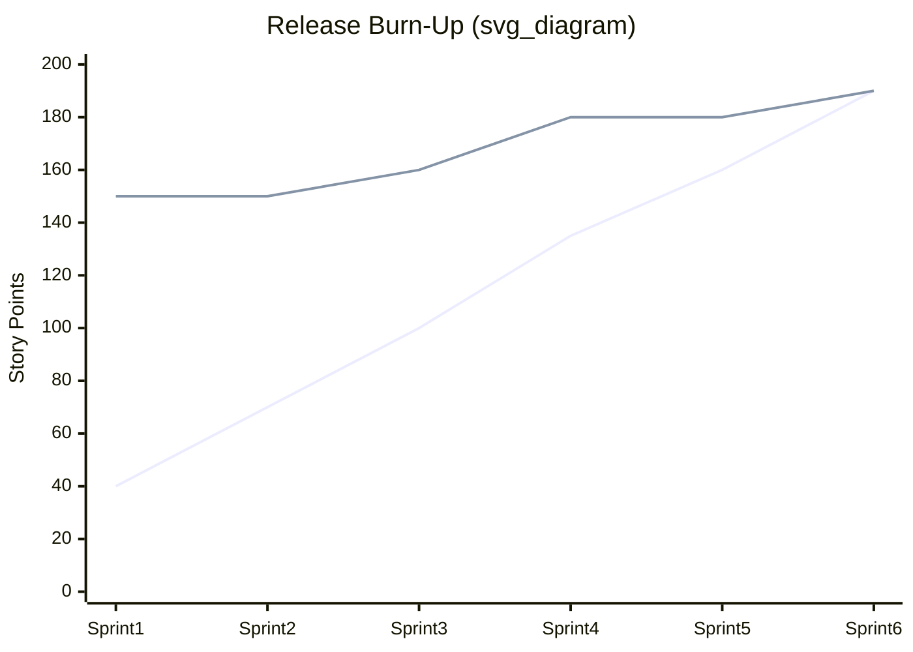
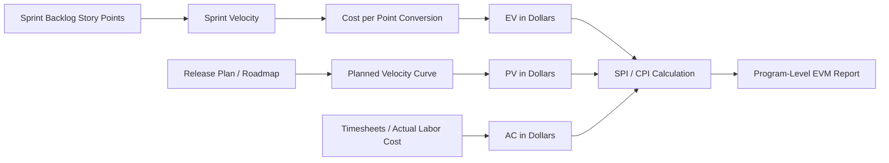

## Velocity and Burn Down versus Earned Value

### Overview

Agile teams and traditional project controls organizations both need to answer the same question — "are we on track?" — but they answer it with fundamentally different instruments. Velocity and burn-down/burn-up charts are the native measurement tools of iterative, story-point-driven Agile delivery. Earned Value Management (EVM) is the native measurement tool of Critical-Path/baseline-driven traditional project controls. Understanding where these two systems agree, where they diverge, and how to reconcile them is essential for any hybrid delivery environment (common in government, defense, and enterprise IT programs that mandate EVM compliance while execution teams work in Scrum or Kanban).

### Velocity: Definition and Mechanics

**Definition**

Velocity is the amount of work a Scrum team completes in a single sprint, measured in story points (or less commonly, ideal days or another relative-sizing unit).

$$V_n = \sum_{i=1}^{k} SP_i$$

where $SP_i$ is the story-point estimate of the $i$-th completed (fully "Done") backlog item in sprint $n$, and $k$ is the number of items completed that sprint.

**Key Points**

- Velocity is a **capacity-planning metric**, not a productivity or performance metric. Comparing velocity across teams is a well-known anti-pattern because story points are team-relative, not absolute units.
- Only fully completed items (meeting the Definition of Done) count. Partially completed stories typically contribute zero points to velocity, which creates a "cliff-edge" reporting behavior distinct from EVM's continuous percent-complete model.
- Velocity is normally averaged over a trailing window (commonly the last 3–6 sprints) to smooth noise before being used for release forecasting.

**Example**

| Sprint | Committed SP | Completed SP |
| --- | --- | --- |
| 1 | 32 | 28 |
| 2 | 30 | 31 |
| 3 | 34 | 29 |

Rolling average velocity ≈ $(28+31+29)/3 = 29.3$ story points/sprint.

### Burn-Down and Burn-Up Charts

**Sprint Burn-Down Chart**

Tracks remaining work (in story points or hours) against time within a single sprint. The x-axis is sprint days; the y-axis is remaining effort. An ideal/guideline line runs linearly from total scope to zero; the actual line reflects true remaining work as it is re-estimated or completed.

**Release Burn-Down Chart**

Tracks total remaining backlog scope (across the whole release, in story points) sprint-over-sprint. Useful for forecasting release completion date given current velocity.

**Burn-Up Chart**

Plots two lines: cumulative work completed and total scope. Burn-up is preferred over burn-down at the release level because it visually separates "work done" from "scope change" — a burn-down chart alone cannot distinguish between the team failing to progress and the product owner adding scope, since both manifest as a stalled or rising line.

**Key Points**

- Burn-down/up charts are **descriptive**, not predictive on their own — forecasting requires overlaying a velocity-derived trendline.
- Scope-change visibility is the single biggest structural advantage of burn-up over burn-down.

### Earned Value Management: Recap of Core Mechanics

EVM relies on three time-phased baseline curves, all denominated in a common unit — usually cost ($) or, less commonly, labor hours:

- **PV** (Planned Value) — the budgeted cost of work scheduled to be done by a given date.
- **EV** (Earned Value) — the budgeted cost of work actually completed by that date.
- **AC** (Actual Cost) — the real cost incurred to complete that work.

From these:

$$SV = EV - PV \qquad SPI = \frac{EV}{PV}$$

$$CV = EV - AC \qquad CPI = \frac{EV}{AC}$$

EVM's defining feature relative to Agile metrics is that it fuses **schedule, scope, and cost** into a single normalized index ($, or %), enabling apples-to-apples comparison across dissimilar work packages and full program roll-up.

### Structural Comparison

| Dimension | Velocity / Burn Charts | Earned Value Management |
| --- | --- | --- |
| Core unit | Story points (relative, team-specific) | Currency or labor hours (absolute, comparable across teams) |
| What it measures | Scope throughput over time | Schedule + cost performance against baseline |
| Baseline concept | Implicit (backlog / release scope) | Explicit, formal Performance Measurement Baseline (PMB) |
| Cost visibility | None natively | Central (AC, CPI) |
| Granularity | Sprint/iteration level | Work package / control account level |
| Change handling | Scope change is visible immediately in burn-up | Scope change requires formal baseline change control |
| Forecasting method | Velocity-based linear extrapolation | EAC formulas (statistical, e.g. $EAC = AC + \frac{BAC-EV}{CPI}$) |
| Comparability across teams | Poor (points aren't standardized) | Good (currency is standardized) |
| Typical governance context | Team-level, informal | Program/contract level, often mandated (e.g. ANSI/EIA-748) |

### Mapping Agile Metrics onto EVM Formulas — Agile Earned Value

A common hybrid technique ("Agile EVM" or "AgileEVM") reconstructs PV/EV/AC from Scrum artifacts so that traditional program offices can still receive EVM-compliant status:

- **BAC (Budget at Completion)** ≈ total release scope in story points × average $/point (a fixed conversion rate, or "cost per point," derived from the team's burdened labor rate and average velocity).
- **PV** at any point in the release ≈ (planned cumulative story points per the release plan) × $/point.
- **EV** at any point ≈ (cumulative *completed* story points) × $/point.
- **AC** ≈ actual burdened labor cost incurred to date (timesheets, sprint capacity cost), independent of story points.

$$\text{Cost per point} = \frac{\text{Sprint burdened cost}}{\text{Sprint velocity}}$$

**Example**

Suppose a release has 300 total story points, a target of 6 sprints, and each sprint costs $50,000 in burdened labor regardless of output.

- Planned velocity: 50 points/sprint → PV at end of Sprint 3 = 150 points × ($300,000 total budget / 300 points) = $150,000.
- Actual completed: 130 points by end of Sprint 3 → EV = 130 × $1,000/point = $130,000.
- Actual cost incurred: 3 sprints × $50,000 = $150,000 = AC.

$$SPI = \frac{130{,}000}{150{,}000} = 0.87 \qquad CPI = \frac{130{,}000}{150{,}000} = 0.87$$

Both indices show the team is behind schedule and running cost-inefficient relative to the baseline — a signal burn-down alone would show only partially (as slower-than-ideal scope burn) without ever quantifying the dollar impact.

### Why the Two Systems Diverge

**[Inference]** Practitioners often report the following sources of divergence; these are consequences of the differing measurement philosophies rather than universal guarantees:

1. **Fixed-cost sprints mask cost variance.** Because Scrum teams are typically a fixed-cost resource pool (same team, same cost, every sprint), naive AgileEVM tends to produce $CPI \approx SPI$ whenever cost per sprint is constant — cost inefficiency and schedule inefficiency become mathematically indistinguishable unless cost per point is separately tracked at finer granularity (e.g., per-person, per-skill-type).
2. **Story points are not linear cost proxies.** A 5-point story and another unrelated 5-point story may have very different actual labor cost; EVM assumes the PMB accurately reflects planned cost distribution, an assumption that is weaker under relative-sizing regimes.
3. **Definition-of-Done cliff effect vs. percent-complete.** Traditional EVM permits partial credit (0/50/100 rule, or physical percent complete) for in-progress work packages. Agile velocity awards zero credit until a story is fully Done, which tends to make burn-down charts look more pessimistic mid-sprint than an equivalently progressed EVM work package would.
4. **Scope volatility.** EVM's PMB is change-controlled and relatively static within a reporting period; Agile backlogs are explicitly expected to change every sprint via backlog refinement. Reconciling a moving scope baseline against EVM's requirement for a fixed PMB is one of the most cited integration challenges in hybrid programs.

### When to Use Which (and Together)

**Key Points**

- **Team-level, execution-focused tracking** (is this sprint healthy, will this release ship on time): velocity + burn-up is lighter-weight and gives faster feedback.
- **Program/contract-level, compliance-focused tracking** (is this multi-million-dollar program on cost and schedule against a contractual baseline, per DoD/DOE EVMS requirements): EVM is typically mandated and provides audit-ready, standardized reporting.
- **Hybrid programs** commonly run both concurrently: Scrum teams manage their own backlog with velocity/burn-up for day-to-day work, while a program controls function periodically converts sprint outputs into EVM metrics (via story-point-to-dollar conversion) for external stakeholder and contractual reporting.

### Common Pitfalls

- Treating velocity as a performance KPI and pressuring teams to inflate story-point estimates ("velocity gaming"), which silently corrupts any downstream AgileEVM conversion.
- Using a single global $/point conversion rate across teams with different skill mixes or cost structures, which distorts CPI.
- Failing to re-baseline PV when the product backlog undergoes significant re-prioritization — this is the Agile analogue of an uncontrolled baseline change and produces misleading SV/SPI.
- Reporting SPI = 1.0 as "on schedule" without checking whether the underlying burn-up shows scope has also grown proportionally (a false sense of schedule health).

**Related Topics**

- Story-point-to-dollar conversion methodologies and their statistical validity
- Physical percent complete vs. 0/50/100 rules in traditional EVM
- Rolling wave planning as a bridge between Agile backlogs and EVM control accounts
- ANSI/EIA-748 EVMS guidelines and Agile tailoring guidance (e.g., NDIA Agile EVM guide)
- To-Complete Performance Index (TCPI) as an Agile release-forecasting analogue
- Cumulative Flow Diagrams as a Kanban alternative to sprint burn-down
- Integrating Agile release trains (SAFe) with program-level EVM reporting