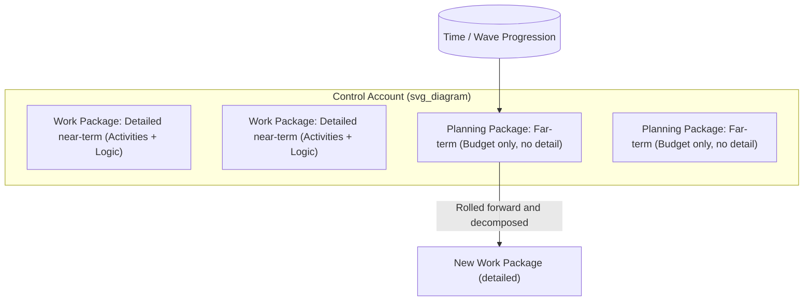

## Rolling Wave Planning and Progressive Elaboration

### Overview

Rolling wave planning is a schedule-development technique in which work in the near term is planned in fine detail, while work further out in the future is planned only at a summary level, with detail added progressively as that work approaches and more information becomes known. It is the primary mechanism by which traditional, baseline-driven scheduling (CPM/EVM) accommodates uncertainty without abandoning the discipline of a formal, integrated master schedule. Progressive elaboration is the broader project-management principle underlying rolling wave: plans are continuously refined as more detailed and specific information becomes available as the project progresses.

### Core Concepts

**Progressive Elaboration**

Progressive elaboration describes the iterative process of increasing the level of detail in a project management plan as greater amounts of information and more accurate estimates become available. It is not the same as scope creep — the total scope envelope is defined early (often via a Work Breakdown Structure to a summary level), but the *decomposition and sequencing detail* of that scope is deferred and filled in over time.

**Rolling Wave Planning**

Rolling wave planning is the specific scheduling technique that operationalizes progressive elaboration on the project schedule. The PMBOK Guide defines it as an iterative planning technique in which the work to be accomplished in the near term is planned in detail, while work further in the future is planned at a higher level.

**Key Points**

- Near-term work packages are decomposed to the **activity level** (suitable for CPM network logic, resource assignment, and detailed cost estimating).
- Far-term work is represented as **planning packages** or **summary-level planning packages (SLPPs)** — placeholder line items with a budget and a time-phased spread, but no detailed activity network yet.
- As the project progresses and a wave of planning packages approaches execution, they are decomposed ("rolled") into detailed work packages and activities — hence "rolling wave."

### Relationship to the Work Breakdown Structure and Control Accounts

In an EVM-compliant environment (e.g., ANSI/EIA-748 EVMS), rolling wave planning interacts directly with the WBS and the Control Account Plan (CAP) structure:

- **Control Account (CA):** A management control point where scope, schedule, and budget are integrated and compared to earned value. Control accounts are typically established early and can persist over the life of the effort.
- **Work Package (WP):** Detailed, near-term, scheduled effort within a control account, with discrete Objective Measures of performance for earning value.
- **Planning Package (PP):** A logical aggregation of far-term work within a control account, holding budget but not yet broken down into work packages; carries no detailed schedule logic and typically cannot earn value directly (it must first be converted to work packages).

**Key Points**

- The **conversion of a planning package into work packages** must happen far enough in advance of execution to allow for detailed estimating, resourcing, and (in EVM environments) baseline change control — commonly recommended at roughly 2–3 reporting periods (often 2–3 months) ahead of the work starting, though the exact lead time is [Inference] organization- and complexity-dependent rather than a universal standard.
- Total allocated budget (the sum of work package and planning package budgets within a control account) must always reconcile to the control account's total budget — rolling wave changes *distribution and detail*, not the total authorized scope or funding.

### Rolling Wave in the CPM Network

In a Critical Path Method schedule, rolling wave planning has a direct structural effect on the network diagram:

- **Near-term activities:** Fully sequenced with finish-to-start, start-to-start, or other precedence logic, durations estimated bottom-up, resources loaded, and included in the live critical path calculation.
- **Far-term work:** Represented as a single summary/hammock activity or milestone with a placeholder duration derived top-down from the overall schedule baseline, without internal logic.

$$D_{summary} = \sum_{j} D_j \quad \text{(future estimate, later replaced by detailed network math once decomposed)}$$

When the wave rolls forward and the summary activity is decomposed, the *total float* and *critical path* calculations for the entire schedule must be re-run, since inserting real logic into a former placeholder can change downstream float values and potentially shift the critical path.

**Example**

A 12-month software modernization project might structure its schedule as follows:

| Period | Planning Detail |
| --- | --- |
| Months 1–3 | Fully decomposed activities: design reviews, sprint-level tasks, specific test activities, named resources |
| Months 4–6 | Planning package: "Integration Phase" — single 3-month placeholder with rough budget |
| Months 7–9 | Planning package: "UAT and Hardening" — single 3-month placeholder |
| Months 10–12 | Planning package: "Deployment and Transition" — single 3-month placeholder |

At the end of Month 2, the team performs detailed planning for Months 4–6 (the next wave), converting the "Integration Phase" planning package into 15–20 discrete activities with logic, resource assignments, and updated cost estimates — while Months 7–12 remain at planning-package level.

### Interaction with Earned Value Management

Rolling wave planning has specific, well-documented implications for EVM mechanics:

- **Performance Measurement Baseline (PMB):** The PMB includes both work packages and planning packages, but only work packages generate objective earned value (via 0/100, 50/50, milestone-weighted, or percent-complete methods). Planning packages contribute to PV (time-phased budget) but cannot generate EV until converted.
- **Undistributed Budget (UB) vs. Planning Packages:** Undistributed budget is budget not yet assigned to *any* control account or WBS element, whereas a planning package's budget *is* assigned to a specific control account but not yet decomposed to the activity level. Rolling wave primarily governs the planning-package-to-work-package transition, not the UB-to-CA assignment.
- **Baseline Change Control:** Converting a planning package into work packages is generally treated as a **detail-level replanning action within the existing control account budget**, not a scope or budget baseline change — provided the total control account budget is unchanged. If decomposition reveals the need for additional budget or a schedule extension, that does require formal baseline change control.
- **Management Reserve (MR) distinction:** Rolling wave's planning packages are *distributed* budget (owned by a control account, part of the PMB); Management Reserve is *undistributed* budget held by the program manager for unknown-unknowns and is not part of the PMB at all. Confusing the two is a common EVM audit finding.

### Why Rolling Wave Is Used

**Key Points**

- **Estimating accuracy improves with proximity.** Detailed, activity-level estimates made 9 months in advance for volatile scope are typically far less reliable than estimates made 4–6 weeks out; rolling wave avoids investing detailed-planning effort in information likely to become stale or wrong.
- **Reduces churn and rework in the schedule.** Maintaining full activity-level detail for the entire project duration means constant, costly logic and estimate revisions as requirements evolve; summary-level far-term representation is cheaper to maintain.
- **Bridges Agile and predictive approaches.** In hybrid programs, near-term "waves" often correspond to a committed set of upcoming sprints (planned at story level), while far-term waves correspond to release-level or epic-level roadmap items (planned at a coarse level) — making rolling wave the conceptual link between Agile backlog grooming and CPM/EVM schedule baselines.

### Common Pitfalls

- **Under-planning the "next wave" too late**, leaving insufficient lead time to convert a planning package into fully vetted work packages before execution begins, causing schedule slippage or improvised, low-quality activity definitions.
- **Treating planning package budgets as precise** when they are, by design, top-down rough-order estimates; using them for detailed cost variance analysis before decomposition produces misleading CV/CPI signals.
- **Failing to reconcile total budget** after decomposition — if the sum of newly created work package budgets does not equal the original planning package budget, this creates an undocumented, uncontrolled change to the PMB.
- **Skipping the re-run of network float/critical-path calculations** after decomposing a summary activity, leaving stale total float values that no longer reflect actual downstream logic.

**Related Topics**

- Work Breakdown Structure (WBS) decomposition standards and the 8/80 rule
- Control Account Plans (CAPs) and Objective Measures of performance
- Management Reserve vs. Undistributed Budget vs. Contingency Reserve
- Baseline Change Control processes and log-based traceability in EVMS
- Percent-complete earning rules (0/100, 50/50, milestone-weighted, apportioned effort)
- Integrated Master Schedule (IMS) health metrics (DCMA 14-point assessment)
- Hammock activities and summary-level scheduling techniques in CPM tools