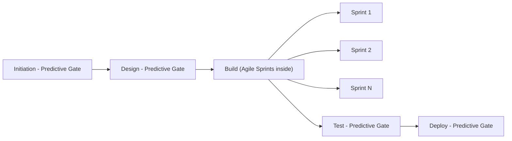

## Blending Predictive and Adaptive Methods

### Overview

Blending predictive and adaptive methods — often called "hybrid project management" — refers to the deliberate combination of plan-driven, baseline-controlled approaches (CPM scheduling, EVM cost/schedule integration, formal change control) with iterative, incremental approaches (Scrum, Kanban, XP) within a single program or even a single project. Rather than treating predictive and adaptive as mutually exclusive lifecycles, hybrid approaches partition the work, the organization, or the lifecycle phases so that each piece is governed by whichever approach best fits its characteristics.

### Why Hybrids Exist

**Key Points**

- **Uncertainty is not uniform across a project.** Some components (regulatory compliance deliverables, fixed infrastructure, hardware procurement) have low requirements volatility and benefit from predictive rigor; other components (user-facing features, algorithms, UX) have high volatility and benefit from adaptive iteration and fast feedback loops.
- **Contractual and governance obligations often mandate predictive artifacts.** Government and defense contracts frequently require an Integrated Master Schedule (IMS) and EVMS compliance (ANSI/EIA-748) regardless of the execution team's internal methodology, forcing a hybrid interface layer even when delivery teams are fully Agile.
- **Organizational maturity and stakeholder expectations** — executives and PMOs often expect fixed-date, fixed-budget commitments (predictive framing) even while technical teams want autonomy over sequencing and design (adaptive framing).

### The PMI Continuum: Predictive, Hybrid, Adaptive

The PMI Agile Practice Guide frames delivery approaches on a spectrum rather than a binary:

| Attribute | Predictive | Hybrid | Adaptive |
| --- | --- | --- | --- |
| Requirements | Fixed upfront | Core fixed, periphery flexible | Emergent, evolving |
| Planning | Comprehensive, front-loaded | Rolling wave / progressive elaboration | Iteration-by-iteration |
| Delivery cadence | Single/few large releases | Mixed — phase gates + iterations | Frequent, incremental |
| Change control | Formal, baseline-controlled | Tiered (formal at program level, lightweight at team level) | Continuous, embraced |
| Primary tracking metric | CPM float, EVM (SPI/CPI) | Blended (see conversion techniques below) | Velocity, burn-up/down |

### Common Hybrid Architectures

**1. Phase-Based Hybrid (Waterfall-wrapped-Agile)**

Predictive at the macro/program level (fixed phase gates: Initiation → Design → Build → Test → Deploy), Agile within the "Build" phase for iterative development sprints. The IMS carries summary-level milestones for phase boundaries; detailed sprint execution happens beneath a single planning package (a direct application of rolling wave planning).

**2. Component-Based Hybrid**

Different workstreams within the same program use different lifecycles concurrently. Example: a manufacturing/hardware workstream runs CPM-scheduled with EVM tracking; the embedded-software workstream runs Scrum with velocity tracking. Integration points between workstreams become synchronization milestones in the master schedule.

**3. Agile-Wrapped-in-EVM (Program-Level Predictive, Team-Level Adaptive)**

The most common pattern in regulated/contracted environments: teams execute in Scrum/Kanban internally, while a program controls office translates sprint outputs into EVM-compliant reporting via story-point-to-dollar conversion (as detailed under Agile Earned Value). The IMS holds sprint/PI (Program Increment) boundaries as scheduled milestones; the control accounts hold planning packages that get "rolled" into detailed work packages as each Program Increment approaches — combining rolling wave planning with hybrid governance.

**4. Risk-Adjusted Hybrid**

Selection of predictive vs. adaptive is driven explicitly by a risk/uncertainty assessment per work package or WBS element, sometimes formalized via a decision matrix scoring requirements stability, technical novelty, and stakeholder availability.

### Reconciling Metrics Across the Boundary

Blending methods requires a translation layer so that adaptive team output can still populate predictive control artifacts:

$$EV_{hybrid} = \left(\sum_{\text{Agile WPs}} SP_{completed} \times \$/pt\right) + \left(\sum_{\text{Predictive WPs}} \%complete \times BAC_{wp}\right)$$

**Example**

A hybrid program has two control accounts feeding one program-level EVM report:

- **Control Account A (Hardware, predictive):** BAC = $2,000,000; physical percent complete assessed at 60% → EV_A = $1,200,000.
- **Control Account B (Software, Agile):** Total scope 400 story points at $2,000/point (BAC = $800,000); 220 points completed → EV_B = $440,000.

Program-level EV = $1,200,000 + $440,000 = $1,640,000, against a combined BAC of $2,800,000, giving a program-level percent complete of ≈58.6% — a single, blended figure usable in an executive EVM status report despite the two control accounts using entirely different internal tracking mechanics.

**Key Points**

- The conversion rate ($/story point) must be periodically recalibrated as team composition or velocity trends change; a stale rate silently corrupts CPI at the program roll-up level.
- Predictive control accounts retain formal percent-complete rules (0/100, 50/50, milestone, apportioned effort); Agile control accounts use completed-story-point ratios — these are structurally different earning rules being summed into one number, which is a known source of interpretive risk for stakeholders reading only the top-line SPI/CPI.

### Governance Considerations

- **Change control tiering.** Predictive portions typically require formal Change Control Board approval for baseline changes; Agile portions handle backlog reprioritization through product owner authority within a fixed budget/timebox envelope — a lighter-weight, continuous form of change control. The interface (how much backlog reprioritization is allowed before it becomes a formal baseline change) must be explicitly defined.
- **Reporting cadence mismatch.** EVM reporting is typically monthly; Agile sprints are typically 1–4 weeks. Hybrid programs must define a reconciliation cadence (commonly aligning EVM reporting periods to sprint or Program Increment boundaries) to avoid reporting on partially-completed sprints as if they were discrete, measurable progress.
- **Tooling integration.** [Inference] Organizations commonly integrate Agile Life-cycle Management tools (Jira, Azure DevOps) with EVM/scheduling tools (e.g., a CPM scheduling tool or an EVM system) via APIs or periodic data exports, though the specific integration architecture is highly tool- and organization-dependent rather than standardized.

### Common Pitfalls

- **False precision at the roll-up level** — presenting a blended CPI/SPI to executives without disclosing that it aggregates fundamentally different earning methodologies, leading to overconfidence in the number's diagnostic power.
- **Governance mismatch causing team friction** — imposing full predictive change-control formality on an Agile team's routine backlog changes, effectively negating the adaptive benefits the hybrid was meant to preserve.
- **Treating "hybrid" as "Agile in name, Waterfall in practice"** — assigning fixed detailed scope, cost, and schedule to Agile teams upfront (defeating the purpose of iterative discovery) purely to satisfy predictive reporting formats.
- **Neglecting integration milestones** — component-based hybrids are especially vulnerable to schedule risk at the interfaces between differently-paced workstreams; these integration points deserve explicit CPM network logic and buffer/reserve treatment even when the surrounding work is adaptive.

**Related Topics**

- Agile Release Trains and Program Increment planning (SAFe) as a hybrid cadence mechanism
- Story-point-to-dollar conversion methodologies and recalibration techniques
- Integrated Master Schedule (IMS) health and the DCMA 14-point assessment in hybrid contexts
- Change Control Board processes and tiered governance models
- Percent-complete earning rules for predictive control accounts
- Risk-adjusted lifecycle selection frameworks (predictive vs. adaptive decision matrices)
- Portfolio-level reporting when constituent projects use different lifecycle models