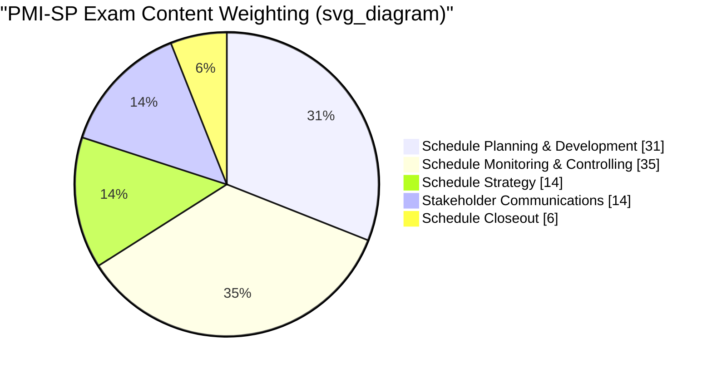

## PMI Scheduling Professional Certification

### Overview

The PMI Scheduling Professional (PMI-SP)® is a specialized credential offered by the Project Management Institute that recognizes advanced knowledge and demonstrated experience in developing, maintaining, and analyzing project schedules. Unlike the generalist PMP credential, PMI-SP is scoped specifically to the scheduling discipline — CPM network development, resource-loaded scheduling, schedule risk analysis, and schedule performance monitoring (including EVM-based schedule metrics) — making it directly relevant to practitioners specializing in schedule and cost control.

### Eligibility Requirements

Before applying, candidates must meet one of three eligibility paths: [PMI](https://www.pmi.org/certifications/scheduling-sp)

| Path | Degree | Scheduling Experience (within last 5 years) | Scheduling Education |
| --- | --- | --- | --- |
| Set A | Secondary degree (high school diploma or global equivalent) | 40 months | 40 contact hours |
| Set B | Four-year degree | 24 months | 30 contact hours |
| Set C | Bachelor's or post-graduate degree from a GAC-accredited program | 12 months | 30 contact hours |

PMI accepts hours spent in training for Microsoft Project and for other scheduling tools toward the education requirement. [PMI](https://www.pmi.org/certifications/scheduling-sp)

**Key Points**

- Experience must be within the specialized area of professional project scheduling specifically, not general project management experience.
- Candidates selected for an eligibility audit must provide a copy of their degree, supervisor-signed verification of experience, and certification or proof of project management experience.

### Exam Structure

The exam consists of 170 multiple-choice questions administered over 210 minutes, of which 20 are unscored pretest questions and 150 are scored. The exam is offered in English and is taken at a Pearson VUE testing center. Candidates who do not pass may attempt the exam up to three times within one year. [PMI Scheduling Professional (PMI-SP)® | PMI +2](https://www.pmi.org/certifications/scheduling-sp)

**Exam Content Outline (Domains)**

The scored content is distributed across five domains: Schedule Strategy (14%), Schedule Planning and Development (31%), Schedule Monitoring and Controlling (35%), Schedule Closeout (6%), and Stakeholder Communications Management (14%). [PMI](https://www.pmi.org/certifications/scheduling-sp)

**Key Points**

- "Schedule Monitoring and Controlling" is the single largest domain at 35%, which is where CPM float analysis, schedule variance, schedule performance index (SPI), and schedule change control are concentrated — directly overlapping with EVM schedule-side metrics.
- "Schedule Planning and Development" (31%) covers network diagramming methods, duration estimating, resource loading, and critical path/critical chain development — the foundational CPM mechanics.
- Together these two domains account for 66% of the scored exam, signaling that PMI-SP is weighted heavily toward hands-on schedule construction and control rather than administrative or closeout activities.

### Reference Standards

The primary standards referenced by the exam are A Guide to the Project Management Body of Knowledge (PMBOK Guide) and the Practice Standard for Scheduling, Third Edition, both published by PMI. The Practice Standard for Scheduling in particular details the actionable, objective measurement process for project schedules and schedule models, including guidance on schedule model quality, critical path methodology, and schedule performance measurement — material directly relevant to CPM/EVM integration. [PMI](https://www.pmi.org/certifications/scheduling-sp)

### Path to Certification

1. **Check eligibility** against Set A, B, or C above.
2. **Complete the application**, documenting past projects, roles/responsibilities (not just project descriptions), employers, project durations, and qualifying training hours. The application can be saved and returned to before submission. [PMI](https://www.pmi.org/certifications/scheduling-sp)
3. **Pay and schedule the exam** once the application is accepted; if selected for audit, candidates must provide degree verification, supervisor-signed experience verification, and proof of project management experience. [PMI](https://www.pmi.org/certifications/scheduling-sp)
4. **Study**, using the PMBOK Guide, the Practice Standard for Scheduling, and supplementary texts on integrated cost/schedule control and scheduling-tool-specific guides.
5. **Take the exam** at a Pearson VUE testing center.

### Maintaining the Certification

PMI-SP holders must earn 30 Professional Development Units (PDUs) within each three-year certification cycle to maintain the credential, where each PDU represents one hour spent learning, teaching, presenting, reading, volunteering, or creating content. [PMI](https://www.pmi.org/certifications/scheduling-sp)

**Key Points**

- The three-year cycle is measured from the date the exam was passed, not the date the physical/digital certificate was issued — a distinction that has caused inadvertent lapses for some credential holders. [Unverified: this specific framing is a commonly cited practical tip rather than explicit PMI policy language quoted verbatim above.]
- PDU tracking and reporting is done through PMI's Continuing Certification Requirements System (CCRS).

### Relevance to CPM/EVM Practitioners

**Key Points**

- PMI-SP is one of the few PMI credentials that examines schedule risk analysis, resource-constrained scheduling, and schedule performance measurement in enough depth to be directly complementary to EVM practice — a PMI-SP holder is expected to understand how schedule variance (SV) and Schedule Performance Index (SPI) relate to the underlying CPM network, not just how to compute the formulas.
- The credential is frequently pursued alongside or after the PMP by practitioners specializing in planning/scheduling roles (e.g., Master Scheduler, Planning Engineer, EVM Analyst) on large capital, construction, defense, or infrastructure programs where a dedicated scheduling specialist role exists separately from the project manager role.
- Because the exam explicitly covers stakeholder communications regarding schedule status (14% weighting), it also reinforces the reporting side of EVM — translating SPI/CPI and float erosion into stakeholder-comprehensible status narratives.

**Related Topics**

- PMI Practice Standard for Scheduling — schedule model quality and the DCMA 14-point assessment
- Resource-constrained vs. resource-leveled CPM scheduling
- Schedule Risk Analysis (SRA) using Monte Carlo simulation
- Comparison with other scheduling credentials (AACE Planning & Scheduling Professional, PMI-ACP for hybrid environments)
- PDU categories and the PMI Talent Triangle (Ways of Working, Power Skills, Business Acumen)
- Master Scheduler and Planning Engineer career pathways in capital projects and defense programs