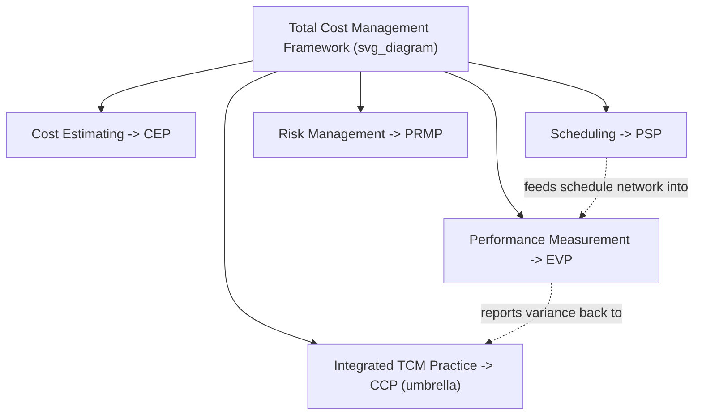

## AACE International Certifications Including CCP, PSP, and EVP

### Overview

AACE International (the Association for the Advancement of Cost Engineering, now operating under the name "AACE International") has administered professional certification examinations since 1976 in the cost engineering and total project controls domain. Its credentialing program is organized around the Total Cost Management (TCM) Framework — an integrated process map covering cost estimating, scheduling, cost control, and risk management across a capital project's life cycle. Within this family, three certifications are most directly relevant to Critical Path Method (CPM) and Earned Value Management (EVM) practice: the Certified Cost Professional (CCP), the Planning & Scheduling Professional (PSP), and the Earned Value Professional (EVP).

### Certification Tiers

AACE organizes its nine certifications across three tiers:

| Tier | Certifications | Renewal |
| --- | --- | --- |
| Technician | CCT (Certified Cost Technician), CST (Certified Scheduling Technician) | Expire after 4 years, not renewable — stepping stones to professional-level credentials |
| Professional | CCP, CEP (Certified Estimating Professional), EVP, PSP, PRMP (Project Risk Management Professional) | Renewed every 3 years via recertification |
| Expert | CFCC (Certified Forensic Claims Consultant), DRMP (Decision & Risk Management Professional) | Highest tier, built on professional-level experience |

### Certified Cost Professional (CCP)

**Overview**

The CCP is AACE's flagship, broadest credential — described by AACE as the "umbrella" certification above its specialist certifications. A CCP is an experienced practitioner with advanced knowledge and technical expertise to apply the broad principles and best practices of Total Cost Management in the planning, execution, and management of any organizational project or program, and to communicate TCM principles to all levels of stakeholders.

**Eligibility**

- 8 full years of industry-related experience, **or**
- 4 years of industry-related experience plus a related 4-year degree
- No technical paper requirement under the current process
- Experience must be verified by the employer via AACE's Employment Verification Form — a CV, résumé, or job description alone is not accepted
- All application documents must be in English or carry an official English translation

**Exam Structure**

A closed-book exam of up to 5 hours, consisting of 119 multiple-choice questions plus one written memo, scored across 7 domains under the current blueprint, requiring a 70% passing score. Fees are commonly cited around $525 for members and $690 for non-members, though exact pricing should be confirmed directly with AACE as fee schedules change.

**Key Points**

- [Unverified] As of a September 2026 AACE notice, CCP certification applications were temporarily closed as of July 1, 2026 due to an operational issue, with reopening announced for September 17, 2026 — candidates should verify current application-window status directly on AACE's site before planning an application timeline, since this kind of administrative status is subject to change after this material was assembled.
- CCP is broader in scope than PSP or EVP, spanning cost estimating, cost control, scheduling, and project management integration rather than one specialty area.

### Planning & Scheduling Professional (PSP)

**Overview**

A PSP is a skilled planning and scheduling professional with advanced experience in project planning and in developing, monitoring, updating, forecasting, and analyzing integrated project schedules. The PSP leads the planning and scheduling process within the AACE Total Cost Management framework and is expected to communicate effectively with all project stakeholders, internal and external. The PSP Certification Study Guide is built around AACE Recommended Practice 14R-90, "Responsibility and Required Skills for a Planning and Scheduling Professional," along with the current edition of the Skills and Knowledge of Cost Engineering.

**Key Points**

- The credential is explicitly domain-agnostic — applicable across aerospace, agriculture, telecommunications, shipbuilding, software development, and resource industries, not limited to construction.
- PSP content centers on integrated CPM schedule development, monitoring, updating, forecasting, and forensic schedule analysis techniques — content that overlaps substantially with the schedule-network and float-analysis mechanics underlying CPM.

### Earned Value Professional (EVP)

**Overview**

An EVP is a practitioner of Earned Value with demonstrated mastery across the full EVM lifecycle: interpreting contract language as it relates to EV application; organizing project scope into a meaningful structure for execution; planning, scheduling, and budgeting project work from initiation through closeout using an integrated cost/schedule tool; monitoring project progress for performance measurement; operating an Earned Value Management System (EVMS) and its related accounting component for recording actual costs; generating and analyzing EV reports using actual cost data reconcilable with the accounting system; and managing changes to scope, performance trends, or baseline deviations throughout a project or portfolio's life cycle in public and/or private sector contexts. The experienced EVP is expected to interpret EV data and metrics and communicate them coherently to all levels of stakeholders.

**Key Points**

- EVP is the AACE credential most directly and narrowly focused on EVM mechanics specifically — PV/EV/AC, SPI/CPI, variance analysis, and EVMS compliance — making it the most direct AACE analogue to the EVM half of a combined CPM/EVM skill set, with PSP as the analogue to the CPM/scheduling half.
- The EVP's scope explicitly includes reconciling EV data against the accounting system's actual cost data — a system-integration competency (scheduling tool ↔ accounting system) beyond the pure formula-level EVM calculations.

### Recertification

Professional-level AACE certifications (CCP, CEP, PSP, EVP, PRMP) must be renewed every three years. Certificants must accumulate 12 Continuing Education Units (CEUs) across at least two categories during each recertification period, or alternatively choose to re-sit the examination.

### Comparative Positioning

| Credential | Scope | Primary Domain Overlap with CPM/EVM |
| --- | --- | --- |
| CCP | Broadest — full Total Cost Management | Integrates both, at a management/oversight level |
| PSP | Specialist — planning and scheduling | Direct: CPM network development, float, schedule forensic analysis |
| EVP | Specialist — earned value | Direct: PV/EV/AC mechanics, EVMS operation, variance/index analysis |
| CEP | Specialist — cost estimating | Indirect: feeds the cost baseline that EVM measures against |
| PRMP | Specialist — risk management | Indirect: schedule/cost risk analysis (e.g., Monte Carlo schedule risk) |

**Key Points**

- Compared to PMI-SP (a PMI credential scoped narrowly to scheduling), AACE's family lets a practitioner choose a credential matched precisely to their specialization — PSP for scheduling specifically, EVP for earned value specifically, or CCP for a generalist cost-engineering leadership role spanning both.
- [Inference] In practice, senior project controls leads on large capital or EPC (engineering-procurement-construction) programs often pursue CCP as a capstone credential after having already earned PSP and/or EVP, though this progression is a common career pattern rather than an AACE-mandated prerequisite chain.

**Related Topics**

- AACE Recommended Practice 14R-90 (Planning and Scheduling Professional responsibilities)
- AACE Total Cost Management (TCM) Framework structure and process map
- Certified Estimating Professional (CEP) and its relationship to EVM's Planned Value baseline
- Project Risk Management Professional (PRMP) and schedule/cost risk integration
- Forensic schedule analysis techniques (a PSP-adjacent specialty, relevant to claims and delay analysis)
- Comparing AACE PSP/EVP against PMI-SP for career-path decision-making
- ANSI/EIA-748 EVMS compliance and its relationship to the EVP body of knowledge