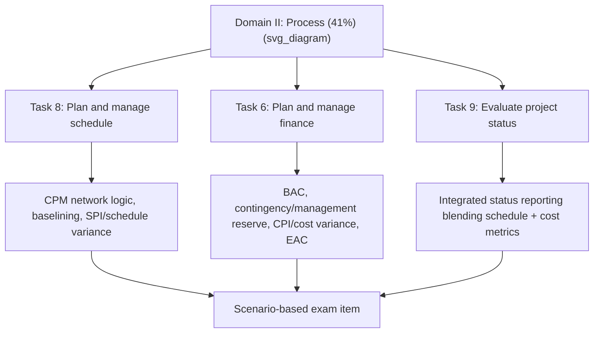

## PMP Exam Content on Schedule and Cost Management

### Overview

Under the current PMP Examination Content Outline (effective July 2026), schedule and cost management are no longer separate, discretely-weighted knowledge areas as in prior PMBOK-aligned formats. They are folded into **Domain II: Process (41% of the exam)**, specifically as **Task 8: Plan and manage schedule** and **Task 6: Plan and manage finance**, alongside a broader set of process tasks covering integration, scope, value delivery, resources, procurement, quality, status, and closure. The 2026 ECO update was driven by a Job Task Analysis (JTA) reflecting predictive, adaptive/agile, and hybrid ways of working distributed across all three domains rather than isolated to one.

### The Three-Domain Structure

| Domain | Weight | Relevance to Schedule/Cost |
| --- | --- | --- |
| I. People | 33% | Indirect — stakeholder communication of schedule/cost status, conflict over resource/schedule tradeoffs |
| II. Process | 41% | Direct — contains the dedicated schedule (Task 8) and finance (Task 6) tasks |
| III. Business Environment | 26% | Indirect — governance thresholds and compliance around cost/schedule reporting |

**Key Points**

- Approximately 40% of exam items represent predictive project management approaches, with the remaining 60% split between adaptive/agile and hybrid approaches — meaning schedule/cost questions may be framed through a CPM/EVM lens, a velocity/burn-down lens, or a blended hybrid lens depending on the item.
- The ECO explicitly states that predictive, adaptive, and hybrid approaches are found throughout all three domains and are not isolated to any single task, so schedule/cost competency is tested contextually rather than as an isolated knowledge-recall section.

### Task 8: Plan and Manage Schedule (Domain II)

This is the task most directly aligned to CPM and traditional scheduling practice. Its enablers are:

- Prepare a schedule based on the selected development approach
- Coordinate with other projects and operations
- Estimate project tasks (milestones, dependencies, story points)
- Utilize benchmarks and historical data
- Create a project schedule
- Baseline a project schedule
- Execute a schedule management plan
- Analyze schedule variation

**Key Points**

- The phrase "estimate project tasks (milestones, dependencies, story points)" explicitly blends predictive terminology (milestones, dependencies — the language of CPM networks) with adaptive terminology (story points), reflecting the hybrid framing that runs through the entire 2026 ECO.
- "Baseline a project schedule" and "Analyze schedule variation" are the two enablers most directly testable via CPM/EVM mechanics — schedule baselining maps to establishing the Performance Measurement Baseline, and variation analysis maps to Schedule Variance (SV) and Schedule Performance Index (SPI) calculations.
- "Coordinate with other projects and operations" reflects cross-project schedule integration — relevant to hammock activities, external constraints, and resource-shared critical paths in multi-project environments.

### Task 6: Plan and Manage Finance (Domain II)

This task carries the cost-management content, rebranded from earlier "Cost Management" framing to "finance" to reflect a broader financial-stewardship scope. Its enablers are:

- Analyze project financial needs
- Quantify risk and contingency financial allocations
- Plan spend tracking throughout the project life cycle
- Plan financial reporting
- Anticipate future finance challenges
- Monitor financial variations and work with the governance process
- Manage financial reserves

**Key Points**

- "Quantify risk and contingency financial allocations" and "Manage financial reserves" map directly to Management Reserve and Contingency Reserve concepts, which sit adjacent to EVM's Budget at Completion (BAC) and Management Reserve distinction.
- "Plan spend tracking throughout the project life cycle" and "Monitor financial variations" are the enablers most directly testable via Cost Variance (CV) and Cost Performance Index (CPI) calculations, and via Estimate at Completion (EAC) forecasting methods.
- This task was explicitly expanded and elevated in the July 2026 update — public commentary on the update highlights financial management as a newly detailed, standalone task within Process, a departure from earlier outlines where cost content was more diffusely distributed. [Unverified: characterizations of "newly detailed" describe the update's emphasis relative to prior ECO versions and reflect third-party analysis rather than PMI's own outline text quoted above.]

### How Schedule and Cost Questions Are Likely Framed

**Key Points**

- **Task 9: Evaluate project status** (enablers: develop project metrics/analysis/reconciliation, assess current progress, measure/analyze/update project metrics, communicate project status) is where schedule and cost metrics most often converge into a single scenario-based exam item — consistent with how EVM naturally fuses SPI and CPI into one integrated status picture.
- Given the new Case/Scenario, Enhanced Matching, and Graphic-Based question types introduced in the July 2026 update, schedule/cost items are more likely to present a chart (e.g., an S-curve, a partial network diagram, or an EVM data table) and ask the candidate to interpret it, rather than to recall a formula in isolation.
- Because roughly 60% of items represent adaptive or hybrid approaches, a schedule/cost scenario may just as easily reference velocity and burn-up trends as CPM float and EVM indices — candidates should expect to translate between the two representations rather than assume a purely predictive framing.

### Eligibility and Exam Logistics (Context for Certification Planning)

- **Eligibility paths** are tiered by educational background: secondary education requires 60 months of non-overlapping project-leadership experience within the last 10 years; an associate's-level credential requires 48 months; a bachelor's degree requires 36 months; a GAC-accredited bachelor's/postgraduate degree requires 24 months.
- Candidates must also complete at least 35 hours of commercial training in project management aligned to the ECO; active CAPM holders who meet the experience/education requirements have this training requirement waived.
- **Exam format**: 180 total questions (170 scored, 10 unscored pretest), 240 minutes, with two 10-minute breaks — one after the case-study section and one roughly midway through the independent-question portion.
- **Retakes**: up to three attempts within a 1-year eligibility window; after three failed attempts, a 1-year wait is required before reapplying.
- **Maintenance**: 60 Professional Development Units (PDUs) every 3 years, plus a renewal fee, through PMI's Continuing Certification Requirements (CCR) program.

### Relevance to CPM/EVM Practitioners Specifically

**Key Points**

- The PMP is a generalist credential — schedule and cost content is proportionally smaller than in PMI-SP or AACE's PSP/EVP, but it is tested in an integrated, scenario-driven way that mirrors how a working project manager actually uses CPM and EVM outputs (as inputs to broader decisions about resourcing, stakeholder communication, and governance) rather than as standalone technical calculation exercises.
- A candidate with strong PMI-SP or AACE PSP/EVP grounding will typically find the mechanical content of Task 8 and Task 6 straightforward; the PMP's distinguishing difficulty for such candidates is usually the surrounding People and Business Environment context each schedule/cost scenario is embedded in, not the schedule/cost mechanics themselves.

**Related Topics**

- PMI-SP as a scheduling-specialist complement to the generalist PMP
- AACE EVP as an earned-value-specialist complement to the generalist PMP
- Scenario-based and graphic-based question formats and how to practice for them
- Management Reserve vs. Contingency Reserve vs. financial reserves terminology alignment
- Hybrid approach framing in PMP items: recognizing predictive vs. adaptive vs. hybrid scenario cues
- PMI's Job Task Analysis (JTA) methodology and how it shapes future ECO revisions