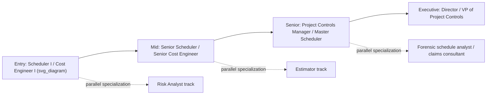

## Building a Career in Planning and Project Controls

### Overview

Planning and project controls is a distinct career track from general project management — it is the specialist discipline responsible for developing, maintaining, and analyzing the schedule and cost baselines (via CPM and EVM) that project managers and executives use to make decisions. Careers in this field span entry-level scheduler/cost engineer roles through senior project controls manager and portfolio controls director positions, most concentrated in capital-intensive industries: construction, oil & gas, EPC (engineering-procurement-construction), aerospace/defense, infrastructure, and utilities.

### Core Career Track and Progression

| Level | Typical Titles | Typical Focus |
| --- | --- | --- |
| Entry | Scheduler I, Cost Engineer I, Project Controls Analyst | Building and maintaining CPM schedules, basic EVM data entry and reporting, activity-level tracking |
| Mid | Senior Scheduler, Senior Cost Engineer, Project Controls Specialist | Independent CPM network development, schedule risk analysis, EVM variance analysis, forecasting (EAC/ETC) |
| Senior | Lead Scheduler, Project Controls Manager, Master Scheduler | Multi-project/program schedule integration, control account management, EVMS compliance, mentoring junior staff |
| Executive | Director of Project Controls, VP of Project Controls, Program Controls Director | Portfolio-level reporting, EVMS governance, tool/process strategy, executive stakeholder communication |

**Key Points**

- Two common entry points exist: a **scheduling-first path** (starting as a scheduler focused on CPM network development) and a **cost-first path** (starting as a cost engineer focused on estimating and cost control), which typically converge at the mid-to-senior level into a combined "project controls" role encompassing both.
- Specialization branches (risk analysis, forensic schedule/delay analysis, estimating) often split off from the core track at the mid-career stage rather than being pursued from the start.

### Foundational Technical Skills

**Key Points**

- **CPM scheduling mechanics**: network diagramming (precedence diagramming method), forward/backward pass calculations, total float and free float, critical path identification, and schedule logic quality (avoiding open ends, negative lag, excessive constraints).
- **EVM mechanics**: PV/EV/AC, SV/CV, SPI/CPI, EAC/ETC/TCPI formulas, and the ability to translate raw index numbers into a coherent narrative about project health.
- **Scheduling software proficiency**: Oracle Primavera P6 and Microsoft Project are the two dominant tools in most project controls job postings; familiarity with resource loading, baseline management, and schedule health metrics (e.g., DCMA 14-point assessment) within these tools is commonly expected.
- **Cost/EVM software and reporting tools**: spreadsheet-based EVM reporting is still common at smaller organizations; larger EVMS-compliant programs often use dedicated cost/schedule integration tools alongside ERP systems for actual cost data.
- **Risk analysis**: Monte Carlo schedule risk simulation (e.g., using Primavera Risk Analysis or similar tools) is increasingly expected at the mid-to-senior level, particularly on capital megaprojects.

### Building the Skill Set: A Practical Sequence

1. **Master core CPM/EVM theory** — understand the "why" behind float, baselining, and the EV formulas, not just how to compute them, since interview and on-the-job scenarios frequently test judgment (e.g., "the schedule shows positive float everywhere — what does that suggest about the logic quality?").
2. **Gain hands-on tool proficiency** — build, update, and baseline schedules in Primavera P6 or MS Project on real or simulated projects; the tool-specific muscle memory (constraint types, calendars, resource curves) is what differentiates a theoretically knowledgeable candidate from a job-ready one.
3. **Practice variance and forecasting narratives** — take a sample EVM dataset and write the kind of one-paragraph status narrative a project controls analyst would actually submit to a program manager, translating SPI/CPI into plain-language risk statements.
4. **Pursue a foundational certification** — PMI-SP or AACE's PSP/EVP (or CCP for a broader Total Cost Management scope) signal credibility to employers and structure self-study around a recognized body of knowledge.
5. **Seek exposure to schedule risk analysis and forensic delay analysis** — even peripheral exposure (shadowing, assisting) to these adjacent specialties broadens senior-level career optionality.
6. **Develop stakeholder communication skills deliberately** — project controls professionals who advance to management roles are consistently distinguished by their ability to present technical schedule/cost data to non-technical executives and clients, not solely by technical depth.

### Industry Sectors and Typical Entry Routes

**Key Points**

- **Construction and EPC**: the largest employer base for project controls roles; entry is often via a construction management, civil engineering, or industrial engineering degree, sometimes combined with field experience (estimating, field engineering) before moving into a dedicated controls role.
- **Oil & gas and energy megaprojects**: heavy emphasis on formal EVMS compliance and Total Cost Management frameworks (AACE's TCM is particularly influential in this sector); PSP/CCP credentials carry strong recognition.
- **Aerospace and defense (government contracting)**: EVMS compliance under ANSI/EIA-748 is often contractually mandated; project controls professionals in this sector need familiarity with formal Integrated Baseline Reviews (IBRs), DCMA surveillance, and government reporting formats (e.g., Contract Performance Reports).
- **IT and software-adjacent programs**: increasingly hybrid, blending CPM/EVM-style program-level reporting with Agile team-level execution — project controls professionals entering this space benefit from fluency in translating velocity/burn-up data into EVM-style formats.

### Certifications as Career Accelerators

| Certification | Best Fit For |
| --- | --- |
| PMI-SP | Scheduling specialists across industries generally, especially those already PMI-aligned |
| AACE PSP | Scheduling specialists, particularly in construction/EPC/energy sectors with AACE's TCM framework in use |
| AACE EVP | Earned value specialists, particularly on EVMS-compliant government/defense programs |
| AACE CCP | Senior generalists aiming for a broad Total Cost Management leadership role |
| PMP | General project management credibility, useful as a complement when moving from a pure controls specialist role toward broader project leadership |

**Key Points**

- [Inference] Employers in capital-project-heavy sectors (construction, energy, defense) tend to weight AACE credentials (PSP, EVP, CCP) more heavily due to the sector-specific TCM framework alignment, while PMI credentials (PMI-SP, PMP) carry broader general recognition — but exact employer preference varies significantly by organization and region, so this should be treated as a general pattern rather than a fixed rule.
- Stacking a specialist credential (PSP or EVP) with a generalist one (PMP) is a common strategy for professionals aiming to transition from a pure project controls specialist role into a project or program management role later in their career.

### Common Career Pitfalls

- **Over-indexing on tool mechanics without theoretical grounding** — being fast in Primavera P6 without understanding why a given float value or EV calculation matters limits advancement past junior-level execution roles.
- **Neglecting communication skill development** — technically excellent schedulers/cost engineers who cannot translate findings for non-technical stakeholders often plateau at the senior individual-contributor level rather than advancing into management.
- **Staying purely siloed in either scheduling or cost** — the most senior project controls roles typically require fluency in both CPM and EVM together, since the two are interdependent (schedule slippage drives cost variance and vice versa); professionals who never cross-train into the other half of the discipline may find their advancement path narrower.
- **Underestimating the value of sector-specific frameworks** — a scheduler with strong general CPM skills but no exposure to sector-specific expectations (EVMS compliance in defense, TCM in energy/construction) may find the learning curve steeper when moving into those sectors later in their career.

**Related Topics**

- PMI Scheduling Professional certification (detailed eligibility and exam structure)
- AACE International certifications including CCP, PSP, and EVP (detailed eligibility and exam structure)
- Integrated Baseline Reviews (IBRs) and DCMA EVMS surveillance in government contracting
- Schedule Risk Analysis (SRA) via Monte Carlo simulation as a specialization path
- Forensic schedule/delay analysis as a senior-career specialization
- Primavera P6 vs. Microsoft Project: feature comparison for project controls roles
- Transitioning from project controls specialist to program/portfolio management leadership