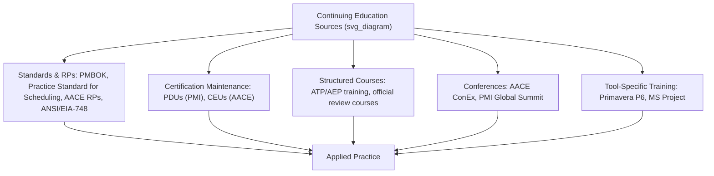

## Continuing Education and Professional Resources

### Overview

Continuing education in planning and project controls serves two purposes: maintaining active certifications (PMI-SP, AACE PSP/EVP/CCP, PMP) through required Professional Development Units (PDUs) or Continuing Education Units (CEUs), and staying current with evolving standards, tools, and practices in a field where scheduling software, EVMS guidance, and industry recommended practices continue to develop. This entry surveys the standards bodies, recommended practices, publications, and structured learning channels most relevant to CPM/EVM practitioners.

### Certification Maintenance Requirements

| Certification | Body | Cycle | Requirement |
| --- | --- | --- | --- |
| PMP | PMI | 3 years | 60 PDUs + renewal fee (Continuing Certification Requirements program) |
| PMI-SP | PMI | 3 years | 30 PDUs + renewal fee |
| CCP / PSP / EVP / PRMP | AACE International | 3 years | 12 CEUs across at least 2 categories, or re-sit the exam |
| CCT / CST | AACE International | 4 years | Not renewable — stepping stones to professional-level credentials |

**Key Points**

- PMI's PDU system credits time spent learning, teaching, presenting, reading, volunteering, or creating content — a broad definition that lets practitioners earn credit through varied activities rather than only formal coursework.
- AACE's CEU system requires spreading credit across at least two categories, which discourages relying on a single narrow activity (e.g., only attending webinars) to satisfy the full renewal requirement.

### Core Standards and Recommended Practices

**PMI Standards**

- *A Guide to the Project Management Body of Knowledge* (PMBOK Guide) — the foundational reference across PMI's certification family, though PMI is explicit that the PMP exam is scenario/task-based and not written to any single text.
- *Practice Standard for Scheduling* (currently in its Third Edition) — the primary PMI reference specifically for schedule model quality, critical path methodology, and schedule performance measurement; directly relevant to CPM practice and PMI-SP exam preparation.

**AACE Recommended Practices (RPs)**

AACE maintains roughly 120 peer-reviewed Recommended Practice documents that codify accepted methods across cost engineering and project controls. Two are especially central to CPM/EVM practice:

- **RP 14R-90**, "Responsibility and Required Skills for a Planning and Scheduling Professional" — the foundational document underlying the PSP certification's scope.
- **Skills and Knowledge of Cost Engineering** — a broader reference publication covering the full Total Cost Management skill set, underlying both the CCP and, by extension, EVP content.

**Key Points**

- AACE's RP library extends well beyond scheduling and EVM into estimate classification systems, forensic schedule analysis, and risk analysis methodologies — practitioners building a durable knowledge base benefit from browsing the library periodically rather than only consulting RPs when preparing for a specific exam.

### Government and Industry EVMS Guidance

**Key Points**

- **ANSI/EIA-748**, the Earned Value Management Systems standard, is the guideline most government contractors and defense programs are contractually required to comply with; practitioners on such programs should track updates to this standard and associated DCMA (Defense Contract Management Agency) surveillance guidance directly, since compliance expectations can shift.
- The **DCMA 14-point schedule health assessment** is a widely referenced practical checklist for evaluating Integrated Master Schedule (IMS) quality (logic, constraints, high float, negative lag, etc.) and is commonly used as an ongoing internal quality-control practice, not just a one-time compliance check.
- The **NDIA (National Defense Industrial Association) PMSC (Program Management Systems Committee)** publishes guidance, including material specifically addressing Agile EVM integration for hybrid defense programs — a valuable ongoing resource for practitioners in blended predictive/adaptive environments.

### Structured Learning Channels

**Key Points**

- **PMI and AACE-provided courses**: both organizations offer official review courses (e.g., AACE's CCP Review and PSP Review online courses) aimed specifically at certification preparation, alongside broader continuing-education modules and webinar libraries.
- **PMI Authorized Training Partners (ATPs)** and equivalent AACE-recognized education providers offer structured commercial training that satisfies certification training-hour requirements while also serving as ongoing skill development.
- **Conferences**: AACE's annual International Conference & Expo and PMI's Global Summit are the flagship industry conferences in this space, offering technical seminars (e.g., data analytics for cost engineering, project controls from the owner's perspective) alongside networking and PDU/CEU-eligible sessions.
- **Vendor/tool-specific training**: since Primavera P6 and Microsoft Project dominate the scheduling tool landscape, tool-specific certification and training tracks (offered by the vendors and by third-party training providers) remain a practical, ongoing component of a project controls professional's skill maintenance, distinct from the PMI/AACE credential tracks.

### Publications and Ongoing Reading

**Key Points**

- **AACE's Cost Engineering Journal** and its community blog ("Source") provide ongoing, practitioner-oriented content on emerging cost engineering and project controls topics.
- **PMI's Project Management Journal** and general PMI thought-leadership publications (e.g., its periodic "Pulse of the Profession" research) provide broader industry-trend context, including recent emphasis on reframing project success beyond the traditional schedule/budget/scope triple constraint toward stakeholder value.
- Practitioners should treat vendor blogs, exam-prep sites, and third-party study guides as supplementary rather than authoritative — official standards-body publications (PMI, AACE) remain the primary source for exam-relevant and practice-relevant content, since third-party material can lag behind or misstate current requirements.

### Practical Recommendations for Staying Current

1. Set a recurring calendar review (e.g., annually) of the PMI and AACE certification pages directly, since eligibility requirements, exam content outlines, and fee schedules are periodically revised — sometimes significantly, as with the July 2026 PMP ECO update.
2. Track PDU/CEU accumulation continuously rather than in a last-minute push before a renewal deadline, since PMI's PDU categories reward diverse ongoing engagement (teaching, volunteering, content creation) that is hard to compress into a short window.
3. Periodically revisit foundational recommended practices (e.g., AACE RP 14R-90, the Practice Standard for Scheduling) even after initial certification, since practical fluency benefits from re-reading foundational material with the added context of on-the-job experience.
4. Maintain parallel awareness of both the PMI and AACE ecosystems even if only certified in one, since cross-pollination of standards and practices (e.g., Agile EVM guidance) increasingly flows across both bodies.

**Related Topics**

- PMI Scheduling Professional certification (detailed eligibility and exam structure)
- AACE International certifications including CCP, PSP, and EVP (detailed eligibility and exam structure)
- ANSI/EIA-748 EVMS standard and DCMA surveillance practices in defense contracting
- DCMA 14-point schedule health assessment as an ongoing quality-control practice
- NDIA PMSC guidance on Agile Earned Value integration for hybrid programs
- Building a career in planning and project controls
- Evaluating third-party exam-prep and training resources for credibility