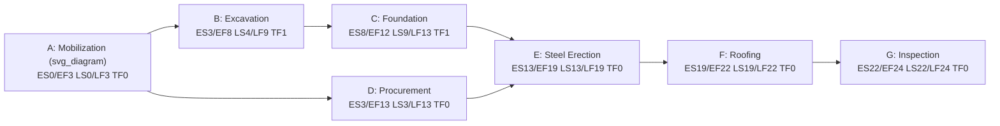

## Worked CPM Network Diagram Examples

### Overview

This entry walks through fully worked Critical Path Method examples using the Precedence Diagramming Method (PDM), covering forward pass, backward pass, float calculation, and critical path identification — progressing from a simple finish-to-start network to a more complex network with lag, lead, and multiple dependency types.

### Example 1: Basic Finish-to-Start Network

**Problem Setup**

| Activity | Description | Duration (days) | Predecessors |
| --- | --- | --- | --- |
| A | Site Mobilization | 3 | — |
| B | Excavation | 5 | A |
| C | Foundation Pour | 4 | B |
| D | Procurement (long-lead equipment) | 10 | A |
| E | Structural Steel Erection | 6 | C, D |
| F | Roofing | 3 | E |
| G | Final Inspection | 2 | F |

**Forward Pass (Early Start / Early Finish)**

Using the convention $EF = ES + Duration$ and $ES = \max(EF_{predecessors})$:

- A: $ES=0, EF=3$
- B: $ES=3, EF=8$
- C: $ES=8, EF=12$
- D: $ES=3, EF=13$
- E: $ES=\max(12,13)=13, EF=19$
- F: $ES=19, EF=22$
- G: $ES=22, EF=24$

**Backward Pass (Late Start / Late Finish)**

Starting from the project finish date (24) and using $LS = LF - Duration$, $LF = \min(LS_{successors})$:

- G: $LF=24, LS=22$
- F: $LF=22, LS=19$
- E: $LF=19, LS=13$
- D: $LF=13, LS=3$
- C: $LF=13, LS=9$
- B: $LF=9, LS=4$
- A: $LF=\min(4,3)=3, LS=0$

**Total Float and Critical Path**

$$TF = LS - ES = LF - EF$$

| Activity | ES | EF | LS | LF | Total Float | Critical? |
| --- | --- | --- | --- | --- | --- | --- |
| A | 0 | 3 | 0 | 3 | 0 | Yes |
| B | 3 | 8 | 4 | 9 | 1 | No |
| C | 8 | 12 | 9 | 13 | 1 | No |
| D | 3 | 13 | 3 | 13 | 0 | Yes |
| E | 13 | 19 | 13 | 19 | 0 | Yes |
| F | 19 | 22 | 19 | 22 | 0 | Yes |
| G | 22 | 24 | 22 | 24 | 0 | Yes |

**Critical Path: A → D → E → F → G, Total Duration = 24 days.**

**Key Points**

- B and C form a **near-critical path** with only 1 day of total float — a common real-world situation where a project has more than one path close to critical, meaning a small delay in the excavation/foundation sequence could shift the critical path entirely.
- Note that D (Procurement), not the B→C excavation/foundation sequence, drives the critical path here — a frequent real-world pattern where long-lead procurement, not on-site construction sequencing, is the true schedule driver.

### Example 2: Network with Lag and Non-Finish-to-Start Dependencies

Real-world schedules rarely use only finish-to-start (FS) relationships with zero lag. This example introduces a start-to-start (SS) relationship with lag and a finish-to-start relationship with lag (representing curing time).

| Activity | Description | Duration (days) | Predecessor & Relationship |
| --- | --- | --- | --- |
| A | Rebar Placement | 4 | — |
| B | Concrete Pour | 3 | A: SS+2 (pour can start 2 days after rebar begins, working in parallel on different sections) |
| C | Concrete Curing | 7 | B: FS+0 |
| D | Formwork Strip | 1 | C: FS+5 (must wait 5 of the 7 curing days before partial strip is safe) |

**Forward Pass with Lag**

- A: $ES=0, EF=4$
- B (SS+2 from A): $ES = ES_A + 2 = 2$, $EF = ES + Duration = 2+3=5$
- C (FS+0 from B): $ES = EF_B + 0 = 5$, $EF = 5+7=12$
- D (FS+5 from C, meaning D can start once 5 days of C's 7-day duration have elapsed, not after C fully finishes): $ES = ES_C + 5 = 10$, $EF = 10+1=11$

**Key Points**

- Note the counterintuitive result: **D's early finish (11) is earlier than C's early finish (12)** — this is a direct consequence of the FS+5 lag being measured from C's start rather than C's full completion, which is a common source of scheduling logic errors when lag types are confused.
- **Lag** (positive) represents a required waiting period between activities (e.g., curing time); **lead** (negative lag) represents allowed overlap (e.g., starting the next activity before the predecessor fully finishes) — both must be modeled explicitly, as a plain FS relationship with zero lag would incorrectly assume Formwork Strip cannot begin until Curing is 100% complete.
- Total project duration for this fragment is governed by whichever path has the latest EF among the network's terminal activities — in isolation here, C (EF=12) still finishes after D (EF=11), so if D were the final activity in this fragment, C would still constrain any successor of D that also depends on C directly.

### Example 3: Resource-Constrained Float Erosion

A common real-world scenario: two non-critical activities sharing a scarce resource (e.g., one crane) compete for the same time window, artificially consuming float even though the CPM logic alone shows slack.

| Activity | Duration | Total Float (logic-only) | Resource |
| --- | --- | --- | --- |
| H | 4 days | 3 days | Crane #1 (only one available) |
| I | 4 days | 5 days | Crane #1 (only one available) |

If H and I's float windows overlap and only one crane exists, resource leveling will push one activity later, **consuming its logic-based float** — a resource-leveled schedule can show zero or reduced float on an activity that pure CPM math (ignoring resources) would classify as non-critical. This is why the **resource-constrained critical path** (sometimes called the "critical chain" in Theory of Constraints terminology, though methodologically distinct from Goldratt's Critical Chain Method) can differ from the logic-only critical path.

**Key Points**

- **[Inference]** In practice, project controls teams commonly report both the logic-only critical path and a resource-leveled schedule side by side, since stakeholders need to understand whether a delay risk stems from network logic or from resource contention — though the specific reporting convention varies by organization and scheduling tool.
- Total float reported by scheduling software (Primavera P6, MS Project) by default typically reflects logic-only float unless resource leveling has been explicitly applied and the schedule recalculated — a frequent point of confusion for schedulers new to resource-constrained analysis.

### Common Errors in Worked CPM Problems

- **Forgetting to take the maximum (forward pass) or minimum (backward pass)** when an activity has multiple predecessors/successors — a frequent arithmetic slip that silently produces an incorrect critical path.
- **Misapplying lag direction** — applying a lag to the wrong relationship type (e.g., treating an SS+2 lag as though it were FS+2) produces early dates that don't reflect the actual physical constraint being modeled.
- **Confusing total float with free float** — total float is the delay an activity can absorb without delaying the project finish date; free float is the delay an activity can absorb without delaying its immediate successor's early start. An activity can have zero free float but positive total float, or vice versa in some edge cases involving float-sharing among parallel paths.
- **Assuming the critical path is unique and static** — as Example 1 shows, near-critical paths can become critical with small changes; recomputing the critical path after any logic or duration change is standard practice, not an occasional check.

**Related Topics**

- Free float vs. total float vs. independent float — formal definitions and edge cases
- Resource leveling algorithms and their effect on reported float
- Precedence Diagramming Method (PDM) relationship types: FS, SS, FF, SF with lag/lead
- Critical Chain Method (Goldratt) as a resource-aware alternative to traditional CPM
- Schedule risk analysis (Monte Carlo simulation) applied to near-critical path scenarios
- DCMA 14-point assessment applied to a worked schedule for logic-quality checks