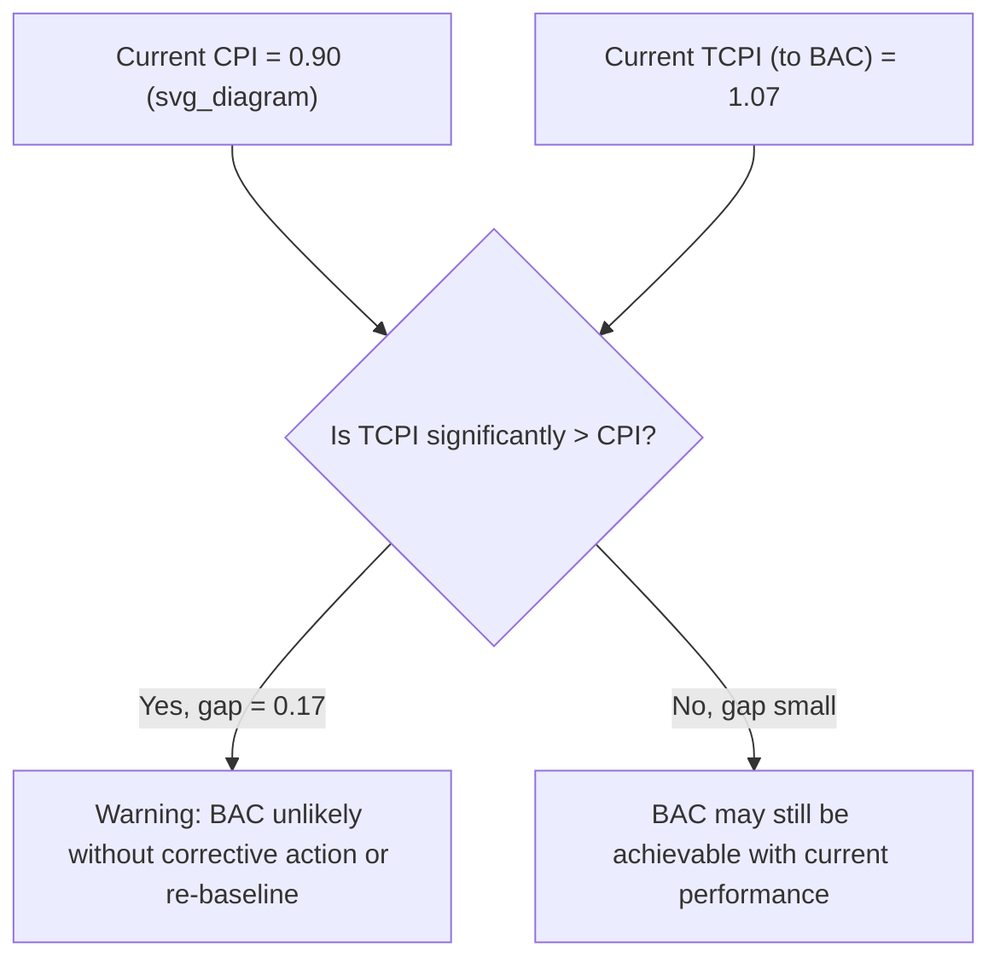

## Worked EVM Calculation Exercises

### Overview

This entry works through progressively complex Earned Value Management calculations: basic index computation, a full status report at a single point in time, forecasting via multiple EAC formulas, and a multi-period trend analysis showing how EVM data evolves and what it signals about project health.

### Core Formula Reference

$$SV = EV - PV \qquad SPI = \frac{EV}{PV}$$

$$CV = EV - AC \qquad CPI = \frac{EV}{AC}$$

$$VAC = BAC - EAC \qquad TCPI = \frac{BAC - EV}{BAC - AC}$$

### Exercise 1: Basic Single-Period Calculation

**Given:**

A project has a Budget at Completion (BAC) of $500,000. At the end of Month 4:

- Planned Value (PV) = $220,000
- Earned Value (EV) = $190,000
- Actual Cost (AC) = $210,000

**Solve for SV, CV, SPI, and CPI, and interpret the results.**

$$SV = 190{,}000 - 220{,}000 = -\$30{,}000$$

$$SPI = \frac{190{,}000}{220{,}000} = 0.86$$

$$CV = 190{,}000 - 210{,}000 = -\$20{,}000$$

$$CPI = \frac{190{,}000}{210{,}000} = 0.90$$

**Interpretation**

**Key Points**

- **Negative SV and SPI < 1** indicate the project is behind schedule: only 86% of the value planned for this point has actually been earned.
- **Negative CV and CPI < 1** indicate the project is over budget: for every dollar spent, only $0.90 of planned value has been earned.
- Both indices point in the same unfavorable direction here, which is a common but not universal pattern — schedule and cost performance can and do diverge (e.g., a project can be ahead of schedule but over budget, achieved by spending extra resources to accelerate work).

### Exercise 2: Full Status Report with Multiple Forecasting Methods

**Given:**

Same project (BAC = $500,000), same Month 4 data (PV=$220,000, EV=$190,000, AC=$210,000). Calculate the Estimate at Completion (EAC) under three different forecasting assumptions.

**Method 1 — Atypical variance (one-time issue, no ongoing trend expected):**

$$EAC = AC + (BAC - EV)$$

$$EAC = 210{,}000 + (500{,}000 - 190{,}000) = 210{,}000 + 310{,}000 = \$520{,}000$$

**Method 2 — Typical variance (cost performance to date will continue):**

$$EAC = \frac{BAC}{CPI}$$

$$EAC = \frac{500{,}000}{0.90} = \$555{,}556$$

**Method 3 — Combined schedule and cost impact (both trends expected to continue):**

$$EAC = AC + \frac{BAC - EV}{CPI \times SPI}$$

$$EAC = 210{,}000 + \frac{500{,}000 - 190{,}000}{0.90 \times 0.86} = 210{,}000 + \frac{310{,}000}{0.774} \approx 210{,}000 + 400{,}517 = \$610{,}517$$

**Estimate to Complete (ETC) and Variance at Completion (VAC), using Method 2's EAC:**

$$ETC = EAC - AC = 555{,}556 - 210{,}000 = \$345{,}556$$

$$VAC = BAC - EAC = 500{,}000 - 555{,}556 = -\$55{,}556$$

**To-Complete Performance Index (TCPI, against BAC):**

$$TCPI = \frac{BAC - EV}{BAC - AC} = \frac{500{,}000 - 190{,}000}{500{,}000 - 210{,}000} = \frac{310{,}000}{290{,}000} = 1.07$$

**Key Points**

- The three EAC methods produce a wide range ($520,000 to $610,517) precisely because they encode different assumptions about whether current variance is a one-time event or an ongoing trend — selecting the wrong method for the actual situation can meaningfully mislead stakeholders.
- **TCPI = 1.07** means the remaining work must be completed at 107% cost efficiency (i.e., better than currently achieved) to hit the original BAC — a TCPI meaningfully above 1.0 combined with a CPI meaningfully below 1.0 is a classic warning sign that the original budget is very unlikely to be met without a formal re-baseline or corrective action.
- [Inference] A TCPI more than roughly 0.1–0.2 above the current CPI is often treated by practitioners as a signal that hitting BAC is unrealistic without intervention, though no universal numeric threshold is standardized across organizations — this is a heuristic, not a formal rule.

### Exercise 3: Multi-Period Trend Analysis

**Given:** The following data was collected over four months for a project with BAC = $1,000,000.

| Month | PV | EV | AC |
| --- | --- | --- | --- |
| 1 | $100,000 | $95,000 | $90,000 |
| 2 | $220,000 | $200,000 | $210,000 |
| 3 | $350,000 | $300,000 | $340,000 |
| 4 | $480,000 | $390,000 | $460,000 |

**Calculate SPI and CPI for each month and identify the trend.**

| Month | SPI = EV/PV | CPI = EV/AC |
| --- | --- | --- |
| 1 | 95,000/100,000 = 0.95 | 95,000/90,000 = 1.06 |
| 2 | 200,000/220,000 = 0.91 | 200,000/210,000 = 0.95 |
| 3 | 300,000/350,000 = 0.86 | 300,000/340,000 = 0.88 |
| 4 | 390,000/480,000 = 0.81 | 390,000/460,000 = 0.85 |

**Interpretation**

**Key Points**

- Both SPI and CPI show a **consistent, worsening trend** across all four months — this is a materially more serious signal than a single bad month, since it indicates a systemic issue (e.g., understaffing, scope growth, productivity decline) rather than a one-time event.
- Month 1's CPI of 1.06 (favorable) reversing to consistently unfavorable by Month 4 illustrates why a **single-period snapshot can be misleading** — trend analysis across multiple periods is necessary to distinguish noise from a genuine performance trajectory.
- Given this consistent downward trend, Method 2 or Method 3 EAC forecasting (which assume the trend continues) would be far more appropriate than Method 1 (which assumes an atypical, non-recurring variance) — selecting an EAC method should be informed by exactly this kind of trend inspection, not applied mechanically.

### Common Errors in Worked EVM Exercises

- **Confusing SV/CV (dollar variances) with SPI/CPI (ratios/indices)** — both measure the same underlying relationship but are not interchangeable in interpretation; a $ -50,000 variance is a very different signal on a $100,000 project versus a $10,000,000 project, whereas the corresponding index is scale-independent.
- **Applying the wrong EAC formula for the situation** — using Method 1 (atypical variance) when the underlying data shows a clear multi-period trend (as in Exercise 3) will systematically understate the likely final cost.
- **Forgetting that TCPI is calculated relative to a target** (either BAC or EAC) and that the choice of target changes the interpretation — TCPI-to-BAC answers "what efficiency is needed to hit the original budget," while TCPI-to-EAC answers "what efficiency is needed to hit the revised forecast."
- **Treating CPI/SPI values near 1.0 as automatically healthy** without checking the trend direction — a CPI of 0.98 that has declined from 1.05 over three consecutive periods warrants more attention than a stable CPI of 0.95.

**Related Topics**

- Selecting the appropriate EAC formula based on variance cause analysis
- Statistical forecasting techniques beyond the standard EAC formulas (e.g., regression-based forecasting)
- Integrating EVM trend analysis with CPM schedule variance for root-cause diagnosis
- Control account-level EVM reporting versus project-level roll-up
- Agile Earned Value calculations as a comparison point to traditional EVM exercises
- Building an EVM status report template for stakeholder communication