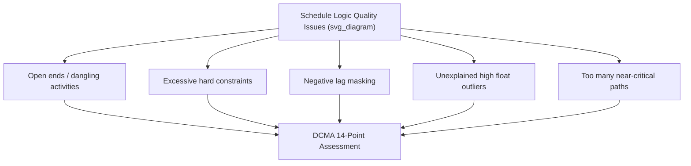

## Common Scheduling and Cost Control Pitfalls

### Overview

This entry catalogs the most frequently recurring failure modes in CPM scheduling and EVM-based cost control, organized by category: schedule logic errors, baseline/change-control failures, EVM measurement distortions, forecasting misuse, and organizational/behavioral pitfalls. Recognizing these patterns is a core capstone skill, since real-world project controls work is often less about performing the calculations correctly and more about noticing when the underlying data or process has gone wrong.

### Schedule Logic Pitfalls

**Key Points**

- **Open ends (dangling activities)** — activities with no predecessor or no successor (other than the project start/finish milestones) create logic gaps where the schedule cannot correctly calculate float; these often indicate incomplete network development rather than genuinely unconstrained work.
- **Excessive use of hard constraints** (e.g., "Must Finish On," "Start No Later Than") — hard constraints override the natural forward/backward pass logic and can mask true float or artificially manufacture a false critical path; the DCMA 14-point assessment explicitly flags high constraint counts as a schedule quality risk.
- **Negative lag ("negative float masking")** — using negative lag to force an artificially compressed schedule without genuinely re-sequencing or re-resourcing the work misrepresents the achievability of the plan.
- **High total float outliers** — activities with unusually large float (e.g., hundreds of days) often indicate a missing logic tie rather than genuine schedule slack, and should be investigated rather than accepted at face value.
- **Excessive number of critical or near-critical paths** — a schedule where most activities show near-zero float suggests either an overly compressed schedule or logic errors that have inadvertently made too much of the network critical, reducing the schedule's diagnostic value (everything looks equally urgent).

### Baseline and Change Control Pitfalls

**Key Points**

- **Re-baselining too frequently, or without formal change control** — quietly resetting the baseline whenever performance looks poor eliminates the diagnostic value of variance analysis; SV/CV become meaningless if the baseline is a moving target that always tracks close to actuals.
- **Re-baselining too infrequently** — the opposite failure: continuing to measure against a hopelessly outdated baseline (after major, formally approved scope changes) produces enormous, uninformative variances that obscure genuinely actionable signals.
- **Converting rolling-wave planning packages into work packages too late** — insufficient lead time before execution begins leaves inadequate opportunity for proper estimating, resourcing, and review, often resulting in rushed, low-quality activity definitions right when detailed control is most needed.
- **Failing to reconcile budget after decomposition** — when a planning package is broken into detailed work packages, the sum of the new work package budgets must equal the original planning package budget; silent mismatches constitute an uncontrolled change to the Performance Measurement Baseline.

### EVM Measurement and Data Quality Pitfalls

**Key Points**

- **Inconsistent percent-complete methodologies across work packages** — mixing subjective "eyeball" percent complete with objective milestone-based or apportioned-effort methods within the same project produces EV data that is not internally comparable, undermining roll-up accuracy.
- **Using AC data that isn't reconciled with the accounting system** — actual cost figures pulled informally (e.g., estimated from timesheets without accounting system reconciliation) can diverge materially from the figures that will eventually appear in formal financial statements, creating embarrassing later corrections.
- **Crediting EV for work that doesn't meet the Definition of Done / Objective Measure** — prematurely claiming earned value for partially complete work inflates SPI/CPI temporarily but creates a "hidden backlog" of incomplete work that resurfaces as a sudden performance drop later.
- **Applying a single, stale story-point-to-dollar conversion rate** in Agile EVM contexts — as team composition, skill mix, or velocity trends shift, an outdated conversion rate silently distorts EV in dollar terms even though the underlying story-point tracking remains accurate.

### Forecasting Misuse Pitfalls

**Key Points**

- **Applying the "atypical variance" EAC formula ($EAC = AC + (BAC-EV)$) when the underlying data shows a clear ongoing trend** — this systematically understates the likely final cost or duration when a variance is actually systemic rather than a one-time event.
- **Reporting a single EAC number without a range or sensitivity check** — presenting one deterministic EAC to executives implies more certainty than the underlying data supports; presenting a range across the standard EAC formulas (or a Monte Carlo-derived confidence interval) better represents genuine forecast uncertainty.
- **Ignoring TCPI as a reality check** — failing to compute and communicate TCPI-to-BAC alongside a "we can still hit budget" claim can allow unrealistic recovery expectations to persist uncorrected.

### Organizational and Behavioral Pitfalls

**Key Points**

- **Velocity gaming in hybrid/Agile-EVM environments** — inflating story-point estimates to make velocity (and thus derived EV) look better corrupts both the Agile team's own planning data and any downstream EVM conversion built on it.
- **Treating the schedule/cost baseline as a one-time deliverable rather than a living management tool** — building an initial CPM/EVM baseline carefully but then failing to maintain, update, and re-analyze it regularly reduces project controls to a compliance exercise rather than genuine decision support.
- **Presenting blended predictive/adaptive metrics without disclosing the blend** — in hybrid programs, showing a single program-level SPI/CPI without noting that it aggregates fundamentally different earning methodologies (percent-complete predictive work packages vs. completed-story-point Agile work packages) risks false precision and stakeholder overconfidence.
- **Siloing scheduling and cost functions** — when schedulers and cost engineers operate independently without regularly cross-referencing schedule variance against cost variance, root-cause diagnosis suffers, since schedule slippage and cost overruns are frequently linked (e.g., overtime paid to recover schedule shows up as a cost variance driven by a schedule variance).
- **Under-investing in stakeholder communication of technical findings** — technically accurate SV/CV/SPI/CPI data delivered without a clear plain-language narrative often fails to drive the corrective action it should, regardless of how rigorous the underlying calculation was.

### A Composite Diagnostic Checklist

1. Does the schedule have open ends, excessive constraints, or unexplained high-float activities? (Logic quality)
2. Has the baseline been changed recently, and if so, was it through formal change control? (Baseline integrity)
3. Are percent-complete methods consistent across work packages being rolled up together? (EVM data quality)
4. Does the SPI/CPI trend over the last several periods show a consistent direction, or is the current reading an outlier? (Trend context)
5. Does the chosen EAC method match the actual variance pattern (one-time vs. systemic)? (Forecasting validity)
6. If this is a hybrid program, is the blended nature of any program-level index disclosed to its audience? (Reporting transparency)
7. Are schedule and cost variances being reviewed together, or in separate silos? (Root-cause diagnosis)

**Related Topics**

- DCMA 14-point schedule health assessment in full detail
- Baseline change control processes and documentation standards
- Rolling wave planning and progressive elaboration (planning-to-work-package conversion timing)
- Worked CPM network diagram examples (illustrating several of these logic pitfalls concretely)
- Worked EVM calculation exercises (illustrating EAC method selection in practice)
- Blending predictive and adaptive methods (context for the hybrid-reporting pitfalls above)
- Root-cause analysis techniques linking schedule variance to cost variance