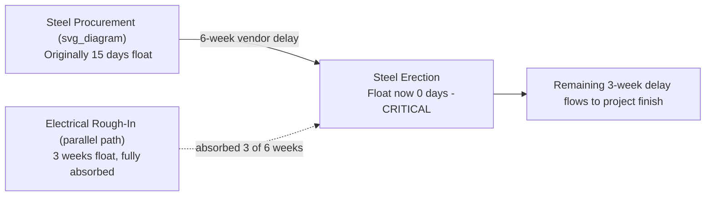

## Real World Case Study Analysis

### Overview

This capstone entry walks through a composite, realistic project controls case study — a mid-size infrastructure project experiencing schedule slippage and cost overrun — applying CPM network diagnosis, EVM calculation, trend analysis, and root-cause reasoning together, in the way a working project controls analyst would actually approach a status review. The scenario is a synthesized composite for instructional purposes rather than a specific named project.

### Case Background

A municipal water treatment plant upgrade has a Budget at Completion (BAC) of $8,000,000 and a planned duration of 18 months. At the Month 10 status date, the project controls analyst has been asked to prepare a status report explaining why the project "feels behind" despite monthly reports showing SPI and CPI values close to 1.0 in recent months.

**Data available at Month 10:**

| Metric | Value |
| --- | --- |
| PV (cumulative) | $4,200,000 |
| EV (cumulative) | $3,650,000 |
| AC (cumulative) | $3,900,000 |
| BAC | $8,000,000 |

**Recent monthly SPI/CPI trend (Months 7–10):**

| Month | SPI | CPI |
| --- | --- | --- |
| 7 | 1.02 | 0.99 |
| 8 | 0.99 | 0.97 |
| 9 | 0.94 | 0.94 |
| 10 | 0.87 | 0.94 |

### Step 1: Compute Current Cumulative Indices

$$SPI = \frac{3{,}650{,}000}{4{,}200{,}000} = 0.87 \qquad CPI = \frac{3{,}650{,}000}{3{,}900{,}000} = 0.94$$

**Key Points**

- Cumulative SPI (0.87) at Month 10 matches the Month 10 monthly figure exactly here because cumulative indices are, by construction, a running aggregate — but note that a cumulative index can mask a sharper recent-period decline if earlier months were much stronger, which is exactly why the monthly trend table above must be examined alongside the cumulative snapshot.
- The stakeholder's confusion ("feels behind despite indices near 1.0") is explained by looking at the **trend direction**, not the current snapshot: SPI has declined steadily from 1.02 to 0.87 across four months — a project that was on schedule in Month 7 is now meaningfully behind, and a single cumulative number at Month 10 doesn't communicate the velocity of that decline.

### Step 2: Diagnose the Schedule Side (CPM Lens)

The analyst pulls the CPM network and finds:

- The critical path runs through **structural steel procurement and erection**, a sequence originally planned for Months 6–11.
- Steel procurement (a long-lead item) was delayed by 6 weeks due to a vendor capacity issue — this delay was absorbed partially by float on a parallel electrical rough-in path, but the float on that parallel path was only 3 weeks, so 3 weeks of the delay pushed directly onto the project finish date.
- Total float on the now-critical steel erection activity has gone from +15 days (at Month 7) to 0 days (at Month 10) — a direct, traceable erosion matching the observed SPI decline.

**Key Points**

- This is a textbook example of **float erosion driving SPI decline** — the schedule variance is not caused by uniformly slow work across the whole project, but by a specific, traceable vendor delay on a long-lead procurement item that has now consumed all available float on its path.
- Identifying this requires going beyond the EVM index and back into the underlying CPM network — a pure EVM view can tell you *that* the project is 13% behind on earned schedule value, but only the network diagnosis explains *why* and *what specifically* is driving it.

### Step 3: Diagnose the Cost Side (EVM Lens)

The analyst breaks down AC by category and finds:

- Labor costs are tracking close to budget (CPI ≈ 0.98 for labor-only work packages).
- Materials costs are running high (CPI ≈ 0.88 for materials-heavy work packages), driven by the same steel vendor situation: expedited freight charges were incurred to partially mitigate the delay.
- The blended CPI of 0.94 masks this divergence between labor (healthy) and materials (unhealthy) performance.

**Key Points**

- This illustrates why **control-account-level or category-level EVM breakdowns** are essential for root-cause diagnosis — the project-level CPI of 0.94 alone doesn't reveal that the cost problem is concentrated specifically in materials, and specifically tied to the same root cause (the steel vendor delay) as the schedule problem.
- The schedule delay and the cost overrun are **not independent problems** — the expedited freight cost was incurred specifically *because of* the schedule delay, which is a common real-world pattern where schedule and cost variances share a single root cause rather than being separate issues each requiring separate mitigation.

### Step 4: Forecast and Recommend

Given the confirmed, ongoing (not one-time) nature of the variance — a real vendor capacity constraint expected to persist for at least one more delivery cycle — the analyst selects the Method 2 (typical variance) EAC formula:

$$EAC = \frac{BAC}{CPI} = \frac{8{,}000{,}000}{0.94} \approx \$8{,}510{,}638$$

$$VAC = BAC - EAC = 8{,}000{,}000 - 8{,}510{,}638 \approx -\$510{,}638$$

$$TCPI = \frac{BAC-EV}{BAC-AC} = \frac{8{,}000{,}000 - 3{,}650{,}000}{8{,}000{,}000-3{,}900{,}000} = \frac{4{,}350{,}000}{4{,}100{,}000} \approx 1.06$$

**Recommendation drafted for the status report:**

- Report the current $510,638 projected overrun and the schedule slip driven specifically by the steel vendor delay, not a generic "productivity issue."
- Recommend evaluating whether a second steel supplier or partial re-sequencing of downstream work (rearranging non-critical activities to run in parallel rather than series where feasible) could recover part of the 3-week critical path delay.
- Flag TCPI of 1.06 as a modest, plausibly achievable efficiency target for the remaining work, rather than a red flag requiring immediate re-baselining.

### Key Takeaways from the Case Study

**Key Points**

- **Trend data outperforms single-period snapshots** for detecting emerging problems — the stakeholder's intuition that "something feels wrong" was validated by the multi-month SPI decline well before the cumulative index alone would have raised obvious alarm.
- **CPM and EVM are complementary, not redundant** — EVM told the analyst *that* a problem existed and roughly *how large* it was in dollar and schedule-index terms; CPM network analysis told the analyst *why*, tracing the issue to a specific activity, vendor, and float-consumption pattern.
- **Category/control-account-level breakdowns reveal root causes that blended, project-level metrics hide** — the labor/materials CPI split was essential to correctly attributing the cost overrun to the same root cause as the schedule slip, rather than treating them as two unrelated issues.
- **Forecasting method selection depends on classifying the variance correctly** — because the analyst confirmed the vendor issue was ongoing rather than resolved, Method 2 (not the more optimistic Method 1) was the defensible choice, directly affecting the $510,638 figure communicated to stakeholders.

**Related Topics**

- Worked CPM network diagram examples (float calculation mechanics underlying Step 2)
- Worked EVM calculation exercises (EAC formula selection underlying Step 4)
- Common scheduling and cost control pitfalls (several pitfalls avoided by this analyst's approach)
- Control account-level versus project-level EVM reporting granularity
- Root-cause analysis techniques linking schedule variance to cost variance
- Vendor and procurement risk management in long-lead CPM activities
- Communicating technical schedule/cost findings to non-technical stakeholders