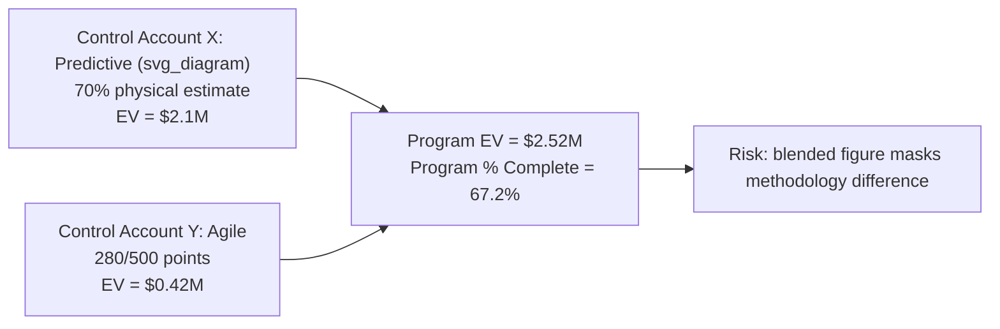

## Final Mastery Assessment and Practice Scenarios

### Overview

This capstone entry presents a set of self-assessment practice scenarios spanning the full CPM/EVM curriculum — network diagramming, float and critical path analysis, EVM calculation, forecasting, rolling wave planning, hybrid/Agile integration, and diagnostic reasoning — with full worked solutions. Use these to test integrated understanding rather than isolated formula recall.

### Scenario 1: Critical Path Under Ambiguous Logic

**Prompt:** A network has activities A (5 days, no predecessor), B (3 days, predecessor A), C (4 days, predecessor A), and D (2 days, predecessors B and C). Identify the critical path and the total float on the non-critical path.

**Solution:**

Forward pass: A: EF=5. B: ES=5, EF=8. C: ES=5, EF=9. D: ES=max(8,9)=9, EF=11.

Backward pass (project finish=11): D: LF=11, LS=9. C: LF=9, LS=5. B: LF=9, LS=6. A: LF=min(6,5)=5, LS=0.

Total float: A=0, B=6-5=1, C=5-5=0, D=0.

**Critical path: A → C → D (11 days). B has 1 day of total float.**

**Key Points**

- This scenario tests whether the solver correctly takes the **maximum** at the merge point (D's ES=9, not 8) and correctly propagates the **minimum** backward (A's LS=5, not 6) — the single most common arithmetic error in CPM exercises.

### Scenario 2: EVM Diagnosis with Conflicting Signals

**Prompt:** A project shows SPI=1.05 and CPI=0.80 at the current status date. Write a one-paragraph interpretation suitable for a status report, and identify what additional data would help confirm the diagnosis.

**Model Answer:**

"The project is ahead of schedule (SPI=1.05, earning 5% more value than planned) but significantly over budget (CPI=0.80, receiving only $0.80 of value per dollar spent). This combination often indicates that resources have been added or overtime authorized to accelerate the schedule, at a cost premium — a common and sometimes deliberate tradeoff, but one that should be confirmed rather than assumed. To confirm this diagnosis, request a labor-hours-versus-budgeted-hours breakdown and check for authorized overtime or added-crew change requests; if no such authorization exists, the cost overrun may instead indicate an unrelated cost problem (e.g., materials price escalation) coinciding coincidentally with good schedule performance."

**Key Points**

- This scenario tests the ability to **generate, not just interpret, hypotheses** — SPI/CPI combinations rarely have a single guaranteed explanation, and a mature response identifies what further evidence would distinguish between plausible causes rather than asserting one cause with false confidence.

### Scenario 3: Rolling Wave and Baseline Change Control

**Prompt:** A control account has a total budget of $2,000,000, currently split into $1,200,000 of work packages (near-term, detailed) and $800,000 of planning packages (far-term, summary-level). The far-term planning package is now being decomposed into three new work packages totaling $850,000. Is this a baseline change requiring formal change control? Why or why not, and what should happen next?

**Model Answer:**

This is **not** a scope or budget baseline change in the formal sense — it is the expected rolling-wave conversion of a planning package into work packages. However, the $850,000 total for the new work packages exceeds the original $800,000 planning package budget by $50,000. This discrepancy **does** require attention: either the $50,000 must be justified as a legitimate, formally-approved scope/budget change requiring change control, or the decomposition estimate must be revised downward to reconcile with the original $800,000 allocation before the new work packages are baselined. Silently accepting the $50,000 gap would constitute an uncontrolled, undocumented change to the control account's Performance Measurement Baseline.

**Key Points**

- This scenario tests whether the solver recognizes the **specific dollar-reconciliation check** that must accompany every rolling-wave conversion — a detail easy to overlook when focused only on whether the conversion itself is "allowed."

### Scenario 4: Hybrid Program EV Reconciliation

**Prompt:** A hybrid program has two control accounts: Control Account X (predictive, BAC=$3,000,000, physical percent complete=70%) and Control Account Y (Agile, total scope=500 story points at $1,500/point, 280 points completed). Calculate program-level EV and percent complete, and identify one interpretive risk in presenting this figure to executives.

**Solution:**

$$EV_X = 0.70 \times 3{,}000{,}000 = \$2{,}100{,}000$$

$$BAC_Y = 500 \times 1{,}500 = \$750{,}000 \qquad EV_Y = 280 \times 1{,}500 = \$420{,}000$$

$$EV_{program} = 2{,}100{,}000 + 420{,}000 = \$2{,}520{,}000 \qquad BAC_{program} = 3{,}000{,}000 + 750{,}000 = \$3{,}750{,}000$$

$$\%complete_{program} = \frac{2{,}520{,}000}{3{,}750{,}000} \approx 67.2\%$$

**Interpretive risk:** The blended 67.2% figure combines a **subjective physical percent-complete estimate** (Control Account X) with an **objective completed-story-point ratio** (Control Account Y) — these are earned through fundamentally different methodologies with different reliability characteristics, and presenting a single blended percentage without disclosing this risks giving executives false confidence in the figure's precision.

### Scenario 5: Full Integrated Diagnostic

**Prompt:** At Month 6 of a 12-month project (BAC=$1,000,000), PV=$500,000, EV=$430,000, AC=$470,000. The schedule shows the critical path activity currently in progress has 0 days of total float, down from 20 days at Month 3. Write a complete but concise status assessment covering schedule, cost, forecast, and one root-cause hypothesis.

**Model Answer:**

$$SPI = \frac{430{,}000}{500{,}000} = 0.86 \qquad CPI = \frac{430{,}000}{470{,}000} = 0.915$$

$$EAC_{typical} = \frac{1{,}000{,}000}{0.915} \approx \$1{,}092{,}896$$

"The project is behind schedule (SPI=0.86) and modestly over budget (CPI=0.915). The critical path's float has fully eroded from 20 days to 0 days over three months, indicating the schedule slip is concentrated on a specific, identifiable activity rather than spread uniformly — this should be investigated directly rather than treated as generalized underperformance. Assuming current cost performance continues, the forecast Estimate at Completion is approximately $1,092,896, a projected $92,896 overrun. Root-cause hypothesis: given that float eroded specifically on the current critical activity rather than project-wide, a resource constraint, vendor delay, or scope-definition issue local to that specific activity is more likely than a systemic productivity problem — the next diagnostic step should be a targeted review of that activity's resource assignments and any recent change requests, not a broad schedule compression."

**Key Points**

- This scenario integrates every mechanism covered across the curriculum — SPI/CPI calculation, EAC forecasting, float-erosion interpretation, and root-cause hypothesis generation — and rewards responses that connect the CPM float signal to the EVM index signal explicitly, rather than reporting them as separate, unrelated facts.

### Self-Assessment Rubric

| Skill Area | Demonstrated By |
| --- | --- |
| CPM mechanics | Correctly identifying critical path and float on ambiguous merge/burst logic |
| EVM calculation | Correctly computing SV/CV/SPI/CPI/EAC/TCPI from raw PV/EV/AC/BAC data |
| Forecasting judgment | Selecting the EAC method matching the actual variance pattern, not applying one by default |
| Baseline/change control literacy | Recognizing when a rolling-wave conversion requires reconciliation or formal change control |
| Hybrid/Agile integration | Correctly blending predictive and Agile EV data while disclosing methodological risk |
| Root-cause diagnosis | Connecting schedule (CPM) and cost (EVM) signals to a specific, falsifiable hypothesis rather than a generic explanation |

**Related Topics**

- Worked CPM network diagram examples (foundational mechanics for Scenario 1)
- Worked EVM calculation exercises (foundational mechanics for Scenarios 2, 4, and 5)
- Real world case study analysis (an extended version of the integrated diagnostic style in Scenario 5)
- Rolling wave planning and progressive elaboration (foundational concept for Scenario 3)
- Blending predictive and adaptive methods (foundational concept for Scenario 4)
- Common scheduling and cost control pitfalls (a checklist companion to this assessment)