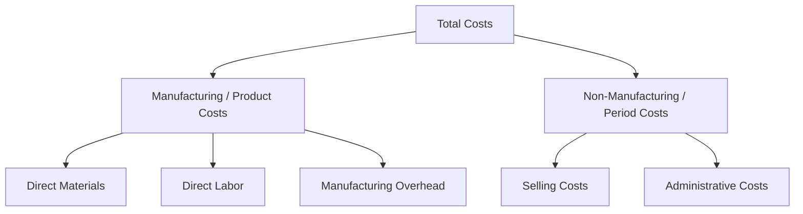
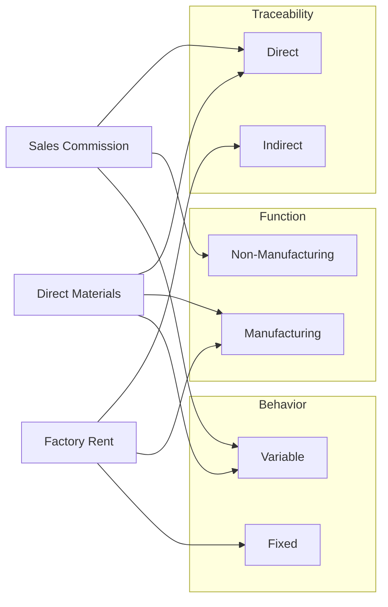

## Cost Classification by Behavior Function and Traceability

### Overview

Cost classification is the process of grouping costs according to a chosen characteristic so that managers can predict, control, and analyze them. Three independent classification dimensions are covered here: **behavior** (how a cost reacts to activity changes), **function** (the organizational purpose the cost serves), and **traceability** (how directly a cost can be assigned to a cost object). A single cost can carry a label from all three dimensions simultaneously — for example, direct materials are variable (behavior), a product cost (function), and direct (traceability) — because the dimensions classify the same underlying cost from different analytical angles.

### Classification by Behavior

Behavior classification asks: *what happens to total cost and per-unit cost as activity volume changes?*

**Key Points**

- **Variable costs**: Total variable cost changes in direct proportion to activity; per-unit variable cost is constant.
- **Fixed costs**: Total fixed cost remains constant within a relevant range; per-unit fixed cost decreases as volume increases.
- **Mixed (semi-variable) costs**: Contain both a fixed and variable component (e.g., a utility bill with a base charge plus usage rate).
- **Step costs**: Fixed within a narrow range of activity, then jump to a new level once a threshold is crossed (e.g., adding a supervisor for every 10 additional workers).

| Cost Type | Total Cost Behavior | Per-Unit Behavior |
| --- | --- | --- |
| Variable | Changes proportionally with volume | Constant |
| Fixed | Constant within relevant range | Decreases as volume rises |
| Mixed | Changes, but not proportionally | Changes, decreasing fixed portion per unit |
| Step | Constant, then jumps at threshold | Decreases within a step, resets at jump |

**Relevant Range**

Fixed cost behavior only holds within a **relevant range** — the span of activity over which the fixed cost assumption is valid. Outside this range (e.g., needing a second factory building), the fixed cost level itself changes.

$$TC = F + (V \times Q)$$

Where $TC$ is total cost, $F$ is total fixed cost, $V$ is variable cost per unit, and $Q$ is quantity of activity.

**Example**

A factory pays $50,000/month in fixed rent and $8 per unit in direct materials. At $Q = 1{,}000$ units:

$$TC = 50{,}000 + (8 \times 1{,}000) = 58{,}000$$

Per-unit cost at this volume is $58{,}000 / 1{,}000 = \$58$. At $Q = 5{,}000$ units, $TC = \$90{,}000$, but per-unit cost drops to $18, illustrating fixed-cost dilution.

### Classification by Function

Function classification groups costs by the business activity they support.

**Key Points**

- **Manufacturing (product) costs**: Direct materials, direct labor, and manufacturing overhead — costs incurred to produce a good, capitalized into inventory until sale.
- **Non-manufacturing (period) costs**: Selling costs (commissions, advertising, shipping) and administrative costs (executive salaries, office rent, legal fees) — expensed in the period incurred, regardless of production or sales volume.

The function classification interacts with financial reporting: product costs flow through Work-in-Process and Finished Goods inventory accounts before hitting Cost of Goods Sold, while period costs are expensed immediately on the income statement.

### Classification by Traceability

Traceability asks: *can this cost be economically and specifically traced to a single cost object (a product, department, or project)?*

**Key Points**

- **Direct costs**: Can be traced to a specific cost object without allocation (e.g., steel used in a specific car being assembled).
- **Indirect costs**: Cannot be economically traced to a single cost object and must be allocated using a cost driver (e.g., factory electricity shared across multiple product lines).

The determination of "direct" vs. "indirect" is always relative to a defined **cost object**. A factory supervisor's salary is indirect with respect to an individual unit of product, but direct with respect to the factory department as a whole.

**Example**

| Cost Object: "Product A" | Classification |
| --- | --- |
| Steel plate used only in Product A | Direct |
| Factory rent (shared across 5 products) | Indirect |
| Assembly worker paid per Product A unit | Direct |
| Plant manager's salary | Indirect |

### Intersection of the Three Dimensions

These dimensions are orthogonal — a cost is classified along all three simultaneously.

[Inference] The classification a cost receives along one dimension does not predict its classification along another; direct costs are commonly but not universally variable, and this correlation should not be treated as a rule when analyzing atypical cost structures (e.g., a dedicated direct-cost machine lease that is fixed).

### Common Pitfalls

- Confusing "direct" with "variable" — a dedicated supervisor assigned solely to one product line is a direct cost but behaves as fixed.
- Assuming fixed costs are fixed forever — they are only fixed within the relevant range and time period assumed.
- Misclassifying step costs as pure fixed or pure variable, which distorts break-even and leverage calculations covered in later chapters.
- Ignoring that traceability depends entirely on how the cost object is defined; changing the cost object can reclassify the same dollar amount from direct to indirect.

**Next Steps**

- Separating mixed costs into fixed and variable components (High-Low Method, Regression, Scattergraph)
- Contribution Margin Income Statement Format
- Break-Even Point and Target Profit Analysis
- Degree of Operating Leverage (DOL) Calculation and Interpretation
- Cost-Volume-Profit (CVP) Assumptions and Limitations
- Allocation of Indirect Costs Using Cost Drivers (Activity-Based Costing foundations)